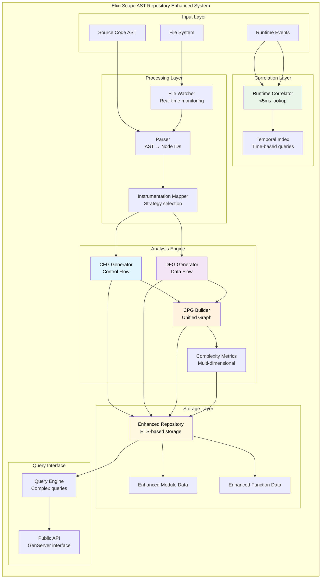
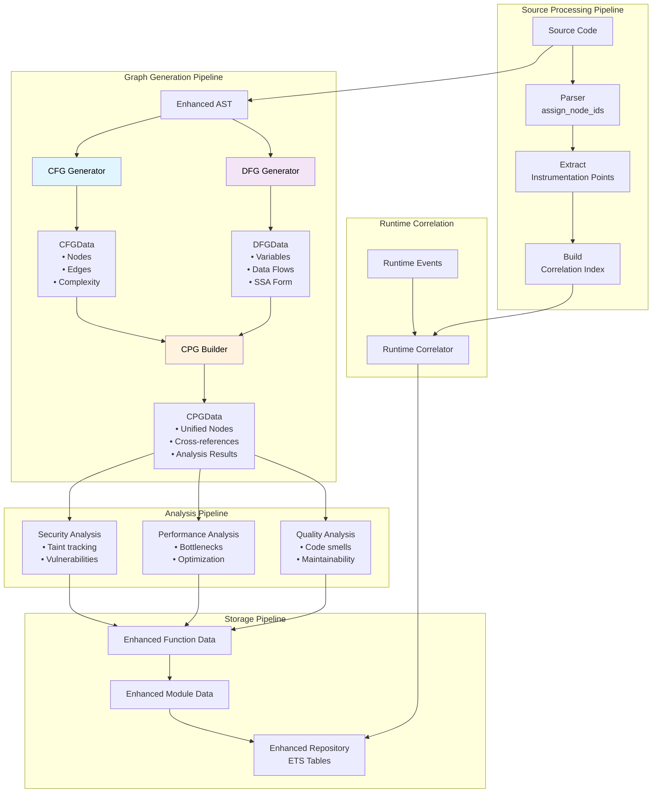
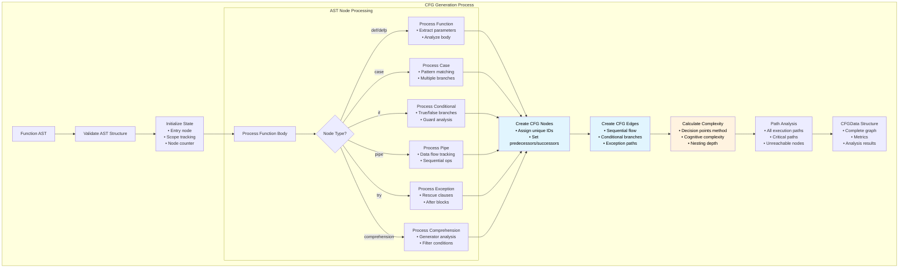
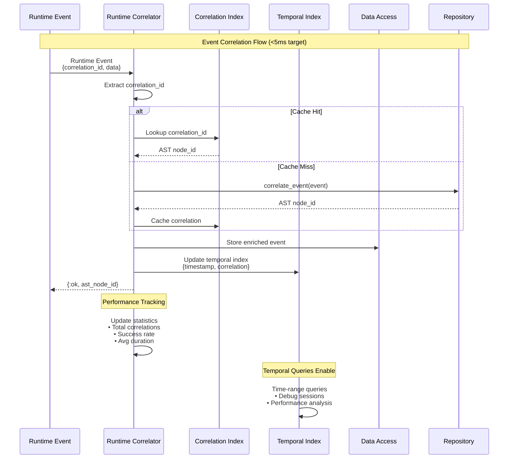
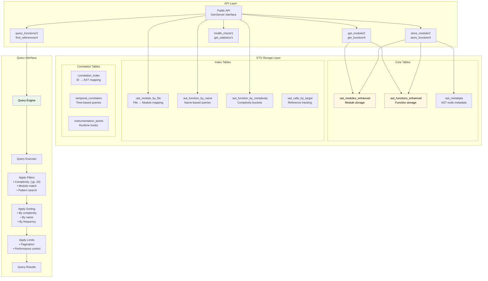
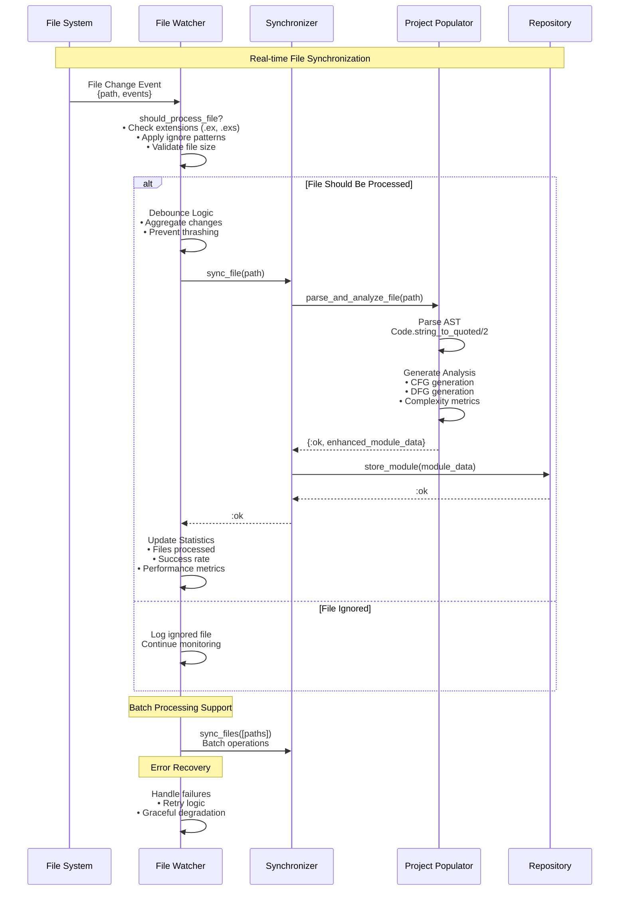
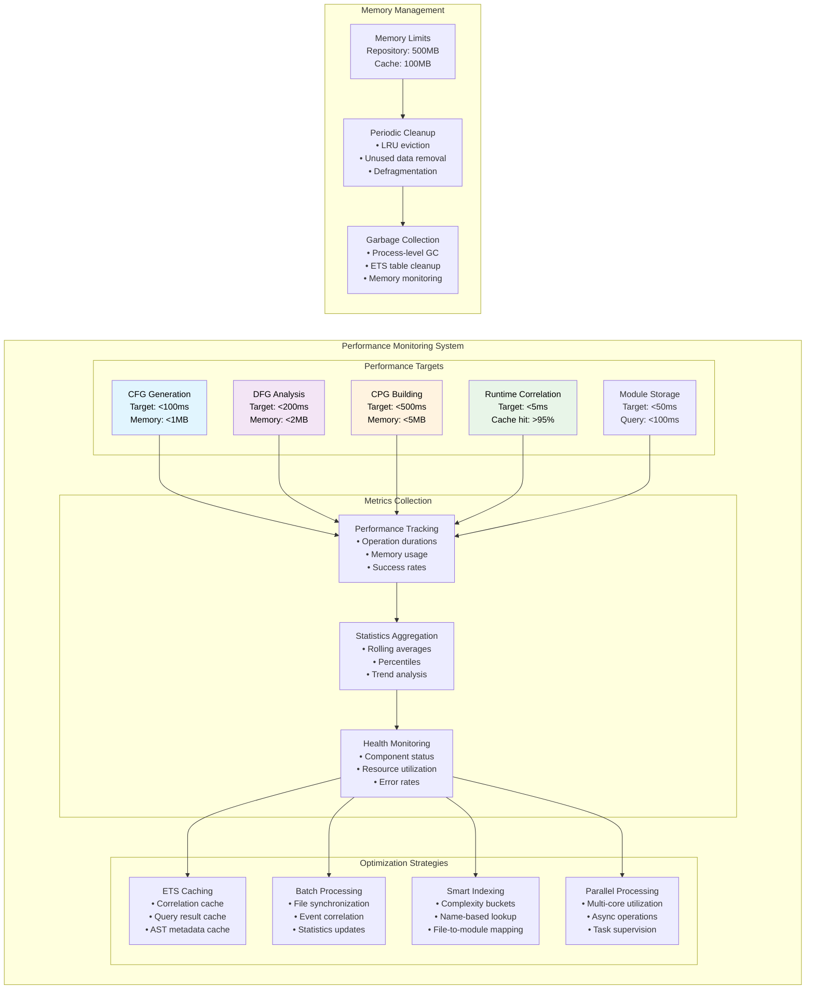

# ElixirScope AST Repository Architecture - Mermaid Diagrams

## 1. System Overview & Component Architecture

## 2. Data Flow Architecture

## 3. Control Flow Graph (CFG) Generation Detail

## 4. Data Flow Graph (DFG) Generation Detail

```mermaid
flowchart TD
    subgraph "DFG Generation with SSA"
        FAST[Function AST] --> INIT[Initialize State<br/>• Variable tracking<br/>• Scope stack<br/>• SSA versioning]
        
        INIT --> ANALYZE[Analyze AST for Data Flow]
        
        subgraph "Variable Analysis"
            ANALYZE --> VAR_DEF[Variable Definitions<br/>• Parameters<br/>• Assignments<br/>• Pattern matches]
            
            VAR_DEF --> SSA[SSA Form Creation<br/>• Version variables<br/>• x → x_0, x_1, x_2]
            
            SSA --> VAR_USE[Variable Uses<br/>• References<br/>• Function arguments<br/>• Guards]
            
            VAR_USE --> DATA_FLOW[Data Flow Edges<br/>• Definition → Use<br/>• Transformation chains]
        end
        
        subgraph "Advanced Analysis"
            DATA_FLOW --> PHI[Phi Node Generation<br/>• Control flow merges<br/>• Variable unification]
            
            PHI --> CAPTURE[Closure Analysis<br/>• Captured variables<br/>• Scope tracking]
            
            CAPTURE --> SHADOW[Shadowing Detection<br/>• Variable conflicts<br/>• Scope violations]
            
            SHADOW --> MUTATION[Mutation Tracking<br/>• Variable reassignment<br/>• State changes]
        end
        
        MUTATION --> LIFETIME[Variable Lifetime<br/>• Birth to death tracking<br/>• Usage frequency]
        
        LIFETIME --> UNUSED[Unused Variable Detection<br/>• Dead code analysis<br/>• Optimization hints]
        
        UNUSED --> DFG_RESULT[DFGData Structure<br/>• Complete data flow<br/>• Analysis results<br/>• Optimization hints]
    end
    
    style SSA fill:#f3e5f5,color:#000
    style PHI fill:#f3e5f5,color:#000
    style CAPTURE fill:#e8f5e8,color:#000
```

## 5. Runtime Correlation Architecture

## 6. Storage and Query Architecture

## 7. File System Integration Architecture

## 8. Performance and Monitoring Architecture

These diagrams provide a comprehensive architectural overview suitable for senior engineers, covering the system's layered architecture, data flow patterns, detailed component interactions, and performance characteristics. Each diagram focuses on a specific aspect while showing how components integrate within the larger system.