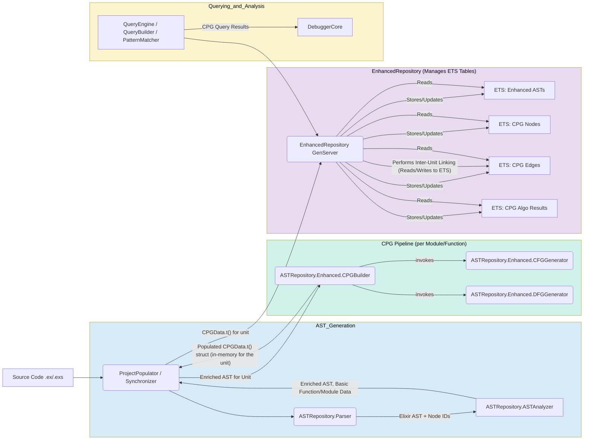

# CPG ETS Integration Guide

## 1. ETS Table Schema Design

### Primary Tables
```elixir
# CPG Nodes - stored per function for locality
@cpg_nodes_table
# Key: {module_name, function_key, cpg_node_id}
# Value: serialized CPGNode.t()

# CPG Edges - optimized for traversal
@cpg_edges_table  
# Key: {from_node_id, edge_type, to_node_id}
# Value: serialized CPGEdge.t()

# Analysis Cache - versioned results
@cpg_analysis_cache
# Key: {cpg_unit_key, algorithm_name, params_hash, version}
# Value: serialized algorithmic results
```

### Index Tables
```elixir
# Node Type Index - for filtering by AST type
@cpg_node_type_index
# Key: {ast_type, module_name, function_key}
# Value: [cpg_node_ids]

# Community Index - for architectural analysis
@cpg_community_index
# Key: {community_id, version}
# Value: [member_node_ids]

# High Centrality Index - for pattern detection
@cpg_centrality_index
# Key: {centrality_type, percentile_range, version}
# Value: [{node_id, score}]
```

## 2. Serialization Patterns

### Efficient Binary Encoding
```elixir
# Leverage existing patterns from EnhancedModuleData
defmodule CPGNode do
  def to_ets_format(%CPGNode{} = node) do
    :erlang.term_to_binary(node, [:compressed])
  end
  
  def from_ets_format(binary) when is_binary(binary) do
    :erlang.binary_to_term(binary)
  end
end
```

### Large Data Handling
```elixir
# For large analysis results, use streaming serialization
def store_large_analysis_result(key, large_map) do
  chunks = chunk_analysis_result(large_map, @chunk_size)
  Enum.each(chunks, fn {chunk_id, chunk_data} ->
    :ets.insert(@cpg_analysis_cache, {{key, chunk_id}, chunk_data})
  end)
end
```

## 3. Query Optimization Patterns

### Graph Traversal via ETS
```elixir
def bfs_traversal(start_node_id, max_depth) do
  Stream.unfold({[start_node_id], 0, MapSet.new()}, fn
    {[], _depth, _visited} -> nil
    {queue, depth, visited} when depth >= max_depth -> nil
    {[node | rest], depth, visited} ->
      if MapSet.member?(visited, node) do
        {[], {rest, depth, visited}}
      else
        neighbors = get_neighbors_from_ets(node)
        new_visited = MapSet.put(visited, node)
        new_queue = rest ++ neighbors
        {node, {new_queue, depth + 1, new_visited}}
      end
  end)
end
```

### Cached Algorithm Results
```elixir
def get_or_compute_centrality(cpg_unit_key, algorithm, opts) do
  cache_key = {cpg_unit_key, algorithm, hash_opts(opts), get_cpg_version(cpg_unit_key)}
  
  case :ets.lookup(@cpg_analysis_cache, cache_key) do
    [{^cache_key, result}] -> {:ok, result}
    [] -> 
      {:ok, cpg_data} = get_cpg_data(cpg_unit_key)
      result = apply(CPGMath, algorithm, [cpg_data, opts])
      :ets.insert(@cpg_analysis_cache, {cache_key, result})
      {:ok, result}
  end
end
```

## 4. Incremental Update Strategies

### Version-Based Cache Invalidation
```elixir
def invalidate_analysis_cache(cpg_unit_key, old_version) do
  # Use ETS select_delete for efficient bulk removal
  match_spec = [
    {{:_, :_, :_, old_version}, [], [true]}
  ]
  :ets.select_delete(@cpg_analysis_cache, match_spec)
end
```

### Incremental Edge Updates
```elixir
def update_inter_procedural_edges(changed_function_keys) do
  # Remove old edges
  Enum.each(changed_function_keys, &remove_outgoing_edges/1)
  
  # Recompute and insert new edges
  new_edges = compute_inter_procedural_edges(changed_function_keys)
  :ets.insert(@cpg_edges_table, new_edges)
end
```

## Revised Implementation Timeline

Based on the ETS architecture insights, here's a more realistic implementation timeline:

### **Week 1: ETS Foundation Enhancement**
- Study existing `EnhancedRepository` ETS patterns thoroughly
- Design CPG-specific ETS table schemas
- Implement CPG data serialization/deserialization  
- Add versioning to `CPGData.t()` structure
- Create initial ETS indexes for CPG queries

### **Week 2: Core Algorithm Implementation**
- Implement `CPGMath` helper functions (`get_neighbors`, `get_edges`)
- Implement basic graph algorithms (SCC, shortest path, degree centrality)
- Focus on correctness with simple ETS integration
- Add caching layer for algorithmic results

### **Week 3: Semantic Layer and Query Integration**
- Implement `CPGSemantics` with code-aware interpretations
- Enhance `QueryBuilder` for CPG-aware query conditions
- Implement on-demand computation in query execution
- Add ETS-optimized graph traversal patterns

### **Week 4: Advanced Features and Optimization**
- Complete remaining centrality measures and community detection
- Enhance `PatternMatcher` with CPG rules
- Implement incremental update strategies
- Add performance monitoring and memory optimization

### **Week 5: AI Integration and Testing**
- Implement `AI.Bridge` CPG feature extraction
- Add comprehensive integration tests
- Performance benchmarking and optimization
- Documentation and examples

## Key Success Metrics

To validate our ETS-based CPG implementation:

1. **Performance**: Query response time < 100ms for typical CPG queries
2. **Memory Efficiency**: CPG storage overhead < 50% of AST storage
3. **Scalability**: Handle projects with 1000+ modules without degradation
4. **Cache Hit Rate**: > 80% for repeated algorithmic computations
5. **Incremental Update Speed**: < 1 second for single function changes

## Testing Strategy Refinements

Based on the ETS architecture, our testing should emphasize:

### **ETS Integration Tests**
```elixir
test "CPG data roundtrip through ETS preserves structure and semantics" do
  original_cpg = build_test_cpg()
  
  # Store via Repository
  :ok = EnhancedRepository.store_cpg(original_cpg)
  
  # Retrieve and verify
  {:ok, retrieved_cpg} = EnhancedRepository.get_cpg(original_cpg.module_name, original_cpg.function_key)
  
  assert cpg_semantically_equivalent?(original_cpg, retrieved_cpg)
end
```

### **ETS Query Performance Tests**
```elixir
test "ETS-based graph traversal scales linearly with graph size" do
  sizes = [100, 500, 1000, 5000]
  
  results = Enum.map(sizes, fn size ->
    cpg = generate_cpg_of_size(size)
    EnhancedRepository.store_cpg(cpg)
    
    {time, _result} = :timer.tc(fn ->
      QueryBuilder.execute_query(build_traversal_query(cpg))
    end)
    
    {size, time}
  end)
  
  # Verify roughly linear scaling
  assert_linear_scaling(results, tolerance: 0.2)
end
```


# Revisiting the Architecture with ETS as the CPG "Database"
 
**Refined Component Interaction with ETS-based CPG:**


 


The ETS architecture insight significantly strengthens our CPG implementation approach by building on proven, production-ready foundations rather than introducing entirely new storage paradigms. This should lead to a more robust, performant, and maintainable solution.