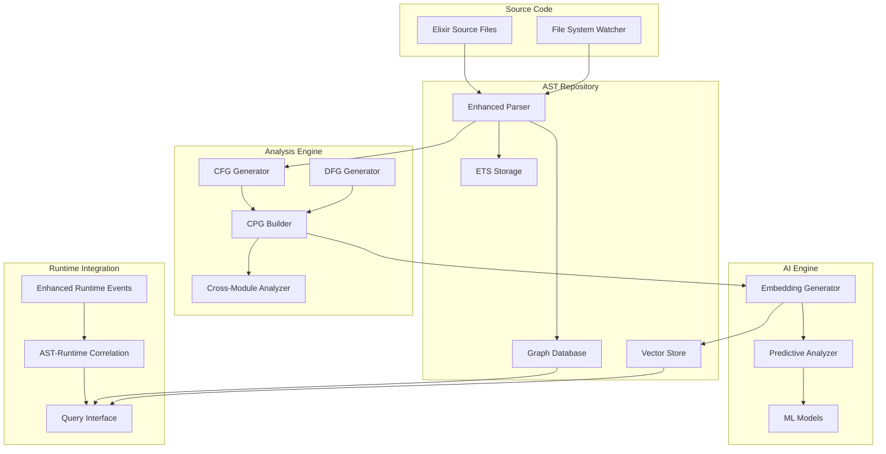

# Current Phase: Revolutionary AST Repository & Foundational Layer - ACTIVE 🚀

**Phase**: 3 (Skipping Web UI Phase 2)  
**Timeline**: 8-10 weeks  
**Status**: 🟡 **ACTIVE DEVELOPMENT**  
**Priority**: Critical Foundation  
**Start Date**: May 27, 2025  
**Dependencies**: ✅ Phase 1 Complete (Core APIs functional)

## 🎯 **Phase Overview**

Build the revolutionary AST repository and foundational layer that will transform ElixirScope from a runtime debugger into a comprehensive code intelligence platform. This phase implements the groundbreaking ideas from AST_DISCUSS.md, creating persistent, queryable AST storage with advanced analysis capabilities.

### **Strategic Shift: Foundation First**
Rather than building a web UI on top of limited capabilities, we're building the revolutionary foundation that will enable unprecedented debugging and code intelligence features. The web UI can be a separate application that leverages this powerful foundation.

### **Revolutionary Goals**
1. **Persistent AST Repository** - Complete project AST storage with graph database
2. **Code Property Graphs (CPGs)** - Unified AST + CFG + DFG representation
3. **AST-Runtime Correlation** - Link runtime events to precise AST sub-trees
4. **Advanced Static Analysis** - Cross-module analysis and pattern detection
5. **Foundational AI Integration** - AST-aware ML models and embeddings

---

## 📋 **Week-by-Week Implementation Plan**

### **Week 1-2: Persistent AST Repository Foundation**

#### **Task 1.1: AST Repository Architecture**
```elixir
# Enhance: lib/elixir_scope/ast_repository/repository.ex
defmodule ElixirScope.ASTRepository.Repository do
  @moduledoc """
  Revolutionary persistent AST repository with graph database integration.
  Stores complete project ASTs with queryable relationships.
  """
  
  # Enhanced ETS tables for comprehensive AST storage
  @modules_table :ast_modules_comprehensive
  @functions_table :ast_functions_comprehensive  
  @ast_nodes_table :ast_nodes_detailed
  @relationships_table :ast_relationships
  @call_graph_table :ast_call_graph
  
  def populate_project_asts(project_path) do
    # Parse all .ex files in project
    # Generate comprehensive ModuleData with full ASTs
    # Store in enhanced repository structure
  end
end
```

**Deliverables:**
- [ ] Enhanced `ASTRepository.Repository` with comprehensive storage
- [ ] Automated project AST population pipeline
- [ ] AST synchronization on file changes (via FileSystem watcher)
- [ ] Cross-module relationship tracking
- [ ] Performance optimization for large codebases

#### **Task 1.2: Graph Database Integration**
```elixir
# Create: lib/elixir_scope/ast_repository/graph_store.ex
defmodule ElixirScope.ASTRepository.GraphStore do
  @moduledoc """
  Graph database integration for advanced AST querying.
  Supports Neo4j, ArangoDB, or embedded graph storage.
  """
  
  def store_ast_as_graph(module_ast, module_name) do
    # Convert Elixir AST to graph nodes and edges
    # Store in graph database with relationships
    # Index for fast querying
  end
  
  def query_ast_patterns(pattern_query) do
    # Execute graph queries for AST patterns
    # Support complex traversals and pattern matching
  end
end
```

**Deliverables:**
- [ ] Graph database adapter (start with embedded solution)
- [ ] AST-to-graph conversion pipeline
- [ ] Graph query interface for AST patterns
- [ ] Performance benchmarking for graph operations
- [ ] Migration path from ETS to graph storage

### **Week 3-4: Code Property Graphs (CPGs)**

#### **Task 3.1: Control Flow Graph Generation**
```elixir
# Create: lib/elixir_scope/ast_repository/cfg_generator.ex
defmodule ElixirScope.ASTRepository.CFGGenerator do
  @moduledoc """
  Generate Control Flow Graphs from Elixir ASTs.
  Handles OTP patterns, case statements, function calls.
  """
  
  def generate_cfg(function_ast) do
    # Analyze control flow through function
    # Handle case, cond, if, try-catch patterns
    # Generate CFG nodes and edges
    %CFG{
      entry_node: entry,
      exit_nodes: exits,
      nodes: cfg_nodes,
      edges: cfg_edges
    }
  end
end
```

#### **Task 3.2: Data Flow Graph Generation**
```elixir
# Create: lib/elixir_scope/ast_repository/dfg_generator.ex
defmodule ElixirScope.ASTRepository.DFGGenerator do
  @moduledoc """
  Generate Data Flow Graphs from Elixir ASTs.
  Tracks variable assignments, usage, and data dependencies.
  """
  
  def generate_dfg(function_ast) do
    # Track variable definitions and uses
    # Identify data dependencies
    # Handle pattern matching and destructuring
    %DFG{
      variables: var_nodes,
      definitions: def_edges,
      uses: use_edges,
      dependencies: dep_edges
    }
  end
end
```

#### **Task 3.3: Unified Code Property Graph**
```elixir
# Create: lib/elixir_scope/ast_repository/cpg.ex
defmodule ElixirScope.ASTRepository.CPG do
  @moduledoc """
  Unified Code Property Graph combining AST, CFG, and DFG.
  Enables advanced semantic analysis and querying.
  """
  
  defstruct [
    :module_name,
    :ast_nodes,      # Original AST structure
    :cfg_nodes,      # Control flow nodes
    :dfg_nodes,      # Data flow nodes
    :relationships,  # All relationships between nodes
    :metadata       # Additional analysis metadata
  ]
  
  def build_cpg(module_ast) do
    # Combine AST, CFG, and DFG into unified graph
    # Create cross-references between representations
    # Enable complex queries across all dimensions
  end
end
```

**Deliverables:**
- [ ] CFG generation for Elixir control structures
- [ ] DFG generation with variable tracking
- [ ] Unified CPG data structure and builder
- [ ] CPG storage in graph database
- [ ] Query interface for complex CPG patterns

### **Week 5-6: AST-Runtime Integration Enhancement**

#### **Task 5.1: Enhanced AST Node Correlation**
```elixir
# Enhance: lib/elixir_scope/ast_repository/parser.ex
defmodule ElixirScope.ASTRepository.Parser do
  @moduledoc """
  Enhanced AST parsing with comprehensive node ID generation.
  Links every AST node to potential runtime events.
  """
  
  def assign_comprehensive_node_ids(ast) do
    # Generate unique IDs for every AST node
    # Create mapping from runtime events to AST sub-trees
    # Store variable scope and binding information
    # Enable precise runtime-to-AST correlation
  end
  
  def build_ast_metadata(ast_with_ids) do
    # Extract comprehensive metadata for each node
    # Variable scopes, function signatures, complexity metrics
    # Store in searchable format
  end
end
```

#### **Task 5.2: Runtime Event Enhancement**
```elixir
# Enhance: lib/elixir_scope/capture/instrumentation_runtime.ex
defmodule ElixirScope.Capture.InstrumentationRuntime do
  @moduledoc """
  Enhanced runtime event capture with AST correlation.
  Links runtime events to precise AST nodes and contexts.
  """
  
  def report_ast_context_event(ast_node_id, event_type, context) do
    # Enhanced event reporting with AST context
    # Include variable bindings, call stack, execution path
    # Store relationships to AST sub-trees
  end
  
  def capture_variable_with_ast_context(var_name, value, ast_node_id, scope_info) do
    # Capture variables with full AST context
    # Link to variable definition and usage nodes
    # Enable data flow tracking
  end
end
```

**Deliverables:**
- [ ] Comprehensive AST node ID generation
- [ ] Enhanced runtime event capture with AST context
- [ ] Variable tracking with AST correlation
- [ ] Runtime-to-AST query capabilities
- [ ] Performance optimization for enhanced correlation

### **Week 7-8: Advanced Static Analysis**

#### **Task 7.1: Cross-Module Analysis**
```elixir
# Create: lib/elixir_scope/analysis/cross_module_analyzer.ex
defmodule ElixirScope.Analysis.CrossModuleAnalyzer do
  @moduledoc """
  Advanced static analysis across module boundaries.
  Uses complete AST repository for global insights.
  """
  
  def build_global_call_graph() do
    # Analyze all modules to build complete call graph
    # Handle dynamic calls, protocol implementations
    # Identify circular dependencies and hotspots
  end
  
  def analyze_data_flow_across_modules(start_function, target_data) do
    # Trace data flow across module boundaries
    # Identify how data propagates through system
    # Find potential data leaks or transformations
  end
  
  def detect_architectural_patterns() do
    # Identify OTP supervision trees
    # Detect Phoenix controller patterns
    # Find Ecto schema relationships
  end
end
```

#### **Task 7.2: Advanced Pattern Detection**
```elixir
# Enhance: lib/elixir_scope/ai/pattern_recognizer.ex
defmodule ElixirScope.AI.PatternRecognizer do
  @moduledoc """
  Enhanced pattern recognition using complete AST repository.
  Detects complex patterns across entire codebase.
  """
  
  def detect_performance_antipatterns() do
    # Find N+1 query patterns in Ecto code
    # Identify inefficient Enum operations
    # Detect potential memory leaks
  end
  
  def find_security_vulnerabilities() do
    # Detect SQL injection possibilities
    # Find unvalidated user input paths
    # Identify potential XSS vulnerabilities
  end
  
  def analyze_code_complexity_patterns() do
    # Identify overly complex functions
    # Find deeply nested control structures
    # Detect code duplication patterns
  end
end
```

**Deliverables:**
- [ ] Global call graph generation and analysis
- [ ] Cross-module data flow analysis
- [ ] Architectural pattern detection
- [ ] Performance anti-pattern detection
- [ ] Security vulnerability analysis

### **Week 9-10: Foundational AI Integration**

#### **Task 9.1: AST Vector Embeddings**
```elixir
# Create: lib/elixir_scope/ai/ast_embeddings.ex
defmodule ElixirScope.AI.ASTEmbeddings do
  @moduledoc """
  Generate vector embeddings for AST nodes and code patterns.
  Enables semantic similarity and ML-based analysis.
  """
  
  def generate_function_embeddings(function_ast) do
    # Convert function AST to vector representation
    # Capture semantic meaning and structure
    # Use for similarity search and clustering
  end
  
  def generate_pattern_embeddings(ast_pattern) do
    # Create embeddings for code patterns
    # Enable pattern matching and detection
    # Support for bug pattern recognition
  end
  
  def build_similarity_index() do
    # Build searchable index of code embeddings
    # Enable fast similarity queries
    # Support for semantic code search
  end
end
```

#### **Task 9.2: Predictive Analysis Foundation**
```elixir
# Create: lib/elixir_scope/ai/predictive_analyzer.ex
defmodule ElixirScope.AI.PredictiveAnalyzer do
  @moduledoc """
  Predictive analysis using AST features and runtime history.
  Foundation for intelligent debugging and optimization.
  """
  
  def predict_performance_hotspots(module_ast) do
    # Use AST complexity + historical runtime data
    # Predict likely performance bottlenecks
    # Recommend optimization strategies
  end
  
  def predict_error_probability(function_ast, runtime_context) do
    # Analyze AST patterns associated with errors
    # Predict likelihood of runtime errors
    # Suggest preventive measures
  end
  
  def recommend_instrumentation_strategy(module_ast) do
    # Analyze AST to recommend optimal instrumentation
    # Balance insight vs. performance overhead
    # Adapt based on runtime patterns
  end
end
```

**Deliverables:**
- [ ] AST vector embedding generation
- [ ] Semantic similarity search capabilities
- [ ] Predictive performance analysis
- [ ] Error probability prediction
- [ ] Intelligent instrumentation recommendations

---

## 🔧 **Technical Architecture**

### **Enhanced AST Repository Stack**
```
ElixirScope AST Repository
├── Storage Layer
│   ├── ETS Tables (hot data, fast access)
│   ├── Graph Database (relationships, complex queries)
│   └── Vector Store (embeddings, similarity search)
├── Analysis Layer
│   ├── CFG/DFG Generators
│   ├── CPG Builder
│   ├── Cross-Module Analyzer
│   └── Pattern Recognizer
├── AI Layer
│   ├── Embedding Generator
│   ├── Predictive Analyzer
│   └── ML Model Integration
└── Integration Layer
    ├── Runtime Correlation
    ├── Event Enhancement
    └── Query Interface
```

### **Data Flow Architecture**


---

## 🧪 **Testing Strategy**

### **AST Repository Testing**
```elixir
# test/elixir_scope/ast_repository/comprehensive_test.exs
defmodule ElixirScope.ASTRepository.ComprehensiveTest do
  use ExUnit.Case, async: false
  
  test "populates complete project AST repository" do
    # Test full project parsing and storage
    # Verify all modules and functions captured
    # Check AST node ID generation
  end
  
  test "maintains AST synchronization on file changes" do
    # Test file watcher integration
    # Verify incremental updates
    # Check consistency after changes
  end
  
  test "generates accurate CFG and DFG" do
    # Test control flow graph generation
    # Verify data flow analysis
    # Check complex control structures
  end
end
```

### **Performance Testing**
```elixir
# test/elixir_scope/performance/ast_performance_test.exs
defmodule ElixirScope.Performance.ASTPerformanceTest do
  use ExUnit.Case, async: false
  
  test "AST repository scales to large codebases" do
    # Test with 1000+ modules
    # Verify query performance <1s
    # Check memory usage bounds
  end
  
  test "graph queries execute efficiently" do
    # Test complex AST pattern queries
    # Verify sub-second response times
    # Check concurrent query handling
  end
end
```

### **Integration Testing**
```elixir
# test/elixir_scope/integration/ast_runtime_integration_test.exs
defmodule ElixirScope.Integration.ASTRuntimeIntegrationTest do
  use ExUnit.Case, async: false
  
  test "runtime events correlate to precise AST nodes" do
    # Generate runtime events
    # Verify AST node correlation
    # Check context accuracy
  end
  
  test "predictive analysis uses AST + runtime data" do
    # Test performance prediction
    # Verify error probability analysis
    # Check instrumentation recommendations
  end
end
```

---

## 📊 **Success Criteria & Validation**

### **Foundational Requirements**
- [ ] **Complete AST Repository** - All project modules parsed and stored
- [ ] **Graph Database Integration** - Complex AST queries <1s response time
- [ ] **CPG Generation** - Unified AST + CFG + DFG for all functions
- [ ] **Runtime Correlation** - Events linked to precise AST sub-trees
- [ ] **Cross-Module Analysis** - Global call graph and data flow analysis
- [ ] **Pattern Detection** - Automated detection of performance/security issues
- [ ] **Vector Embeddings** - Semantic similarity search operational
- [ ] **Predictive Analysis** - Performance and error prediction capabilities

### **Performance Requirements**
- [ ] **AST Population** - Complete project parsing <30s for medium projects
- [ ] **Query Performance** - Complex AST queries <1s response time
- [ ] **Memory Usage** - AST repository <500MB for large projects
- [ ] **Synchronization** - File changes reflected <5s
- [ ] **Embedding Generation** - Function embeddings <100ms each
- [ ] **Prediction Speed** - Analysis recommendations <2s

### **Quality Requirements**
- [ ] **Test Coverage** - >95% for all new AST repository components
- [ ] **Accuracy** - >90% for pattern detection and predictions
- [ ] **Reliability** - Zero data loss during AST synchronization
- [ ] **Scalability** - Support projects with 10,000+ functions
- [ ] **Extensibility** - Plugin architecture for custom analysis

---

## 🚀 **Revolutionary Capabilities Enabled**

### **Immediate Capabilities**
1. **Semantic Code Search** - "Find functions similar to this one"
2. **Structural Breakpoints** - Break on AST patterns, not just lines
3. **Data Flow Visualization** - Track data through AST nodes
4. **Cross-Module Impact Analysis** - Understand change ripple effects
5. **Intelligent Root Cause Analysis** - AST + runtime correlation

### **Near-Term Capabilities**
1. **Predictive Debugging** - "This pattern often leads to errors"
2. **Automated Optimization** - AI-suggested refactoring
3. **Security Analysis** - Vulnerability detection from AST patterns
4. **Performance Prediction** - Bottleneck identification before deployment
5. **Macro Debugging** - Debug generated code back to macro source

### **Foundation for Future**
1. **AI Debugging Assistant** - Natural language debugging help
2. **Self-Optimizing Code** - Automatic performance improvements
3. **Proactive Bug Prevention** - Stop bugs before they happen
4. **Code Evolution Analysis** - Track how changes affect behavior
5. **Distributed AST Intelligence** - Cross-node semantic understanding

---

## 🔄 **Implementation Priorities**

### **Week 1-2 Focus**
- **Priority 1**: Enhanced AST Repository with comprehensive storage
- **Priority 2**: Graph database integration foundation
- **Priority 3**: Automated project AST population

### **Week 3-4 Focus**
- **Priority 1**: CFG and DFG generation
- **Priority 2**: Unified CPG data structure
- **Priority 3**: Performance optimization for large codebases

### **Week 5-6 Focus**
- **Priority 1**: Enhanced runtime-AST correlation
- **Priority 2**: Cross-module analysis capabilities
- **Priority 3**: Advanced pattern detection

### **Week 7-8 Focus**
- **Priority 1**: Vector embeddings and similarity search
- **Priority 2**: Predictive analysis foundation
- **Priority 3**: Comprehensive testing and validation

### **Week 9-10 Focus**
- **Priority 1**: AI integration and ML model foundation
- **Priority 2**: Performance optimization and scalability
- **Priority 3**: Documentation and API finalization

---

## 🎯 **Phase Success Definition**

Upon completion of this phase, ElixirScope will have:

1. **Revolutionary AST Repository** - Complete, queryable, persistent AST storage
2. **Code Property Graphs** - Unified AST + CFG + DFG representation
3. **Advanced Static Analysis** - Cross-module insights and pattern detection
4. **AST-Runtime Integration** - Precise correlation between static and dynamic
5. **AI Foundation** - Vector embeddings and predictive analysis capabilities
6. **Semantic Understanding** - Code intelligence beyond traditional debugging

**This phase transforms ElixirScope from a runtime debugger into a comprehensive code intelligence platform.**

---

**Phase Start Date**: May 28, 2025  
**Expected Completion**: August 6-20, 2025  
**Phase Lead**: ElixirScope Core Team  
**Status**: 🟡 **ACTIVE DEVELOPMENT** 