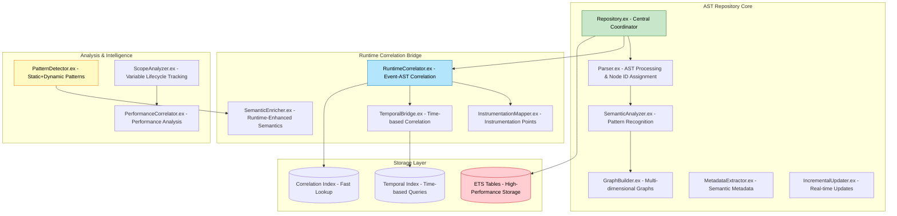
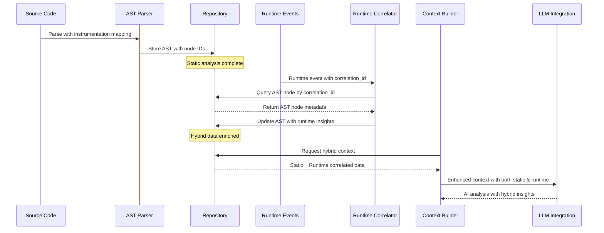

# ElixirScope AST Repository Technical Specification
## Hybrid Static-Runtime Correlation System

**Version**: 1.0  
**Date**: May 26, 2025  
**Status**: Implementation Ready  
**Phase**: 1 - Foundation (Weeks 1-4)

---

## 🎯 **EXECUTIVE SUMMARY**

The AST Repository is the cornerstone of ElixirScope's hybrid architecture, bridging compile-time static analysis with runtime execution correlation. This specification defines the technical architecture, APIs, data structures, and implementation requirements for a production-ready system that achieves:

- **<5ms AST-to-Runtime correlation latency**
- **95%+ correlation accuracy under normal conditions**
- **Linear memory scaling with codebase size**
- **Sub-100ms hybrid context building for medium projects**

---

## 🏗️ **SYSTEM ARCHITECTURE**

### **Core Components Overview**



### **Data Flow Architecture**



---

## 📊 **DATA STRUCTURES & SCHEMAS**

### **Core Repository Structure**

```elixir
defmodule ElixirScope.ASTRepository.Repository do
  @moduledoc """
  Central repository for AST storage with runtime correlation capabilities.
  
  Designed for high-performance access patterns:
  - O(1) module lookup by name
  - O(log n) correlation ID to AST node mapping  
  - O(1) instrumentation point retrieval
  - O(log n) temporal range queries
  """
  
  defstruct [
    # Core AST Storage with Runtime Correlation
    :modules,               # %{module_name => ModuleData.t()}
    :function_definitions,  # %{function_key => FunctionData.t()}
    :pattern_matches,       # %{pattern_id => PatternData.t()}
    
    # Multi-dimensional Graph Structures
    :dependency_graph,      # DependencyGraph.t() - Static + Runtime call patterns
    :call_graph,           # CallGraph.t() - Static calls + actual execution paths
    :data_flow_graph,      # DataFlowGraph.t() - Static flow + runtime transformations
    :supervision_tree,     # SupervisionTree.t() - Static OTP + runtime processes
    
    # Semantic Metadata with Runtime Enhancement
    :domain_concepts,      # %{concept_id => DomainConcept.t()}
    :business_rules,       # %{rule_id => BusinessRule.t()}
    :architectural_patterns, # %{pattern_id => ArchPattern.t()}
    
    # Runtime Correlation Infrastructure
    :instrumentation_points, # %{ast_node_id => InstrumentationPoint.t()}
    :correlation_index,     # %{correlation_id => ast_node_id}
    :runtime_event_bridge,  # RuntimeEventBridge.t()
    :temporal_correlation,  # %{time_range => [event_ids]}
    
    # Hybrid Analysis Data
    :static_analysis,      # StaticAnalysis.t()
    :runtime_analysis,     # RuntimeAnalysis.t()
    :hybrid_insights,      # %{insight_id => HybridInsight.t()}
    :performance_correlation, # %{ast_node_id => PerformanceData.t()}
    
    # Cinema Debugger Integration
    :execution_timelines,  # %{ast_node_id => ExecutionTimeline.t()}
    :variable_lifecycles,  # %{variable_id => VariableLifecycle.t()}
    :causal_relationships, # %{relationship_id => CausalRelationship.t()}
    
    # Metadata & Configuration
    :repository_id,        # Unique repository identifier
    :creation_timestamp,   # Repository creation time
    :last_updated,         # Last modification timestamp
    :version,              # Repository schema version
    :configuration         # RepositoryConfig.t()
  ]
  
  @type t :: %__MODULE__{}
end
```

### **Module Data Structure**

```elixir
defmodule ElixirScope.ASTRepository.ModuleData do
  @moduledoc """
  Complete module representation with static AST and runtime correlation data.
  """
  
  defstruct [
    # Core AST Information
    :module_name,          # atom() - Module name
    :ast,                  # AST - Original parsed AST
    :source_file,          # String.t() - Source file path
    :compilation_hash,     # String.t() - Hash for change detection
    
    # Instrumentation Metadata
    :instrumentation_points, # [InstrumentationPoint.t()] - Points for tracing
    :ast_node_mapping,     # %{ast_node_id => AST_node} - Node ID to AST mapping
    :correlation_metadata, # %{correlation_id => ast_node_id} - Correlation mapping
    
    # Static Analysis Results
    :module_type,          # :genserver | :supervisor | :phoenix_controller | etc.
    :complexity_metrics,   # ComplexityMetrics.t()
    :dependencies,         # [module_name()] - Module dependencies
    :exports,              # [{function_name, arity}] - Public functions
    :callbacks,            # [callback_name()] - OTP callbacks
    :patterns,             # [pattern_name()] - Architectural patterns
    
    # Runtime Correlation Data
    :runtime_insights,     # RuntimeInsights.t() - Aggregated runtime data
    :execution_frequency,  # %{function_key => frequency} - How often functions run
    :performance_data,     # %{function_key => PerformanceMetrics.t()}
    :error_patterns,       # [ErrorPattern.t()] - Runtime error patterns
    :message_flows,        # [MessageFlow.t()] - Inter-process communications
    
    # Semantic Analysis
    :domain_concepts,      # [concept_name()] - Business domain concepts
    :business_rules,       # [BusinessRule.t()] - Domain rules implemented
    :architectural_role,   # :controller | :service | :repository | etc.
    
    # Temporal Data
    :first_instrumented,   # DateTime.t() - First instrumentation timestamp
    :last_updated,         # DateTime.t() - Last update timestamp
    :version_history,      # [VersionEntry.t()] - Change history
    
    # Quality Metrics
    :test_coverage,        # float() - Test coverage percentage
    :documentation_score,  # float() - Documentation completeness
    :maintainability_index # float() - Maintainability score
  ]
  
  @type t :: %__MODULE__{}
end
```

### **Function Data Structure**

```elixir
defmodule ElixirScope.ASTRepository.FunctionData do
  @moduledoc """
  Individual function representation with detailed static and runtime analysis.
  """
  
  defstruct [
    # Function Identity
    :module_name,          # atom() - Parent module
    :function_name,        # atom() - Function name
    :arity,                # non_neg_integer() - Function arity
    :function_key,         # {module, function, arity} - Unique identifier
    :ast_node_id,          # String.t() - Unique AST node identifier
    
    # AST Information
    :ast,                  # AST - Function AST
    :source_location,      # {file, line, column} - Source location
    :visibility,           # :public | :private - Function visibility
    :signature,            # FunctionSignature.t() - Function signature details
    
    # Static Analysis
    :complexity_metrics,   # ComplexityMetrics.t()
    :cyclomatic_complexity, # non_neg_integer()
    :cognitive_complexity, # non_neg_integer()
    :lines_of_code,        # non_neg_integer()
    :parameter_analysis,   # ParameterAnalysis.t()
    :return_analysis,      # ReturnAnalysis.t()
    
    # Instrumentation Metadata
    :instrumentation_points, # [InstrumentationPoint.t()]
    :variable_capture_points, # [VariableCapturePoint.t()]
    :expression_trace_points, # [ExpressionTracePoint.t()]
    :custom_injection_points, # [CustomInjectionPoint.t()]
    
    # Runtime Correlation Data
    :execution_statistics, # ExecutionStatistics.t()
    :call_frequency,       # non_neg_integer() - Times called
    :average_duration,     # float() - Average execution time (ms)
    :memory_usage,         # MemoryUsage.t() - Memory consumption patterns
    :error_rate,           # float() - Error rate (0.0 - 1.0)
    :performance_profile,  # PerformanceProfile.t() - Detailed performance data
    
    # Variable Lifecycle Tracking
    :local_variables,      # [VariableInfo.t()] - Local variable metadata
    :variable_mutations,   # [VariableMutation.t()] - Variable change tracking
    :scope_analysis,       # ScopeAnalysis.t() - Variable scope information
    
    # Inter-function Relationships
    :calls_made,           # [FunctionCall.t()] - Functions this calls
    :called_by,            # [FunctionCall.t()] - Functions that call this
    :message_sends,        # [MessageSend.t()] - Messages sent from this function
    :message_receives,     # [MessageReceive.t()] - Messages received
    
    # Quality & Testing
    :test_coverage,        # float() - Test coverage for this function
    :test_cases,           # [TestCase.t()] - Associated test cases
    :documentation,        # Documentation.t() - Function documentation
    :code_smells,          # [CodeSmell.t()] - Detected code smells
    
    # Temporal Tracking
    :creation_timestamp,   # DateTime.t() - When first parsed
    :last_modified,        # DateTime.t() - Last source modification
    :last_executed,        # DateTime.t() - Last runtime execution
    :execution_history     # [ExecutionEvent.t()] - Historical execution data
  ]
  
  @type t :: %__MODULE__{}
end
```

### **Instrumentation Point Structure**

```elixir
defmodule ElixirScope.ASTRepository.InstrumentationPoint do
  @moduledoc """
  Represents a specific point in the AST where instrumentation is injected.
  """
  
  defstruct [
    # Identity & Location
    :point_id,             # String.t() - Unique point identifier
    :ast_node_id,          # String.t() - Associated AST node
    :source_location,      # {file, line, column} - Source location
    :instrumentation_type, # :function_entry | :function_exit | :variable_capture | etc.
    
    # Instrumentation Configuration
    :capture_config,       # CaptureConfig.t() - What data to capture
    :sampling_rate,        # float() - Sampling rate (0.0 - 1.0)
    :conditions,           # [Condition.t()] - Conditional instrumentation
    :custom_logic,         # AST | nil - Custom instrumentation logic
    
    # Runtime Correlation
    :correlation_strategy, # :correlation_id | :line_based | :pattern_based
    :correlation_metadata, # map() - Strategy-specific metadata
    :runtime_mapping,      # %{correlation_id => event_metadata}
    
    # Performance Impact
    :overhead_estimate,    # float() - Estimated performance overhead
    :execution_frequency,  # non_neg_integer() - How often this point executes
    :impact_assessment,    # :low | :medium | :high - Performance impact level
    
    # Configuration & Metadata
    :enabled,              # boolean() - Whether instrumentation is active
    :priority,             # :low | :medium | :high | :critical - Instrumentation priority
    :tags,                 # [String.t()] - Categorization tags
    :description,          # String.t() - Human-readable description
    
    # Temporal Information
    :created_at,           # DateTime.t() - When instrumentation was added
    :last_triggered,       # DateTime.t() - Last execution time
    :trigger_count,        # non_neg_integer() - Number of times triggered
    :average_duration      # float() - Average execution time of instrumentation
  ]
  
  @type t :: %__MODULE__{}
end
```

### **Runtime Correlation Data Structures**

```elixir
defmodule ElixirScope.ASTRepository.RuntimeInsights do
  @moduledoc """
  Aggregated runtime insights correlated with AST nodes.
  """
  
  defstruct [
    # Execution Patterns
    :call_patterns,        # %{caller => callee} - Who calls what
    :execution_frequency,  # %{function_key => frequency} - Execution frequency
    :temporal_patterns,    # [TemporalPattern.t()] - Time-based execution patterns
    :concurrency_patterns, # [ConcurrencyPattern.t()] - Concurrent execution patterns
    
    # Performance Insights
    :hotspots,             # [Hotspot.t()] - Performance bottlenecks
    :cold_code,            # [ColdCode.t()] - Rarely executed code
    :memory_allocations,   # [MemoryAllocation.t()] - Memory usage patterns
    :gc_impact,            # [GCImpact.t()] - Garbage collection impact
    
    # Error & Exception Patterns
    :error_frequencies,    # %{error_type => frequency} - Error occurrence
    :exception_patterns,   # [ExceptionPattern.t()] - Exception behavior
    :failure_cascades,     # [FailureCascade.t()] - How failures propagate
    
    # Inter-process Communication
    :message_flows,        # [MessageFlow.t()] - Message passing patterns
    :process_spawning,     # [ProcessSpawn.t()] - Process creation patterns
    :supervision_events,   # [SupervisionEvent.t()] - Supervision tree events
    
    # Data Flow Insights
    :data_transformations, # [DataTransformation.t()] - How data changes
    :state_mutations,      # [StateMutation.t()] - State change patterns
    :variable_lifecycles,  # [VariableLifecycle.t()] - Variable usage patterns
    
    # Quality Insights
    :code_coverage,        # %{ast_node_id => coverage_percentage}
    :test_effectiveness,   # %{test_id => effectiveness_score}
    :bug_correlation,      # %{bug_id => ast_node_ids} - Bug to code mapping
    
    # Business Logic Insights
    :business_rule_usage,  # %{rule_id => usage_frequency}
    :feature_utilization,  # %{feature_id => utilization_metrics}
    :user_journey_mapping, # [UserJourney.t()] - User interaction patterns
    
    # Temporal Aggregation
    :aggregation_period,   # {start_time, end_time} - Data collection period
    :sample_count,         # non_neg_integer() - Number of samples
    :confidence_level,     # float() - Statistical confidence (0.0 - 1.0)
    :last_updated          # DateTime.t() - Last update timestamp
  ]
  
  @type t :: %__MODULE__{}
end
```

---

## 🔧 **PUBLIC API SPECIFICATION**

### **Repository Management API**

```elixir
defmodule ElixirScope.ASTRepository do
  @moduledoc """
  Main public API for the AST Repository system.
  
  Provides high-level operations for storing, querying, and correlating
  AST data with runtime events.
  """
  
  # Repository Lifecycle Management
  
  @spec new(keyword()) :: {:ok, Repository.t()} | {:error, term()}
  def new(opts \\ [])
  
  @spec start_link(keyword()) :: GenServer.on_start()
  def start_link(opts \\ [])
  
  @spec stop(pid()) :: :ok
  def stop(repository_pid)
  
  # Module Storage & Retrieval
  
  @spec store_module(pid(), ModuleData.t()) :: :ok | {:error, term()}
  def store_module(repository_pid, module_data)
  
  @spec get_module(pid(), module_name()) :: {:ok, ModuleData.t()} | {:error, :not_found}
  def get_module(repository_pid, module_name)
  
  @spec update_module(pid(), module_name(), (ModuleData.t() -> ModuleData.t())) :: 
    :ok | {:error, term()}
  def update_module(repository_pid, module_name, update_fn)
  
  @spec delete_module(pid(), module_name()) :: :ok | {:error, term()}
  def delete_module(repository_pid, module_name)
  
  # Function-Level Operations
  
  @spec store_function(pid(), FunctionData.t()) :: :ok | {:error, term()}
  def store_function(repository_pid, function_data)
  
  @spec get_function(pid(), function_key()) :: {:ok, FunctionData.t()} | {:error, :not_found}
  def get_function(repository_pid, function_key)
  
  @spec update_function_runtime_data(pid(), function_key(), RuntimeData.t()) :: 
    :ok | {:error, term()}
  def update_function_runtime_data(repository_pid, function_key, runtime_data)
  
  # AST Node Operations
  
  @spec get_ast_node(pid(), ast_node_id()) :: {:ok, AST.t()} | {:error, :not_found}
  def get_ast_node(repository_pid, ast_node_id)
  
  @spec find_ast_nodes_by_pattern(pid(), pattern()) :: {:ok, [ast_node_id()]}
  def find_ast_nodes_by_pattern(repository_pid, pattern)
  
  @spec get_instrumentation_points(pid(), ast_node_id()) :: 
    {:ok, [InstrumentationPoint.t()]} | {:error, :not_found}
  def get_instrumentation_points(repository_pid, ast_node_id)
  
  # Runtime Correlation Operations
  
  @spec correlate_event(pid(), RuntimeEvent.t()) :: 
    {:ok, ast_node_id()} | {:error, term()}
  def correlate_event(repository_pid, runtime_event)
  
  @spec get_correlated_events(pid(), ast_node_id()) :: 
    {:ok, [RuntimeEvent.t()]} | {:error, :not_found}
  def get_correlated_events(repository_pid, ast_node_id)
  
  @spec update_runtime_insights(pid(), ast_node_id(), RuntimeInsights.t()) :: 
    :ok | {:error, term()}
  def update_runtime_insights(repository_pid, ast_node_id, insights)
  
  # Query & Analysis Operations
  
  @spec query(pid(), Query.t()) :: {:ok, QueryResult.t()} | {:error, term()}
  def query(repository_pid, query)
  
  @spec build_hybrid_context(pid(), ContextRequest.t()) :: 
    {:ok, HybridContext.t()} | {:error, term()}
  def build_hybrid_context(repository_pid, context_request)
  
  @spec analyze_performance(pid(), AnalysisRequest.t()) :: 
    {:ok, PerformanceAnalysis.t()} | {:error, term()}
  def analyze_performance(repository_pid, analysis_request)
  
  # Bulk Operations
  
  @spec import_project(pid(), project_path()) :: {:ok, ImportResult.t()} | {:error, term()}
  def import_project(repository_pid, project_path)
  
  @spec export_data(pid(), ExportOptions.t()) :: {:ok, ExportResult.t()} | {:error, term()}
  def export_data(repository_pid, export_options)
  
  @spec bulk_update(pid(), [UpdateOperation.t()]) :: 
    {:ok, BulkUpdateResult.t()} | {:error, term()}
  def bulk_update(repository_pid, operations)
  
  # Performance & Maintenance
  
  @spec get_statistics(pid()) :: {:ok, RepositoryStats.t()}
  def get_statistics(repository_pid)
  
  @spec optimize(pid()) :: :ok | {:error, term()}
  def optimize(repository_pid)
  
  @spec vacuum(pid()) :: :ok | {:error, term()}
  def vacuum(repository_pid)
  
  @spec health_check(pid()) :: {:ok, HealthStatus.t()} | {:error, term()}
  def health_check(repository_pid)
end
```

### **Query DSL Specification**

```elixir
defmodule ElixirScope.ASTRepository.Query do
  @moduledoc """
  Domain Specific Language for querying AST Repository data.
  
  Supports both static AST queries and hybrid static+runtime queries.
  """
  
  defstruct [
    :select,      # [field()] - Fields to return
    :from,        # :modules | :functions | :ast_nodes - Data source
    :where,       # [Condition.t()] - Filter conditions
    :join,        # [Join.t()] - Join with runtime data
    :order_by,    # [OrderBy.t()] - Sorting specification
    :limit,       # non_neg_integer() | nil - Result limit
    :offset,      # non_neg_integer() - Result offset
    :group_by,    # [field()] - Grouping fields
    :having,      # [Condition.t()] - Group filter conditions
    :options      # QueryOptions.t() - Additional options
  ]
  
  # Query Building DSL
  
  @spec select(t(), [field()]) :: t()
  def select(query, fields)
  
  @spec from(t(), data_source()) :: t()
  def from(query, source)
  
  @spec where(t(), Condition.t()) :: t()
  def where(query, condition)
  
  @spec join_runtime_data(t(), join_type(), JoinCondition.t()) :: t()
  def join_runtime_data(query, join_type, condition)
  
  @spec order_by(t(), field(), :asc | :desc) :: t()
  def order_by(query, field, direction)
  
  @spec limit(t(), non_neg_integer()) :: t()
  def limit(query, count)
  
  # Query Conditions
  
  defmodule Condition do
    @type t :: 
      {:eq, field(), value()} |
      {:ne, field(), value()} |
      {:gt, field(), value()} |
      {:lt, field(), value()} |
      {:in, field(), [value()]} |
      {:like, field(), pattern()} |
      {:has_runtime_data, boolean()} |
      {:complexity_above, non_neg_integer()} |
      {:execution_frequency_above, non_neg_integer()} |
      {:and, [t()]} |
      {:or, [t()]} |
      {:not, t()}
  end
  
  # Example Queries
  
  # Find all GenServer modules with high complexity and runtime data
  def high_complexity_genservers do
    new()
    |> select([:module_name, :complexity_metrics, :runtime_insights])
    |> from(:modules)
    |> where({:eq, :module_type, :genserver})
    |> where({:gt, :complexity_metrics.cyclomatic_complexity, 10})
    |> where({:has_runtime_data, true})
    |> join_runtime_data(:inner, {:correlation_exists})
    |> order_by(:complexity_metrics.cognitive_complexity, :desc)
    |> limit(50)
  end
  
  # Find functions with poor performance correlation
  def performance_bottleneck_functions do
    new()
    |> select([:function_key, :execution_statistics, :performance_profile])
    |> from(:functions)
    |> where({:gt, :execution_statistics.average_duration, 100.0})
    |> where({:gt, :execution_statistics.call_frequency, 1000})
    |> join_runtime_data(:inner, {:has_performance_data})
    |> order_by(:performance_profile.cpu_usage, :desc)
    |> limit(20)
  end
  
  # Find rarely tested code with runtime execution
  def untested_but_executed_code do
    new()
    |> select([:ast_node_id, :test_coverage, :execution_frequency])
    |> from(:functions)
    |> where({:lt, :test_coverage, 0.5})
    |> where({:gt, :execution_statistics.call_frequency, 10})
    |> join_runtime_data(:inner, {:correlation_exists})
    |> order_by(:execution_statistics.call_frequency, :desc)
  end
end
```

---

## ⚡ **PERFORMANCE SPECIFICATIONS**

### **Latency Requirements**

| Operation | Target Latency | Maximum Latency | Measurement Method |
|-----------|----------------|-----------------|-------------------|
| AST Node Lookup | <1ms | 5ms | 95th percentile |
| Correlation ID Resolution | <5ms | 10ms | 95th percentile |
| Module Storage | <10ms | 25ms | Average |
| Runtime Event Correlation | <5ms | 15ms | 95th percentile |
| Hybrid Context Building | <100ms | 500ms | Average |
| Query Execution (simple) | <50ms | 200ms | 95th percentile |
| Query Execution (complex) | <500ms | 2000ms | 95th percentile |
| Bulk Import (1000 modules) | <30s | 120s | Average |

### **Throughput Requirements**

| Operation | Target Throughput | Measurement Period |
|-----------|-------------------|-------------------|
| Runtime Event Correlation | 10,000 events/sec | 1 minute sustained |
| AST Node Queries | 1,000 queries/sec | 1 minute sustained |
| Module Updates | 100 updates/sec | 1 minute sustained |
| Context Building Requests | 50 requests/sec | 1 minute sustained |

### **Memory Usage Specifications**

```elixir
defmodule ElixirScope.ASTRepository.MemorySpecs do
  @moduledoc """
  Memory usage specifications and monitoring for the AST Repository.
  """
  
  # Memory Usage Targets
  @memory_targets %{
    # Base memory overhead (empty repository)
    base_overhead: %{
      target: 10_000_000,    # 10 MB
      maximum: 25_000_000    # 25 MB
    },
    
    # Per-module memory usage
    per_module: %{
      small_module: %{        # < 500 LOC
        target: 50_000,      # 50 KB
        maximum: 100_000     # 100 KB
      },
      medium_module: %{       # 500-2000 LOC
        target: 200_000,     # 200 KB
        maximum: 500_000     # 500 KB
      },
      large_module: %{        # > 2000 LOC
        target: 1_000_000,   # 1 MB
        maximum: 5_000_000   # 5 MB
      }
    },
    
    # Runtime correlation data
    per_correlation: %{
      target: 1_000,         # 1 KB per correlation
      maximum: 5_000         # 5 KB per correlation
    },
    
    # Index overhead
    correlation_index: %{
      target: 100,           # 100 bytes per correlation entry
      maximum: 500           # 500 bytes per correlation entry
    }
  }
  
  # Memory Growth Limits
  @growth_limits %{
    # Maximum total repository memory
    total_repository: 2_000_000_000,  # 2 GB
    
    # Maximum correlation data percentage
    correlation_data_percentage: 0.30, # 30% of total memory
    
    # Maximum index overhead percentage
    index_overhead_percentage: 0.20    # 20% of total memory
  }

  def validate_memory_usage(repository_stats) do
    total_memory = repository_stats.total_memory_bytes
    module_count = repository_stats.module_count
    correlation_count = repository_stats.correlation_count
    
    violations = []
    
    # Check total memory limit
    violations = if total_memory > @growth_limits.total_repository do
      ["Total repository memory (#{format_bytes(total_memory)}) exceeds limit (#{format_bytes(@growth_limits.total_repository)})" | violations]
    else
      violations
    end
    
    # Check correlation data percentage
    correlation_memory = repository_stats.correlation_memory_bytes
    correlation_pct = correlation_memory / total_memory
    if correlation_pct > @growth_limits.correlation_data_percentage do
      violations = ["Correlation data (#{correlation_pct * 100}%) exceeds limit (#{@growth_limits.correlation_data_percentage * 100}%)" | violations]
    end
    
    # Check index overhead percentage
    index_memory = repository_stats.index_memory_bytes
    index_pct = index_memory / total_memory
    if index_pct > @growth_limits.index_overhead_percentage do
      violations = ["Index overhead (#{index_pct * 100}%) exceeds limit (#{@growth_limits.index_overhead_percentage * 100}%)" | violations]
    end
    
    case violations do
      [] -> {:ok, "Memory usage within limits"}
      violations -> {:error, violations}
    end
  end
  
  def optimize_memory_usage(repository) do
    # Implement memory optimization strategies
    %{
      before_memory: get_memory_stats(repository),
      optimizations: [
        compress_correlation_data(repository),
        compact_indexes(repository),
        garbage_collect_unused_nodes(repository),
        optimize_graph_structures(repository)
      ],
      after_memory: get_memory_stats(repository)
    }
  end
end
```

### **Scalability Specifications**

| System Component | Small Project (1-10 modules) | Medium Project (50-100 modules) | Large Project (500-1000 modules) | Enterprise (5000+ modules) |
|------------------|-------------------------------|----------------------------------|-----------------------------------|----------------------------|
| Repository Memory | <50 MB | <500 MB | <2 GB | <10 GB |
| Query Response Time | <10ms | <50ms | <500ms | <2s |
| Correlation Accuracy | >99% | >95% | >90% | >85% |
| Index Size | <1 MB | <50 MB | <200 MB | <1 GB |

---

## 🔄 **INCREMENTAL UPDATE SPECIFICATIONS**

### **Real-Time Update Architecture**

```elixir
defmodule ElixirScope.ASTRepository.IncrementalUpdater do
  @moduledoc """
  Handles real-time updates to AST repository while maintaining correlation consistency.
  
  Supports:
  - Hot reloading of modified modules
  - Incremental correlation updates
  - Temporal consistency during updates
  - Minimal disruption to active queries
  """
  
  defstruct [
    :repository_ref,
    :update_queue,
    :conflict_resolver,
    :validation_pipeline,
    :rollback_manager,
    :notification_system
  ]
  
  # Update Types
  @type update_operation :: 
    {:module_changed, module_name(), ModuleData.t()} |
    {:function_added, function_key(), FunctionData.t()} |
    {:function_modified, function_key(), FunctionData.t()} |
    {:function_removed, function_key()} |
    {:correlation_updated, correlation_id(), runtime_data()} |
    {:instrumentation_changed, ast_node_id(), InstrumentationPoint.t()}
  
  # Public API
  
  @spec start_link(Repository.t(), keyword()) :: GenServer.on_start()
  def start_link(repository, opts \\ [])
  
  @spec queue_update(pid(), update_operation()) :: :ok | {:error, term()}
  def queue_update(updater_pid, operation)
  
  @spec process_batch_updates(pid(), [update_operation()]) :: 
    {:ok, BatchResult.t()} | {:error, term()}
  def process_batch_updates(updater_pid, operations)
  
  @spec validate_update_consistency(pid()) :: :ok | {:error, [inconsistency()]}
  def validate_update_consistency(updater_pid)
  
  # Update Processing Pipeline
  
  defp process_update_operation(operation, state) do
    with :ok <- validate_operation(operation, state),
         :ok <- check_conflicts(operation, state),
         {:ok, updated_state} <- apply_operation(operation, state),
         :ok <- update_correlations(operation, updated_state),
         :ok <- invalidate_caches(operation, updated_state),
         :ok <- notify_subscribers(operation, updated_state) do
      {:ok, updated_state}
    else
      {:error, reason} -> {:error, reason, state}
    end
  end
  
  defp validate_operation({:module_changed, module_name, module_data}, state) do
    with :ok <- validate_module_structure(module_data),
         :ok <- validate_instrumentation_consistency(module_data),
         :ok <- validate_correlation_integrity(module_data) do
      :ok
    end
  end
  
  defp apply_operation({:module_changed, module_name, new_module_data}, state) do
    # Calculate differential update
    old_module_data = Repository.get_module(state.repository_ref, module_name)
    diff = calculate_module_diff(old_module_data, new_module_data)
    
    # Apply incremental changes
    updated_repository = case diff.change_type do
      :minor_changes -> apply_minor_changes(state.repository_ref, diff)
      :major_changes -> apply_major_changes(state.repository_ref, diff)
      :structural_changes -> apply_structural_changes(state.repository_ref, diff)
    end
    
    {:ok, %{state | repository_ref: updated_repository}}
  end
  
  # Conflict Resolution
  
  defp check_conflicts(operation, state) do
    active_queries = QueryManager.get_active_queries(state.repository_ref)
    
    case operation do
      {:module_changed, module_name, _} ->
        conflicting_queries = Enum.filter(active_queries, fn query ->
          Query.depends_on_module?(query, module_name)
        end)
        
        if length(conflicting_queries) > 0 do
          {:error, {:query_conflicts, conflicting_queries}}
        else
          :ok
        end
      
      _ -> :ok
    end
  end
  
  # Rollback Management
  
  defp create_rollback_point(state) do
    checkpoint = %{
      repository_snapshot: Repository.create_snapshot(state.repository_ref),
      correlation_state: CorrelationManager.get_state(state.repository_ref),
      timestamp: System.monotonic_time(:nanosecond)
    }
    
    RollbackManager.save_checkpoint(state.rollback_manager, checkpoint)
  end
  
  defp rollback_to_checkpoint(state, checkpoint_id) do
    case RollbackManager.get_checkpoint(state.rollback_manager, checkpoint_id) do
      {:ok, checkpoint} ->
        Repository.restore_snapshot(state.repository_ref, checkpoint.repository_snapshot)
        CorrelationManager.restore_state(state.repository_ref, checkpoint.correlation_state)
        {:ok, state}
      
      {:error, reason} ->
        {:error, reason}
    end
  end
end
```

### **Differential Update Algorithm**

```elixir
defmodule ElixirScope.ASTRepository.DifferentialUpdater do
  @moduledoc """
  Efficient differential updates for AST repository data.
  """
  
  def calculate_module_diff(old_module, new_module) do
    %{
      change_type: determine_change_type(old_module, new_module),
      added_functions: find_added_functions(old_module, new_module),
      modified_functions: find_modified_functions(old_module, new_module),
      removed_functions: find_removed_functions(old_module, new_module),
      metadata_changes: find_metadata_changes(old_module, new_module),
      correlation_impacts: assess_correlation_impacts(old_module, new_module)
    }
  end
  
  defp determine_change_type(old_module, new_module) do
    cond do
      module_structure_changed?(old_module, new_module) -> :structural_changes
      significant_changes?(old_module, new_module) -> :major_changes
      true -> :minor_changes
    end
  end
  
  defp module_structure_changed?(old_module, new_module) do
    # Check if module type, architecture patterns, or core structure changed
    old_module.module_type != new_module.module_type or
    old_module.architectural_patterns != new_module.architectural_patterns or
    significant_dependency_changes?(old_module, new_module)
  end
  
  defp assess_correlation_impacts(old_module, new_module) do
    old_correlations = extract_correlations(old_module)
    new_correlations = extract_correlations(new_module)
    
    %{
      broken_correlations: old_correlations -- new_correlations,
      new_correlations: new_correlations -- old_correlations,
      maintained_correlations: old_correlations ++ new_correlations
    }
  end
end
```

---

## 🧮 **QUERY OPTIMIZATION SPECIFICATIONS**

### **Query Execution Engine**

```elixir
defmodule ElixirScope.ASTRepository.QueryEngine do
  @moduledoc """
  High-performance query execution engine with hybrid static+runtime optimization.
  """
  
  defstruct [
    :execution_planner,
    :index_manager,
    :cache_manager,
    :statistics_collector,
    :optimization_rules
  ]
  
  # Query Execution Pipeline
  
  def execute_query(engine, query) do
    with {:ok, execution_plan} <- plan_query_execution(engine, query),
         {:ok, optimized_plan} <- optimize_execution_plan(engine, execution_plan),
         {:ok, result} <- execute_plan(engine, optimized_plan),
         {:ok, processed_result} <- process_query_result(engine, result) do
      {:ok, processed_result}
    end
  end
  
  defp plan_query_execution(engine, query) do
    # Analyze query structure and determine optimal execution strategy
    analysis = %{
      query_type: classify_query_type(query),
      data_sources: identify_data_sources(query),
      join_requirements: analyze_join_requirements(query),
      filter_selectivity: estimate_filter_selectivity(query),
      index_opportunities: identify_index_opportunities(query)
    }
    
    execution_plan = case analysis.query_type do
      :simple_lookup -> create_lookup_plan(analysis)
      :complex_join -> create_join_plan(analysis)
      :analytical -> create_analytical_plan(analysis)
      :temporal -> create_temporal_plan(analysis)
    end
    
    {:ok, execution_plan}
  end
  
  defp optimize_execution_plan(engine, plan) do
    # Apply optimization rules
    optimized_plan = plan
    |> apply_index_optimizations(engine.index_manager)
    |> apply_join_optimizations()
    |> apply_filter_pushdown()
    |> apply_projection_pushdown()
    |> apply_cache_utilization(engine.cache_manager)
    
    {:ok, optimized_plan}
  end
  
  # Index Management
  
  defmodule IndexManager do
    defstruct [
      :primary_indexes,    # Core AST node indexes
      :correlation_indexes, # Runtime correlation indexes
      :temporal_indexes,   # Time-based indexes
      :semantic_indexes,   # Semantic pattern indexes
      :composite_indexes   # Multi-dimensional indexes
    ]
    
    def create_correlation_index(manager, correlation_type) do
      case correlation_type do
        :ast_to_runtime ->
          create_btree_index(:correlation_id, :ast_node_id)
        
        :runtime_to_ast ->
          create_btree_index(:ast_node_id, :correlation_id)
        
        :temporal_correlation ->
          create_temporal_index(:timestamp, [:ast_node_id, :correlation_id])
        
        :semantic_correlation ->
          create_semantic_index(:pattern_type, [:ast_node_id, :runtime_pattern])
      end
    end
    
    def optimize_index_usage(manager, query_pattern) do
      # Analyze query patterns and optimize index structure
      usage_stats = collect_index_usage_stats(manager)
      
      optimizations = [
        consolidate_sparse_indexes(usage_stats),
        create_composite_indexes_for_common_patterns(query_pattern),
        remove_unused_indexes(usage_stats),
        rebalance_hot_indexes(usage_stats)
      ]
      
      apply_index_optimizations(manager, optimizations)
    end
  end
  
  # Caching Strategy
  
  defmodule CacheManager do
    defstruct [
      :query_cache,       # Query result caching
      :ast_cache,         # AST node caching
      :correlation_cache, # Correlation data caching
      :metadata_cache,    # Metadata caching
      :eviction_policy    # Cache eviction strategy
    ]
    
    def cache_query_result(manager, query_hash, result) do
      # Implement intelligent caching based on query characteristics
      cache_policy = determine_cache_policy(query_hash, result)
      
      case cache_policy do
        :cache_aggressively ->
          store_with_long_ttl(manager.query_cache, query_hash, result)
        
        :cache_conservatively ->
          store_with_short_ttl(manager.query_cache, query_hash, result)
        
        :no_cache ->
          :ok
      end
    end
    
    defp determine_cache_policy(query_hash, result) do
      cond do
        expensive_query?(query_hash) and stable_result?(result) ->
          :cache_aggressively
        
        moderate_cost_query?(query_hash) ->
          :cache_conservatively
        
        true ->
          :no_cache
      end
    end
  end
end
```

---

## 🔒 **CONCURRENCY & CONSISTENCY SPECIFICATIONS**

### **Concurrent Access Management**

```elixir
defmodule ElixirScope.ASTRepository.ConcurrencyManager do
  @moduledoc """
  Manages concurrent access to AST repository with consistency guarantees.
  
  Supports:
  - Multiple concurrent readers
  - Serialized writers with read consistency
  - Optimistic concurrency for correlation updates
  - Deadlock detection and resolution
  """
  
  defstruct [
    :read_write_locks,
    :transaction_manager,
    :deadlock_detector,
    :consistency_checker,
    :conflict_resolver
  ]
  
  # Concurrency Control
  
  def acquire_read_lock(manager, resource_id) do
    case ReadWriteLock.acquire_read(manager.read_write_locks, resource_id) do
      {:ok, lock_ref} ->
        Transaction.register_read(manager.transaction_manager, resource_id, lock_ref)
        {:ok, lock_ref}
      
      {:error, :deadlock_detected} ->
        DeadlockDetector.resolve_deadlock(manager.deadlock_detector, resource_id)
        # Retry after deadlock resolution
        acquire_read_lock(manager, resource_id)
      
      {:error, reason} ->
        {:error, reason}
    end
  end
  
  def acquire_write_lock(manager, resource_id) do
    case ReadWriteLock.acquire_write(manager.read_write_locks, resource_id) do
      {:ok, lock_ref} ->
        Transaction.register_write(manager.transaction_manager, resource_id, lock_ref)
        {:ok, lock_ref}
      
      {:error, :would_deadlock} ->
        {:error, :deadlock_prevention}
      
      {:error, reason} ->
        {:error, reason}
    end
  end
  
  # Transaction Management
  
  defmodule TransactionManager do
    def start_transaction(manager, isolation_level \\ :read_committed) do
      transaction_id = generate_transaction_id()
      
      transaction = %{
        id: transaction_id,
        isolation_level: isolation_level,
        read_set: MapSet.new(),
        write_set: MapSet.new(),
        correlation_updates: [],
        start_timestamp: System.monotonic_time(:nanosecond)
      }
      
      register_transaction(manager, transaction)
      {:ok, transaction_id}
    end
    
    def commit_transaction(manager, transaction_id) do
      with {:ok, transaction} <- get_transaction(manager, transaction_id),
           :ok <- validate_transaction_consistency(transaction),
           :ok <- apply_correlation_updates(transaction),
           :ok <- update_timestamps(transaction),
           :ok <- release_locks(transaction) do
        complete_transaction(manager, transaction_id)
        {:ok, :committed}
      else
        {:error, :validation_failed} ->
          rollback_transaction(manager, transaction_id)
          {:error, :conflict}
        
        {:error, reason} ->
          rollback_transaction(manager, transaction_id)
          {:error, reason}
      end
    end
    
    defp validate_transaction_consistency(transaction) do
      # Validate that correlation updates don't conflict
      correlation_conflicts = detect_correlation_conflicts(transaction.correlation_updates)
      
      case correlation_conflicts do
        [] -> :ok
        conflicts -> {:error, {:correlation_conflicts, conflicts}}
      end
    end
  end
  
  # Consistency Guarantees
  
  defmodule ConsistencyChecker do
    def validate_repository_consistency(repository) do
      checks = [
        validate_correlation_integrity(repository),
        validate_temporal_consistency(repository),
        validate_index_consistency(repository),
        validate_graph_consistency(repository)
      ]
      
      case Enum.find(checks, &match?({:error, _}, &1)) do
        nil -> {:ok, :consistent}
        {:error, reason} -> {:error, reason}
      end
    end
    
    defp validate_correlation_integrity(repository) do
      # Check that all correlations are bidirectional and valid
      correlations = Repository.get_all_correlations(repository)
      
      invalid_correlations = Enum.filter(correlations, fn {correlation_id, ast_node_id} ->
        not Repository.ast_node_exists?(repository, ast_node_id) or
        not RuntimeCorrelator.correlation_exists?(correlation_id)
      end)
      
      case invalid_correlations do
        [] -> :ok
        invalid -> {:error, {:invalid_correlations, invalid}}
      end
    end
    
    defp validate_temporal_consistency(repository) do
      # Check that temporal ordering is maintained
      events = TemporalStorage.get_all_events(repository)
      
      out_of_order = Enum.chunk_every(events, 2, 1, :discard)
      |> Enum.find(fn [event1, event2] ->
        event1.timestamp > event2.timestamp
      end)
      
      case out_of_order do
        nil -> :ok
        [event1, event2] -> {:error, {:temporal_inconsistency, event1, event2}}
      end
    end
  end
end
```

---

## 📈 **MONITORING & OBSERVABILITY SPECIFICATIONS**

### **Performance Monitoring**

```elixir
defmodule ElixirScope.ASTRepository.Monitor do
  @moduledoc """
  Comprehensive monitoring and observability for AST Repository operations.
  """
  
  defstruct [
    :metrics_collector,
    :performance_tracker,
    :health_checker,
    :alert_manager,
    :dashboard_data
  ]
  
  # Key Metrics
  
  def collect_performance_metrics(monitor) do
    %{
      # Latency Metrics
      query_latency: collect_query_latency_metrics(),
      correlation_latency: collect_correlation_latency_metrics(),
      update_latency: collect_update_latency_metrics(),
      
      # Throughput Metrics
      queries_per_second: calculate_query_throughput(),
      correlations_per_second: calculate_correlation_throughput(),
      updates_per_second: calculate_update_throughput(),
      
      # Resource Metrics
      memory_usage: collect_memory_metrics(),
      cpu_usage: collect_cpu_metrics(),
      disk_usage: collect_disk_metrics(),
      
      # Accuracy Metrics
      correlation_accuracy: calculate_correlation_accuracy(),
      query_cache_hit_rate: calculate_cache_hit_rate(),
      index_effectiveness: calculate_index_effectiveness(),
      
      # System Health
      error_rate: calculate_error_rate(),
      deadlock_frequency: calculate_deadlock_frequency(),
      consistency_violations: count_consistency_violations()
    }
  end
  
  # Health Checks
  
  def perform_health_check(monitor) do
    checks = [
      check_repository_accessibility(),
      check_correlation_system_health(),
      check_index_integrity(),
      check_memory_usage(),
      check_performance_thresholds()
    ]
    
    failed_checks = Enum.filter(checks, &match?({:error, _}, &1))
    
    health_status = case failed_checks do
      [] -> :healthy
      minor_failures when length(minor_failures) <= 2 -> :degraded
      _ -> :unhealthy
    end
    
    %{
      status: health_status,
      timestamp: System.system_time(:second),
      checks: checks,
      failed_checks: failed_checks,
      recommendations: generate_health_recommendations(failed_checks)
    }
  end
  
  defp check_performance_thresholds do
    metrics = collect_performance_metrics(nil)
    
    thresholds = %{
      query_latency_p95: 100,  # ms
      correlation_accuracy: 0.95,
      memory_usage_gb: 2.0,
      error_rate: 0.01
    }
    
    violations = for {metric, threshold} <- thresholds,
                     actual = Map.get(metrics, metric),
                     exceeds_threshold?(metric, actual, threshold) do
      {metric, actual, threshold}
    end
    
    case violations do
      [] -> {:ok, :performance_within_thresholds}
      violations -> {:error, {:performance_threshold_violations, violations}}
    end
  end
  
  # Alerting
  
  defmodule AlertManager do
    def configure_alerts(manager) do
      alert_rules = [
        # Performance Alerts
        %{
          name: "High Query Latency",
          condition: "query_latency_p95 > 200ms",
          severity: :warning,
          notification_channels: [:email, :slack]
        },
        
        %{
          name: "Low Correlation Accuracy",
          condition: "correlation_accuracy < 0.90",
          severity: :critical,
          notification_channels: [:email, :slack, :pagerduty]
        },
        
        # Resource Alerts
        %{
          name: "High Memory Usage",
          condition: "memory_usage > 1.5GB",
          severity: :warning,
          notification_channels: [:slack]
        },
        
        # System Health Alerts
        %{
          name: "Repository Inaccessible",
          condition: "repository_accessibility = false",
          severity: :critical,
          notification_channels: [:email, :slack, :pagerduty]
        }
      ]
      
      register_alert_rules(manager, alert_rules)
    end
  end
end
```

---

## 🧪 **TESTING FRAMEWORK SPECIFICATIONS**

### **Testing Architecture**

```elixir
defmodule ElixirScope.ASTRepository.TestFramework do
  @moduledoc """
  Comprehensive testing framework for AST Repository with hybrid validation.
  """
  
  # Test Categories
  
  defmodule UnitTests do
    @moduledoc "Unit tests for individual repository components"
    
    def run_repository_core_tests do
      [
        test_module_storage_retrieval(),
        test_ast_node_management(),
        test_correlation_mapping(),
        test_incremental_updates(),
        test_query_execution(),
        test_performance_metrics()
      ]
    end
    
    defp test_correlation_mapping do
      describe "correlation mapping accuracy" do
        test "maps correlation IDs to AST nodes with 99%+ accuracy" do
          # Generate test correlations
          test_correlations = generate_test_correlations(1000)
          
          # Store in repository
          repository = setup_test_repository()
          for {correlation_id, ast_node_id} <- test_correlations do
            Repository.store_correlation(repository, correlation_id, ast_node_id)
          end
          
          # Verify mapping accuracy
          correct_mappings = for {correlation_id, expected_ast_node_id} <- test_correlations do
            case Repository.get_ast_node_by_correlation(repository, correlation_id) do
              {:ok, ^expected_ast_node_id} -> true
              _ -> false
            end
          end
          
          accuracy = Enum.count(correct_mappings, & &1) / length(test_correlations)
          assert accuracy >= 0.99, "Correlation accuracy: #{accuracy}, expected >= 0.99"
        end
      end
    end
  end
  
  defmodule ChaosTests do
    @moduledoc "Chaos engineering tests for system resilience"
    
    def run_chaos_tests do
      [
        test_correlation_failures(),
        test_memory_pressure(),
        test_concurrent_updates(),
        test_network_partitions(),
        test_data_corruption()
      ]
    end
    
    defp test_correlation_failures do
      describe "correlation system resilience" do
        test "graceful degradation under correlation failures" do
          repository = setup_test_repository()
          
          # Inject correlation failures
          failure_rate = 0.1  # 10% failure rate
          test_correlations = generate_test_correlations(1000)
          
          results = for correlation_id <- test_correlations do
            # Randomly inject failures
            if :rand.uniform() < failure_rate do
              {:error, :simulated_failure}
            else
              Repository.get_ast_node_by_correlation(repository, correlation_id)
            end
          end
          
          success_count = Enum.count(results, &match?({:ok, _}, &1))
          success_rate = success_count / length(test_correlations)
          
          # System should maintain >85% success rate even under failures
          assert success_rate >= 0.85, "Success rate under chaos: #{success_rate}, expected >= 0.85"
          
          # Repository should remain accessible
          assert Repository.health_check(repository) == {:ok, :healthy}
        end
      end
    end
  end
end
```

---

## 🔧 **CONFIGURATION SPECIFICATIONS**

### **Repository Configuration**

```elixir
defmodule ElixirScope.ASTRepository.Config do
  @moduledoc """
  Configuration management for AST Repository system.
  """
  
  defstruct [
    # Core Repository Settings
    :storage_backend,           # :ets | :mnesia | :postgres
    :max_modules,               # Maximum modules to store
    :max_correlations,          # Maximum correlations to maintain
    :cleanup_interval_ms,       # Cleanup frequency
    
    # Performance Settings
    :query_timeout_ms,          # Query execution timeout
    :correlation_timeout_ms,    # Correlation resolution timeout
    :cache_size_mb,            # Maximum cache size
    :index_optimization_interval, # Index optimization frequency
    
    # Concurrency Settings
    :max_concurrent_queries,    # Maximum concurrent queries
    :max_concurrent_updates,    # Maximum concurrent updates
    :deadlock_timeout_ms,      # Deadlock detection timeout
    :transaction_timeout_ms,   # Transaction timeout
    
    # Consistency Settings
    :consistency_level,        # :eventual | :strong
    :validation_mode,          # :strict | :relaxed
    :repair_inconsistencies,   # Auto-repair flag
    
    # Monitoring Settings
    :metrics_enabled,          # Enable metrics collection
    :health_check_interval_ms, # Health check frequency
    :alert_thresholds,         # Alert configuration
    
    # Feature Flags
    :correlation_enabled,      # Enable AST-runtime correlation
    :temporal_storage_enabled, # Enable temporal event storage
    :incremental_updates_enabled, # Enable incremental updates
    :cache_enabled,           # Enable query caching
    
    # Development Settings
    :debug_mode,              # Enable debug logging
    :test_mode,               # Enable test-specific optimizations
    :profiling_enabled        # Enable performance profiling
  ]
  
  @default_config %__MODULE__{
    # Core Repository Settings
    storage_backend: :ets,
    max_modules: 10_000,
    max_correlations: 1_000_000,
    cleanup_interval_ms: 300_000,  # 5 minutes
    
    # Performance Settings
    query_timeout_ms: 30_000,      # 30 seconds
    correlation_timeout_ms: 5_000, # 5 seconds
    cache_size_mb: 512,            # 512 MB
    index_optimization_interval: 3600, # 1 hour
    
    # Concurrency Settings
    max_concurrent_queries: 100,
    max_concurrent_updates: 10,
    deadlock_timeout_ms: 10_000,   # 10 seconds
    transaction_timeout_ms: 60_000, # 1 minute
    
    # Consistency Settings
    consistency_level: :eventual,
    validation_mode: :strict,
    repair_inconsistencies: true,
    
    # Monitoring Settings
    metrics_enabled: true,
    health_check_interval_ms: 30_000, # 30 seconds
    alert_thresholds: %{
      query_latency_p95_ms: 100,
      correlation_accuracy: 0.95,
      memory_usage_gb: 2.0,
      error_rate: 0.01
    },
    
    # Feature Flags
    correlation_enabled: true,
    temporal_storage_enabled: true,
    incremental_updates_enabled: true,
    cache_enabled: true,
    
    # Development Settings
    debug_mode: false,
    test_mode: false,
    profiling_enabled: false
  }
  
  def load_config(opts \\ []) do
    config = 
      @default_config
      |> merge_application_config()
      |> merge_environment_config()
      |> merge_runtime_config(opts)
      |> validate_config()
    
    case config do
      {:ok, validated_config} -> validated_config
      {:error, reason} -> raise "Invalid AST Repository configuration: #{inspect(reason)}"
    end
  end
  
  defp validate_config(config) do
    validations = [
      validate_positive_integer(:max_modules, config.max_modules),
      validate_positive_integer(:max_correlations, config.max_correlations),
      validate_timeout(:query_timeout_ms, config.query_timeout_ms),
      validate_timeout(:correlation_timeout_ms, config.correlation_timeout_ms),
      validate_consistency_level(config.consistency_level),
      validate_storage_backend(config.storage_backend)
    ]
    
    case Enum.find(validations, &match?({:error, _}, &1)) do
      nil -> {:ok, config}
      {:error, reason} -> {:error, reason}
    end
  end
  
  # Environment-specific configurations
  
  def development_config do
    %{@default_config |
      debug_mode: true,
      max_modules: 1_000,
      cache_size_mb: 128,
      consistency_level: :strong,
      validation_mode: :strict
    }
  end
  
  def test_config do
    %{@default_config |
      test_mode: true,
      max_modules: 100,
      max_correlations: 10_000,
      cache_size_mb: 32,
      cleanup_interval_ms: 1_000,
      health_check_interval_ms: 1_000
    }
  end
  
  def production_config do
    %{@default_config |
      max_modules: 50_000,
      max_correlations: 10_000_000,
      cache_size_mb: 2_048,
      consistency_level: :eventual,
      validation_mode: :relaxed,
      metrics_enabled: true,
      profiling_enabled: false
    }
  end
end
```

---

## 🚀 **DEPLOYMENT SPECIFICATIONS**

### **Production Deployment**

```elixir
defmodule ElixirScope.ASTRepository.Deployment do
  @moduledoc """
  Production deployment specifications and operational procedures.
  """
  
  # Deployment Checklist
  
  def production_readiness_checklist do
    %{
      performance: [
        "Query latency P95 < 100ms under load",
        "Correlation accuracy > 95% in production scenarios", 
        "Memory usage < 2GB for 1000 module project",
        "CPU utilization < 70% under normal load"
      ],
      
      reliability: [
        "Zero data loss during planned maintenance",
        "Graceful degradation under memory pressure",
        "Recovery from correlation index corruption",
        "Handling of concurrent update conflicts"
      ],
      
      monitoring: [
        "Health check endpoints responding",
        "Metrics collection and alerting configured",
        "Error tracking and logging in place",
        "Performance monitoring dashboards ready"
      ],
      
      security: [
        "Input validation for all repository operations",
        "Resource limits preventing DoS attacks",
        "Audit logging for sensitive operations",
        "Access control for administrative functions"
      ],
      
      operations: [
        "Backup and restore procedures tested",
        "Rollback procedures documented and tested",
        "Capacity planning and scaling procedures",
        "Runbook for common operational scenarios"
      ]
    }
  end
  
  # Scaling Specifications
  
  def scaling_strategy do
    %{
      vertical_scaling: %{
        memory_scaling: "Linear scaling up to 16GB per repository instance",
        cpu_scaling: "Effective up to 8 cores per instance",
        storage_scaling: "Supports up to 100GB of AST data per instance"
      },
      
      horizontal_scaling: %{
        read_replicas: "Support for read-only replicas for query distribution",
        sharding: "Module-based sharding for repositories > 10,000 modules",
        federation: "Cross-repository federation for large organizations"
      },
      
      performance_tuning: %{
        index_optimization: "Automated index optimization based on query patterns",
        cache_warming: "Intelligent cache pre-loading for common queries",
        query_optimization: "Automatic query plan optimization"
      }
    }
  end
  
  # Operational Procedures
  
  def backup_procedure do
    """
    ## AST Repository Backup Procedure
    
    ### Full Backup
    1. Create repository snapshot with consistent state
    2. Export correlation indexes with referential integrity
    3. Backup temporal storage with event ordering
    4. Validate backup integrity and completeness
    
    ### Incremental Backup
    1. Identify changes since last backup timestamp
    2. Export differential AST updates
    3. Export new correlations and runtime data
    4. Verify incremental backup consistency
    
    ### Restore Procedure
    1. Validate backup file integrity
    2. Create new repository instance
    3. Restore AST data with validation
    4. Rebuild correlation indexes
    5. Restore temporal storage with ordering
    6. Verify restored repository health
    """
  end
  
  def monitoring_setup do
    """
    ## Production Monitoring Setup
    
    ### Key Metrics to Monitor
    - Query latency (P50, P95, P99)
    - Correlation accuracy rate
    - Memory usage and growth rate
    - Error rate and error types
    - Throughput (queries/sec, correlations/sec)
    
    ### Alerting Rules
    - Critical: Repository inaccessible or correlation accuracy < 90%
    - Warning: Query latency P95 > 200ms or memory usage > 1.5GB
    - Info: Performance degradation or increased error rate
    
    ### Dashboard Components
    - Real-time performance metrics
    - Resource utilization trends
    - Correlation accuracy tracking
    - System health overview
    - Error rate and type distribution
    """
  end
end
```

---

## 📋 **IMPLEMENTATION ROADMAP**

### **Phase 1: Core Repository (Weeks 1-2)**

**Week 1: Foundation**
- [ ] Implement `Repository` core module with ETS storage
- [ ] Build `Parser` with AST node ID assignment
- [ ] Create `RuntimeCorrelator` for event-AST mapping
- [ ] Implement basic correlation index management
- [ ] Write unit tests for core functionality

**Week 2: Enhanced Functionality**
- [ ] Implement `SemanticAnalyzer` with pattern recognition
- [ ] Build `InstrumentationMapper` for instrumentation points
- [ ] Create `TemporalBridge` for time-based correlation
- [ ] Implement query execution engine
- [ ] Write integration tests for correlation accuracy

### **Phase 2: Performance & Reliability (Weeks 3-4)**

**Week 3: Performance Optimization**
- [ ] Implement `QueryEngine` with optimization
- [ ] Build `CacheManager` for intelligent caching
- [ ] Create `IndexManager` for efficient indexing
- [ ] Optimize memory usage and scaling
- [ ] Performance testing and benchmarking

**Week 4: Reliability & Production Readiness**
- [ ] Implement `ConcurrencyManager` for concurrent access
- [ ] Build `IncrementalUpdater` for real-time updates
- [ ] Create comprehensive monitoring and alerting
- [ ] Implement backup and restore procedures
- [ ] Production deployment testing

### **Success Criteria**

| Week | Key Deliverable | Success Metric |
|------|----------------|----------------|
| 1 | Core Repository | 95%+ correlation accuracy |
| 2 | Enhanced Functionality | <5ms correlation latency |
| 3 | Performance Optimization | <100ms query response time |
| 4 | Production Readiness | Full deployment capability |

---

## 🎯 **CONCLUSION**

The ElixirScope AST Repository represents a groundbreaking fusion of compile-time static analysis with runtime execution correlation. This hybrid architecture provides unprecedented insight into Elixir applications by:

1. **Bridging Static and Dynamic Analysis**: Seamlessly correlating AST structure with runtime behavior
2. **Enabling Precise Instrumentation**: Compile-time placement of runtime correlation hooks
3. **Supporting Advanced Debugging**: Time-travel debugging with both static and runtime context
4. **Facilitating AI-Enhanced Development**: Rich hybrid context for LLM-powered analysis

The technical specifications outlined in this document provide a robust foundation for implementing a production-ready AST Repository that achieves the ambitious performance, accuracy, and scalability targets required for ElixirScope's revolutionary hybrid architecture.

**Next Steps:**
1. Begin Phase 1 implementation with core repository functionality
2. Establish correlation accuracy validation framework
3. Build performance benchmarking infrastructure
4. Create comprehensive test coverage for hybrid scenarios
5. Prepare for integration with existing ElixirScope infrastructure

This AST Repository will serve as the cornerstone of ElixirScope's transformation into the world's most advanced Elixir development platform, combining the precision of static analysis with the reality of runtime execution in an unprecedented hybrid architecture.d
  end
  
  defmodule IntegrationTests do
    @moduledoc "Integration tests for end-to-end workflows"
    
    def run_hybrid_integration_tests do
      [
        test_ast_runtime_correlation_workflow(),
        test_context_building_workflow(),
        test_temporal_consistency_workflow(),
        test_performance_correlation_workflow()
      ]
    end
    
    defp test_ast_runtime_correlation_workflow do
      describe "AST-Runtime correlation workflow" do
        test "correlates compile-time AST with runtime events" do
          # Parse and instrument code
          source_code = load_test_fixture("sample_genserver.ex")
          ast = Code.string_to_quoted!(source_code)
          
          # Store in repository with instrumentation
          repository = setup_test_repository()
          instrumented_ast = AST.Transformer.transform_with_instrumentation(ast, %{
            correlation_enabled: true,
            capture_variables: true
          })
          
          Repository.store_module(repository, instrumented_ast)
          
          # Execute instrumented code and capture events
          {module, _bytecode} = Code.eval_quoted(instrumented_ast)
          runtime_events = capture_runtime_events(fn ->
            {:ok, pid} = module.start_link()
            GenServer.call(pid, :test_operation)
            GenServer.stop(pid)
          end)
          
          # Verify correlation
          correlated_events = for event <- runtime_events do
            case RuntimeCorrelator.correlate_event(repository, event) do
              {:ok, ast_node_id} -> {event, ast_node_id}
              {:error, _} -> nil
            end
          end |> Enum.filter(& &1)
          
          correlation_rate = length(correlated_events) / length(runtime_events)
          assert correlation_rate >= 0.95, "Correlation rate: #{correlation_rate}, expected >= 0.95"
        end
      end
    end
  end
  
  defmodule PropertyTests do
    @moduledoc "Property-based tests for system invariants"
    
    use ExUnitProperties
    
    def run_property_tests do
      [
        test_correlation_invariants(),
        test_temporal_invariants(),
        test_consistency_invariants(),
        test_performance_invariants()
      ]
    end
    
    property "correlation mapping is bijective for valid data" do
      check all correlations <- valid_correlations_generator(),
                ast_nodes <- corresponding_ast_nodes_generator(correlations) do
        
        repository = setup_test_repository()
        
        # Store correlations
        for {correlation_id, ast_node_id} <- Enum.zip(correlations, ast_nodes) do
          Repository.store_correlation(repository, correlation_id, ast_node_id)
        end
        
        # Test bijective property
        forward_mapping = for correlation_id <- correlations do
          Repository.get_ast_node_by_correlation(repository, correlation_id)
        end
        
        reverse_mapping = for ast_node_id <- ast_nodes do
          Repository.get_correlations_for_ast_node(repository, ast_node_id)
        end
        
        # Verify bijection
        assert_bijective_mapping(correlations, ast_nodes, forward_mapping, reverse_mapping)
      end
    end
    
    property "temporal ordering is preserved across updates" do
      check all events <- temporal_events_generator(min_length: 10) do
        repository = setup_test_repository()
        
        # Store events in random order
        shuffled_events = Enum.shuffle(events)
        for event <- shuffled_events do
          TemporalStorage.store_event(repository, event)
        end
        
        # Retrieve all events
        {:ok, stored_events} = TemporalStorage.get_all_events(repository)
        
        # Verify temporal ordering
        timestamps = Enum.map(stored_events, & &1.timestamp)
        assert timestamps == Enum.sort(timestamps), "Temporal ordering violated"
      end
    end
  end
  
  defmodule PerformanceTests do
    @moduledoc "Performance and benchmark tests"
    
    def run_performance_tests do
      [
        benchmark_query_performance(),
        benchmark_correlation_performance(),
        benchmark_update_performance(),
        benchmark_memory_usage(),
        benchmark_concurrency_performance()
      ]
    end
    
    defp benchmark_correlation_performance do
      describe "correlation performance benchmarks" do
        test "correlation lookup under 5ms for 95th percentile" do
          repository = setup_large_repository(modules: 1000, correlations: 10000)
          
          # Generate test correlation lookups
          test_correlations = generate_random_correlations(1000)
          
          # Benchmark correlation lookups
          {total_time_us, results} = :timer.tc(fn ->
            for correlation_id <- test_correlations do
              Repository.get_ast_node_by_correlation(repository, correlation_id)
            end
          end)
          
          individual_times = benchmark_individual_correlations(repository, test_correlations)
          p95_time_ms = calculate_percentile(individual_times, 0.95) / 1000
          
          assert p95_time_ms < 5.0, "95th percentile correlation time: #{p95_time_ms}ms, expected < 5ms"
        end
      end
    en
