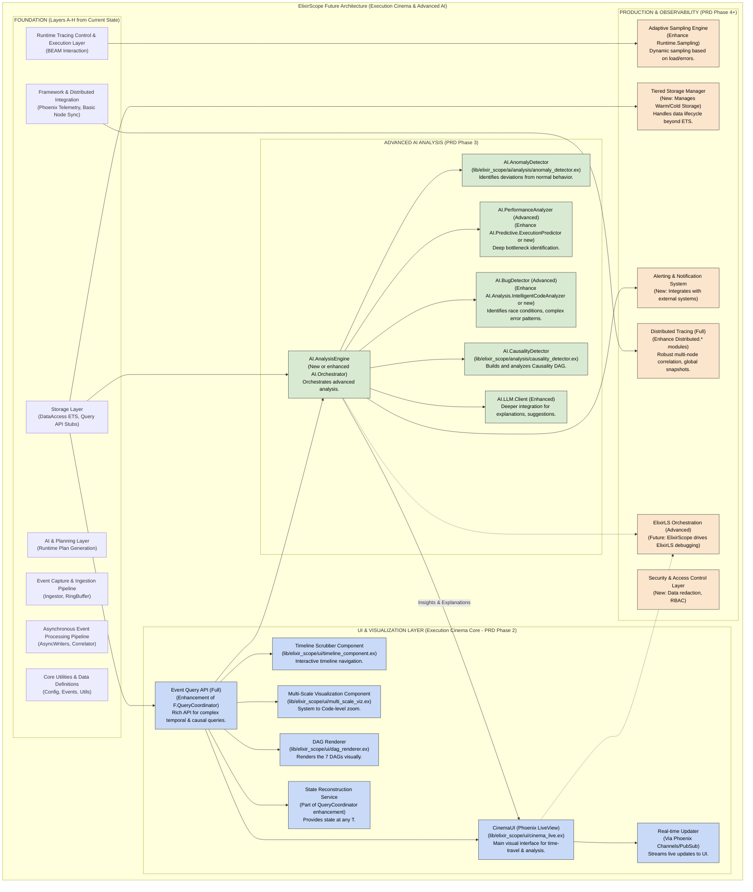

# ElixirScope Integration Tests: Real-World Validation

## 🎯 **Objective: Prove Production Readiness**

Create a comprehensive sample application that serves as the ultimate integration test for ElixirScope's runtime tracing capabilities. This will validate our Phase 1 implementation in realistic scenarios and identify any gaps before moving to Phase 2.

---

## 📱 **Sample Application: "TaskFlow" - Distributed Task Management System**

### **Why TaskFlow?**
- **Real-world complexity**: Multi-process, concurrent, database-heavy
- **Common patterns**: GenServers, Supervisors, Ecto, Phoenix
- **Performance challenges**: N+1 queries, race conditions, bottlenecks
- **Error scenarios**: Timeouts, crashes, resource exhaustion
- **Monitoring needs**: State changes, function calls, resource usage

### **Application Architecture**
```
TaskFlow Application
├── Web Layer (Phoenix)
│   ├── TaskController - CRUD operations
│   ├── ProjectController - Project management
│   └── DashboardLive - Real-time updates
├── Business Logic
│   ├── TaskManager - Task orchestration GenServer
│   ├── ProjectSupervisor - Dynamic project supervision
│   ├── NotificationService - Async notifications
│   └── ReportGenerator - Background report processing
├── Data Layer
│   ├── Ecto Schemas (Task, Project, User)
│   ├── Database queries with intentional N+1 issues
│   └── Cache layer with Redis
└── External Integrations
    ├── Email service (simulated delays)
    ├── File storage (simulated failures)
    └── Webhook notifications
```

---

## 🧪 **Integration Test Categories**

### **1. Runtime Tracing Validation**

#### **1.1 Function Call Tracing**
```elixir
# Test Scenarios
defmodule TaskFlowIntegrationTest do
  test "traces function calls across GenServer boundaries" do
    # Start ElixirScope tracing
    ElixirScope.Runtime.start_tracing([
      modules: [TaskFlow.TaskManager, TaskFlow.ProjectSupervisor],
      level: :function_calls
    ])
    
    # Execute business logic
    {:ok, task} = TaskFlow.create_task(%{title: "Test Task", project_id: 1})
    
    # Validate traces captured
    traces = ElixirScope.Runtime.get_traces()
    assert_function_traced(traces, TaskFlow.TaskManager, :create_task, 1)
    assert_function_traced(traces, TaskFlow.Repo, :insert, 1)
  end
end
```

#### **1.2 State Change Monitoring**
```elixir
test "monitors GenServer state changes during task processing" do
  # Monitor TaskManager state changes
  ElixirScope.Runtime.monitor_process(TaskFlow.TaskManager, :state_changes)
  
  # Trigger state changes
  TaskFlow.TaskManager.assign_task(task_id, user_id)
  TaskFlow.TaskManager.complete_task(task_id)
  
  # Validate state transitions captured
  state_changes = ElixirScope.Runtime.get_state_changes()
  assert_state_transition(state_changes, :task_assigned)
  assert_state_transition(state_changes, :task_completed)
end
```

### **2. Performance Monitoring Validation**

#### **2.1 N+1 Query Detection**
```elixir
test "detects N+1 queries in project dashboard" do
  # Create test data that triggers N+1
  project = create_project_with_tasks(100)
  
  # Start performance monitoring
  ElixirScope.Runtime.start_performance_monitoring([
    modules: [TaskFlow.ProjectController],
    detect_patterns: [:n_plus_one_queries]
  ])
  
  # Trigger N+1 scenario
  conn = get(conn, "/projects/#{project.id}/dashboard")
  
  # Validate N+1 detection
  performance_issues = ElixirScope.Runtime.get_performance_issues()
  assert_issue_detected(performance_issues, :n_plus_one_query)
  assert performance_issues.query_count > 50
end
```

#### **2.2 Resource Usage Monitoring**
```elixir
test "monitors memory and CPU usage during report generation" do
  # Start resource monitoring
  ElixirScope.Runtime.start_resource_monitoring([
    processes: [TaskFlow.ReportGenerator],
    metrics: [:memory, :cpu, :message_queue_length]
  ])
  
  # Generate large report
  TaskFlow.ReportGenerator.generate_annual_report(2023)
  
  # Validate resource metrics captured
  metrics = ElixirScope.Runtime.get_resource_metrics()
  assert metrics.peak_memory > 0
  assert metrics.cpu_usage_samples |> length() > 10
end
```

### **3. Error Handling & Recovery Validation**

#### **3.1 Process Crash Monitoring**
```elixir
test "traces process crashes and supervisor restarts" do
  # Monitor supervisor tree
  ElixirScope.Runtime.monitor_supervisor_tree(TaskFlow.ProjectSupervisor)
  
  # Trigger intentional crash
  TaskFlow.ProjectWorker.simulate_crash(project_id)
  
  # Validate crash and restart captured
  events = ElixirScope.Runtime.get_supervisor_events()
  assert_event_captured(events, :child_terminated)
  assert_event_captured(events, :child_restarted)
end
```

#### **3.2 Timeout and Retry Monitoring**
```elixir
test "monitors timeout scenarios and retry logic" do
  # Monitor external service calls
  ElixirScope.Runtime.trace_external_calls([
    modules: [TaskFlow.EmailService, TaskFlow.WebhookService]
  ])
  
  # Trigger timeout scenario
  TaskFlow.EmailService.send_notification(email, %{simulate_timeout: true})
  
  # Validate timeout and retry captured
  external_calls = ElixirScope.Runtime.get_external_calls()
  assert_timeout_captured(external_calls, TaskFlow.EmailService)
  assert_retry_attempts(external_calls, 3)
end
```

### **4. Concurrency & Race Condition Detection**

#### **4.1 Concurrent Access Monitoring**
```elixir
test "detects race conditions in concurrent task assignment" do
  # Start concurrency monitoring
  ElixirScope.Runtime.monitor_concurrency([
    processes: [TaskFlow.TaskManager],
    detect_races: true
  ])
  
  # Simulate concurrent access
  tasks = for i <- 1..10, do: 
    Task.async(fn -> TaskFlow.assign_next_available_task(user_id) end)
  
  Task.await_many(tasks)
  
  # Validate race condition detection
  race_conditions = ElixirScope.Runtime.get_race_conditions()
  assert length(race_conditions) > 0
end
```

### **5. Real-Time Monitoring Integration**

#### **5.1 Live Dashboard Integration**
```elixir
test "integrates with Phoenix LiveView for real-time monitoring" do
  # Start live monitoring
  {:ok, view, _html} = live(conn, "/admin/elixir_scope_dashboard")
  
  # Trigger monitored activity
  TaskFlow.create_task(%{title: "Live Test"})
  
  # Validate real-time updates
  assert_receive {:live_patch, %{traces: traces}}
  assert length(traces) > 0
end
```

---

## 🏗 **Sample Application Implementation Plan**

### **Phase 1: Core Application (Week 1)**
```elixir
# Basic TaskFlow structure
mix new task_flow --sup
cd task_flow

# Add dependencies
# - Phoenix for web interface
# - Ecto for database
# - ElixirScope (local path dependency)
# - ExUnit for testing
```

### **Phase 2: Business Logic (Week 1-2)**
```elixir
# Implement core modules
defmodule TaskFlow.TaskManager do
  use GenServer
  # Task assignment logic with intentional performance issues
end

defmodule TaskFlow.ProjectSupervisor do
  use DynamicSupervisor
  # Dynamic project worker management
end

defmodule TaskFlow.ReportGenerator do
  use GenServer
  # Background processing with resource usage
end
```

### **Phase 3: Integration Points (Week 2)**
```elixir
# Add ElixirScope integration
defmodule TaskFlow.Application do
  def start(_type, _args) do
    children = [
      TaskFlow.Repo,
      TaskFlowWeb.Endpoint,
      TaskFlow.TaskManager,
      # ElixirScope integration
      {ElixirScope.Runtime.Controller, [
        auto_start: true,
        default_tracing: [
          modules: [TaskFlow.TaskManager, TaskFlow.ProjectSupervisor],
          level: :function_calls
        ]
      ]}
    ]
    
    Supervisor.start_link(children, strategy: :one_for_one)
  end
end
```

### **Phase 4: Test Scenarios (Week 2-3)**
```elixir
# Comprehensive integration tests
defmodule TaskFlowIntegrationTest do
  use TaskFlow.DataCase
  
  # 50+ test scenarios covering:
  # - Function call tracing
  # - State monitoring
  # - Performance issues
  # - Error scenarios
  # - Concurrency issues
  # - Resource monitoring
end
```

---

## 📊 **Success Criteria & Validation**

### **Functional Validation**
- ✅ **100% Trace Capture**: All expected function calls captured
- ✅ **State Monitoring**: GenServer state changes tracked accurately
- ✅ **Error Handling**: Crashes and recoveries properly traced
- ✅ **Performance Detection**: N+1 queries and bottlenecks identified
- ✅ **Resource Monitoring**: Memory/CPU usage tracked correctly

### **Performance Validation**
- ✅ **Low Overhead**: <5% performance impact when tracing enabled
- ✅ **Memory Efficiency**: Trace storage doesn't cause memory leaks
- ✅ **Scalability**: Handles 1000+ concurrent operations
- ✅ **Real-time**: Live monitoring updates within 100ms

### **Production Readiness**
- ✅ **Graceful Degradation**: Works in minimal OTP environments
- ✅ **Error Recovery**: ElixirScope failures don't crash application
- ✅ **Configuration**: Easy to enable/disable tracing
- ✅ **Documentation**: Clear integration examples

---

## 🚀 **Implementation Timeline**

### **Week 1: Application Foundation**
- Create TaskFlow Phoenix application
- Implement core business logic
- Add basic database schema and operations
- Create intentional performance issues for testing

### **Week 2: ElixirScope Integration**
- Integrate ElixirScope into TaskFlow
- Implement monitoring configuration
- Create comprehensive test scenarios
- Add real-time dashboard integration

### **Week 3: Validation & Documentation**
- Run full integration test suite
- Performance benchmarking
- Document integration patterns
- Create deployment examples

---

## 📝 **Deliverables**

1. **TaskFlow Sample Application**
   - Complete Phoenix application with realistic complexity
   - Intentional performance issues and error scenarios
   - Comprehensive test suite

2. **Integration Test Suite**
   - 50+ integration tests covering all ElixirScope features
   - Performance benchmarks and validation
   - Error scenario testing

3. **Documentation & Examples**
   - Integration guide for real applications
   - Performance tuning recommendations
   - Best practices for production deployment

4. **Production Readiness Report**
   - Validation results and metrics
   - Known limitations and workarounds
   - Recommendations for Phase 2 development

This comprehensive integration testing approach will prove ElixirScope's production readiness and provide confidence for real-world adoption. 


You've got a solid plan outlined for "TaskFlow" as a real-world integration testbed for ElixirScope! Building a separate, comprehensive sample application is an **excellent strategy** at this stage.

**Why this is the best way forward (compared to just more internal tests):**

1.  **Real-World Integration Complexity:** Internal tests, even good ones, often can't replicate the nuances of using ElixirScope as a dependency in a separate Mix project. TaskFlow will force you to confront:
    *   Setup and configuration friction.
    *   Interaction with other libraries (Phoenix, Ecto, potentially Redis clients, HTTP clients).
    *   Build system compatibility.
    *   How ElixirScope behaves when it's *not* the primary application being developed.
2.  **Elucidating Design Problems:**
    *   **API Usability:** Using `ElixirScope.Runtime` APIs from *another application's perspective* will quickly highlight awkwardness, missing features, or confusing parameters.
    *   **Data Usefulness:** Actually trying to *use* the captured trace data to understand TaskFlow's behavior will reveal if the data is sufficient, well-correlated, and easy to query (even with basic tools initially).
    *   **Performance Impact:** Measuring TaskFlow's performance with and without ElixirScope tracing enabled gives realistic overhead numbers.
    *   **Configuration Gaps:** You'll discover if the current `ElixirScope.Config` options are sufficient or if new ones are needed for fine-grained control in a complex app.
3.  **Holistic Validation:** TaskFlow allows testing the *synergy* of ElixirScope's components (runtime tracing, safety, sampling, ingestor, correlator, storage) in a dynamic, multi-process environment that's closer to what users will experience.
4.  **Serves as a Living Example:** TaskFlow, once instrumented, becomes the primary example and tutorial for how to use ElixirScope effectively.
5.  **Drives Feature Prioritization:** Challenges encountered while instrumenting and debugging TaskFlow will naturally highlight which ElixirScope features are most critical or need improvement.
6.  **Uncovers Edge Cases:** "Real-world complexity" often uncovers subtle bugs or edge cases in tracing/correlation logic that synthetic tests might miss.

**Decision: Proceed with building TaskFlow.** It's a strategic investment that will pay off in a more robust, user-friendly, and production-ready ElixirScope.

Now, let's greatly expand upon your plan for TaskFlow.

---

## **Expanded Plan: "TaskFlow" - ElixirScope's Real-World Proving Ground**

### 🎯 **Revised Objective**

To create "TaskFlow," a moderately complex, distributed-capable (initially single-node, designed for future distribution) task management application featuring common Elixir/OTP and Phoenix patterns. TaskFlow will serve as the primary integration testbed and validation platform for ElixirScope's runtime tracing, AI-driven analysis, and future "Execution Cinema" capabilities. Its development will directly inform and stress-test ElixirScope's design, API, performance, and usability.

---

### 📱 **Sample Application: "TaskFlow" - Detailed Architecture & Features**

The goal is to build enough of TaskFlow to exercise all key aspects of ElixirScope.

#### **A. Core Domain Model (Ecto Schemas)**

1.  **`User`**:
    *   Fields: `id`, `email`, `username`, `hashed_password`, `inserted_at`, `updated_at`.
    *   Associations: `has_many :projects`, `has_many :tasks (as assignee)`.
2.  **`Project`**:
    *   Fields: `id`, `name`, `description`, `status (e.g., :active, :archived)`, `owner_id (references User.id)`, `inserted_at`, `updated_at`.
    *   Associations: `belongs_to :owner, User`, `has_many :tasks`.
3.  **`Task`**:
    *   Fields: `id`, `title`, `description`, `status (e.g., :todo, :in_progress, :completed)`, `priority (e.g., :low, :medium, :high)`, `due_date`, `project_id (references Project.id)`, `assignee_id (references User.id, nullable)`, `inserted_at`, `updated_at`.
    *   Associations: `belongs_to :project`, `belongs_to :assignee, User (optional)`.
4.  **`Comment` (Stretch Goal for more interaction):**
    *   Fields: `id`, `body`, `task_id`, `user_id`, `inserted_at`.
    *   Associations: `belongs_to :task`, `belongs_to :user`.

#### **B. Web Layer (Phoenix)**

1.  **`TaskFlowWeb.UserController`**:
    *   Standard Phoenix authentication (e.g., using `phx.gen.auth`).
    *   Actions: `new`, `create` (registration), `edit`, `update` (profile).
2.  **`TaskFlowWeb.SessionController`**:
    *   Actions: `new`, `create` (login), `delete` (logout).
3.  **`TaskFlowWeb.ProjectController`**:
    *   CRUD actions for `Project`s (index, show, new, create, edit, update, delete).
    *   The `show` action will be designed to potentially cause N+1 queries when displaying tasks.
4.  **`TaskFlowWeb.TaskController`**:
    *   Nested under projects: `/projects/:project_id/tasks/...`
    *   CRUD actions for `Task`s.
5.  **`TaskFlowWeb.DashboardLive` (Phoenix LiveView)**:
    *   Displays a summary of projects and tasks for the logged-in user.
    *   Real-time updates when tasks are created, updated, or assigned (via PubSub).
    *   Will involve multiple `handle_event` and `handle_info` callbacks.
6.  **`TaskFlowWeb.ProjectLive.Show` (Phoenix LiveView - Stretch Goal):**
    *   A LiveView for displaying and managing tasks within a single project, allowing real-time collaboration or updates.
    *   Could involve LiveComponents for individual tasks.

#### **C. Business Logic (Core Elixir/OTP)**

1.  **`TaskFlow.Accounts` Context Module**:
    *   Handles user registration, authentication, profile management.
    *   Interacts with `User` Ecto schema.
2.  **`TaskFlow.Projects` Context Module**:
    *   Handles `Project` CRUD logic. Interacts with `TaskFlowWeb.ProjectController`.
3.  **`TaskFlow.Tasks` Context Module**:
    *   Handles `Task` CRUD logic. Interacts with `TaskFlowWeb.TaskController`.
4.  **`TaskFlow.TaskManager` (GenServer)**:
    *   Manages the lifecycle and assignment of tasks.
    *   State: Could hold a map of `project_id => list_of_task_ids` or tasks needing attention.
    *   API:
        *   `assign_task(task_id, user_id)`: Potentially involves complex logic, checks user availability (simulated).
        *   `complete_task(task_id)`
        *   `get_tasks_for_project(project_id)`
    *   **Intentional Race Condition Scenario**: The `assign_task` logic could be designed with a read-modify-write pattern on a shared resource (e.g., ETS table for task availability flags) that can lead to a race condition under concurrent calls.
5.  **`TaskFlow.ProjectSupervisor` (DynamicSupervisor)**:
    *   Manages worker processes dynamically for each active project.
    *   Example: `TaskFlow.ProjectWorker` (GenServer) - one per active project, perhaps for real-time updates or project-specific calculations. This supervisor will be used to test ElixirScope's ability to trace supervised processes and their lifecycles.
6.  **`TaskFlow.ProjectWorker` (GenServer - supervised by `ProjectSupervisor`)**:
    *   Holds state related to a specific project.
    *   Can have intentional crash scenarios triggered by specific messages to test supervisor restarts and ElixirScope's crash tracing.
    *   Example: `handle_call(:calculate_stress, _from, state)` could be made to divide by zero or exhaust memory under certain conditions.
7.  **`TaskFlow.Notifications.NotificationService` (GenServer or Task.Supervisor based)**:
    *   Handles sending asynchronous notifications (e.g., email, webhook).
    *   API: `send_task_assigned_email(user, task)`, `send_project_updated_webhook(project)`.
    *   Will interact with simulated external services.
8.  **`TaskFlow.Reports.ReportGenerator` (GenServer or Background Job Library like Oban/Exq)**:
    *   Generates reports (e.g., "monthly project summary").
    *   Simulates long-running, resource-intensive (CPU/memory) tasks.
    *   Writes output to a temporary file (simulating file storage interaction).

#### **D. Data Layer (Ecto & Cache)**

1.  **Ecto Repo**: Standard `TaskFlow.Repo`.
2.  **Migrations**: For `User`, `Project`, `Task` schemas.
3.  **Seeds**: Populate with initial users, projects, and tasks.
4.  **Intentional N+1 Query**: In `ProjectController.show` or `DashboardLive`, load projects and then iterate to load tasks for each project individually.
5.  **Cache Layer (Simulated Redis - Optional, for advanced tracing)**:
    *   A simple GenServer (`TaskFlow.Cache`) that mimics Redis get/set operations with ETS.
    *   Some business logic (e.g., fetching project details) could try the cache first.

#### **E. External Integrations (Simulated)**

1.  **`TaskFlow.Integrations.EmailClient`**:
    *   Module with functions like `send(to, subject, body)`.
    *   Internally uses an HTTP client (e.g., HTTPoison, Finch) to POST to a mock email service endpoint (e.g., `http://localhost:PORT/mock_email_service`).
    *   This mock endpoint can be configured to introduce delays or return error statuses.
2.  **`TaskFlow.Integrations.FileStorageClient`**:
    *   Functions like `upload(file_content, path)`, `download(path)`.
    *   Simulates interaction by writing/reading to local temp files. Can simulate failures.
3.  **`TaskFlow.Integrations.WebhookClient`**:
    *   Function `send_event(url, payload)`.
    *   POSTs to a configurable mock webhook receiver.

---

### 🧪 **Expanded Integration Test Categories & Scenarios for ElixirScope using TaskFlow**

For each test, the workflow is:
1.  **Configure ElixirScope Tracing:** Use `ElixirScope.Runtime` API to set up specific traces.
2.  **Execute TaskFlow Action:** Perform an operation in the TaskFlow app.
3.  **Fetch Traces:** Use (future) `ElixirScope.Runtime.get_traces()` or current `DataAccess` queries.
4.  **Assert:** Verify the expected events, correlations, and data were captured.

#### **1. Runtime Tracing Validation**

*   **1.1 Function Call Tracing**
    *   **Scenario**: User creates a new task.
    *   **ElixirScope Setup**: `ElixirScope.Runtime.trace(TaskFlow.Tasks, level: :detailed)`, `ElixirScope.Runtime.trace(TaskFlow.TaskManager, level: :detailed)`.
    *   **TaskFlow Action**: `TaskFlow.Tasks.create_task(%{...})` which calls `TaskFlow.TaskManager.handle_call({:create_task, ...}, ...)`
    *   **Asserts**:
        *   `FunctionEntry` & `FunctionExit` for `TaskFlow.Tasks.create_task/1`.
        *   `FunctionEntry` & `FunctionExit` for `TaskFlow.TaskManager.handle_call/3`.
        *   Captured arguments and return values are correct (and truncated if large).
        *   `call_id` matches for entry/exit pairs.
        *   `parent_call_id` links `TaskManager.handle_call` back to `Tasks.create_task` if the call chain is direct.
*   **1.2 State Change Monitoring**
    *   **Scenario**: Task status changes from `:todo` to `:in_progress` then to `:completed`.
    *   **ElixirScope Setup**: `ElixirScope.Runtime.enable_time_travel(TaskFlow.TaskManagerPID, snapshot_on: [:state_change])` (or similar API to monitor state for a PID).
    *   **TaskFlow Action**: `TaskFlow.TaskManager.assign_task(...)`, `TaskFlow.TaskManager.complete_task(...)`.
    *   **Asserts**:
        *   `StateChange` events captured for `TaskFlow.TaskManager`.
        *   `old_state_ref` and `new_state_ref` reflect the status transitions.
        *   `callback` field correctly identifies `:handle_call` or `:handle_cast`.
        *   `trigger_message_id` links the state change to the causal message.
*   **1.3 Message Tracing**
    *   **Scenario**: Assigning a task notifies the `NotificationService`.
    *   **ElixirScope Setup**: `ElixirScope.Runtime.trace_process(TaskManagerPID, include: [:messages])`, `ElixirScope.Runtime.trace_process(NotificationServicePID, include: [:messages])`.
    *   **TaskFlow Action**: `TaskFlow.TaskManager.assign_task(...)` which might `cast` to `NotificationService`.
    *   **Asserts**:
        *   `MessageSend` event from `TaskManagerPID` to `NotificationServicePID`.
        *   `MessageReceive` event on `NotificationServicePID` matching the send.
        *   `message_id` is consistent between send and receive.
        *   Message content is captured correctly.

#### **2. Performance Monitoring Validation**

*   **2.1 N+1 Query Detection**
    *   **Scenario**: Viewing the Project Show page or DashboardLive that loads many tasks inefficiently.
    *   **ElixirScope Setup**: `ElixirScope.Runtime.trace('ElixirScope.Phoenix.Integration', telemetry_event_prefix: [:ecto, :repo, :query])` (or a higher-level performance pattern detection if available).
    *   **TaskFlow Action**: HTTP GET to `/projects/:id` or load `DashboardLive`.
    *   **Asserts**:
        *   Multiple similar `EctoQueryStart/Complete` events are captured sequentially.
        *   (Future AI) An "N+1 Detected" insight event might be generated.
        *   The source of these queries (controller action, LiveView handler) is correctly correlated.
*   **2.2 Resource Usage Monitoring**
    *   **Scenario**: Generating a large report with `TaskFlow.Reports.ReportGenerator`.
    *   **ElixirScope Setup**: `ElixirScope.Runtime.trace_process(ReportGeneratorPID, metrics: [:memory, :reductions, :gc])`.
    *   **TaskFlow Action**: `TaskFlow.Reports.ReportGenerator.generate_annual_report(...)`.
    *   **Asserts**:
        *   `PerformanceMetric` events captured for memory, reductions, GC activity for `ReportGeneratorPID`.
        *   Values show an increase during report generation.
        *   `Runtime.Safety` limits are respected (if configured and tested).

#### **3. Error Handling & Recovery Validation**

*   **3.1 Process Crash Monitoring**
    *   **Scenario**: `TaskFlow.ProjectWorker` crashes due to an intentionally introduced bug.
    *   **ElixirScope Setup**: `ElixirScope.Runtime.trace_process(ProjectSupervisorPID, include_children: true, include: [:process_lifecycle])`, `ElixirScope.Runtime.trace_process(CrashingWorkerPID, include: [:exceptions])`.
    *   **TaskFlow Action**: Send a message to `ProjectWorker` that triggers the crash.
    *   **Asserts**:
        *   `ProcessExit` event for the crashed worker, with correct reason and stack trace (if from `Runtime.Tracer` on the worker itself).
        *   Events from `ProjectSupervisorPID` showing it received the `:EXIT` signal.
        *   `ProcessSpawn` event if the supervisor restarts the worker.
        *   All events correlated to the supervisor and the specific project context.
*   **3.2 Timeout and Retry Monitoring (External Service Call)**
    *   **Scenario**: `TaskFlow.Notifications.NotificationService` calls a mock email service that simulates a timeout. The service then retries.
    *   **ElixirScope Setup**: `ElixirScope.Runtime.trace(TaskFlow.Integrations.EmailClient, level: :detailed)`.
    *   **TaskFlow Action**: Trigger a notification that uses the timeout-simulating email service.
    *   **Asserts**:
        *   Multiple `FunctionEntry/Exit` pairs for `EmailClient.send/3` (one for each attempt).
        *   The `FunctionExit` events show the timeout error for initial attempts and success for the final one (if retry succeeds).
        *   Durations reflect the timeout and subsequent attempt times.
*   **3.3 Exception Tracing**
    *   **Scenario**: A controller action raises an unhandled exception.
    *   **ElixirScope Setup**: `ElixirScope.Runtime.trace(TaskFlowWeb.TaskController, level: :full)`.
    *   **TaskFlow Action**: Make an HTTP request that triggers the exception in the controller.
    *   **Asserts**:
        *   `FunctionEntry` for the controller action.
        *   `ErrorEvent` (or `FunctionExit` with error reason) captured with:
            *   Correct exception type, message, and stack trace.
            *   Correlation to the controller action's `call_id`.
            *   Relevant context (e.g., HTTP params).

#### **4. Concurrency Validation**

*   **4.1 Concurrent Access & Potential Race Conditions**
    *   **Scenario**: Multiple users try to assign themselves to the last available task slot via `TaskFlow.TaskManager` concurrently.
    *   **ElixirScope Setup**: `ElixirScope.Runtime.trace(TaskFlow.TaskManager, level: :full, capture: [:state_before, :state_after])`.
    *   **TaskFlow Action**: Use `Task.async_stream` to make N concurrent calls to `TaskManager.assign_task(...)`.
    *   **Asserts**:
        *   ElixirScope captures the interleaved `handle_call` entries, state changes, and replies for `TaskManager`.
        *   The trace allows manual or (Future AI) automated analysis to see if any user got an inconsistent state or if the final state is incorrect due to the race.
        *   Demonstrate that ElixirScope provides the necessary data to diagnose such interleaving issues.

#### **5. Real-Time Monitoring Integration (LiveView)**

*   **5.1 `DashboardLive` Updates**
    *   **Scenario**: A task is created in the backend; `DashboardLive` should update.
    *   **ElixirScope Setup**:
        *   `ElixirScope.Runtime.trace(TaskFlowWeb.DashboardLive, level: :detailed, capture: [:assigns_diff])`.
        *   `ElixirScope.Runtime.trace_process(DashboardLivePID, include: [:messages])`.
        *   Trace the PubSub broadcast mechanism.
    *   **TaskFlow Action**: Create a new task using `TaskFlow.Tasks.create_task/1`. This should trigger a PubSub message that `DashboardLive` handles.
    *   **Asserts**:
        *   PubSub broadcast event captured.
        *   `MessageReceive` for the PubSub message by `DashboardLivePID`.
        *   `FunctionEntry/Exit` for `DashboardLive.handle_info/2`.
        *   `StateChange` (or assigns diff) event showing the dashboard's assigns being updated with the new task.

#### **6. Distributed Tracing (If TaskFlow is extended to be multi-node)**

*   **Scenario**: A task created on Node A is assigned to a worker GenServer running on Node B.
*   **ElixirScope Setup**: Full ElixirScope setup on both nodes, cluster configured. Trace relevant modules on both nodes.
*   **TaskFlow Action**: `TaskFlow.Tasks.create_task(%{...}, node: :node_a)`, which then RPCs or messages `TaskManager` on Node B.
*   **Asserts**:
    *   Events captured on Node A for the initial call.
    *   Events captured on Node B for the `TaskManager` interaction.
    *   `GlobalClock` timestamps are used and allow correct causal ordering.
    *   `EventSynchronizer` correctly syncs events between nodes.
    *   A unified query (via future `QueryCoordinator`) can reconstruct the entire distributed flow with consistent correlation IDs.

---

### 🏗 **TaskFlow Implementation Plan (ElixirScope Validation Focus)**

This plan prioritizes TaskFlow features that best test ElixirScope's capabilities.

#### **Phase 1: Core Application & Basic Tracing (Sprint 1-2: 2 Weeks)**

*   **TaskFlow Dev:**
    *   Mix project setup, Phoenix app generation.
    *   Ecto Schemas: `User`, `Project`, `Task`. Migrations & Seeds.
    *   Basic Phoenix CRUD for `Project` and `Task` (HTML controllers).
    *   `TaskFlow.TaskManager` GenServer: Implement basic state (map of tasks) and simple `create_task`, `get_task_status` functions.
*   **ElixirScope Integration & Tests:**
    *   Integrate `ElixirScope.Runtime` into TaskFlow's `application.ex`.
    *   Configure basic ElixirScope tracing for `TaskController` and `TaskManager`.
    *   **Test 1.1.1**: Trace `TaskController.create` -> `TaskManager.handle_call` (function calls, args, returns).
    *   **Test 1.2.1**: Monitor `TaskManager` state changes during task creation.
    *   **Goal**: Validate basic function call and GenServer state tracing.

#### **Phase 2: Advanced Logic & Performance Issues (Sprint 3-4: 2 Weeks)**

*   **TaskFlow Dev:**
    *   `TaskFlow.DashboardLive`: Initial version showing projects and tasks (intentionally introduce N+1 query).
    *   `TaskFlow.ProjectSupervisor` supervising `TaskFlow.ProjectWorker` GenServers (one per project).
    *   `TaskFlow.Reports.ReportGenerator`: Implement a CPU/memory intensive report generation task.
    *   `TaskFlow.Integrations.EmailClient` (mocked): Simulate external calls.
*   **ElixirScope Integration & Tests:**
    *   Trace `DashboardLive` `mount`, `handle_event`.
    *   Trace `ProjectSupervisor` and `ProjectWorker` lifecycle.
    *   Trace `ReportGenerator` execution.
    *   **Test 2.1.1 (N+1)**: Validate ElixirScope captures the multiple Ecto queries.
    *   **Test 2.2.1 (Resource Usage)**: Monitor `ReportGenerator`'s resource consumption.
    *   **Test 3.1.1 (Crash Monitoring)**: Introduce a crash in `ProjectWorker` and verify supervisor restart is traced.
    *   **Test 3.2.1 (Timeout)**: Simulate `EmailClient` timeout; trace retry attempts.
    *   **Goal**: Validate N+1 detection data, resource monitoring, crash and external call tracing.

#### **Phase 3: Concurrency, Real-Time & Polish (Sprint 5-6: 2 Weeks)**

*   **TaskFlow Dev:**
    *   Refine `DashboardLive` with PubSub updates.
    *   Implement the race-condition scenario in `TaskFlow.TaskManager.assign_task`.
    *   (Stretch) `TaskFlowWeb.ProjectLive.Show`.
*   **ElixirScope Integration & Tests:**
    *   Trace PubSub messages for `DashboardLive`.
    *   Set up fine-grained tracing for `TaskManager.assign_task`.
    *   **Test 4.1.1 (Concurrency)**: Validate capture of interleaved events in `TaskManager` during concurrent assignments.
    *   **Test 5.1.1 (LiveView Updates)**: Trace full flow from backend change -> PubSub -> `DashboardLive.handle_info` -> assigns diff.
    *   **Test API Usability**: Evaluate ease of setting up these complex trace scenarios with `ElixirScope.Runtime`.
    *   **Goal**: Validate tracing of complex concurrent interactions and LiveView updates. Document usability feedback for ElixirScope API.

---

### 📊 **Revised Success Criteria & Validation for ElixirScope (via TaskFlow)**

#### **Functional Validation**

*   ✅ **Comprehensive Trace Capture**: ElixirScope captures >99% of developer-designated function calls, messages, and state changes within TaskFlow scenarios relevant to the test.
*   ✅ **Accurate Correlation**: >98% of related events (e.g., GenServer call/reply, message send/receive, parent/child function calls) within a single node are correctly correlated with appropriate IDs.
*   ✅ **State Monitoring Precision**: GenServer state changes captured via `:sys.install` by `StateMonitor` are accurate and timely. `StateSnapshot` events are correctly generated.
*   ✅ **Error & Exception Granularity**: All unhandled exceptions and process crashes within traced TaskFlow components are captured with stack traces and relevant context.
*   ✅ **Performance Anti-Pattern Data**: Data necessary to identify N+1 queries (i.e., multiple similar Ecto query events from a single originating action) is captured.
*   ✅ **Resource Metrics Availability**: Configured resource metrics (memory, CPU, GC) for specific PIDs are captured as `PerformanceMetric` events.

#### **Performance Validation (of ElixirScope)**

*   ✅ **Low Application Overhead**: TaskFlow's average response time for key Phoenix endpoints (e.g., Project index, Task create) increases by less than 5% when ElixirScope is enabled with a `:balanced` tracing strategy. Increase by less than 15% with `:full` tracing strategy.
*   ✅ **Efficient Event Ingestion**: ElixirScope's backend (`Ingestor`, `RingBuffer`, `AsyncWriterPool`) sustains processing of event load generated by TaskFlow under moderate load (e.g., 100 concurrent users performing typical actions) without `RingBuffer` overflows.
*   ✅ **Bounded Memory Footprint**: ElixirScope processes (Controller, Tracers, Monitors, Storage components) maintain a stable and acceptable memory footprint (e.g., < 200MB additional RAM over baseline TaskFlow) during a 1-hour TaskFlow load test.
*   ✅ **Responsive Runtime API**: Calls to `ElixirScope.Runtime` functions (e.g., `trace/2`, `stop_trace/1`) complete within 50ms under normal TaskFlow load.

#### **Production Readiness Validation (of ElixirScope)**

*   ✅ **Stability**: TaskFlow runs stably for an extended period (e.g., 4 hours) under simulated varied load with ElixirScope tracing active, without crashes in ElixirScope or TaskFlow attributable to ElixirScope.
*   ✅ **Graceful Degradation**: ElixirScope's `Runtime.Safety` mechanisms (CPU/memory limits, event rate limits) correctly trigger and reduce tracing impact on TaskFlow when simulated stress conditions are applied.
*   ✅ **Configuration Effectiveness**: Changes to ElixirScope configuration (e.g., sampling rates, trace levels for TaskFlow modules) are correctly applied and result in the expected changes in captured trace data.
*   ✅ **Error Recovery**: If an ElixirScope tracer or monitor process crashes, it is correctly restarted by its supervisor, and tracing for other targets remains unaffected.

---

### 📝 **Revised Deliverables from TaskFlow Project**

1.  **TaskFlow Sample Application**:
    *   Fully functional Git repository with setup instructions.
    *   Includes all described features (core, web, business logic, data, simulated integrations).
    *   Clearly marked sections with intentionally introduced issues (N+1, race conditions, crash points).
2.  **Comprehensive `TaskFlowIntegrationTest` Suite**:
    *   50+ executable integration tests demonstrating ElixirScope's ability to trace and capture data for all specified scenarios.
    *   Tests organized by ElixirScope feature category being validated.
    *   Clear assertions verifying the content, correlation, and completeness of captured ElixirScope trace data.
3.  **`TASKFLOW_ELIXIRSCOPE_VALIDATION_GUIDE.md`**:
    *   Detailed guide on how to run TaskFlow and use its features to test specific ElixirScope capabilities.
    *   Example ElixirScope configurations tailored for debugging different TaskFlow scenarios.
    *   Instructions for interpreting ElixirScope trace data in the context of TaskFlow.
4.  **ElixirScope Production Readiness & Design Feedback Report**:
    *   Quantitative results from performance benchmarks of TaskFlow with/without ElixirScope.
    *   List of ElixirScope bugs, API usability issues, or design limitations discovered during TaskFlow development and testing.
    *   Recommendations for ElixirScope Phase 2 features based on TaskFlow experience.

This expanded TaskFlow plan provides a robust framework for validating ElixirScope's Phase 1 runtime tracing capabilities and ensuring it's well-prepared for production use and future feature development.

```mermaid
graph LR
    subgraph "ElixirScope Foundational Architecture (Current State - Runtime Tracing Focused)"
        direction LR

        subgraph "A. User & Developer Interaction Layer"
            direction TB
            A1["ElixirScope.Runtime API<br>(lib/elixir_scope/runtime.ex)<br>User-facing functions for dynamic trace control (trace/2, stop_trace/1, etc.)"]
            A2["ElixirScope.IExHelpers (Future)<br>(lib/elixir_scope/iex_helpers.ex)<br>Convenience functions for IEx interaction"]
            A3["Mix Tasks<br>(lib/elixir_scope/compiler/mix_task.ex - Repurposed)<br>e.g., `mix elixir_scope.analyze` to trigger AI plan generation"]
        end

        subgraph "B. AI & Planning Layer"
            direction TB
            B1["AI.CodeAnalyzer<br>(lib/elixir_scope/ai/code_analyzer.ex)<br>Static analysis, OTP/Phoenix pattern recognition, complexity scoring. Uses B1a, B1b."]
            B1a["AI.PatternRecognizer<br>(lib/elixir_scope/ai/pattern_recognizer.ex)"]
            B1b["AI.ComplexityAnalyzer<br>(lib/elixir_scope/ai/complexity_analyzer.ex)"]
            B2["AI.Orchestrator<br>(lib/elixir_scope/ai/orchestrator.ex)<br>Manages AI analysis lifecycle, generates RUNTIME tracing plans."]
            B3["AI.Predictive.ExecutionPredictor<br>(lib/elixir_scope/ai/predictive/execution_predictor.ex)<br>Predicts execution paths, resource usage. Interacts with B2 and Query Layer (G)."]
            B4["AI.Analysis.IntelligentCodeAnalyzer<br>(lib/elixir_scope/ai/analysis/intelligent_code_analyzer.ex)<br>Deeper semantic analysis, quality assessment. Interacts with B2 and Query Layer (G)."]
            B5["AI.LLM.Client<br>(lib/elixir_scope/ai/llm/client.ex)<br>Unified client for LLM providers. Uses B5a, B5b."]
            B5a["AI.LLM.Config<br>(lib/elixir_scope/ai/llm/config.ex)"]
            B5b["AI.LLM.Response<br>(lib/elixir_scope/ai/llm/response.ex)"]
            B5c["AI.LLM.Provider Behaviour<br>(lib/elixir_scope/ai/llm/provider.ex)"]
            B5d["AI.LLM.Providers.*<br>(lib/elixir_scope/ai/llm/providers/*.ex)<br>Gemini, Vertex, Mock implementations."]

            B1 --> B2
            A3 --> B2
            B2 --> B5
        end

        subgraph "C. Runtime Tracing Control & Execution Layer"
            direction TB
            C1["Runtime.Controller<br>(lib/elixir_scope/runtime/controller.ex)<br>Central GenServer managing all runtime tracing. Applies plans from B2."]
            C2["Runtime.TracerManager<br>(lib/elixir_scope/runtime/tracer_manager.ex)<br>Manages a pool of C2a.Tracer processes."]
            C2a["Runtime.Tracer<br>(lib/elixir_scope/runtime/tracer.ex)<br>Individual tracer process using :dbg or :erlang.trace. Interacts with C2b."]
            C2b["Runtime.Matchers<br>(lib/elixir_scope/runtime/matchers.ex)<br>DSL for BEAM match specifications."]
            C3["Runtime.StateMonitorManager<br>(lib/elixir_scope/runtime/state_monitor_manager.ex)<br>Manages a pool of C3a.StateMonitor processes."]
            C3a["Runtime.StateMonitor<br>(lib/elixir_scope/runtime/state_monitor.ex)<br>Monitors OTP process state using :sys.install."]
            C4["Runtime.Safety<br>(lib/elixir_scope/runtime/safety.ex)<br>Production safety controls, resource limits, circuit breakers."]
            C5["Runtime.Sampling<br>(lib/elixir_scope/runtime/sampling.ex)<br>Intelligent sampling strategies for tracing."]
            C6["Target Elixir Application<br>(User's Application Code)"]


            A1 --> C1
            B2 --> C1
            C1 --> C2
            C1 --> C3
            C1 --> C4
            C1 --> C5
            C2 --> C2a
            C3 --> C3a
            C2a -- "traces" --> C6
            C3a -- "monitors" --> C6
        end

        subgraph "D. Event Capture & Ingestion Pipeline"
            direction TB
            D1["Capture.InstrumentationRuntime<br>(lib/elixir_scope/capture/instrumentation_runtime.ex)<br>Simplified API for reporting events (used by Telemetry, Tracers)."]
            D2["Capture.Ingestor<br>(lib/elixir_scope/capture/ingestor.ex)<br>Receives trace data (from C2a, C3a, D1), formats ElixirScope.Events, writes to D3."]
            D3["Capture.RingBuffer<br>(lib/elixir_scope/capture/ring_buffer.ex)<br>Lock-free, concurrent-safe event staging buffer."]

            C2a -- "Formatted Events" --> D2
            C3a -- "Formatted Events" --> D2
            F1 -- "Telemetry Events" --> D1
            D1 -- "Formatted Events" --> D2
            D2 --> D3
        end

        subgraph "E. Asynchronous Event Processing Pipeline"
            direction TB
            E1["Capture.PipelineManager<br>(lib/elixir_scope/capture/pipeline_manager.ex)<br>Supervises E2, E3."]
            E2["Capture.AsyncWriterPool<br>(lib/elixir_scope/capture/async_writer_pool.ex)<br>Manages a pool of E2a.AsyncWriter workers."]
            E2a["Capture.AsyncWriter<br>(lib/elixir_scope/capture/async_writer.ex)<br>Worker that reads from D3.RingBuffer, calls E3.EventCorrelator, writes to F.Storage."]
            E3["Capture.EventCorrelator<br>(lib/elixir_scope/capture/event_correlator.ex)<br>Establishes causal links between events. Uses ETS for state."]

            D3 --> E2a
            E1 --> E2
            E1 -.-> E3
            E2a --> E3
        end

        subgraph "F. Storage Layer"
            direction TB
            F1["Storage.DataAccess<br>(lib/elixir_scope/storage/data_access.ex)<br>ETS-based hot storage, indexing (temporal, PID, function, correlation), pruning."]
            F2["Storage.QueryCoordinator (Future)<br>(lib/elixir_scope/storage/query_coordinator.ex)<br>High-level Query API for UI and AI."]

            E3 -- "Correlated Events" --> F1
            F1 --> F2
            A2 -.-> F2
            B3 -.-> F2
            B4 -.-> F2
        end

        subgraph "G. Framework & Distributed Integration"
            direction TB
            G1["Phoenix.Integration<br>(lib/elixir_scope/phoenix/integration.ex)<br>Telemetry handlers for Phoenix & Ecto events. Reports via D1."]
            G2["Distributed.NodeCoordinator<br>(lib/elixir_scope/distributed/node_coordinator.ex)<br>Manages cluster membership, initiates sync."]
            G3["Distributed.EventSynchronizer<br>(lib/elixir_scope/distributed/event_synchronizer.ex)<br>Exchanges event data between nodes. Uses F1 for local events."]
            G4["Distributed.GlobalClock<br>(lib/elixir_scope/distributed/global_clock.ex)<br>Hybrid Logical Clock for distributed event timestamping."]

            G2 --> G3
            G2 --> G4
        end

        subgraph "H. Core Utilities & Data Definitions"
            direction TB
            H1["ElixirScope.Config<br>(lib/elixir_scope/config.ex)<br>Manages system-wide configuration."]
            H2["ElixirScope.Events<br>(lib/elixir_scope/events.ex)<br>Defines all event structures."]
            H3["ElixirScope.Utils<br>(lib/elixir_scope/utils.ex)<br>Timestamps, IDs, data formatting & truncation."]
            H4["ElixirScope.Application<br>(lib/elixir_scope/application.ex)<br>Main OTP Application and supervisor."]
        end

        %% High-level layer connections (conceptual)
        A1 --> C1
        B2 --> C1

        C2a --> D2
        C3a --> D2

        D3 --> E2a
        E2a --> E3
        E3 --> F1
        F1 --> F2

        G1 --> D1

        H1 --> B2
        H1 --> C1
        H1 --> D3
        H1 --> E2
        H1 --> F1

        H2 --> D2
        H2 --> E3
        H2 --> F1

        H3 --> B1
        H3 --> D2
        H3 --> E3
        H3 --> F1

        %% Styling
        classDef user_interaction fill:#f9f,stroke:#333,color:#000
        classDef ai fill:#e1f5fe,stroke:#333,color:#000
        classDef runtime_control fill:#f3e5f5,stroke:#333,color:#000
        classDef capture_ingest fill:#e8f5e9,stroke:#333,color:#000
        classDef async_process fill:#fffde7,stroke:#333,color:#000
        classDef storage fill:#fff3e0,stroke:#333,color:#000
        classDef integration fill:#fce4ec,stroke:#333,color:#000
        classDef core_utils fill:#ede7f6,stroke:#333,color:#000

        class A1,A2,A3 user_interaction;
        class B1,B1a,B1b,B2,B3,B4,B5,B5a,B5b,B5c,B5d ai;
        class C1,C2,C2a,C2b,C3,C3a,C4,C5,C6 runtime_control;
        class D1,D2,D3 capture_ingest;
        class E1,E2,E2a,E3 async_process;
        class F1,F2 storage;
        class G1,G2,G3,G4 integration;
        class H1,H2,H3,H4 core_utils;
    end
```





### Key for Future Diagram:

*   **FOUNDATION:** Represents the currently completed runtime tracing system.
*   **UI & VISUALIZATION LAYER:** Focuses on building the "Execution Cinema" interface as per Phase 2 of the PRD. This involves:
    *   `CinemaUI`: The main LiveView application.
    *   Specialized UI components for different views (timeline, DAGs).
    *   `QueryCoordinator` enhancement to support rich queries needed by the UI.
    *   `StateReconstructionService` to enable time-travel.
*   **ADVANCED AI ANALYSIS:** Corresponds to Phase 3 of the PRD, building more sophisticated AI capabilities on top of the foundational AI and captured data.
    *   `AI.AnalysisEngine`: Central point for advanced analysis.
    *   Specialized detectors for anomalies, performance issues, bugs, and causality.
    *   Deeper LLM integration for explanations.
*   **PRODUCTION & OBSERVABILITY:** Represents Phase 4 and beyond, focusing on production readiness, scalability, and advanced features.
    *   `AdaptiveSamplingEngine`: More dynamic than current `Runtime.Sampling`.
    *   `TieredStorageManager`: For managing warm/cold data beyond ETS.
    *   Full distributed tracing with global snapshots.
    *   ElixirLS orchestration.

This gives a roadmap of how the current solid foundation will evolve. The "future" components largely align with the PRD phases and the vision of extending the AI and UI capabilities.

I will now proceed to expand on the `CURSOR_INTEGRATION_TESTS.md` plan.