Okay, here is a series of detailed Mermaid diagrams depicting the architecture and internal workings of key ElixirScope features, tailored for a technical audience.

---

## ElixirScope Mermaid Diagrams

This section provides a series of Mermaid diagrams illustrating the architecture, data flows, and internal mechanisms of key ElixirScope components. These diagrams are intended for a technical audience familiar with distributed systems, compiler design, and advanced software engineering concepts.

### 1. Overall System Architecture

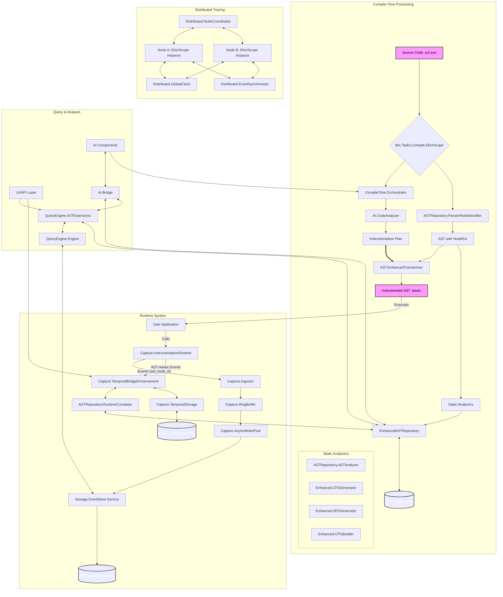

**Diagram 1 Description:** This diagram shows the high-level interaction between the compile-time processing, runtime system, query/analysis layer, and distributed tracing components. It highlights the flow of code and data from source to instrumented binaries, runtime event capture, storage, and subsequent analysis.

---

### 2. Enhanced AST Repository - Internal Structure and Data Flow

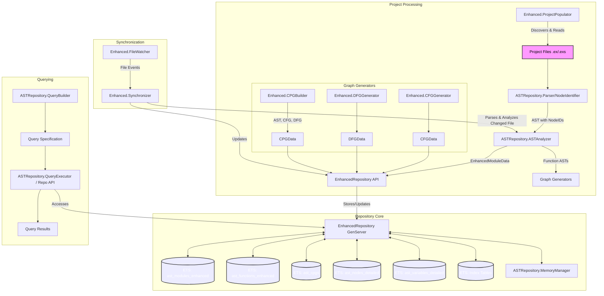

**Diagram 2 Description:** This diagram details the internal structure of the Enhanced AST Repository. It shows how `ProjectPopulator` and `FileWatcher`/`Synchronizer` feed data into the `ASTAnalyzer` and graph generators (`CFGGenerator`, `DFGGenerator`, `CPGBuilder`). The results are stored in the `EnhancedRepository GenServer`, which manages various ETS tables for modules, functions, CPGs, and indexes. The `MemoryManager` interacts with the repository for optimization, and the `QueryBuilder`/`QueryExecutor` provide the interface for accessing this static data.

---

### 3. Runtime Event Capture and AST Correlation Flow

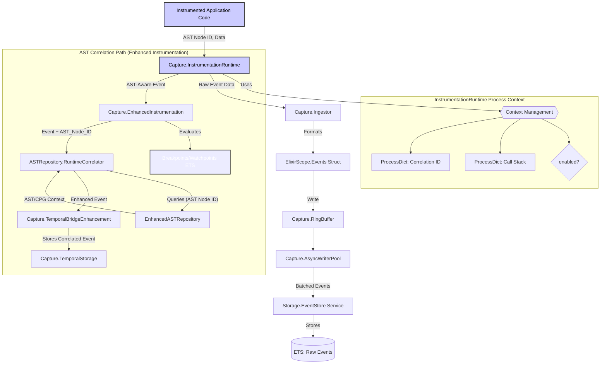

**Diagram 3 Description:** This diagram illustrates the flow of runtime events. Instrumented application code calls `InstrumentationRuntime`. Basic event data flows through the `Ingestor`, `RingBuffer`, and `AsyncWriterPool` to the `EventStore`. For AST-aware events (from `EnhancedTransformer`), `EnhancedInstrumentation` handles breakpoint evaluation and forwards events with `ast_node_id` to `RuntimeCorrelator`. The `RuntimeCorrelator` queries the `EnhancedASTRepository` to fetch static context and produces an enhanced event, which is then passed to `TemporalBridgeEnhancement` for storage in `TemporalStorage`, enabling advanced debugging features.

---

### 4. CPG (Code Property Graph) Generation Process

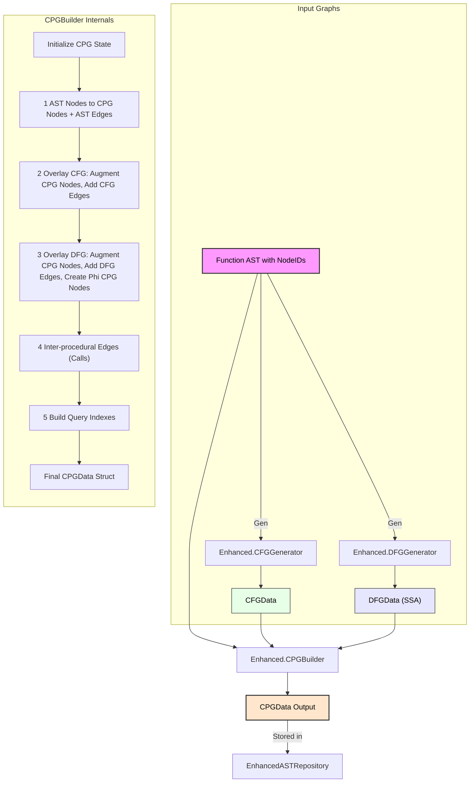

**Diagram 4 Description:** This diagram outlines the CPG generation process. A function's AST (with pre-assigned NodeIDs) is fed into the `CPGBuilder`. Internally, `CFGGenerator` and `DFGGenerator` produce their respective graphs from this AST. The `CPGBuilder` then executes a multi-phase process:
1.  Creates CPG nodes primarily from AST nodes and establishes AST structural edges.
2.  Overlays CFG information by augmenting existing CPG nodes with CFG data and translating CFG edges into CPG CFG-typed edges.
3.  Overlays DFG information, augmenting CPG nodes with DFG data (definitions, uses), creating DFG-typed edges, and potentially creating new synthetic CPG nodes for elements like SSA Phi functions.
4.  (Conceptually) Adds inter-procedural call edges.
5.  Builds query indexes for the unified graph.
The final `CPGData` struct is then stored in the `EnhancedASTRepository`.

---

### 5. Correlated Query Execution (Static + Dynamic)

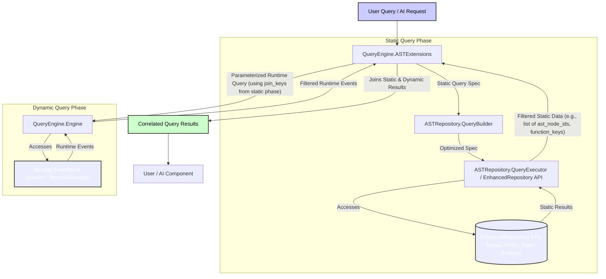

**Diagram 5 Description:** This diagram illustrates how `QueryEngine.ASTExtensions` handles correlated queries that combine static and dynamic data.
1.  A static query part is formulated (possibly via `QueryBuilder`) and executed against the `EnhancedASTRepository` to retrieve static code elements (e.g., functions meeting complexity criteria, CPG nodes matching a pattern).
2.  Join keys (like `ast_node_id`s or `function_key`s) are extracted from these static results.
3.  These join keys are used to parameterize a runtime query template, which is then executed by `QueryEngine.Engine` against the `EventStore` or `TemporalStorage`.
4.  `ASTExtensions` then joins the results from the static and dynamic query phases to produce the final correlated output.

---

### 6. Advanced Debugging Feature: Structural Breakpoint Flow

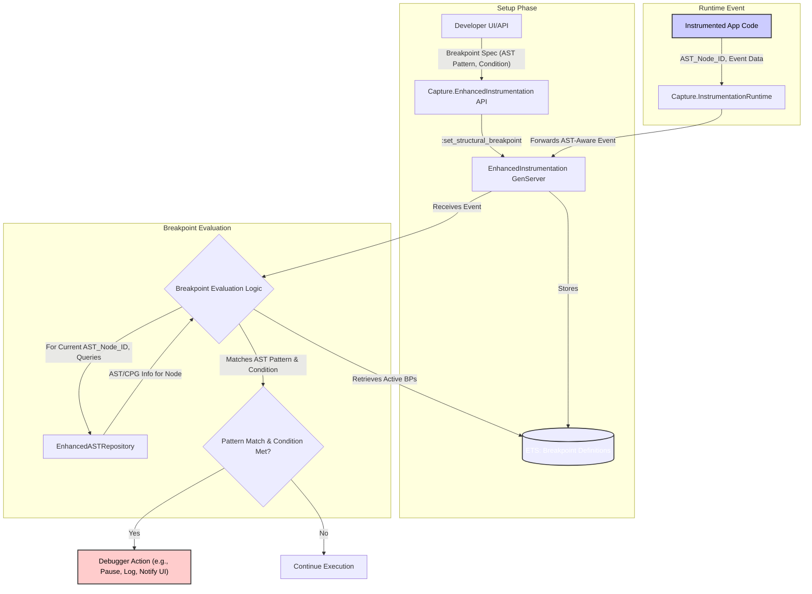

**Diagram 6 Description:** This diagram shows the flow for structural breakpoints:
1.  **Setup**: A developer defines a structural breakpoint (an AST pattern and a condition) via a UI or API, which is stored by the `EnhancedInstrumentation` GenServer in an ETS table.
2.  **Runtime Event**: Instrumented code executes, and `InstrumentationRuntime` reports an AST-aware event (with `ast_node_id`) to `EnhancedInstrumentation`.
3.  **Evaluation**:
    *   `EnhancedInstrumentation` retrieves active structural breakpoint definitions.
    *   For the current event's `ast_node_id`, it queries `EnhancedASTRepository` to get the static AST/CPG information for that specific node.
    *   It then attempts to match the AST information against each active breakpoint's pattern and checks if the specified condition (e.g., pattern match failure, exception occurred) is met.
4.  **Action**: If a breakpoint's pattern and condition are satisfied, a debugger action is triggered (e.g., pausing execution, logging detailed context, notifying a UI). Otherwise, execution continues normally. Data flow breakpoints and semantic watchpoints would follow similar principles but use DFG/CPG data for their specific matching logic.

---

### 7. Enhanced Instrumentation - Breakpoint/Watchpoint Logic

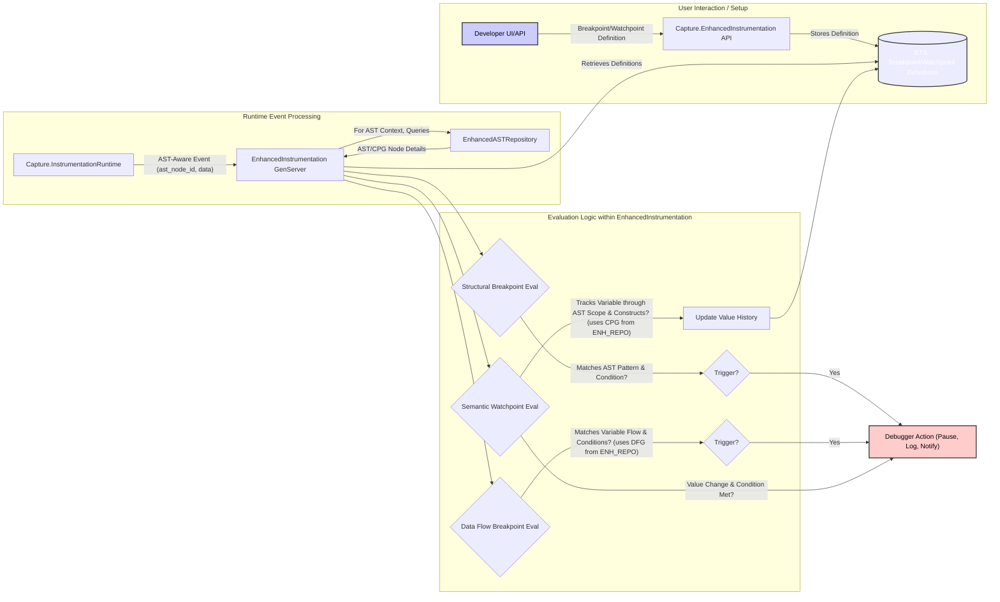

**Diagram 7 Description:** This diagram focuses on the advanced debugging features managed by `EnhancedInstrumentation`.
1.  **Setup**: Developers define structural breakpoints, data flow breakpoints, or semantic watchpoints via a UI or API. These definitions are stored by `EnhancedInstrumentation` (likely in ETS tables).
2.  **Runtime Event**: `InstrumentationRuntime` sends AST-aware events (containing `ast_node_id` and runtime data) to the `EnhancedInstrumentation` GenServer.
3.  **Evaluation**:
    *   `EnhancedInstrumentation` retrieves active breakpoint/watchpoint definitions.
    *   For the current event and its associated `ast_node_id`, it queries the `EnhancedASTRepository` to get the necessary static context (AST node details, DFG snippets, CPG context).
    *   **Structural Breakpoints**: It evaluates if the static properties of the current AST node match the breakpoint's AST pattern and if the runtime condition (e.g., exception occurred, specific value matched) is met.
    *   **Data Flow Breakpoints**: It uses DFG information to check if the specified variable's flow meets the defined conditions at the current AST node.
    *   **Semantic Watchpoints**: It uses CPG information to track the specified variable through relevant AST constructs, updating its value history. If a watched condition is met (e.g., value changes in a specific way), it can trigger an action.
4.  **Action**: If any breakpoint/watchpoint triggers, a debugger action is initiated (e.g., pausing the process, logging detailed information, sending a notification to the UI).

---

### 8. AI-Driven Instrumentation Planning Flow

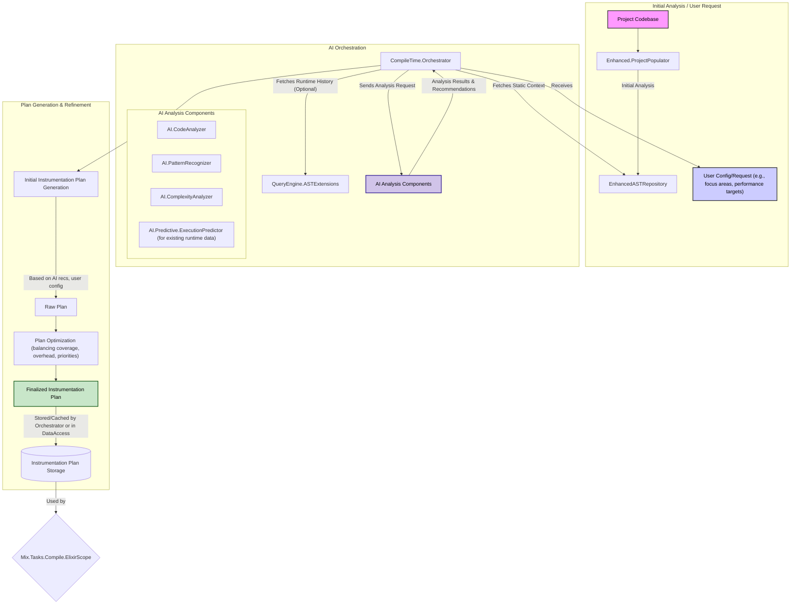

**Diagram 8 Description:** This diagram details the AI-driven instrumentation planning process orchestrated by `CompileTime.Orchestrator`.
1.  **Initial Context**: The `Orchestrator` may start with an existing analysis of the codebase from `EnhancedASTRepository` (populated by `ProjectPopulator`) and user-defined configuration or specific requests (e.g., focus on performance for certain modules). Optionally, it can query historical runtime data via `QueryEngine.ASTExtensions` to understand past behavior.
2.  **AI Analysis**: The `Orchestrator` sends this context to various AI components:
    *   `AI.CodeAnalyzer`: For general code understanding, quality assessment.
    *   `AI.PatternRecognizer`: To identify OTP patterns, architectural styles.
    *   `AI.ComplexityAnalyzer`: To gauge complexity of different code parts.
    *   `AI.Predictive.ExecutionPredictor`: If runtime data is available, to predict hotspots or problematic areas.
    These components return their analyses and recommendations.
3.  **Plan Generation**: The `Orchestrator` generates an initial instrumentation plan based on AI recommendations and user configuration. This plan might specify which modules/functions to instrument, what granularity (function, expression, variable), and what data to capture.
4.  **Plan Refinement**: The raw plan is optimized to balance desired coverage, performance overhead targets, and user-defined priorities.
5.  **Storage**: The finalized plan is stored (e.g., by `DataAccess` or cached by the `Orchestrator`) and used by the `Mix.Tasks.Compile.ElixirScope` compiler during AST transformation.

---

### 9. Temporal Bridge Enhancement - AST-Aware Time-Travel

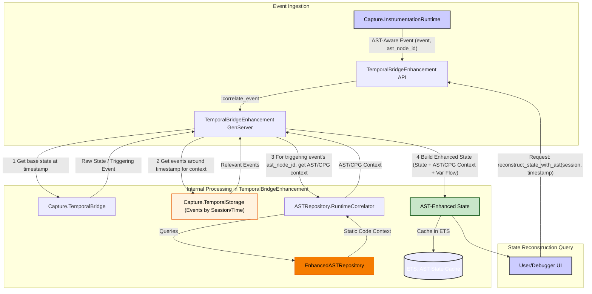

**Diagram 9 Description:** This diagram illustrates how `TemporalBridgeEnhancement` provides AST-aware time-travel debugging.
1.  **Event Ingestion**: `InstrumentationRuntime` sends AST-aware events (containing `ast_node_id`) to `TemporalBridgeEnhancement`. These are eventually stored in `TemporalStorage`.
2.  **State Reconstruction Request**: A user or debugger requests to reconstruct state at a specific `timestamp` for a `session_id`.
3.  **Internal Processing**:
    *   The `TemporalBridgeEnhancement` GenServer first calls the base `TemporalBridge` (if integrated, or directly queries `TemporalStorage`) to get the raw process state and the triggering event at/before the requested `timestamp`.
    *   It fetches relevant surrounding events from `TemporalStorage` for broader context.
    *   Using the `ast_node_id` from the triggering event (or other relevant events), it calls `RuntimeCorrelator` to get the static AST/CPG context from the `EnhancedASTRepository`.
    *   It then combines the raw runtime state with the static code context, potentially analyzing variable flow from the event sequence to build an "AST-Enhanced State."
    *   This enhanced state is cached for performance.
4.  **Response**: The AST-Enhanced State is returned to the user/debugger, allowing them to see not just variable values but also the corresponding code structure that was active.

---

### 10. Distributed Event Synchronization and Correlation

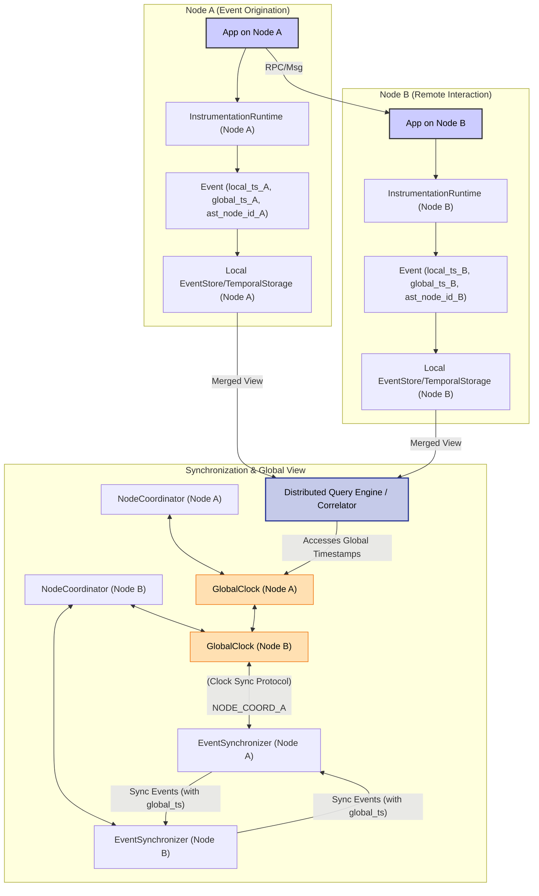

**Diagram 10 Description:** This diagram focuses on distributed tracing and event correlation.
1.  **Local Capture**: Applications on Node A and Node B generate events via their local `InstrumentationRuntime`. Each event is timestamped with both a local monotonic timestamp and a global logical timestamp obtained from the local `GlobalClock`.
2.  **Global Clock Sync**: `GlobalClock` instances on each node periodically synchronize with each other to maintain a consistent (though possibly loose) global time understanding. Hybrid Logical Clocks are used.
3.  **Event Synchronization**: `NodeCoordinator` on each node triggers its `EventSynchronizer`.
    *   `EventSynchronizer` fetches local events (since its last sync with a particular remote node) from its local `EventStore`/`TemporalStorage`.
    *   It sends these events (including their global timestamps) to `EventSynchronizer` instances on other nodes.
    *   When receiving events, it stores them locally, potentially resolving conflicts or duplicates based on event IDs and global timestamps.
4.  **Distributed Correlation & Query**:
    *   A distributed query engine (or a coordinating `RuntimeCorrelator` instance) can query data across multiple nodes.
    *   It uses the global timestamps to order events correctly from different nodes, reconstructing a globally consistent view of distributed interactions (e.g., an RPC from Node A to Node B).
    *   Correlation IDs that span nodes are key to linking parts of a distributed trace.

---

### 11. Memory Management and Optimization Cycle

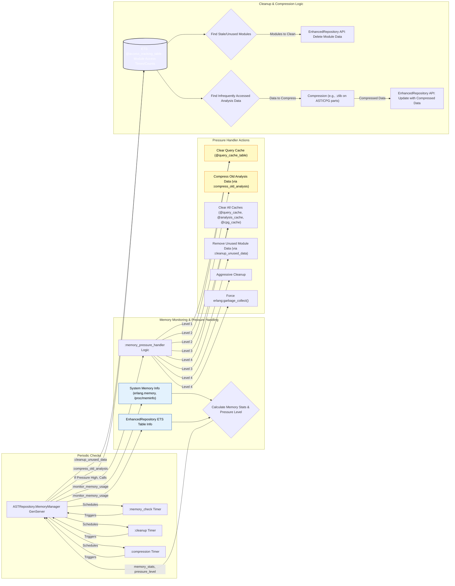

**Diagram 11 Description:** This diagram illustrates the `MemoryManager`'s operations for the `EnhancedASTRepository`.
1.  **Periodic Tasks**: The `MemoryManager` GenServer schedules periodic timers for memory checks, data cleanup, and data compression.
2.  **Memory Monitoring**:
    *   When `:memory_check` triggers, it collects memory statistics from the Erlang VM (`erlang.memory`) and by inspecting the sizes of ETS tables used by the `EnhancedRepository`.
    *   It calculates overall usage and determines the current memory pressure level.
    *   If pressure exceeds thresholds, it invokes the `:memory_pressure_handler` logic.
3.  **Pressure Handling**: Based on the pressure level, specific actions are taken:
    *   Level 1: Clears query caches.
    *   Level 2: Additionally compresses older/infrequently accessed analysis data (like detailed CPGs or DFG results).
    *   Level 3: Clears all caches and removes unused/stale module data from the `EnhancedRepository`.
    *   Level 4: Performs emergency cleanup (more aggressive data removal) and forces system-wide garbage collection.
4.  **Cleanup & Compression**:
    *   The `:cleanup_unused_data` logic (triggered periodically or by pressure handler) consults an access tracking ETS table (which logs when modules/functions were last accessed or analyzed). It identifies stale data and instructs the `EnhancedRepository` to delete it.
    *   The `:compress_old_analysis` logic similarly uses access tracking to find infrequently used, large analysis artifacts (e.g., full ASTs, detailed CPGs) and compresses them in place within the `EnhancedRepository` (e.g., using `:zlib`). The `EnhancedRepository` would then need to handle decompressing this data on demand.

---

These diagrams should provide a solid visual foundation for understanding ElixirScope's more intricate components and their interactions.
