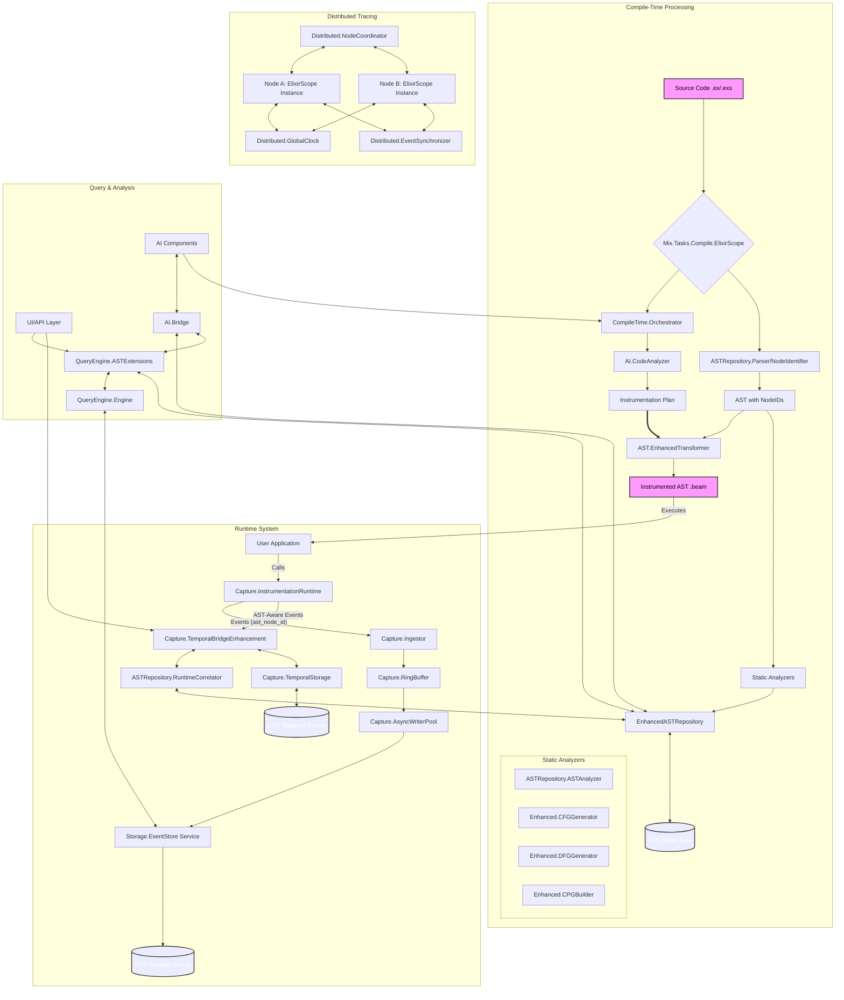
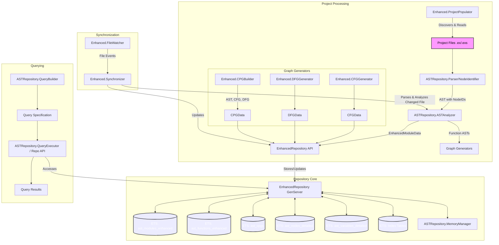
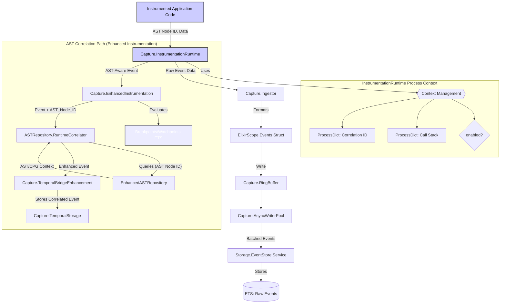
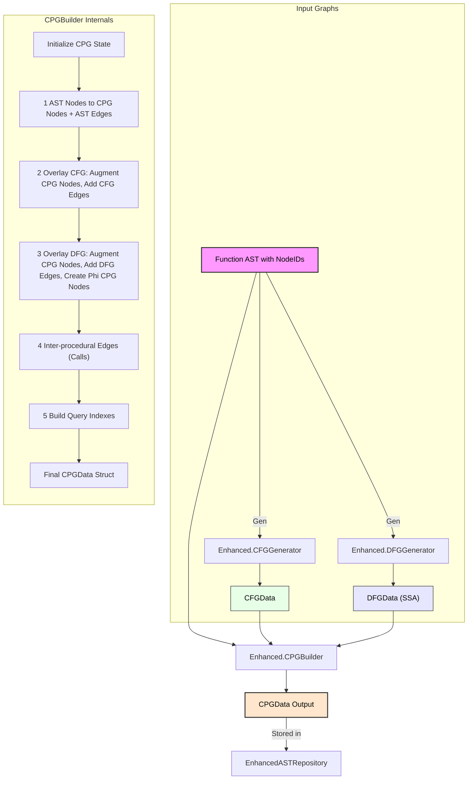
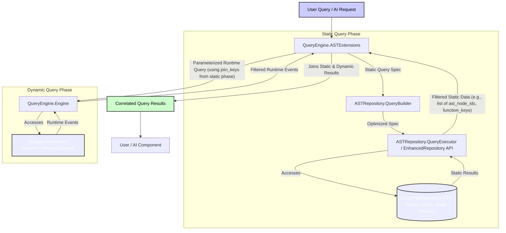
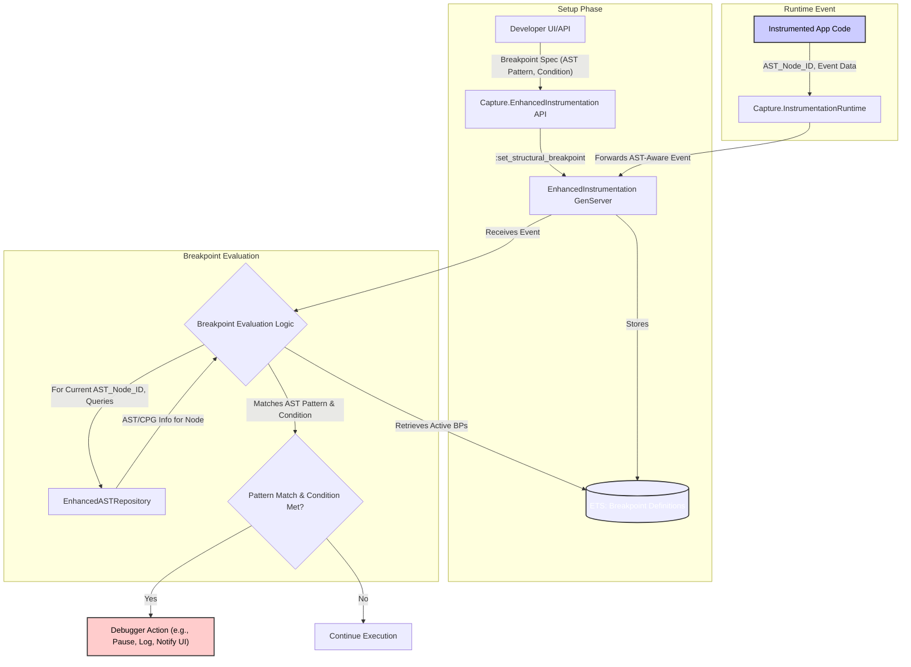

Okay, here is a series of detailed Mermaid diagrams depicting the architecture and internal workings of key ElixirScope features, tailored for a technical audience.

---

## ElixirScope Mermaid Diagrams

This section provides a series of Mermaid diagrams illustrating the architecture, data flows, and internal mechanisms of key ElixirScope components. These diagrams are intended for a technical audience familiar with distributed systems, compiler design, and advanced software engineering concepts.

### 1. Overall System Architecture

**Diagram 1 Description:** This diagram shows the high-level interaction between the compile-time processing, runtime system, query/analysis layer, and distributed tracing components. It highlights the flow of code and data from source to instrumented binaries, runtime event capture, storage, and subsequent analysis.

---

### 2. Enhanced AST Repository - Internal Structure and Data Flow

**Diagram 2 Description:** This diagram details the internal structure of the Enhanced AST Repository. It shows how `ProjectPopulator` and `FileWatcher`/`Synchronizer` feed data into the `ASTAnalyzer` and graph generators (`CFGGenerator`, `DFGGenerator`, `CPGBuilder`). The results are stored in the `EnhancedRepository GenServer`, which manages various ETS tables for modules, functions, CPGs, and indexes. The `MemoryManager` interacts with the repository for optimization, and the `QueryBuilder`/`QueryExecutor` provide the interface for accessing this static data.

---

### 3. Runtime Event Capture and AST Correlation Flow

**Diagram 3 Description:** This diagram illustrates the flow of runtime events. Instrumented application code calls `InstrumentationRuntime`. Basic event data flows through the `Ingestor`, `RingBuffer`, and `AsyncWriterPool` to the `EventStore`. For AST-aware events (from `EnhancedTransformer`), `EnhancedInstrumentation` handles breakpoint evaluation and forwards events with `ast_node_id` to `RuntimeCorrelator`. The `RuntimeCorrelator` queries the `EnhancedASTRepository` to fetch static context and produces an enhanced event, which is then passed to `TemporalBridgeEnhancement` for storage in `TemporalStorage`, enabling advanced debugging features.

---

### 4. CPG (Code Property Graph) Generation Process

**Diagram 4 Description:** This diagram outlines the CPG generation process. A function's AST (with pre-assigned NodeIDs) is fed into the `CPGBuilder`. Internally, `CFGGenerator` and `DFGGenerator` produce their respective graphs from this AST. The `CPGBuilder` then executes a multi-phase process:
1.  Creates CPG nodes primarily from AST nodes and establishes AST structural edges.
2.  Overlays CFG information by augmenting existing CPG nodes with CFG data and translating CFG edges into CPG CFG-typed edges.
3.  Overlays DFG information, augmenting CPG nodes with DFG data (definitions, uses), creating DFG-typed edges, and potentially creating new synthetic CPG nodes for elements like SSA Phi functions.
4.  (Conceptually) Adds inter-procedural call edges.
5.  Builds query indexes for the unified graph.
The final `CPGData` struct is then stored in the `EnhancedASTRepository`.

---

### 5. Correlated Query Execution (Static + Dynamic)

**Diagram 5 Description:** This diagram illustrates how `QueryEngine.ASTExtensions` handles correlated queries that combine static and dynamic data.
1.  A static query part is formulated (possibly via `QueryBuilder`) and executed against the `EnhancedASTRepository` to retrieve static code elements (e.g., functions meeting complexity criteria, CPG nodes matching a pattern).
2.  Join keys (like `ast_node_id`s or `function_key`s) are extracted from these static results.
3.  These join keys are used to parameterize a runtime query template, which is then executed by `QueryEngine.Engine` against the `EventStore` or `TemporalStorage`.
4.  `ASTExtensions` then joins the results from the static and dynamic query phases to produce the final correlated output.

---

### 6. Advanced Debugging Feature: Structural Breakpoint Flow

**Diagram 6 Description:** This diagram shows the flow for structural breakpoints:
1.  **Setup**: A developer defines a structural breakpoint (an AST pattern and a condition) via a UI or API, which is stored by the `EnhancedInstrumentation` GenServer in an ETS table.
2.  **Runtime Event**: Instrumented code executes, and `InstrumentationRuntime` reports an AST-aware event (with `ast_node_id`) to `EnhancedInstrumentation`.
3.  **Evaluation**:
    *   `EnhancedInstrumentation` retrieves active structural breakpoint definitions.
    *   For the current event's `ast_node_id`, it queries `EnhancedASTRepository` to get the static AST/CPG information for that specific node.
    *   It then attempts to match the AST information against each active breakpoint's pattern and checks if the specified condition (e.g., pattern match failure, exception occurred) is met.
4.  **Action**: If a breakpoint's pattern and condition are satisfied, a debugger action is triggered (e.g., pausing execution, logging detailed context, notifying a UI). Otherwise, execution continues normally. Data flow breakpoints and semantic watchpoints would follow similar principles but use DFG/CPG data for their specific matching logic.

---

These diagrams provide a foundational visual understanding. Each component and interaction can be further detailed with more specific sequence diagrams or state charts if needed.
