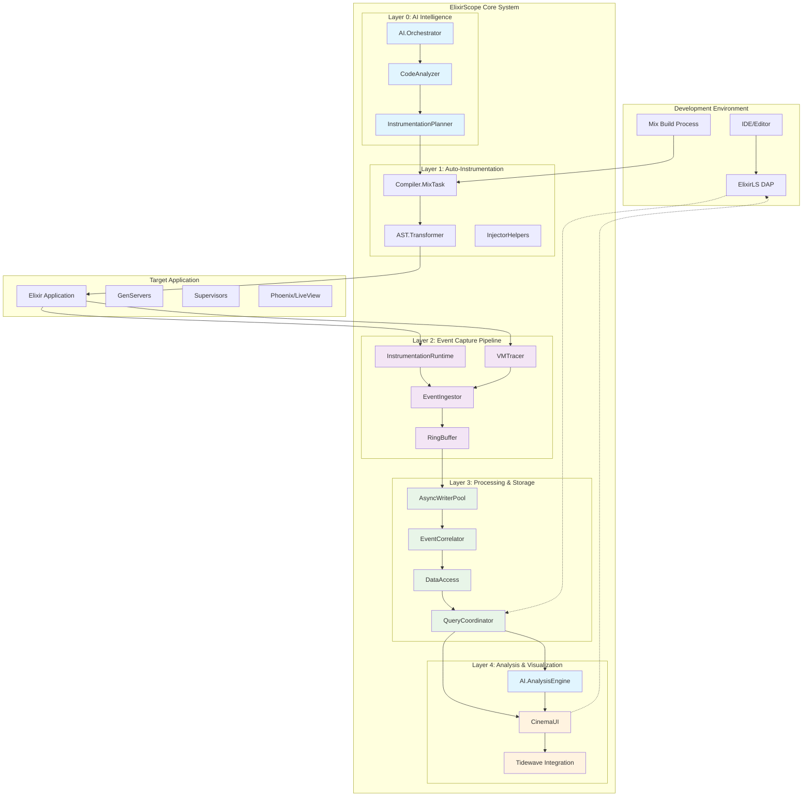
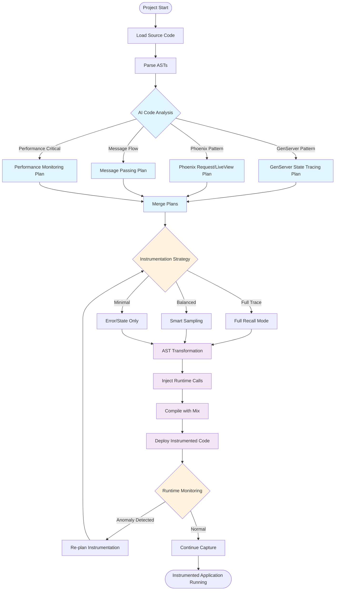
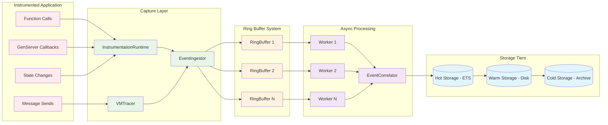
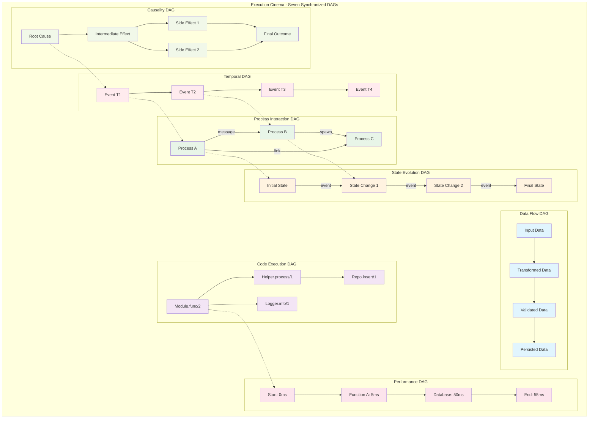
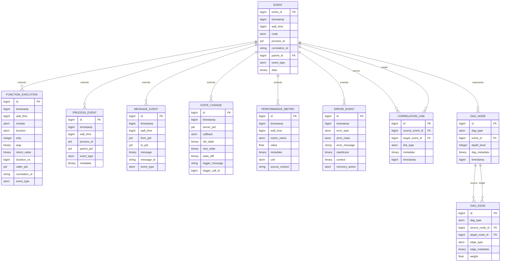
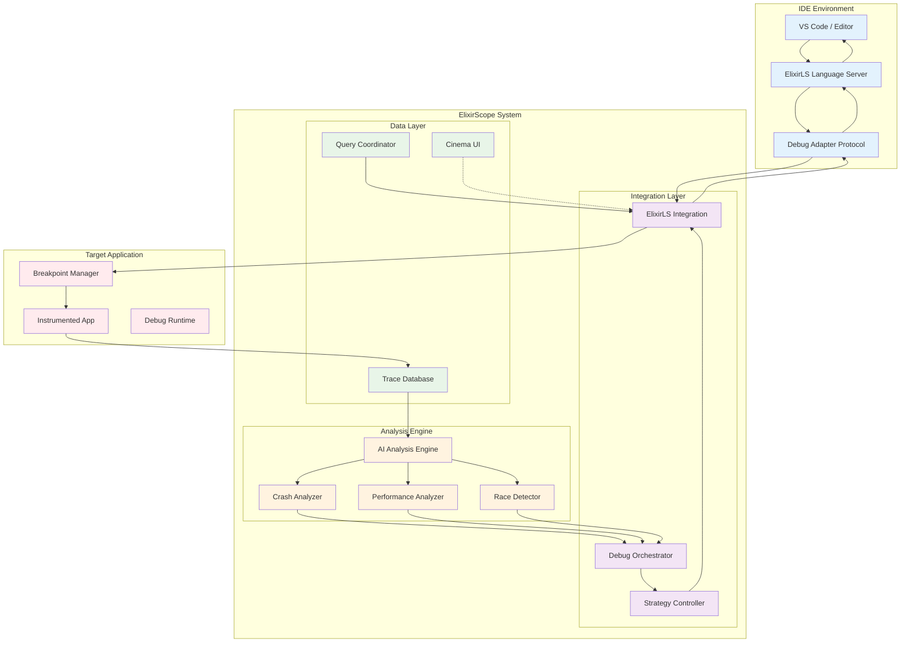
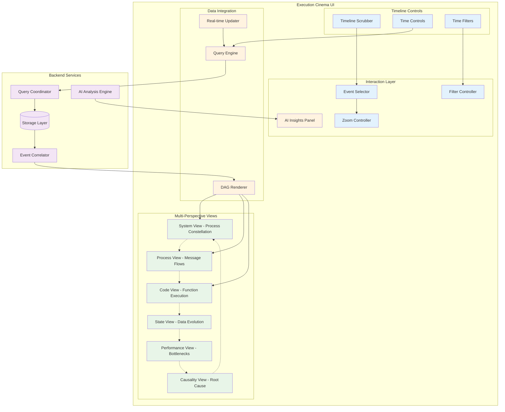
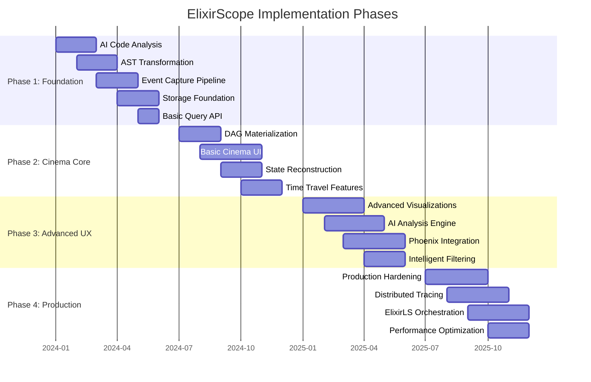

# ElixirScope System Architecture Diagrams

## 1. Overall System Architecture

## 2. AI-Driven Instrumentation Flow

## 3. Event Capture Pipeline

## 4. Seven DAGs (Execution Cinema Model)

## 5. Event Data Model (ERD)

## 6. ElixirLS Integration Architecture

## 7. Execution Cinema UI Component Architecture

## 8. Phase Implementation Roadmap

These diagrams provide a comprehensive visual representation of the ElixirScope system, from high-level architecture through detailed data models and implementation phases. Each diagram focuses on a different aspect of the system to help understand the complex interactions between AI-driven instrumentation, event capture, multi-dimensional analysis, and the innovative "Execution Cinema" visualization approach.
