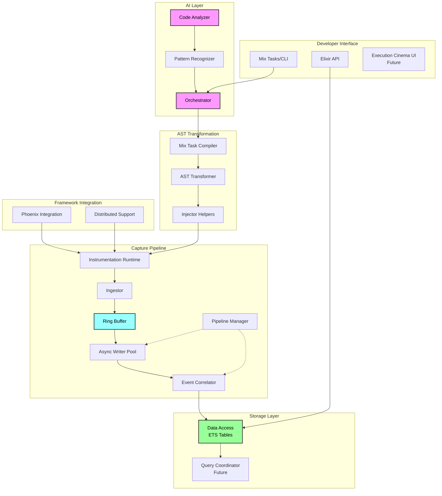
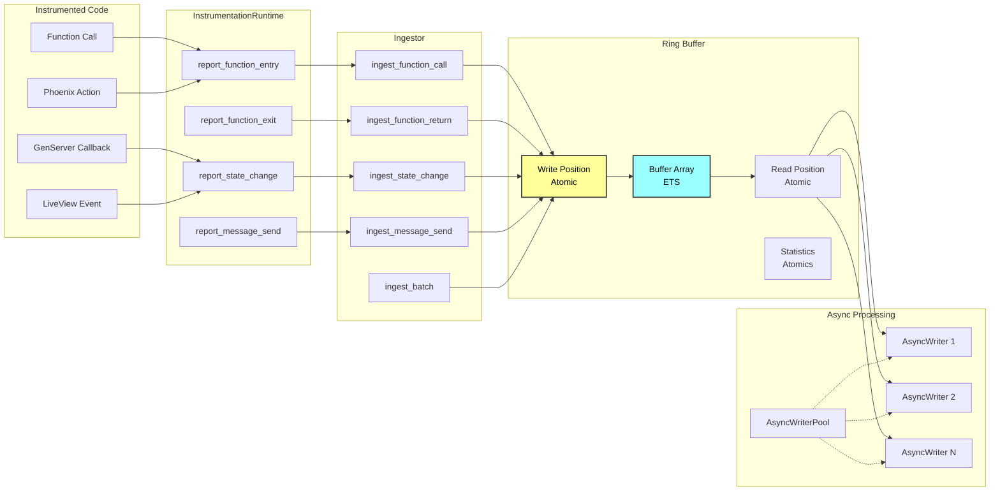
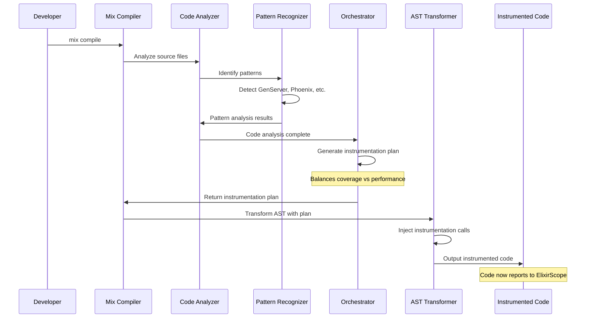
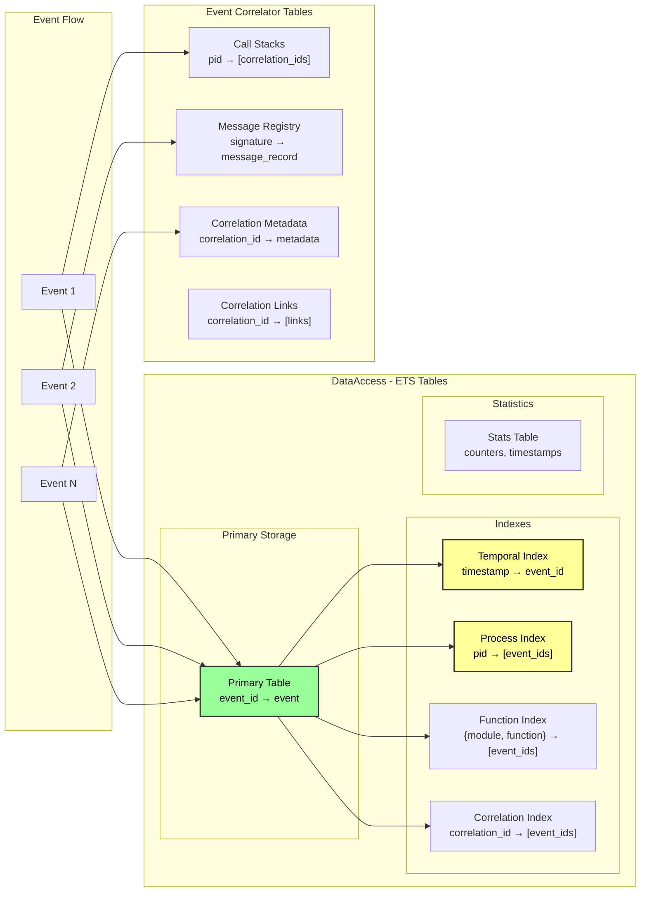
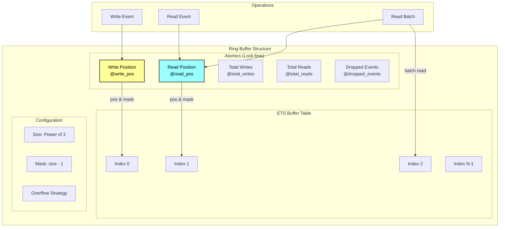
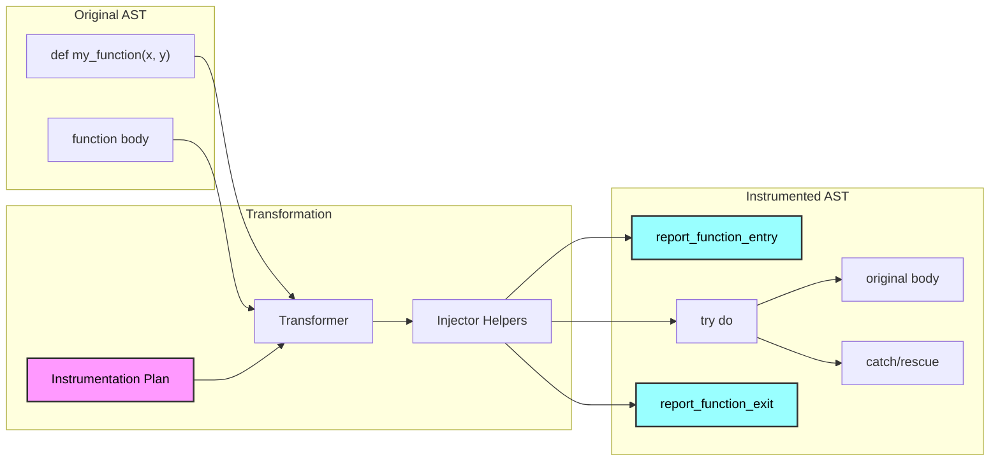
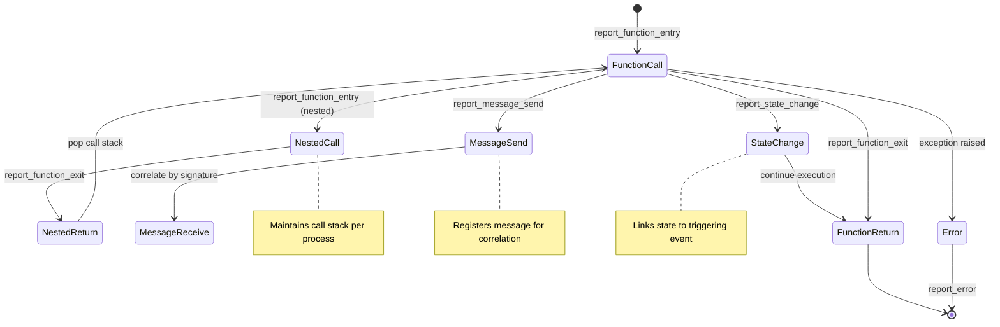
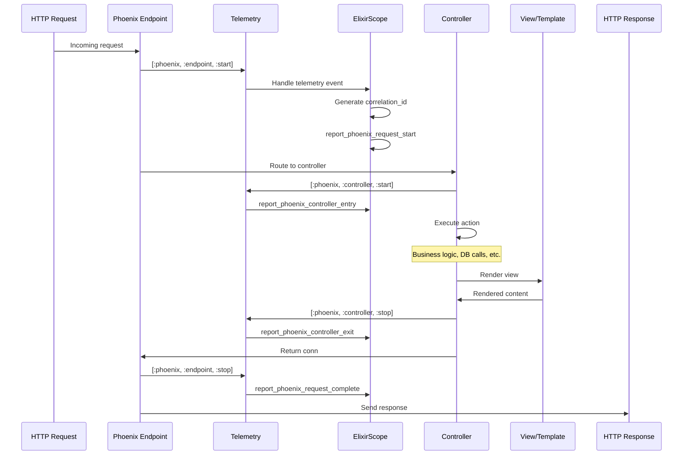
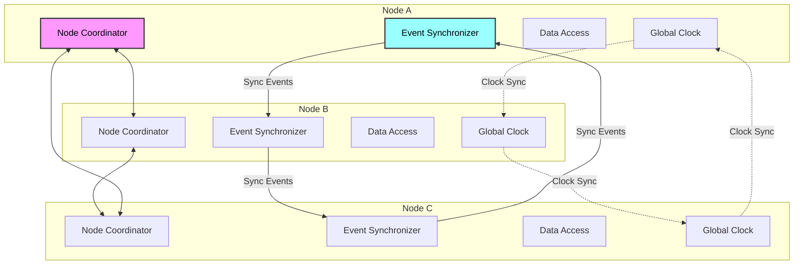
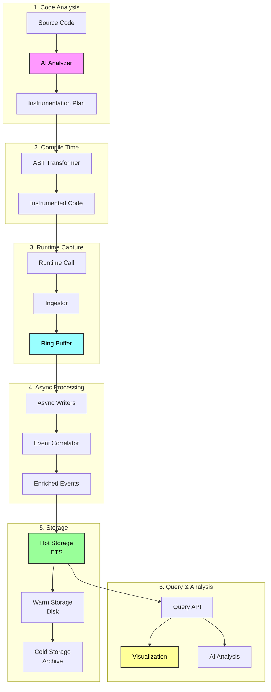

I'll create comprehensive Mermaid diagrams for ElixirScope that focus on the implementation details. Let me create several diagrams covering different aspects of the system.

## 1. High-Level Architecture Overview

## 2. Event Capture Pipeline Detail

## 3. AI Analysis and Instrumentation Flow

## 4. Event Storage and Indexing Structure

## 5. Ring Buffer Implementation Detail

## 6. AST Transformation Process

## 7. Event Correlation State Machine

## 8. Phoenix Integration Flow

## 9. Distributed Event Synchronization

## 10. Complete Event Lifecycle

These diagrams provide a comprehensive view of ElixirScope's implementation, showing:

1. **Overall architecture** and component relationships
2. **Event capture pipeline** from instrumented code to storage
3. **AI-driven instrumentation** workflow
4. **Storage structure** with multiple indexes for efficient querying
5. **Ring buffer** implementation details
6. **AST transformation** process
7. **Event correlation** state machine
8. **Phoenix integration** via telemetry
9. **Distributed synchronization** across nodes
10. **Complete event lifecycle** from code analysis to visualization

Each diagram focuses on implementation details that would be useful for developers working on or understanding the ElixirScope codebase.
