Okay, I will create a series of detailed Mermaid architectural diagrams. I'll start by focusing on the current runtime-centric architecture as indicated by the latest documents like `CURSOR_REVAMP_DEBUG_PLAN.md` and `PROGRESS_SUMMARY.md`, and then extrapolate for future enhancements based on the broader vision outlined in documents like `008-g-prd.md` (ElixirScope PRD) and `CURSOR_PHASE_2_AI_ENGINE.md`.

Here's the first set of diagrams representing the **current state** of ElixirScope:

## Diagrams for Current State (Runtime Tracing Focused)

### 1. Overall System Architecture (Runtime-Focused)

This diagram shows the main components of ElixirScope with its runtime tracing primary mechanism.

> **Note:** Does not show its place within the unified architecture or the compile-time AST instrumentation path.

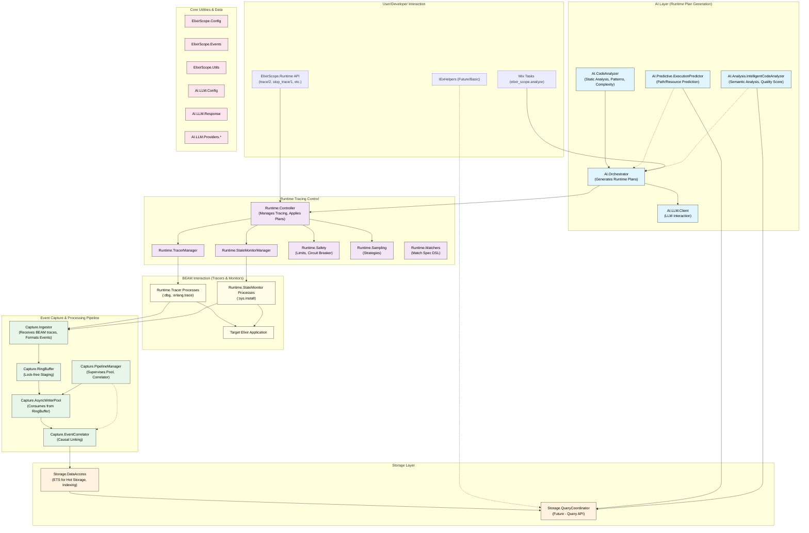

### 2. AI-Driven Runtime Instrumentation Flow

This diagram details how AI analyzes code and translates that into runtime tracing commands.

> **Note:** Focuses only on runtime; should incorporate AI planning for AST instrumentation.

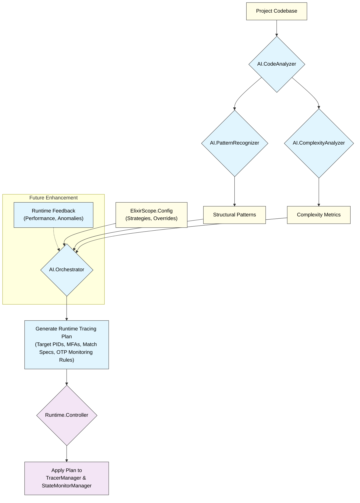

### 3. Runtime Event Capture Pipeline (from BEAM to Ingestor)

Focuses on how events sourced from BEAM's tracing mechanisms are captured.

> **Note:** Accurate for runtime path, but needs to show the convergent path from AST instrumentation via `Capture.InstrumentationRuntime`.

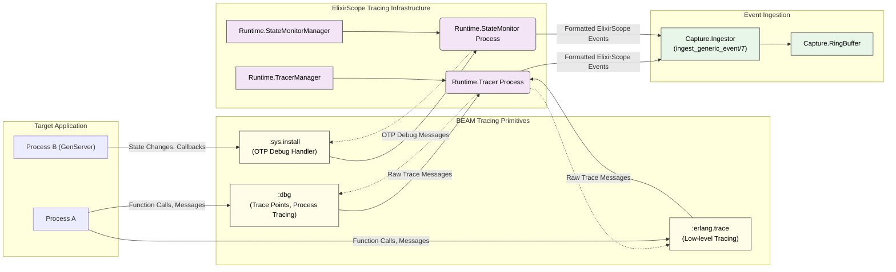

### 4. Asynchronous Event Processing and Storage Pipeline

This diagram picks up from the RingBuffer and shows how events are processed and stored.

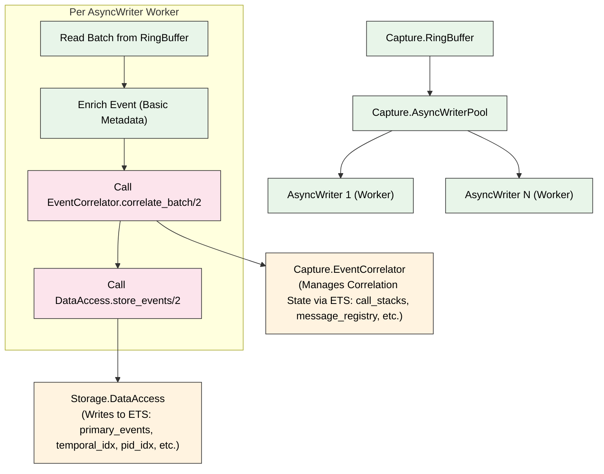

### 5. Simplified ElixirScope Data Model (ERD-like)

Illustrates key event types and their core attributes, including correlation fields.

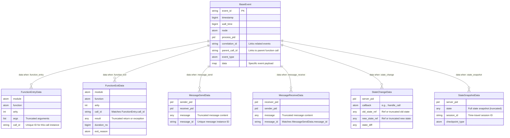

### 6. Runtime API Control Flow

Shows how user API calls flow through the runtime control system.

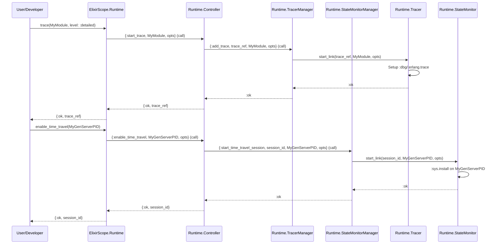

### 7. LLM Integration Architecture

Illustrates the interaction of ElixirScope's LLM client with providers.

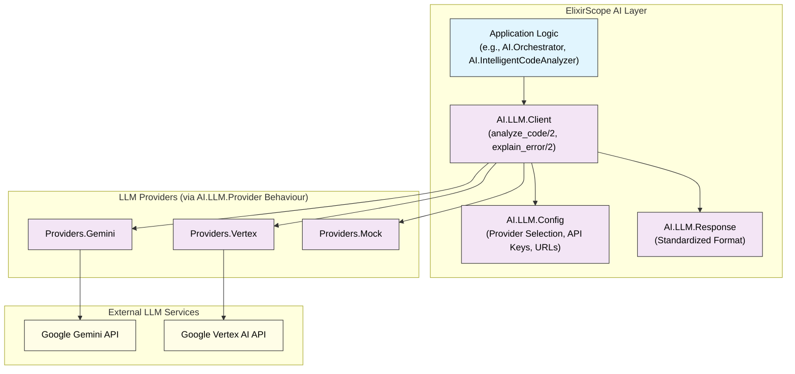

### 8. Predictive & Intelligent Analysis Engines (Conceptual Interaction)

Shows how the advanced AI analysis modules (from Layers 8 & 9 documentation) would interact with the system. These modules exist in code.

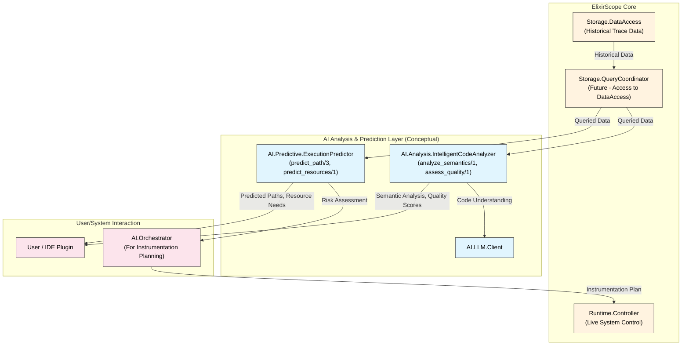

## Diagrams for Future State

### 9. "Execution Cinema" UI & Querying Architecture

This conceptual diagram shows how the future UI will interact with the backend to display trace data and enable time-travel debugging.

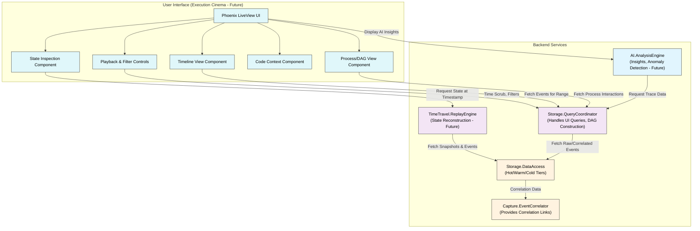

### 10. Advanced AI Analysis Engine Integration (Future)

Based on `CURSOR_PHASE_2_AI_ENGINE.md`, this shows the interaction of more advanced AI components.

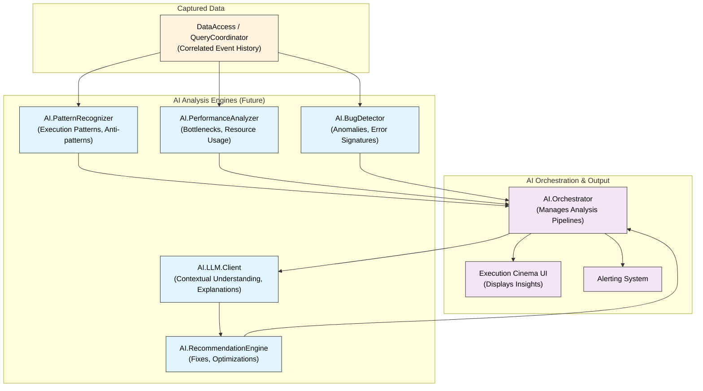

### 11. Distributed Tracing & Data Synchronization (Focus on Existing Components)

This diagram details how the existing distributed components interact.

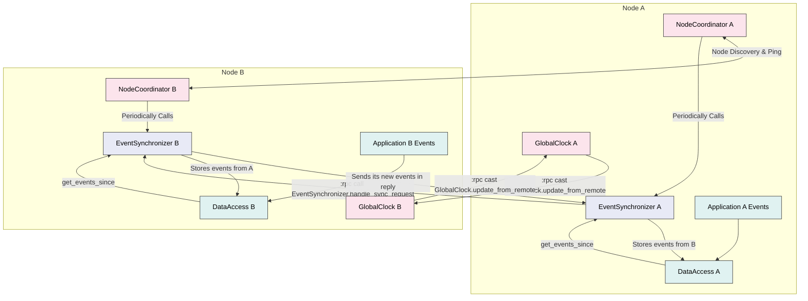

These diagrams should provide a good architectural overview of ElixirScope, covering its current runtime-centric design and its future evolution towards the "Execution Cinema" vision. The level of detail aims to be useful for understanding component interactions and data flows.