Let me discuss what additional diagrams would be most helpful to elucidate ElixirScope's design for both humans and LLMs:

## Discussion: Next Set of Helpful Diagrams

### For Human Understanding:
1. **Performance Characteristics Diagram** - Show the performance targets and bottlenecks visually
2. **Error Handling and Resilience Flow** - How the system handles failures gracefully
3. **Configuration and Runtime Control** - How users configure and control the system
4. **Memory Management Strategy** - Ring buffer overflow, pruning, memory bounds
5. **Testing Strategy Visualization** - How the comprehensive test suite ensures quality

### For LLM Understanding:
1. **Data Structures and Type Relationships** - Clear type hierarchies and relationships
2. **Module Dependency Graph** - Show which modules depend on which
3. **API Contract Specifications** - Input/output relationships for key functions
4. **State Transitions for Key Components** - GenServer states, lifecycle management
5. **Code Generation Patterns** - How AST transformation patterns work

### For Both:
1. **Query Patterns and Data Flow** - How different query types traverse the system
2. **Concurrency Model** - How concurrent operations are coordinated
3. **Integration Points and Extension Model** - Where and how to extend the system
4. **Debugging Workflow with ElixirScope** - End-to-end user journey
5. **Future Architecture Evolution** - How the system will evolve to support the "Grand Plan"

Let me create these diagrams, starting with the most valuable ones:

## 1. Performance Characteristics and Bottlenecks

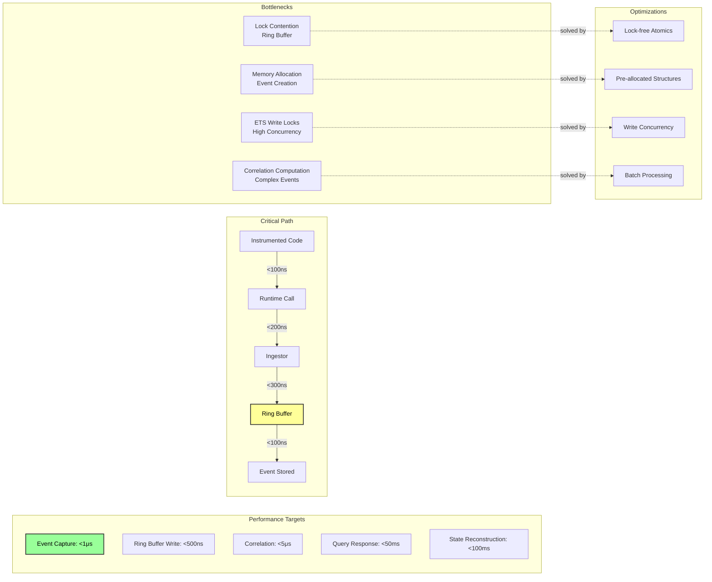

## 2. Module Dependency Graph

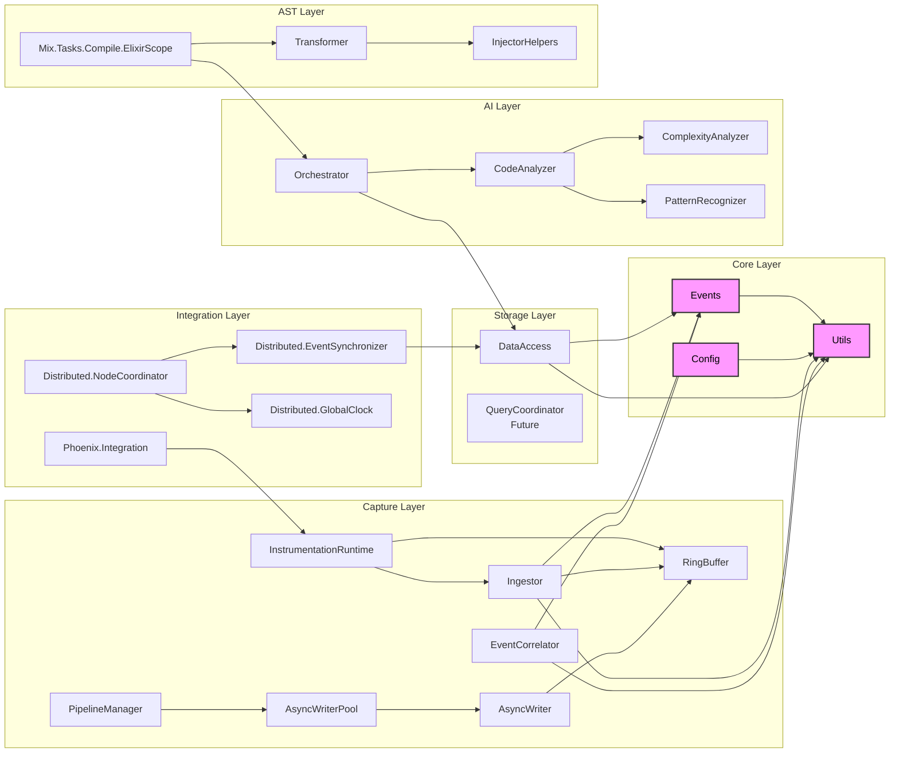

## 3. Error Handling and Resilience Flow

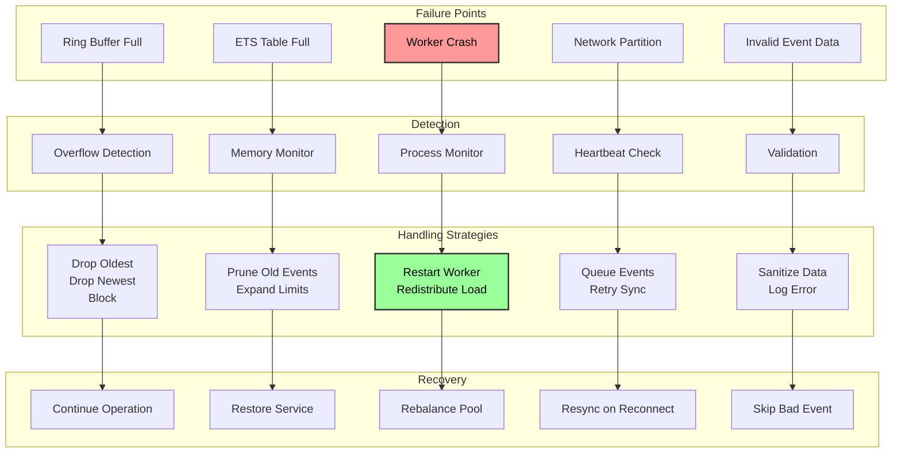

## 4. Memory Management Strategy

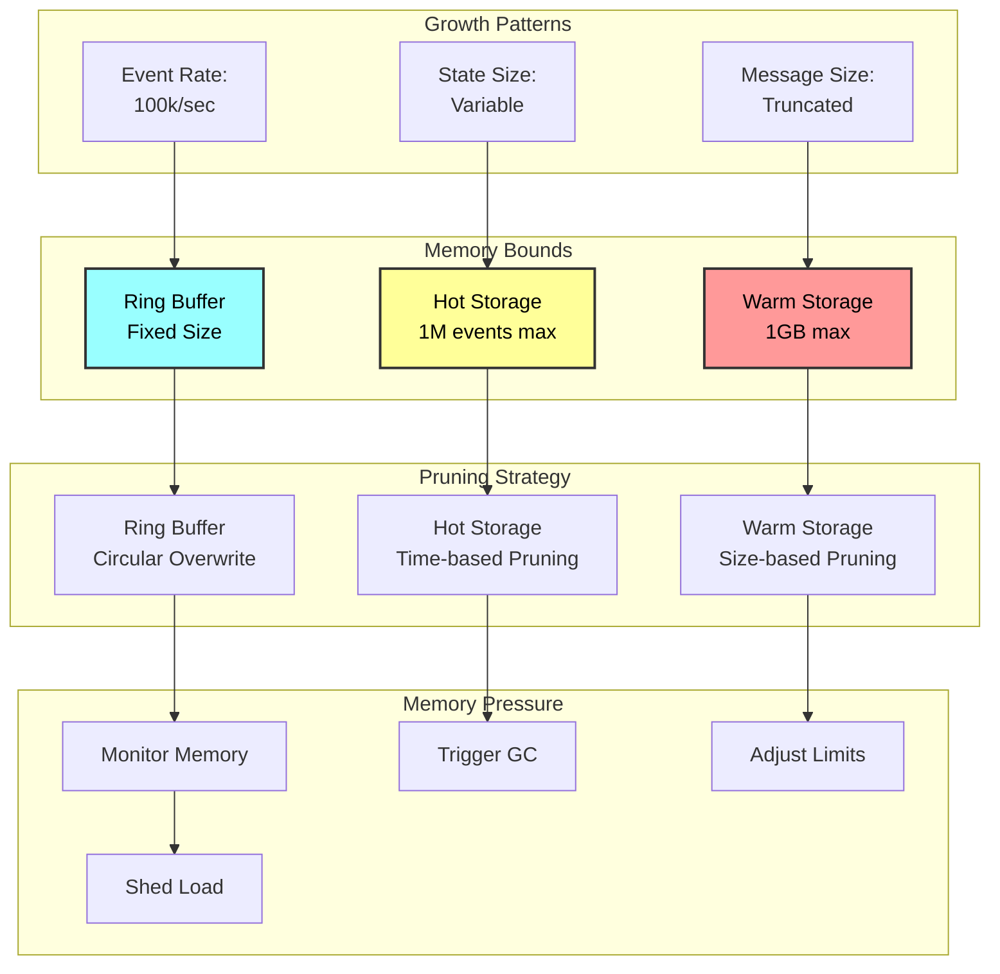

## 5. Query Patterns and Data Flow

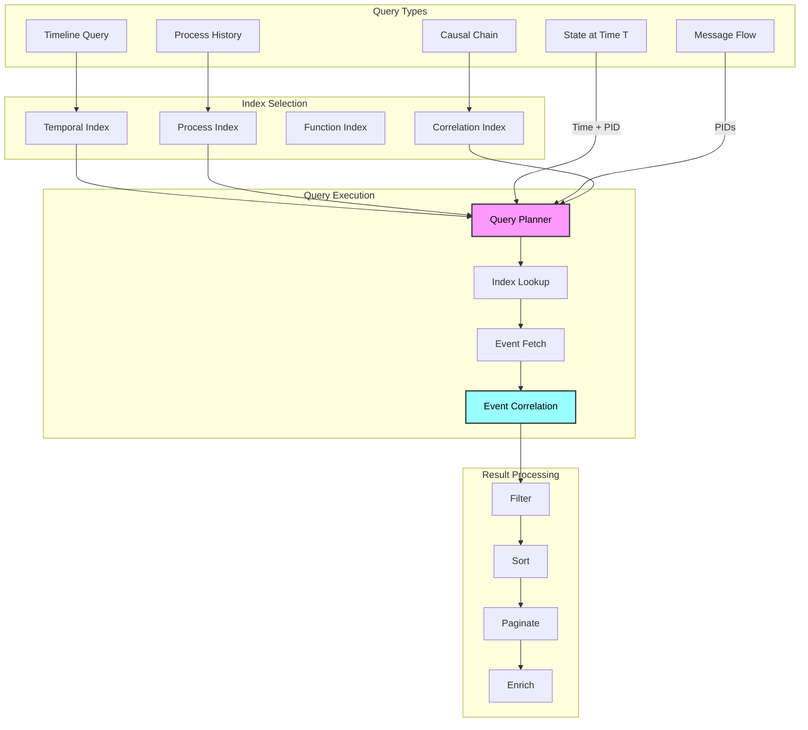

## 6. Concurrency Model

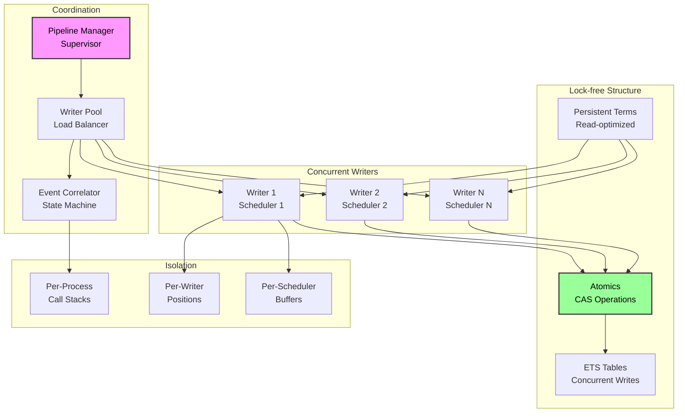

## 7. Data Structures and Type Relationships

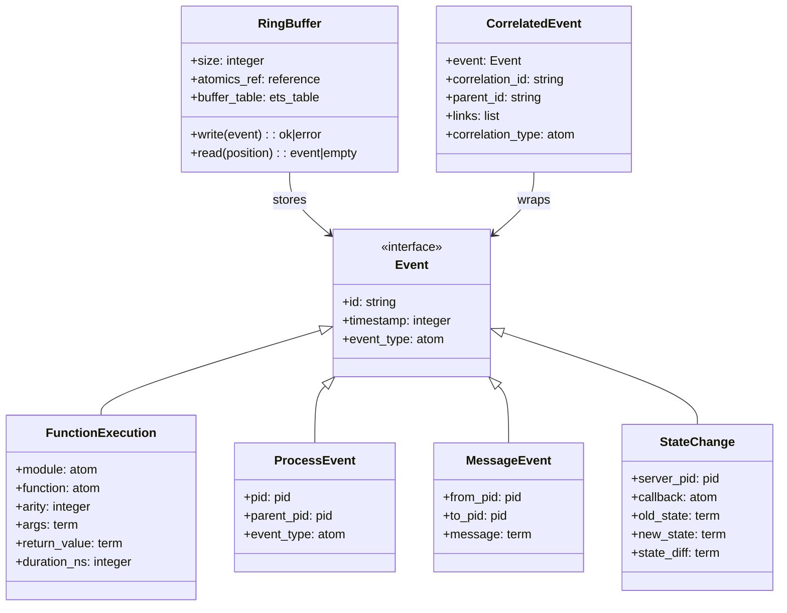

## 8. State Transitions for Key Components

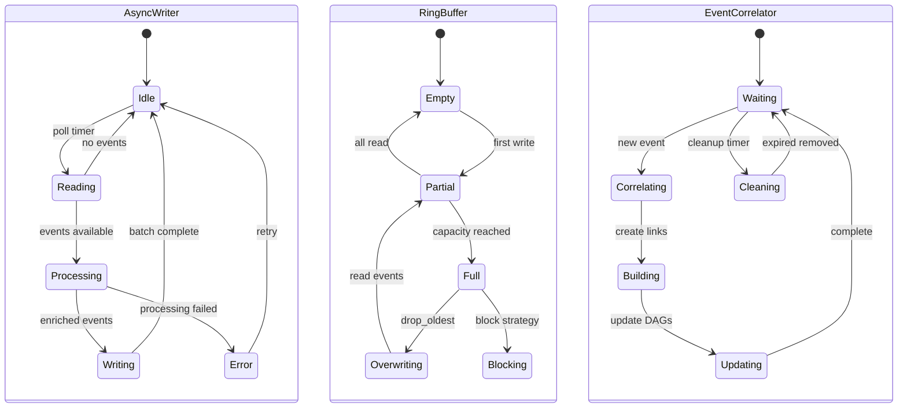

## 9. User Configuration Flow

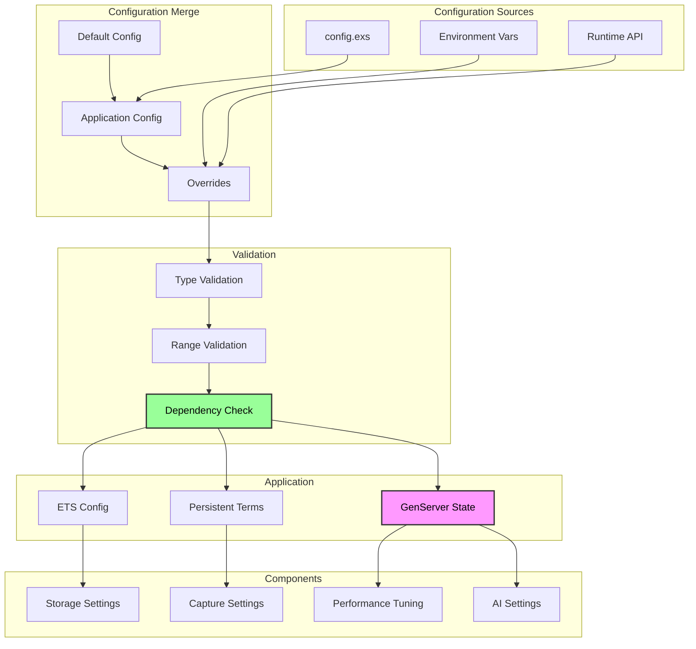

## 10. Testing Strategy Visualization

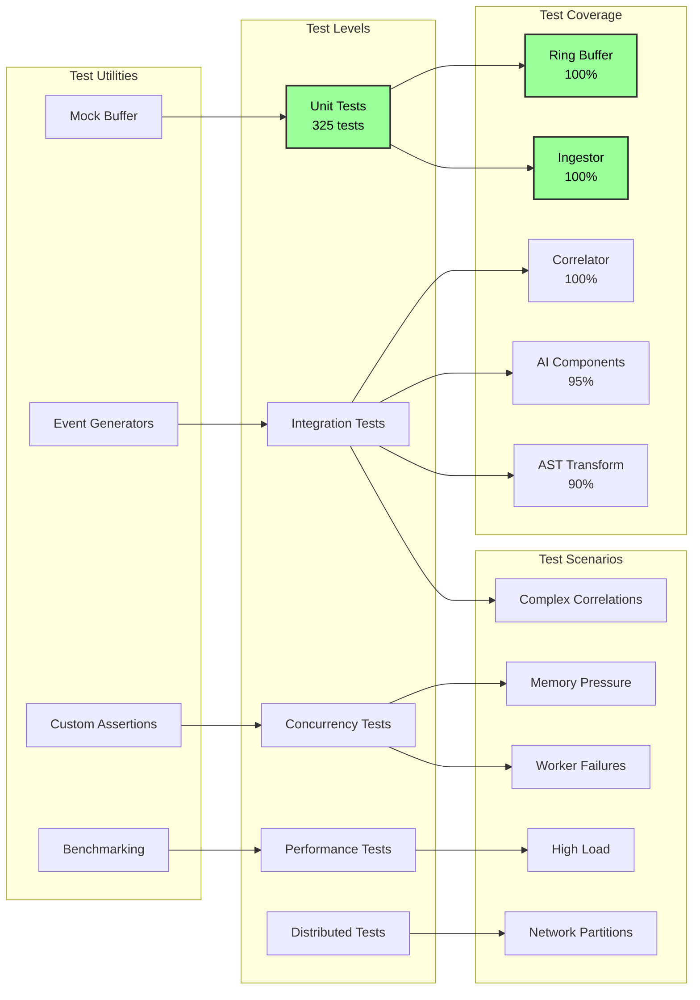

## 11. End-to-End Debugging Workflow

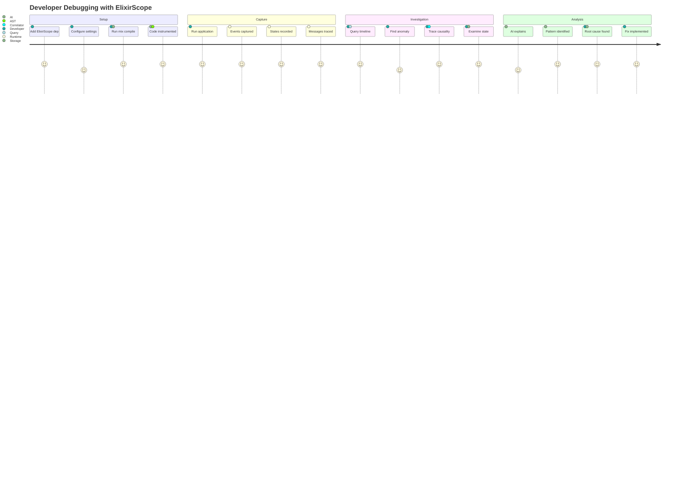

## 12. Future Architecture Evolution

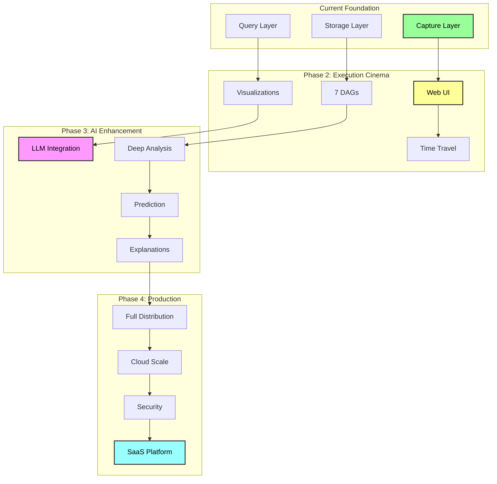

These diagrams provide comprehensive coverage of:
- Performance characteristics and optimization strategies
- Module dependencies and system architecture
- Error handling and resilience patterns
- Memory management strategies
- Query execution flows
- Concurrency coordination
- Data type relationships
- Component state machines
- Configuration management
- Testing strategies
- User workflows
- Future evolution plans

Together with the previous set, these diagrams create a complete visual documentation of ElixirScope that both humans and LLMs can use to understand the system's design, implementation, and usage patterns.