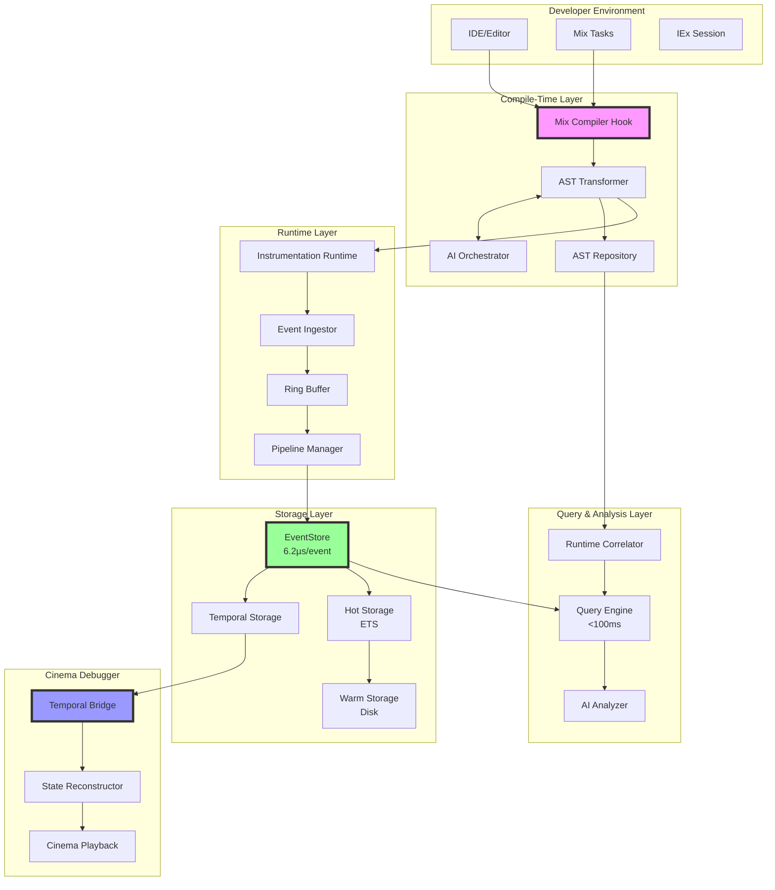
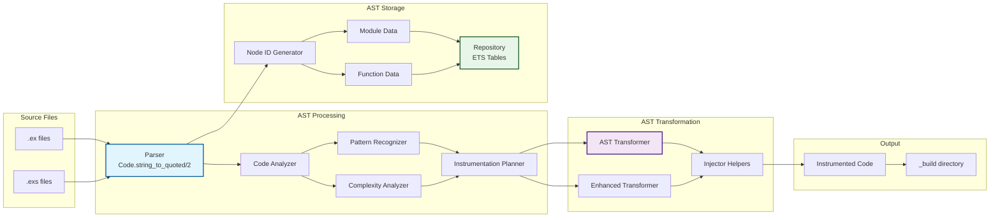
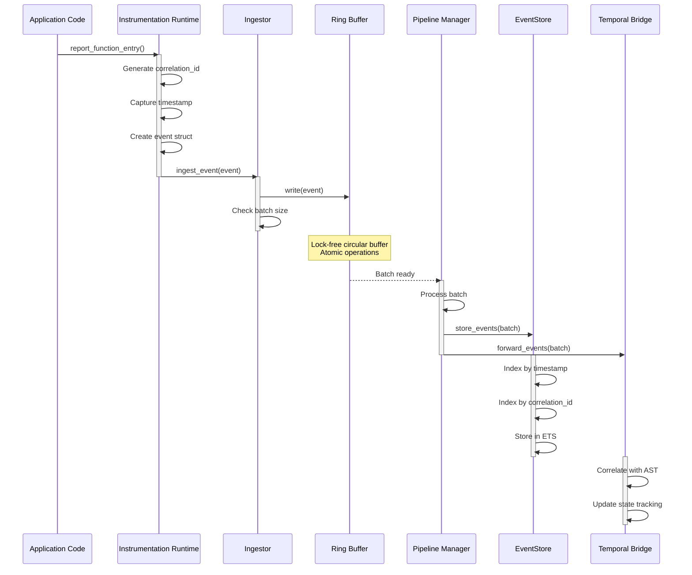
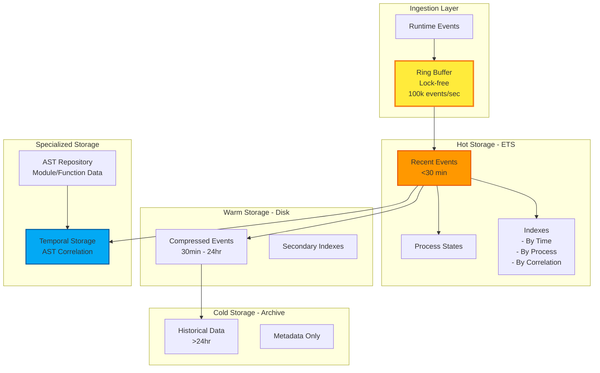
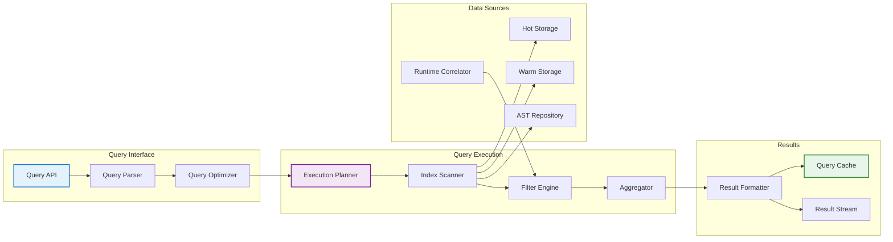
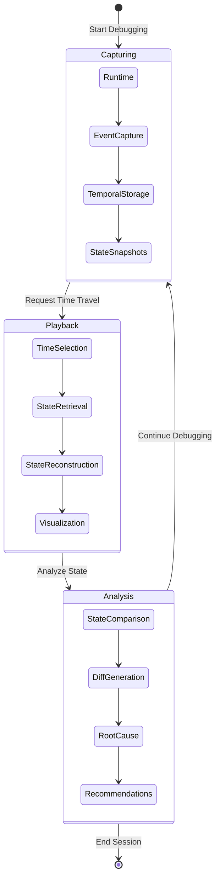
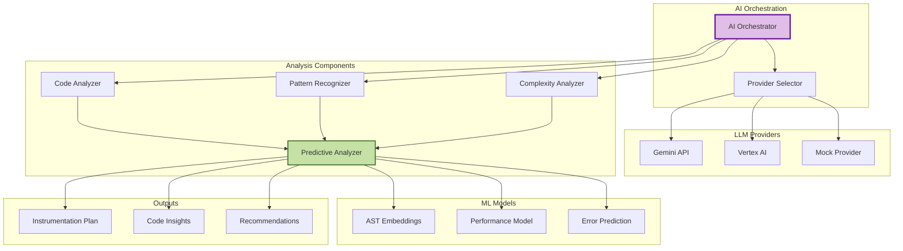
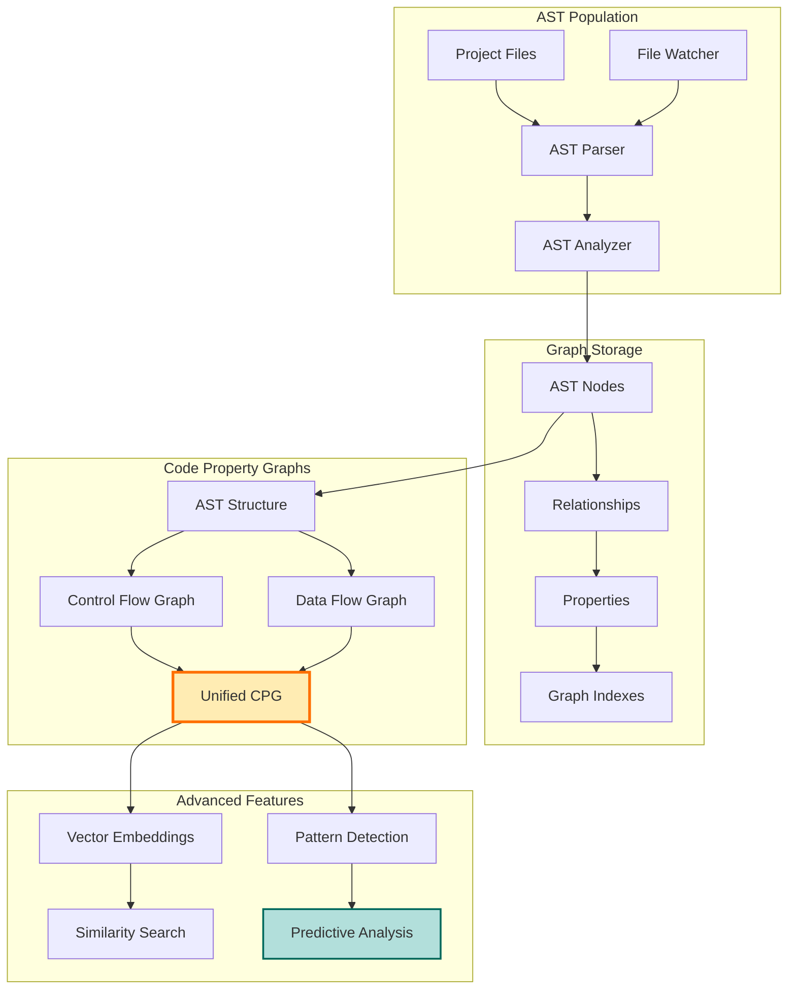
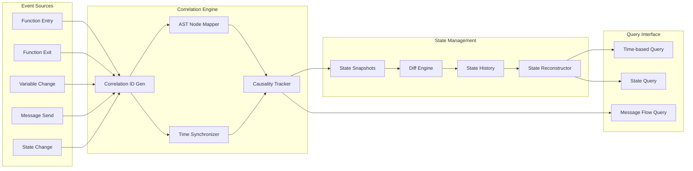
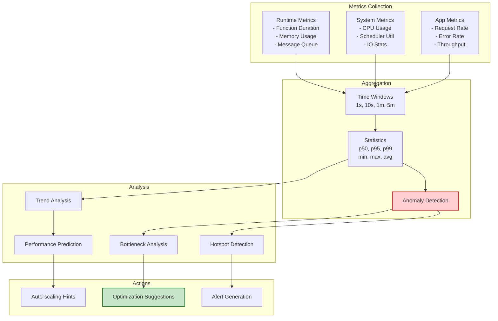

# ElixirScope Architecture Diagrams

## 1. High-Level System Architecture

## 2. Compile-Time AST Transformation Pipeline

## 3. Runtime Event Capture Flow

## 4. Data Storage Architecture

## 5. Query Engine Architecture

## 6. Cinema Debugger Time-Travel Architecture

## 7. AI Integration Architecture

## 8. Revolutionary AST Repository (Phase 3)

## 9. Event Correlation & State Management

## 10. Performance Monitoring Architecture

## Key Architecture Principles

1. **Separation of Concerns**: Clear boundaries between compile-time and runtime components
2. **Performance-First Design**: Lock-free data structures, minimal overhead instrumentation
3. **Scalability**: Tiered storage, efficient indexing, batch processing
4. **Extensibility**: Plugin architecture for AI providers, analysis modules
5. **Correlation**: Strong linking between static (AST) and dynamic (runtime) data
6. **Time-Travel Capability**: Comprehensive state tracking and reconstruction
7. **AI Integration**: Pluggable LLM providers with fallback strategies
8. **Query Optimization**: Multi-level caching, index-based retrieval

## Performance Characteristics

- **Event Ingestion**: <100µs per event overhead
- **Storage**: 6.2µs per event write to EventStore
- **Query**: <100ms for complex queries across 1000 events
- **Memory**: ~50MB overhead for typical applications
- **AST Processing**: <100ms for medium-sized modules
- **State Reconstruction**: <10ms for typical GenServer states

## Future Architecture Enhancements (Phase 3+)

- **Graph Database Integration**: Neo4j/ArangoDB for AST relationships
- **Distributed Tracing**: Cross-node event correlation
- **ML Pipeline**: Real-time model training on event streams
- **Web UI Integration**: Phoenix LiveView real-time dashboard
- **IDE Integration**: LSP protocol support for in-editor debugging
