Okay, here is a series of Mermaid documents representing the ElixirScope system, structured to be useful for both an LLM and your human team. These diagrams are based on the provided Elixir code files.

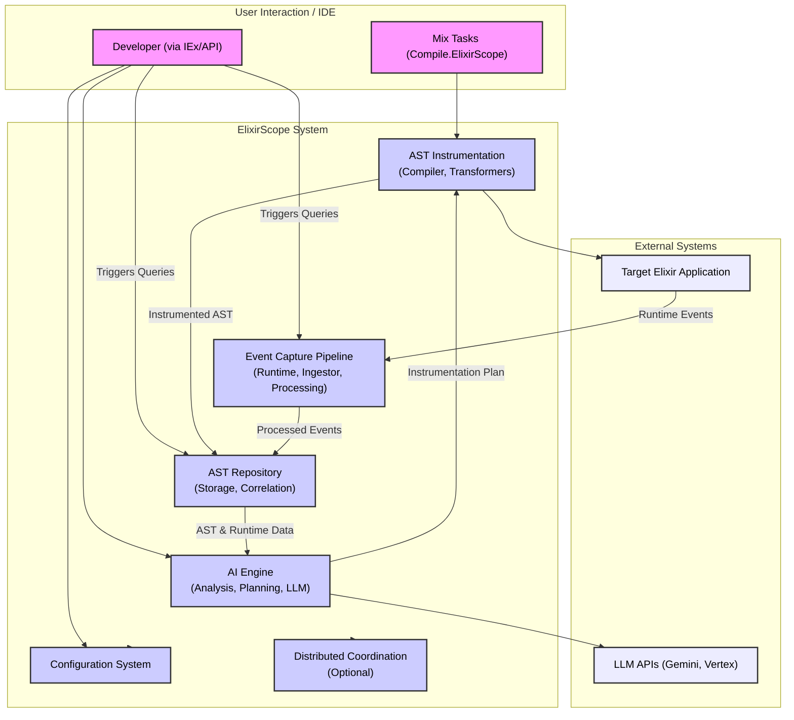

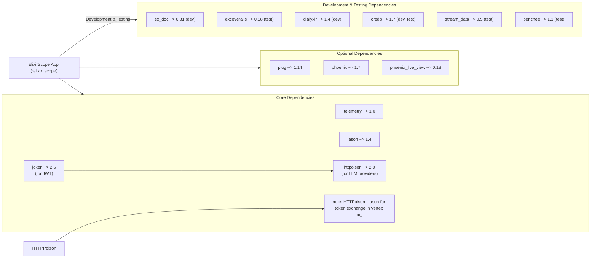

---

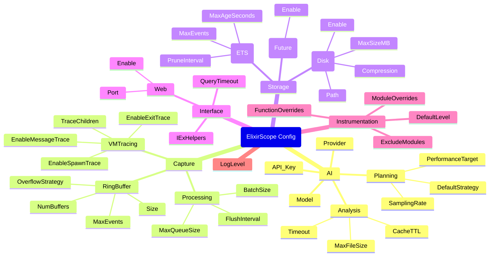

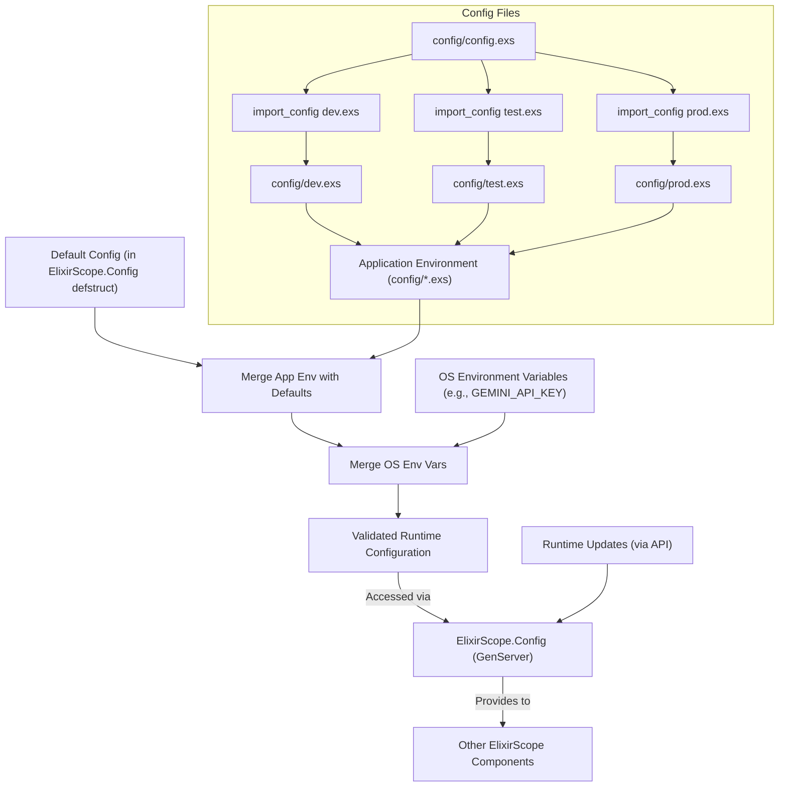

---

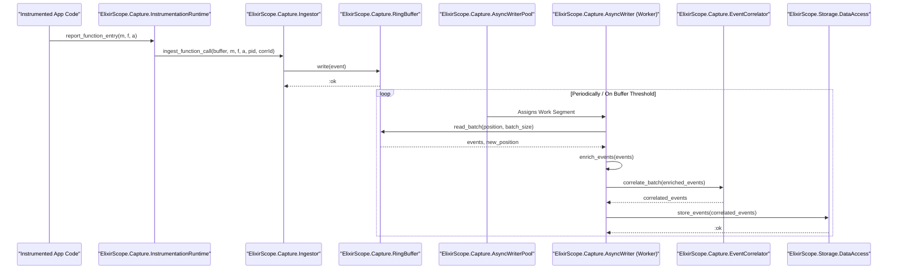

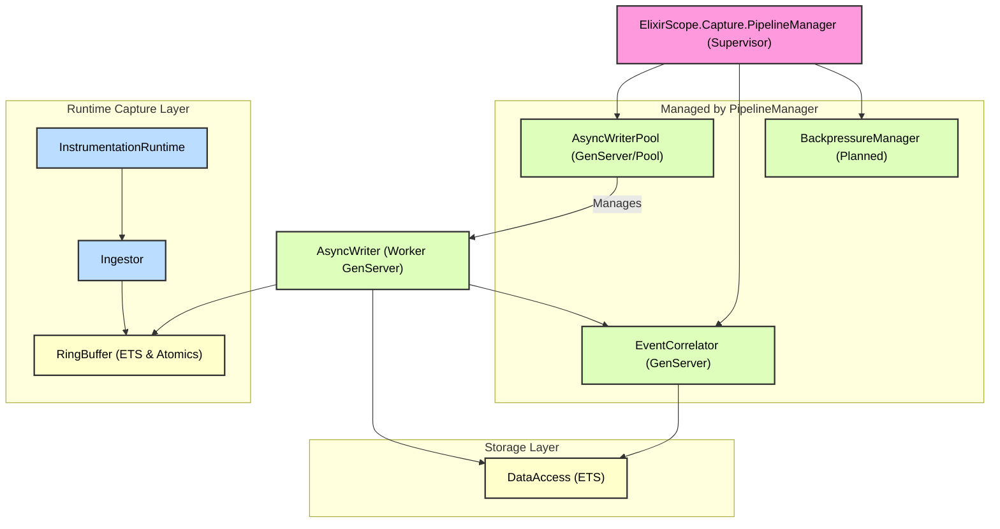

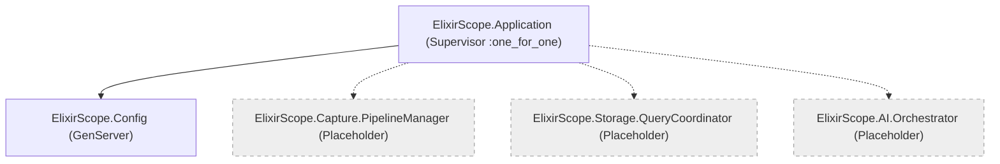

---

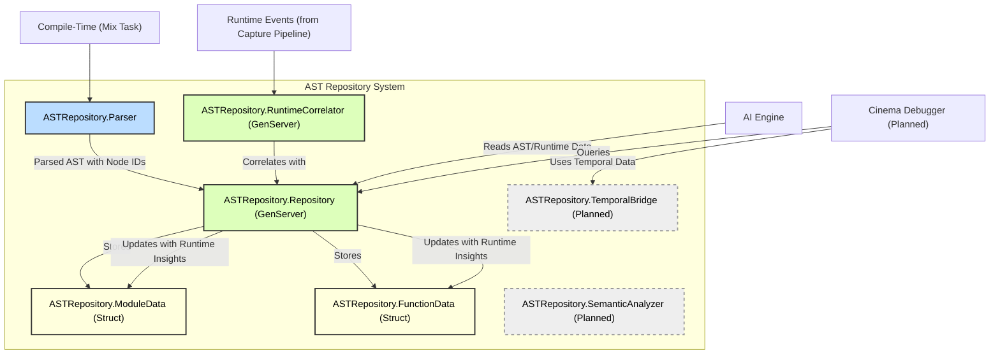

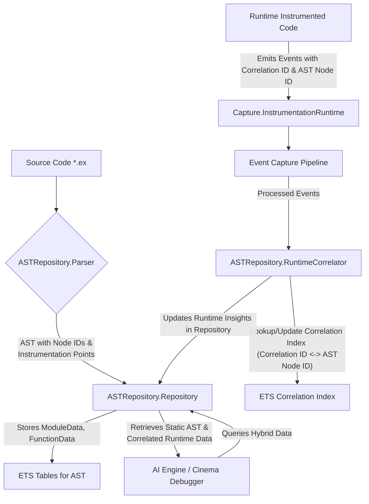

---

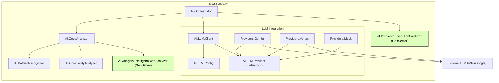

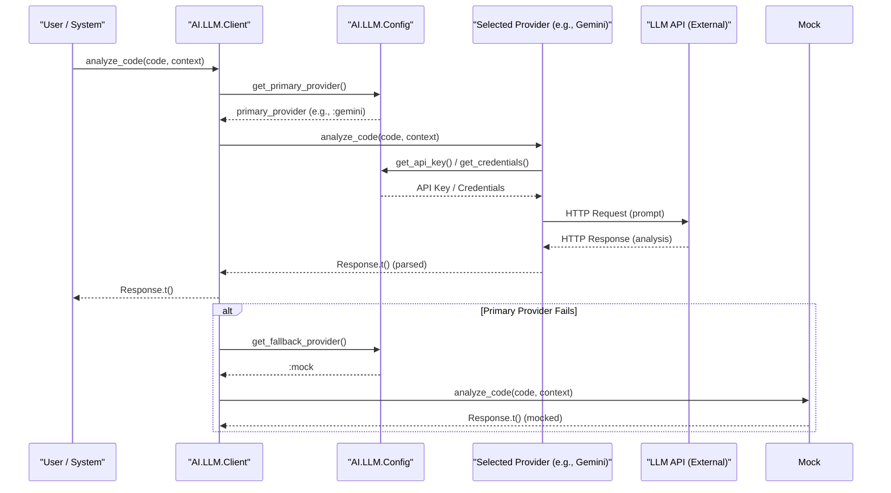

---

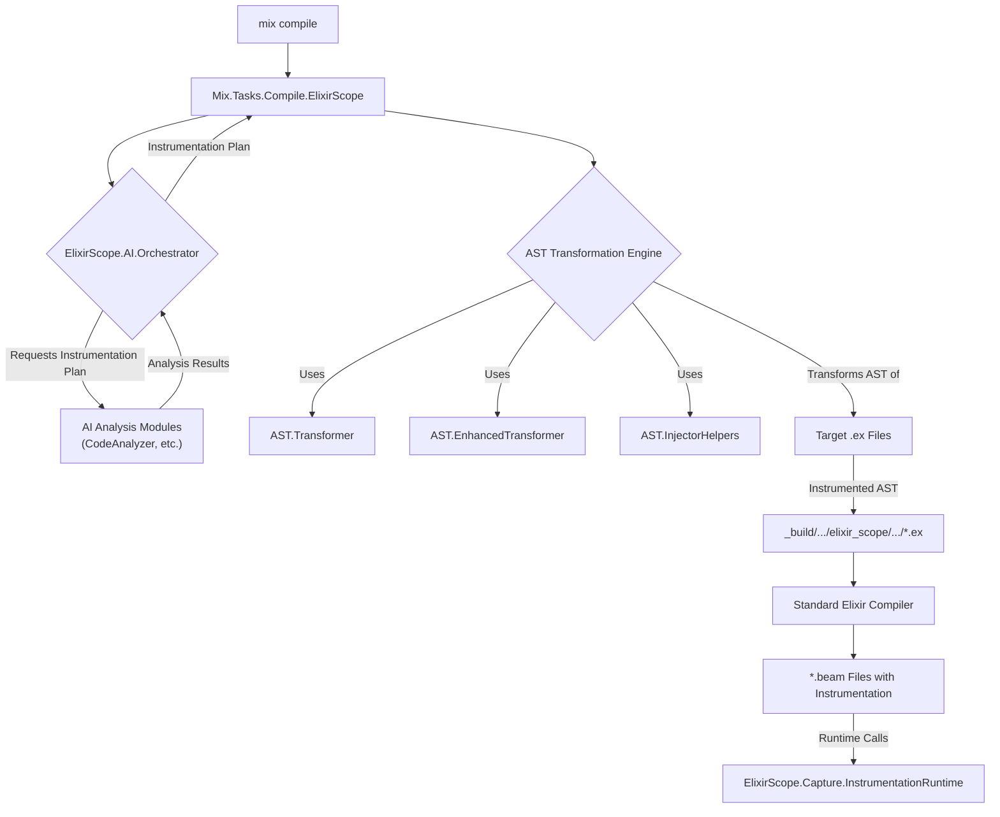

---

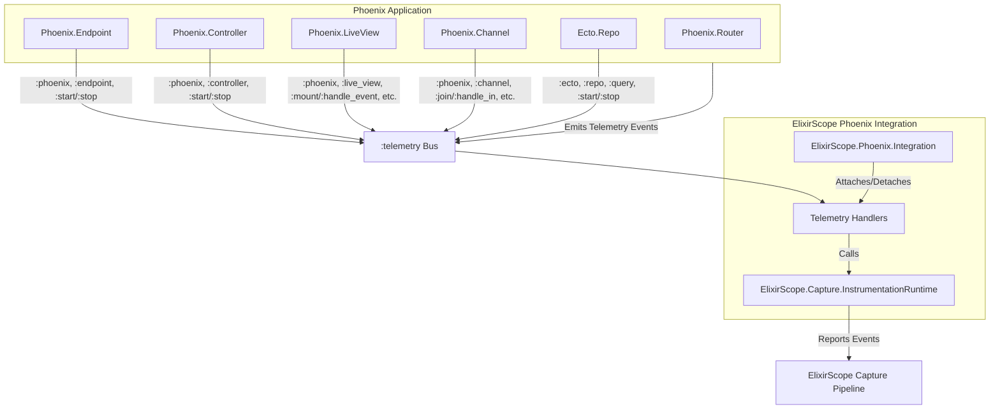

---

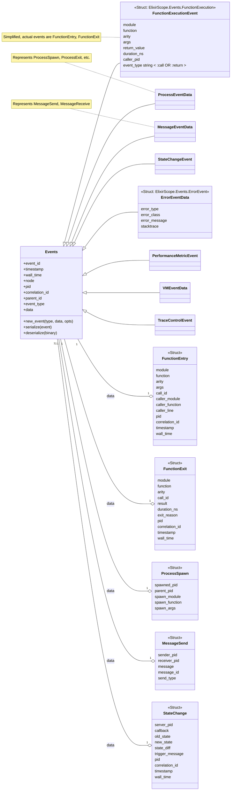

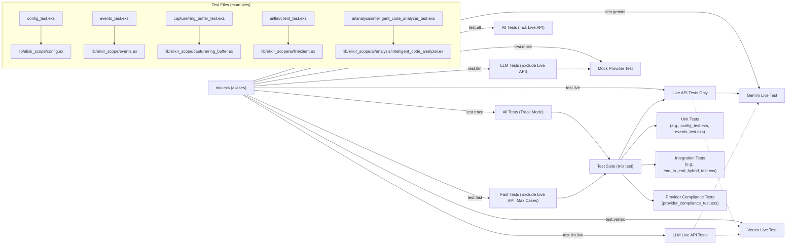

This set of Mermaid documents should provide a good structural overview of your ElixirScope system for various purposes. Remember that these are conceptual diagrams derived from the code; you can refine them further as your system evolves.
