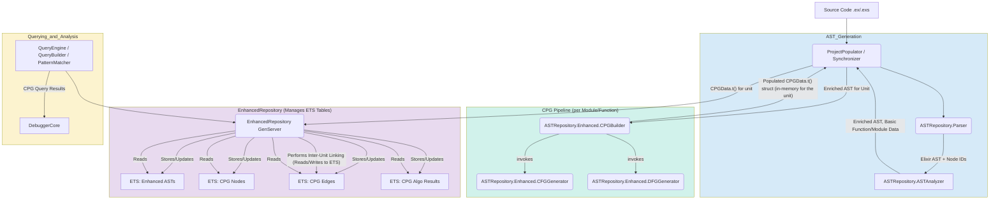

# Revisiting the Architecture with ETS as the CPG "Database"

Let's refine the CPG component architecture focusing on how it integrates with your established ETS patterns:

1.  **`ExCPG.Parser` (Potentially an ElixirScope module like `ElixirScope.ASTRepository.Parser` or an external dep)**
    *   Still responsible for `Source Code -> Standardized Elixir AST (with Node IDs and Source Locations)`.
    *   This part remains crucial.

2.  **`ElixirScope.ASTRepository.Enhanced.CPGBuilder` (and its sub-generators like `CFGGenerator`, `DFGGenerator`)**
    *   **Input:** Takes the Standardized Elixir AST for a module/function.
    *   **Process:**
        *   It will still likely build an **in-memory representation** of the CPG components (AST overlay, CFG, DFG) *for the specific unit it's processing* (e.g., one function). This is for efficiency during generation, as algorithms often need to traverse and reference parts of the graph being built for that unit.
        *   The `CPGData.t()` struct you've designed (`elixir_scope/ast_repository/enhanced/cpg_data.ex`) is the perfect candidate for this in-memory, per-unit representation. It already has fields for `nodes`, `edges`, `source_graphs: %{cfg: cfg, dfg: dfg}`, `unified_analysis`, etc.
    *   **Output:** The populated `CPGData.t()` struct for that unit.

3.  **`ElixirScope.ASTRepository.Enhanced.Repository` (The Core CPG Manager)**
    *   **Input:** Receives the `CPGData.t()` struct for a module/function from `CPGBuilder` (likely invoked by `ProjectPopulator` or `Synchronizer`).
    *   **Persistence (ETS):**
        *   **Primary Storage:** It will take the incoming `CPGData.t()` and decide how to store its contents (nodes, edges, metadata, analysis results) into its managed ETS tables. You already have `@table_name :enhanced_ast_repository`. You might have:
            *   `ets_cpg_nodes`: `{{module_name, function_key, cpg_node_id}, CPGNode.t()}` or similar for global CPG node access.
            *   `ets_cpg_edges`: Storing edges might be trickier. You could store adjacency lists with nodes, or have a separate table: `{{from_cpg_node_id, to_cpg_node_id, edge_label_and_id}, CPGEdge.t()}`. Indexing for traversals is key.
            *   The `unified_analysis` results (centrality, communities, etc.) would also be persisted, perhaps as properties on the relevant nodes or in separate linked ETS tables.
        *   **Serialization:** Before inserting complex structs like `CPGNode.t()` or `CPGEdge.t()` (or the entire `CPGData.t()` if you choose to store it more monolithically per function) into ETS, you'd use `:erlang.term_to_binary/1` and `:erlang.binary_to_term/1` for efficiency and to handle complex terms. Your existing `EnhancedModuleData.to_ets_format/1` shows this pattern.
    *   **Inter-Unit Linking:** After individual CPG units (e.g., per function or module) are stored, a separate process or a deferred task managed by the `Repository` would be responsible for creating inter-procedural edges (e.g., `:CALLS` edges between functions, inter-procedural DFG edges). This involves:
        *   Querying its ETS tables for potential call sites and callee definitions.
        *   Inserting these new inter-unit edges into the ETS tables.
    *   **Partial CPGs & Robustness:**
        *   If `CPGBuilder` fails for a specific function (e.g., due to overly complex code or a bug in a generator), it can return an error or a partially built `CPGData.t()`.
        *   The `Repository` can store this partial data (or a marker indicating "analysis_failed_for_cpg_component_X").
        *   The `ProjectPopulator` or `Synchronizer` (which calls `CPGBuilder` and then `Repository.store_...`) would be responsible for logging this failure and potentially queueing a retry or marking the component for later attention.
        *   **No complex "retry state" needs to be managed by `ExCPGLib` (which is now `CPGBuilder` + generators).** The "state" is simply what's successfully stored in the `EnhancedRepository`'s ETS tables. If something is missing or marked as failed, it needs reprocessing.
    *   **Querying:** The `EnhancedRepository` (and by extension, `QueryBuilder` and `QueryEngine.ASTExtensions`) will query these ETS tables to satisfy CPG-related queries. This will require careful ETS table design and indexing for performant graph traversals.

**Refined Component Interaction with ETS-based CPG:**

**Why this is "Staying the Course" and good:**

1.  **Leverages Existing Strengths:** You're already comfortable with ETS and have built significant parts of ElixirScope around it. This is a huge advantage.
2.  **In-Memory Generation for Speed:** `CPGBuilder` still gets to work on an in-memory `CPGData.t()` for the current unit (function/module), which is efficient for its internal algorithms (CFG gen needs AST, DFG gen needs CFG+AST).
3.  **ETS as the "Database":** The `EnhancedRepository` becomes the steward of the project-wide CPG, persisted across potentially many ETS tables. This *is* your persistence layer for CPG data.
4.  **Transactionality for Storage:** When `EnhancedRepository` stores a `CPGData.t()` unit, it's writing to ETS. While ETS itself doesn't have multi-table transactions, you can structure writes:
    *   Write all nodes for the unit.
    *   Write all intra-unit edges.
    *   If any part fails, you might have partial data for that *unit*, but it's contained. A flag on the module/function entry in `EnhancedRepository` could indicate "CPG_partially_built" or "CPG_build_failed".
5.  **Simplified `CPGBuilder`:** The `CPGBuilder` and its constituent generators (`CFGGenerator`, `DFGGenerator`) do not need to know about ETS or persistence. They take an AST (or partial CPG), enrich it, and return the enriched `CPGData.t()` struct. This keeps them focused and testable.
6.  **`EnhancedRepository` is the State Manager:** It knows what's been processed and stored. If the `ProjectPopulator` wants to re-process a file due to a change, it tells the `Repository`, which can then manage updating/replacing the relevant CPG data in ETS.

**Your File Structure Analysis (`elixir_scope/ast_repository/enhanced/`)**

Your existing structure is already very well-aligned with this:

*   `enhanced/cfg_data.ex`, `cfg_generator.ex`, `cpg_builder.ex`, `cpg_data.ex`, `dfg_data.ex`, `dfg_generator.ex`: These are the core components for building the in-memory `CPGData.t()` for a unit. This is effectively your `ExCPGLib` equivalent, but nicely integrated.
*   `enhanced/repository.ex`: This is your ETS-backed persistence and query layer for these CPGs.
*   `project_populator.ex`, `synchronizer.ex`, `file_watcher.ex`: These are the orchestrators that feed data into `CPGBuilder` and then to the `Repository`.

**Conclusion on DB Layer and Simplicity:**

*   **Yes, you *do* want a "DB layer" in the sense of persistent, queryable storage for the project-wide CPG.** Your existing use of ETS within `EnhancedRepository` *is* serving this purpose.
*   **You don't necessarily need an *external* SQL or dedicated Graph DB if ETS can scale and perform for your query needs.** ETS is very fast for key-based lookups. Graph-like traversals will require careful indexing and potentially more Elixir code in your query layer, but it's entirely feasible. Joern moved to `FlatGraph` for extreme performance on very large CPGs after initially using other graph DBs – this shows that even mature projects evolve their storage.
*   **"No memory at all" is not quite right for the *generation phase* of a CFG/DFG for a single function.** These algorithms benefit from holding the local context (the function's AST/CFG) in memory.
*   **The "Unix-style simplification" comes from:**
    *   `Parser`: text -> AST
    *   `CPGBuilder`: AST (for one unit) -> CPGData struct (for that unit)
    *   `EnhancedRepository`: CPGData struct -> Stores in ETS (persistent graph representation)
    *   `QueryEngine` (via `EnhancedRepository`): Query -> Reads from ETS -> Results

**The "connecting lib" you're spitballing is largely your `ElixirScope.ASTRepository.Enhanced.Repository` backed by ETS tables.** It connects the pure CPG generation logic (`CPGBuilder` et al.) to the persistent CPG and provides the query interface.

**Therefore, "staying the course" with your current ETS-centric approach for the `EnhancedRepository` to store and manage CPG data seems like the most pragmatic, Elixir-idiomatic, and robust path forward.** The key will be:

1.  **Smart ETS Table Design:** How you structure nodes, edges, and their properties in ETS for efficient querying and traversal. This will involve creating various indexes (as hinted in `QueryIndexes.ex`).
2.  **Robust `CPGBuilder`:** Ensure it handles Elixir's features well and can output a clean `CPGData.t()` for each unit.
3.  **Incremental Inter-Unit Linking:** A strategy for `EnhancedRepository` to add edges *between* CPG units after they've been individually processed and stored.

