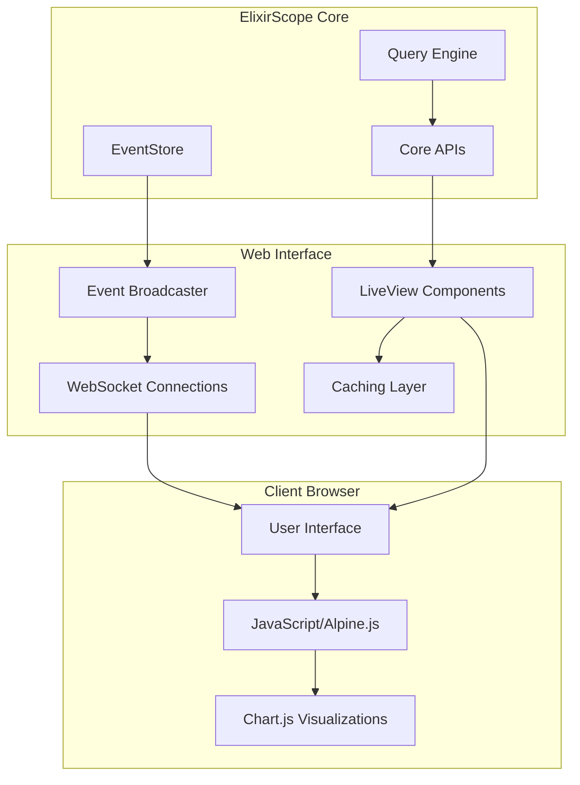

# Phase 2: Web Interface Development - READY TO BEGIN 🚀

**Phase**: 2 of 5  
**Timeline**: 6-8 weeks  
**Status**: 🟡 **READY TO START**  
**Priority**: High  
**Start Date**: May 27, 2025  
**Dependencies**: ✅ Phase 1 Complete (Core APIs functional)

## 🎯 **Phase Overview**

Build a comprehensive Phoenix-based web interface for ElixirScope's Cinema Debugger, providing real-time visualization, time-travel debugging, and interactive analysis capabilities. This phase transforms ElixirScope from a programmatic tool into a full-featured visual debugging platform.

### **Strategic Goals**
1. **Real-Time Debugging Dashboard** - Live event visualization and process monitoring
2. **Time-Travel Interface** - Interactive timeline with state reconstruction
3. **Query Builder** - Visual query construction for event analysis
4. **Performance Monitoring** - Real-time performance metrics and alerts
5. **Developer Experience** - Intuitive UI/UX for debugging workflows

### **Foundation Strengths from Phase 1**
- ✅ **Stable Core APIs** - All 3 core APIs functional (get_events, get_state_at, get_message_flow)
- ✅ **High-Performance Backend** - EventStore delivering 6.2µs storage, Query Engine <100ms
- ✅ **Comprehensive Test Suite** - 759 tests with 27 new tests for Phase 1
- ✅ **Phoenix Telemetry** - Basic telemetry integration already implemented (60%)
- ✅ **Real-Time Infrastructure** - Event streaming and correlation ready

---

## 📋 **Week-by-Week Implementation Plan**

### **Week 1-2: Phoenix Foundation & Real-Time Infrastructure**

#### **Task 2.1: Phoenix Application Setup**
```elixir
# Create: lib/elixir_scope_web/application.ex
defmodule ElixirScopeWeb.Application do
  @moduledoc """
  Phoenix web application for ElixirScope Cinema Debugger.
  Provides real-time debugging interface and visualization.
  """
  
  def start(_type, _args) do
    children = [
      ElixirScopeWeb.Endpoint,
      ElixirScopeWeb.Telemetry,
      {Phoenix.PubSub, name: ElixirScopeWeb.PubSub},
      ElixirScopeWeb.EventBroadcaster
    ]
    
    Supervisor.start_link(children, strategy: :one_for_one)
  end
end
```

**Deliverables:**
- [ ] Phoenix application structure with proper supervision
- [ ] Endpoint configuration with WebSocket support
- [ ] PubSub setup for real-time event broadcasting
- [ ] Basic routing structure for Cinema Debugger
- [ ] Asset pipeline configuration (CSS, JS, LiveView)

#### **Task 2.2: Real-Time Event Broadcasting**
```elixir
# Create: lib/elixir_scope_web/event_broadcaster.ex
defmodule ElixirScopeWeb.EventBroadcaster do
  @moduledoc """
  Broadcasts ElixirScope events to connected web clients.
  Handles event filtering, rate limiting, and client subscriptions.
  """
  
  def start_link(opts) do
    GenServer.start_link(__MODULE__, opts, name: __MODULE__)
  end
  
  def subscribe_to_events(client_id, filters \\ []) do
    # Subscribe client to filtered event stream
  end
  
  def broadcast_event(event) do
    # Broadcast to all subscribed clients with filtering
  end
end
```

**Deliverables:**
- [ ] Event broadcasting GenServer with client management
- [ ] WebSocket connection handling for real-time updates
- [ ] Event filtering and rate limiting for web clients
- [ ] Client subscription management with custom filters
- [ ] Integration with existing EventStore for event streaming

### **Week 3-4: Core LiveView Components**

#### **Task 3.1: Main Dashboard LiveView**
```elixir
# Create: lib/elixir_scope_web/live/dashboard_live.ex
defmodule ElixirScopeWeb.DashboardLive do
  use ElixirScopeWeb, :live_view
  
  def mount(_params, _session, socket) do
    if connected?(socket) do
      ElixirScopeWeb.EventBroadcaster.subscribe_to_events(socket.id)
    end
    
    {:ok, assign(socket, 
      events: [],
      processes: %{},
      performance_metrics: %{},
      timeline_position: :live
    )}
  end
  
  def handle_info({:elixir_scope_event, event}, socket) do
    # Real-time event updates
    {:noreply, update_dashboard_with_event(socket, event)}
  end
end
```

**Features:**
- **Live Event Stream** - Real-time scrolling event list with filtering
- **Process Tree Visualization** - Interactive process hierarchy
- **Performance Metrics** - CPU, memory, message queue lengths
- **Quick Actions** - Start/stop tracing, export data, save sessions

#### **Task 3.2: Time-Travel Debugging Interface**
```elixir
# Create: lib/elixir_scope_web/live/time_travel_live.ex
defmodule ElixirScopeWeb.TimeTravelLive do
  use ElixirScopeWeb, :live_view
  
  def mount(_params, _session, socket) do
    {:ok, assign(socket,
      timeline: build_timeline(),
      current_timestamp: DateTime.utc_now(),
      selected_process: nil,
      state_history: [],
      code_correlation: %{}
    )}
  end
  
  def handle_event("timeline_scrub", %{"timestamp" => ts}, socket) do
    # Handle timeline scrubbing for time-travel
    {:noreply, reconstruct_state_at_timestamp(socket, ts)}
  end
end
```

**Features:**
- **Interactive Timeline** - Scrub through execution history
- **State Reconstruction** - Show process state at any point in time
- **Code Correlation** - Highlight source code corresponding to events
- **State Diff Visualization** - Show state changes over time

**Deliverables:**
- [ ] Dashboard LiveView with real-time event streaming
- [ ] Time-travel interface with timeline scrubbing
- [ ] Process state visualization components
- [ ] Code correlation highlighting
- [ ] Responsive design for various screen sizes

### **Week 5-6: Advanced Visualization & Query Builder**

#### **Task 5.1: Visual Query Builder**
```elixir
# Create: lib/elixir_scope_web/live/query_builder_live.ex
defmodule ElixirScopeWeb.QueryBuilderLive do
  use ElixirScopeWeb, :live_view
  
  def mount(_params, _session, socket) do
    {:ok, assign(socket,
      query_filters: [],
      query_results: [],
      saved_queries: load_saved_queries(),
      query_performance: %{}
    )}
  end
  
  def handle_event("add_filter", filter_params, socket) do
    # Add filter to visual query builder
    {:noreply, add_query_filter(socket, filter_params)}
  end
  
  def handle_event("execute_query", _params, socket) do
    # Execute built query and show results
    {:noreply, execute_visual_query(socket)}
  end
end
```

**Features:**
- **Drag-and-Drop Query Building** - Visual filter construction
- **Query Templates** - Pre-built queries for common debugging scenarios
- **Real-Time Query Validation** - Show query syntax and performance estimates
- **Result Visualization** - Charts, graphs, and tables for query results
- **Query Sharing** - Save and share queries with team members

#### **Task 5.2: Advanced Visualization Components**
```elixir
# Create: lib/elixir_scope_web/components/visualization.ex
defmodule ElixirScopeWeb.Components.Visualization do
  use Phoenix.Component
  
  def process_tree(assigns) do
    # Interactive process tree with supervision hierarchy
  end
  
  def message_flow_diagram(assigns) do
    # Message flow visualization between processes
  end
  
  def performance_chart(assigns) do
    # Real-time performance metrics charts
  end
  
  def event_timeline(assigns) do
    # Interactive event timeline with zoom/pan
  end
end
```

**Deliverables:**
- [ ] Visual query builder with drag-and-drop interface
- [ ] Advanced visualization components (process trees, message flows)
- [ ] Performance monitoring charts and alerts
- [ ] Export capabilities (PDF, CSV, JSON)
- [ ] Query template library with common debugging patterns

### **Week 7-8: Integration, Polish & Performance**

#### **Task 7.1: Deep ElixirScope Integration**
```elixir
# Create: lib/elixir_scope_web/integration/core_bridge.ex
defmodule ElixirScopeWeb.Integration.CoreBridge do
  @moduledoc """
  Bridge between ElixirScope core and web interface.
  Handles configuration, session management, and data flow.
  """
  
  def start_debugging_session(config) do
    # Start ElixirScope with web-optimized configuration
    with {:ok, _pid} <- ElixirScope.start(config),
         :ok <- configure_web_broadcasting() do
      {:ok, create_session_id()}
    end
  end
  
  def configure_for_web_interface() do
    # Optimize ElixirScope configuration for web usage
    ElixirScope.update_config([:capture, :buffer_size], 50_000)
    ElixirScope.update_config([:ai, :planning, :sampling_rate], 0.3)
  end
end
```

#### **Task 7.2: Performance Optimization & Caching**
```elixir
# Create: lib/elixir_scope_web/cache/dashboard_cache.ex
defmodule ElixirScopeWeb.Cache.DashboardCache do
  @moduledoc """
  Caching layer for web interface to reduce load on core APIs.
  Implements intelligent caching with TTL and invalidation.
  """
  
  def cache_dashboard_data(session_id, data) do
    # Cache dashboard data with appropriate TTL
  end
  
  def invalidate_on_new_events(event_types) do
    # Intelligent cache invalidation based on event types
  end
end
```

**Deliverables:**
- [ ] Seamless integration with ElixirScope core APIs
- [ ] Performance optimization for web interface
- [ ] Caching layer for dashboard data
- [ ] Session management and persistence
- [ ] Comprehensive error handling and user feedback

---

## 🎨 **User Interface Design**

### **Design Principles**
1. **Real-Time First** - All data updates in real-time without page refreshes
2. **Developer-Focused** - Optimized for debugging workflows and developer productivity
3. **Information Dense** - Maximum useful information with minimal clutter
4. **Responsive Design** - Works on desktop, tablet, and mobile devices
5. **Accessibility** - WCAG 2.1 AA compliance for inclusive design

### **Color Scheme & Theming**
```css
/* CSS Variables for theming */
:root {
  --primary-color: #6366f1;      /* Indigo for primary actions */
  --secondary-color: #8b5cf6;    /* Purple for secondary elements */
  --success-color: #10b981;      /* Green for success states */
  --warning-color: #f59e0b;      /* Amber for warnings */
  --error-color: #ef4444;        /* Red for errors */
  --background-dark: #1f2937;    /* Dark background */
  --background-light: #f9fafb;   /* Light background */
  --text-primary: #111827;       /* Primary text */
  --text-secondary: #6b7280;     /* Secondary text */
}
```

### **Layout Structure**
```html
<!-- Main dashboard layout -->
<div class="elixir-scope-dashboard">
  <header class="dashboard-header">
    <!-- Status, controls, session info -->
  </header>
  
  <aside class="sidebar">
    <!-- Navigation, filters, saved queries -->
  </aside>
  
  <main class="main-content">
    <!-- Primary visualization area -->
    <div class="event-stream"><!-- Live events --></div>
    <div class="process-tree"><!-- Process hierarchy --></div>
    <div class="timeline"><!-- Time-travel interface --></div>
  </main>
  
  <aside class="details-panel">
    <!-- Selected event/process details -->
  </aside>
</div>
```

---

## 🧪 **Testing Strategy**

### **LiveView Testing**
```elixir
# test/elixir_scope_web/live/dashboard_live_test.exs
defmodule ElixirScopeWeb.DashboardLiveTest do
  use ElixirScopeWeb.ConnCase, async: true
  import Phoenix.LiveViewTest
  
  test "dashboard loads and displays real-time events", %{conn: conn} do
    {:ok, view, html} = live(conn, "/dashboard")
    
    # Test initial load
    assert html =~ "ElixirScope Dashboard"
    assert html =~ "Event Stream"
    
    # Test real-time event updates
    event = create_test_event()
    ElixirScopeWeb.EventBroadcaster.broadcast_event(event)
    
    assert render(view) =~ event.function_name
  end
  
  test "time-travel interface reconstructs state correctly", %{conn: conn} do
    {:ok, view, _html} = live(conn, "/time-travel")
    
    # Test timeline scrubbing
    timestamp = DateTime.utc_now() |> DateTime.add(-60, :second)
    view |> element("#timeline-scrubber") |> render_hook("timeline_scrub", %{timestamp: timestamp})
    
    # Verify state reconstruction
    assert render(view) =~ "State at #{timestamp}"
  end
end
```

### **Integration Testing**
```elixir
# test/elixir_scope_web/integration/web_core_integration_test.exs
defmodule ElixirScopeWeb.Integration.WebCoreIntegrationTest do
  use ElixirScopeWeb.ConnCase, async: false
  
  test "web interface integrates seamlessly with ElixirScope core" do
    # Start ElixirScope with web configuration
    {:ok, _pid} = ElixirScope.start(strategy: :web_optimized)
    
    # Generate some events
    events = generate_test_events(100)
    
    # Verify web interface receives events
    {:ok, view, _html} = live(build_conn(), "/dashboard")
    
    Enum.each(events, fn event ->
      assert render(view) =~ event.function_name
    end)
  end
end
```

### **Performance Testing**
```elixir
# test/elixir_scope_web/performance/web_performance_test.exs
defmodule ElixirScopeWeb.Performance.WebPerformanceTest do
  use ElixirScopeWeb.ConnCase, async: false
  
  test "dashboard handles high event volume without performance degradation" do
    {:ok, view, _html} = live(build_conn(), "/dashboard")
    
    # Generate high volume of events
    start_time = System.monotonic_time(:millisecond)
    
    1..1000
    |> Enum.each(fn _i ->
      event = create_test_event()
      ElixirScopeWeb.EventBroadcaster.broadcast_event(event)
    end)
    
    end_time = System.monotonic_time(:millisecond)
    total_time = end_time - start_time
    
    # Verify performance targets
    assert total_time < 5000  # Less than 5 seconds for 1000 events
    assert render(view) =~ "1000 events"  # All events processed
  end
end
```

---

## 📊 **Success Criteria & Validation**

### **Functional Requirements**
- [ ] **Real-Time Dashboard** - Live event streaming with <100ms latency
- [ ] **Time-Travel Interface** - Interactive timeline with state reconstruction
- [ ] **Visual Query Builder** - Drag-and-drop query construction
- [ ] **Process Visualization** - Interactive process trees and message flows
- [ ] **Performance Monitoring** - Real-time metrics and alerts
- [ ] **Export Capabilities** - PDF, CSV, JSON export of debugging sessions
- [ ] **Session Management** - Save/load debugging sessions
- [ ] **Responsive Design** - Works on desktop, tablet, mobile

### **Performance Requirements**
- [ ] **Page Load Time** - Initial dashboard load <2 seconds
- [ ] **Real-Time Updates** - Event updates with <100ms latency
- [ ] **Query Performance** - Visual queries execute <500ms
- [ ] **Memory Usage** - Web interface <100MB memory footprint
- [ ] **Concurrent Users** - Support 10+ concurrent debugging sessions
- [ ] **Event Throughput** - Handle 1000+ events/second without lag

### **User Experience Requirements**
- [ ] **Intuitive Navigation** - Clear information architecture
- [ ] **Responsive Interactions** - All UI interactions <200ms response
- [ ] **Error Handling** - Graceful error states with helpful messages
- [ ] **Accessibility** - WCAG 2.1 AA compliance
- [ ] **Browser Support** - Modern browsers (Chrome, Firefox, Safari, Edge)
- [ ] **Mobile Friendly** - Usable on tablet and mobile devices

---

## 🔧 **Technical Architecture**

### **Frontend Technology Stack**
```elixir
# Phoenix LiveView for real-time interfaces
# Alpine.js for client-side interactions
# TailwindCSS for styling
# Chart.js for data visualization
# WebSockets for real-time communication
```

### **Component Architecture**
```
ElixirScopeWeb/
├── live/
│   ├── dashboard_live.ex          # Main dashboard
│   ├── time_travel_live.ex        # Time-travel interface
│   ├── query_builder_live.ex      # Visual query builder
│   └── process_detail_live.ex     # Process detail view
├── components/
│   ├── visualization.ex           # Chart and graph components
│   ├── event_stream.ex            # Event list components
│   ├── process_tree.ex            # Process hierarchy
│   └── timeline.ex                # Timeline components
├── integration/
│   ├── core_bridge.ex             # ElixirScope core integration
│   ├── event_broadcaster.ex       # Real-time event broadcasting
│   └── session_manager.ex         # Session management
└── cache/
    ├── dashboard_cache.ex          # Dashboard data caching
    └── query_cache.ex              # Query result caching
```

### **Data Flow Architecture**


---

## 🚀 **Implementation Roadmap**

### **Week 1-2 Milestones**
- [ ] **Phoenix Application Setup** - Complete web application foundation
- [ ] **Real-Time Infrastructure** - Event broadcasting and WebSocket handling
- [ ] **Basic Dashboard** - Simple event list with real-time updates
- [ ] **Integration Testing** - Core API integration validation

### **Week 3-4 Milestones**
- [ ] **Dashboard LiveView** - Full-featured real-time dashboard
- [ ] **Time-Travel Interface** - Interactive timeline with state reconstruction
- [ ] **Process Visualization** - Process tree and hierarchy display
- [ ] **Performance Optimization** - Caching and performance tuning

### **Week 5-6 Milestones**
- [ ] **Visual Query Builder** - Drag-and-drop query construction
- [ ] **Advanced Visualizations** - Charts, graphs, and interactive components
- [ ] **Export Capabilities** - PDF, CSV, JSON export functionality
- [ ] **Mobile Responsiveness** - Tablet and mobile device support

### **Week 7-8 Milestones**
- [ ] **Polish & UX** - Final UI/UX improvements and accessibility
- [ ] **Performance Validation** - Load testing and optimization
- [ ] **Documentation** - User guides and API documentation
- [ ] **Phase 2 Completion** - Full web interface ready for production

---

## 🔄 **Integration with Phase 1 Achievements**

### **Leveraging Phase 1 Infrastructure**
- **EventStore Integration** - Web interface uses high-performance EventStore (6.2µs storage)
- **Query Engine** - Visual queries leverage optimized Query Engine (<100ms)
- **Core APIs** - All three core APIs (get_events, get_state_at, get_message_flow) fully functional
- **Test Foundation** - Build upon 759 existing tests with 27 new Phase 1 tests

### **Performance Continuity**
- **Backend Performance** - Maintain Phase 1 performance achievements
- **Frontend Performance** - Add web interface without degrading core performance
- **Memory Efficiency** - Efficient caching to minimize memory overhead
- **Real-Time Capability** - Leverage existing event streaming infrastructure

---

## 🎯 **Phase 2 Success Definition**

Upon completion of Phase 2, ElixirScope will have:

1. **Complete Web Interface** - Full-featured Phoenix-based debugging interface
2. **Real-Time Capabilities** - Live event streaming and visualization
3. **Time-Travel Debugging** - Interactive timeline with state reconstruction
4. **Visual Query Tools** - Drag-and-drop query builder with templates
5. **Production Ready** - Performance optimized and thoroughly tested
6. **Developer Experience** - Intuitive UI/UX for debugging workflows

**Confidence Level**: HIGH - Building on solid Phase 1 foundation  
**Risk Level**: MEDIUM - Web interface complexity and performance requirements  
**Next Phase**: Phase 3 (AI-Powered Analysis Enhancement)

---

**Phase 2 Start Date**: May 28, 2025  
**Expected Completion**: July 9-23, 2025  
**Phase Lead**: ElixirScope Web Team  
**Status**: �� **READY TO BEGIN** 