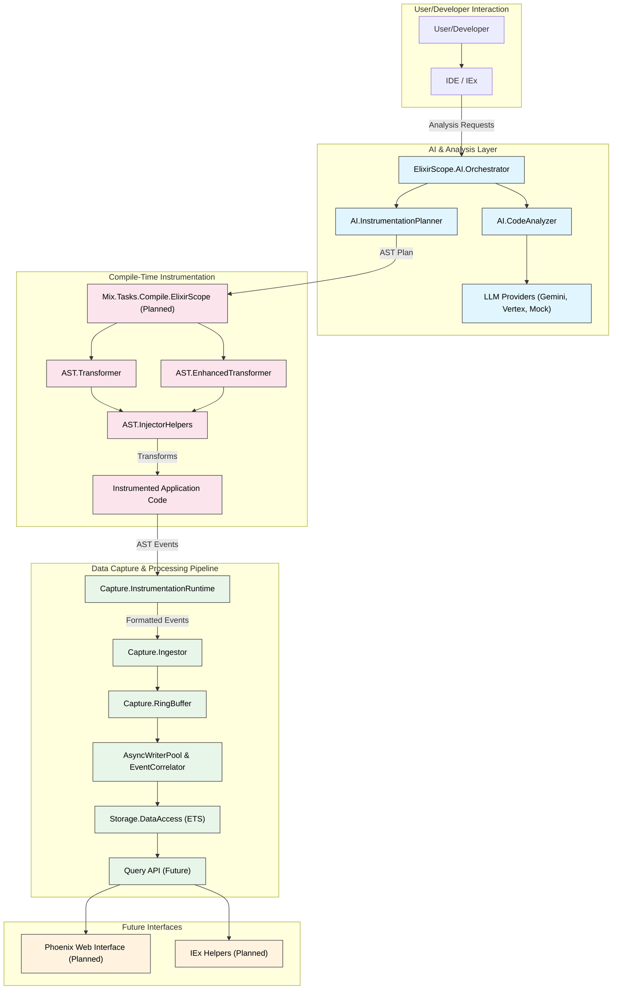

# ElixirScope: The Execution Cinema Debugger for Elixir

<!--[](https://github.com/your-repo/elixir_scope/actions/workflows/ci.yml) -->
<!--[](https://hex.pm/packages/elixir_scope) -->
<!--[](https://github.com/your-repo/elixir_scope/blob/main/LICENSE) -->

**ElixirScope is a next-generation debugging and observability platform for Elixir applications, designed to provide an "Execution Cinema" experience through deep, compile-time AST instrumentation guided by AI-powered analysis.**

Our vision is to revolutionize how developers understand, debug, and optimize complex concurrent and distributed Elixir systems by offering:

-   **Total Behavioral Recall**: Capture comprehensive execution history through compile-time instrumentation.
-   **AI-Driven Guidance**: Intelligent instrumentation planning and code analysis.
-   **Compile-Time Granularity**: Access local variables, trace expressions, and inject custom logic with precision.
-   **Time-Travel Debugging**: Navigate through your application's execution history.
-   **Multi-Dimensional Analysis**: Correlate events across time, processes, state, and performance.

---

## 🚀 Current Status & Focus

ElixirScope has evolved into a focused, compile-time AST instrumentation platform! We have successfully:

1.  **Built a Production-Ready Data Capture Foundation**: High-performance event ingestion, correlation, and storage system with comprehensive test coverage.
2.  **Developed Advanced AST Instrumentation**: Deep compile-time code transformation capabilities for granular debugging and monitoring.
3.  **Integrated AI-Powered Analysis**: Multiple LLM provider support (Gemini, Vertex AI) for intelligent code analysis and instrumentation planning.
4.  **Simplified Architecture**: Removed complex unified/runtime tracing system in favor of a focused, compile-time approach.

This focused approach means ElixirScope offers:
-   **Compile-Time AST Instrumentation** as the primary mechanism for deep debugging and observability.
-   **AI-Guided Analysis** for intelligent instrumentation planning and code insights.
-   **Production-Safe Configuration** with configurable instrumentation levels and performance considerations.

---

## 🏗️ Focused Architecture: Compile-Time Excellence

ElixirScope's streamlined architecture centers around compile-time AST transformation, supported by AI analysis and a robust data pipeline.

### Key Architectural Principles:

*   **Compile-Time First**: Primary focus on AST transformation for deep, granular instrumentation.
*   **AI-Guided Intelligence**: AI-driven code analysis and instrumentation planning for optimal debugging strategies.
*   **High-Performance Pipeline**: Events from AST-injected calls flow through a high-performance `Ingestor` -> `RingBuffer` -> `AsyncWriterPool` -> `EventCorrelator` -> `DataAccess` pipeline.
*   **Production-Safe**: Configurable instrumentation levels with performance impact awareness.
*   **Comprehensive Querying**: Rich data access layer for complex trace analysis and correlation.

### Architectural Diagram



---

## 🚀 Getting Started (Current Capabilities)

### Installation

1.  **Dependency**: Add `elixir_scope` to your `mix.exs`:
    ```elixir
    def deps do
      [
        {:elixir_scope, "~> 0.1.0"}
      ]
    end
    ```

2.  **Application Start**: Add `ElixirScope` to your application's supervision tree:
    ```elixir
    # In your application.ex
    children = [
      # ... other children
      {ElixirScope, []}
    ]
    ```

3.  **Configuration (`config/config.exs`)**:
    ```elixir
    config :elixir_scope,
      # Core settings
      capture: [
        buffer_size: 10_000,
        batch_size: 100,
        flush_interval: 1_000
      ],
      
      # AI Analysis settings
      ai: [
        llm_provider: :mock, # :gemini, :vertex, :mock
        analysis_timeout: 30_000,
        planning: [
          default_strategy: :balanced
        ]
      ],
      
      # AST Instrumentation settings
      ast: [
        default_instrumentation_level: :function_boundaries, # :expressions, :locals
        performance_monitoring: true,
        variable_capture: false
      ]
    ```

### Basic Usage (Current API)

```elixir
# Direct AST transformation (current capability)
plan = %{
  capture_locals: [:important_var, :result],
  trace_expressions: [:complex_calculation],
  custom_injections: [
    {10, :after, quote do: IO.puts("Checkpoint reached") end}
  ]
}

# Transform AST with enhanced instrumentation
transformed_ast = ElixirScope.AST.EnhancedTransformer.transform_with_enhanced_instrumentation(
  original_ast, 
  plan
)

# AI-powered code analysis
{:ok, analysis} = ElixirScope.AI.CodeAnalyzer.analyze_module(MyModule)
complexity = ElixirScope.AI.ComplexityAnalyzer.calculate_complexity(ast)

# Query captured data
events = ElixirScope.Storage.DataAccess.get_events_for_module(MyModule)
correlations = ElixirScope.Storage.DataAccess.get_correlated_events(correlation_id)
```

---

## 🧪 Testing ElixirScope

ElixirScope employs a comprehensive testing strategy with 35 modules and 30 test files, achieving ~85% overall test coverage.

### Key Test Commands

*   `mix test.trace`: Runs the main test suite with detailed output (excludes live API calls) - **Recommended**
*   `mix test.fast`: Runs a fast, parallelized version of the main test suite
*   `mix test.mock`: Tests only the mock LLM provider (very fast, no API calls)
*   `mix test.gemini`: Runs Gemini LLM provider live API tests (requires `GOOGLE_API_KEY`)
*   `mix test.vertex`: Runs Vertex AI LLM provider live API tests (requires `VERTEX_JSON_FILE`)
*   `mix test.llm`: Runs all LLM component tests *excluding* live API calls
*   `mix test.llm.live`: Runs all LLM component tests *including* live API calls
*   `mix test.live`: Runs *only* live API tests for all configured providers
*   `mix test.all`: Runs *all* tests, including all live API tests

### Running Live API Tests

To run tests that make actual calls to LLM APIs:

1.  **Set up Credentials:**
    *   **Vertex AI:** Export `VERTEX_JSON_FILE="/path/to/your/service-account.json"`
    *   **Gemini API:** Export `GOOGLE_API_KEY="your-gemini-api-key"`
2.  **Run Specific Live Tests:**
    *   `mix test.gemini`
    *   `mix test.vertex`
    *   `mix test.live` (for all configured live providers)

---

## 🗺️ Roadmap

With the core compile-time instrumentation foundation complete, our roadmap includes:

1.  **Phase 1 (Core Integration - High Priority):**
    *   Implement `Mix.Tasks.Compile.ElixirScope` for automatic AST transformation
    *   Create user-friendly API for instrumentation control
    *   Enhance AI orchestration for compile-time focus
    *   Develop IEx helpers for common debugging operations

2.  **Phase 2 (User Experience - Medium Priority):**
    *   Develop the "Execution Cinema" Phoenix web interface
    *   Comprehensive documentation and getting started guides
    *   Performance impact characterization and optimization
    *   Real-time event streaming and visualization

3.  **Phase 3 (Advanced Features - Lower Priority):**
    *   Distributed tracing and multi-node correlation
    *   Advanced AI analysis (anomaly detection, optimization suggestions)
    *   ElixirLS integration for IDE support
    *   Production deployment patterns and best practices

---

## 📊 Current Status

### ✅ Production-Ready Components
- **Core Infrastructure**: Configuration, Events, Utils (100% test coverage)
- **Data Pipeline**: High-performance capture, processing, storage (90% test coverage)
- **AI Integration**: Gemini, Vertex AI, Mock providers (90% test coverage)
- **AST Transformation**: Core and enhanced instrumentation (90% test coverage)

### 🚧 In Development
- **Enhanced AST Features**: Advanced variable capture and expression tracing
- **AI Analysis**: Code complexity analysis and pattern recognition
- **Compile-Time Orchestration**: Intelligent instrumentation planning

### 📋 Planned
- **Mix Task Integration**: Automatic compile-time instrumentation
- **Phoenix Web Interface**: Visual debugging and trace exploration
- **Distributed Coordination**: Multi-node tracing capabilities

---

## 🤝 Contributing

We welcome contributions! Please see our `CONTRIBUTING.md` (to be created) for guidelines.

1.  Fork the repository
2.  Create a feature branch (`git checkout -b feature/YourFeature`)
3.  Add tests for new functionality
4.  Ensure all tests pass (`mix test.trace`)
5.  Commit your changes (`git commit -am 'Add some feature'`)
6.  Push to the branch (`git push origin feature/YourFeature`)
7.  Create a new Pull Request

---

## 📄 License

ElixirScope is released under the MIT License. See the `LICENSE` file for details.
