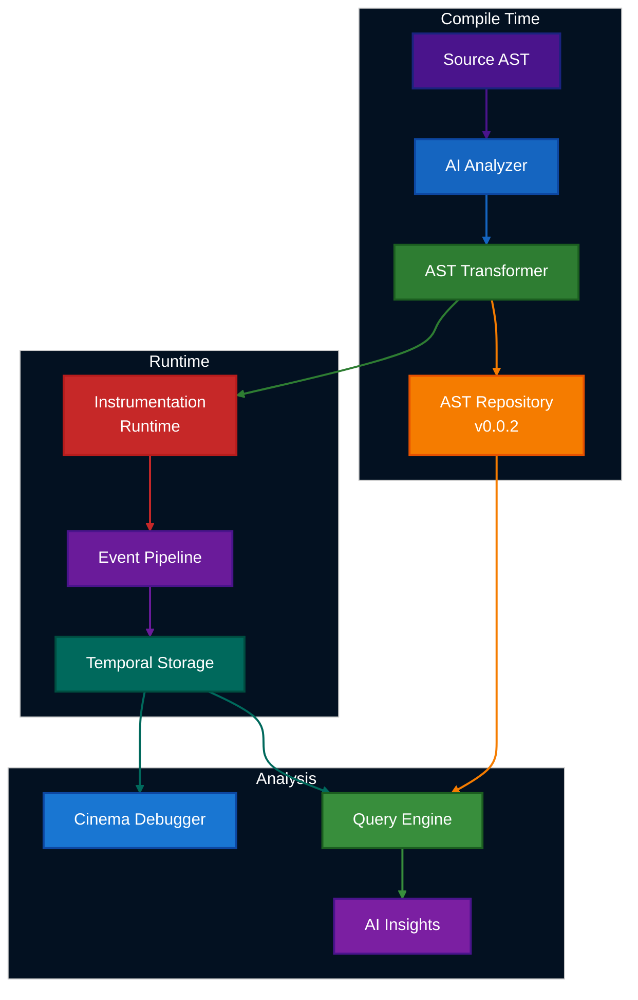

# ElixirScope

[](https://hex.pm/packages/elixir_scope)
[](https://github.com/nshkrdotcom/ElixirScope/actions)
[](https://coveralls.io/github/nshkrdotcom/ElixirScope?branch=main)
[](https://opensource.org/licenses/MIT)

**Revolutionary AST-based debugging and code intelligence platform for Elixir applications**

ElixirScope transforms debugging from a line-by-line process into a cinematic experience by combining compile-time AST instrumentation with runtime event correlation, all guided by AI-powered analysis.

## 🚀 Current Status

- **Latest Release**: v0.0.1 (May 2025) - [Hex.pm](https://hex.pm/packages/elixir_scope)
- **Development**: v0.0.2 - Revolutionary AST Repository (Active)
- **Demo**: Fully functional Cinema Demo showcasing core capabilities

## 📦 Installation

```elixir
def deps do
  [
    {:elixir_scope, "~> 0.0.1"}
  ]
end
```

For development version (v0.0.2):
```elixir
def deps do
  [
    {:elixir_scope, github: "nshkrdotcom/ElixirScope", branch: "main"}
  ]
end
```

## 🎯 Key Features

### Available Now (v0.0.1)
- **⚡ High-Performance Event Capture** - <100µs overhead with correlation IDs
- **🎬 Cinema Debugger** - Time-travel debugging with state reconstruction
- **🤖 AI-Powered Analysis** - Multi-provider LLM support (Gemini, Vertex AI)
- **🔍 AST Instrumentation** - Compile-time code transformation
- **📊 Performance Monitoring** - Real-time metrics and bottleneck detection
- **🔄 State Reconstruction** - Replay application state at any point in time

### Coming in v0.0.2 (May 2025)
- **🌳 Revolutionary AST Repository** - Persistent, queryable AST storage
- **📈 Code Property Graphs** - Unified AST + Control Flow + Data Flow
- **🔗 Deep Runtime Correlation** - Link events to precise AST sub-trees
- **🎯 Semantic Code Search** - Find similar code patterns using AI
- **🚨 Predictive Debugging** - ML-based error and performance prediction

## 🏗️ Architecture



## 🎬 Try the Cinema Demo

Experience ElixirScope's capabilities with our comprehensive demo:

```bash
git clone https://github.com/nshkrdotcom/ElixirScope.git
cd ElixirScope/test_apps/cinema_demo
./run_showcase.sh
```

The demo showcases:
- GenServer state tracking and lifecycle debugging
- Complex data transformation pipeline analysis
- Time-travel debugging with state reconstruction
- Performance bottleneck identification
- Error correlation and root cause analysis
- Deep call stack visualization

## 🚦 Quick Start

### Basic Setup

```elixir
# In your application supervisor
children = [
  # Your other children...
  {ElixirScope, name: :elixir_scope}
]

Supervisor.start_link(children, strategy: :one_for_one)
```

### Configuration

```elixir
# config/dev.exs
config :elixir_scope,
  strategy: :balanced,      # :minimal | :balanced | :full_trace
  sampling_rate: 1.0,       # 0.0 to 1.0
  storage: [
    ring_buffer_size: 100_000,
    retention_minutes: 30
  ]

# config/prod.exs  
config :elixir_scope,
  strategy: :minimal,
  sampling_rate: 0.1,      # 10% sampling in production
  storage: [
    ring_buffer_size: 10_000,
    retention_minutes: 5
  ]
```

### Time-Travel Debugging

```elixir
# Start a debugging session
{:ok, bridge} = ElixirScope.Capture.TemporalBridge.start_link()

# Your application runs...

# Later, reconstruct state at any point
{:ok, past_state} = ElixirScope.Capture.TemporalBridge.reconstruct_state_at(
  bridge,
  ~U[2025-05-27 10:30:00Z]
)

# Analyze what happened
{:ok, events} = ElixirScope.Query.events_between(
  ~U[2025-05-27 10:29:00Z],
  ~U[2025-05-27 10:31:00Z]
)
```

### AI-Powered Analysis

```elixir
# Analyze your codebase
{:ok, insights} = ElixirScope.analyze_codebase()

# Get recommendations for specific modules
{:ok, recommendations} = ElixirScope.AI.recommend_instrumentation([MyApp.Worker])

# Find potential performance issues
{:ok, hotspots} = ElixirScope.AI.detect_performance_patterns()
```

## 📊 Performance Impact

ElixirScope is designed for production use with minimal overhead:

| Metric | Value | Notes |
|--------|-------|-------|
| Event Capture Overhead | <100µs | Per instrumented function |
| Memory Overhead | ~50MB | For typical applications |
| Event Throughput | >100k/sec | Lock-free ring buffer |
| Query Response | <100ms | For 1000 events |
| AST Analysis | <100ms | Per module |

## 🔧 Development

### Running Tests

```bash
# Run all tests (excludes live LLM tests)
mix test

# Run with live LLM tests (requires API keys)
mix test.all

# Run specific test suites
mix test.fast        # Quick unit tests
mix test.performance # Performance benchmarks
```

### LLM Provider Setup

```bash
# For Gemini
export GOOGLE_API_KEY="your-api-key"

# For Vertex AI
export VERTEX_JSON_FILE="/path/to/service-account.json"
```

### Contributing

We welcome contributions! See our [Contributing Guide](CONTRIBUTING.md) for details.

Current focus areas:
- 🌐 Phoenix web interface for Cinema Debugger
- 🎨 Visual debugging tools and timeline UI
- 🔍 Enhanced AST analysis patterns
- 📚 Documentation and tutorials
- 🧪 Property-based and chaos testing

## 📈 Roadmap

### v0.0.2 (In Progress - May 2025)
- [x] Enhanced AST repository design
- [ ] Persistent AST storage with ETS
- [ ] Code Property Graph generation
- [ ] Cross-module analysis
- [ ] AST-runtime correlation enhancement

### v0.1.0 (June 2025)
- [ ] Phoenix web interface
- [ ] Visual time-travel debugger
- [ ] Real-time event streaming
- [ ] Interactive execution timeline

### v0.2.0 (July 2025)
- [ ] Distributed tracing support
- [ ] Advanced AI predictions
- [ ] IDE integration (ElixirLS)
- [ ] Production deployment patterns

### v1.0.0 (Q3 2025)
- [ ] Stable API guarantee
- [ ] Performance optimization tools
- [ ] Enterprise features
- [ ] Comprehensive documentation

## 🎓 Resources

- [Documentation](https://hexdocs.pm/elixir_scope) (Coming Soon)
- [Cinema Demo Guide](test_apps/cinema_demo/README.md)
- [Architecture Diagrams](docs/ARCHITECTURE_DIAGRAMS.md)
- [API Reference](docs/API.md)

## 💬 Community

- **GitHub Discussions**: [Questions & Ideas](https://github.com/nshkrdotcom/ElixirScope/discussions)
- **Elixir Forum**: Tag posts with `elixir-scope`
- **X**: [@elixirscope](https://x.com/micbyrd)

## 📊 Comparison with Other Tools

| Feature | ElixirScope | Recon | Observer | Otter |
|---------|------------|-------|----------|-------|
| AST-based instrumentation | ✅ | ❌ | ❌ | ❌ |
| Time-travel debugging | ✅ | ❌ | ❌ | ❌ |
| AI-powered analysis | ✅ | ❌ | ❌ | ❌ |
| Production overhead | <100µs | <50µs | UI only | <200µs |
| State reconstruction | ✅ | ❌ | ❌ | ❌ |
| Compile-time integration | ✅ | ❌ | ❌ | ❌ |

## 🙏 Acknowledgments

ElixirScope builds upon the excellent Elixir ecosystem:
- The Elixir core team for an introspectable language
- The Phoenix team for LiveView inspiration
- The Erlang/OTP team for a robust foundation
- The Elixir community for continuous support

## 📄 License

Copyright (c) 2025 ElixirScope Contributors

Licensed under the MIT License. See [LICENSE](LICENSE) for details.

---

<div align="center">
  <strong>ElixirScope</strong><br>
  <em>See your code run. Understand how it works. Debug with confidence.</em><br>
  <br>
  <a href="https://hex.pm/packages/elixir_scope">Hex</a> •
  <a href="https://github.com/nshkrdotcom/ElixirScope">GitHub</a> •
  <a href="https://hexdocs.pm/elixir_scope">Docs</a>
</div>
