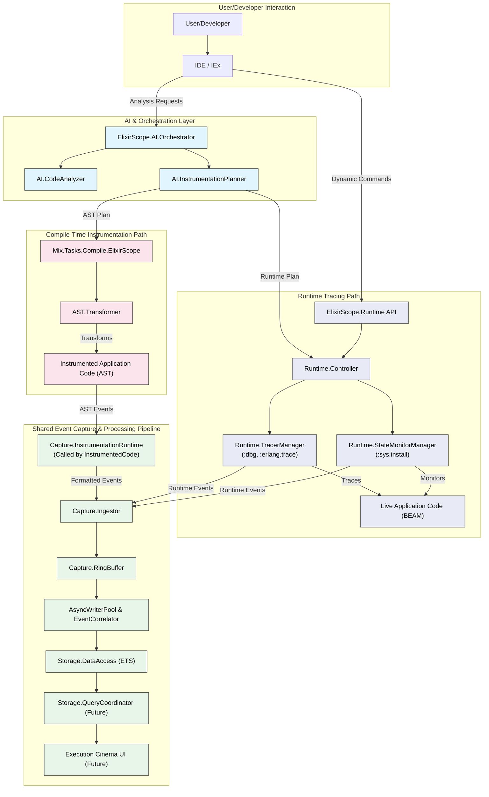
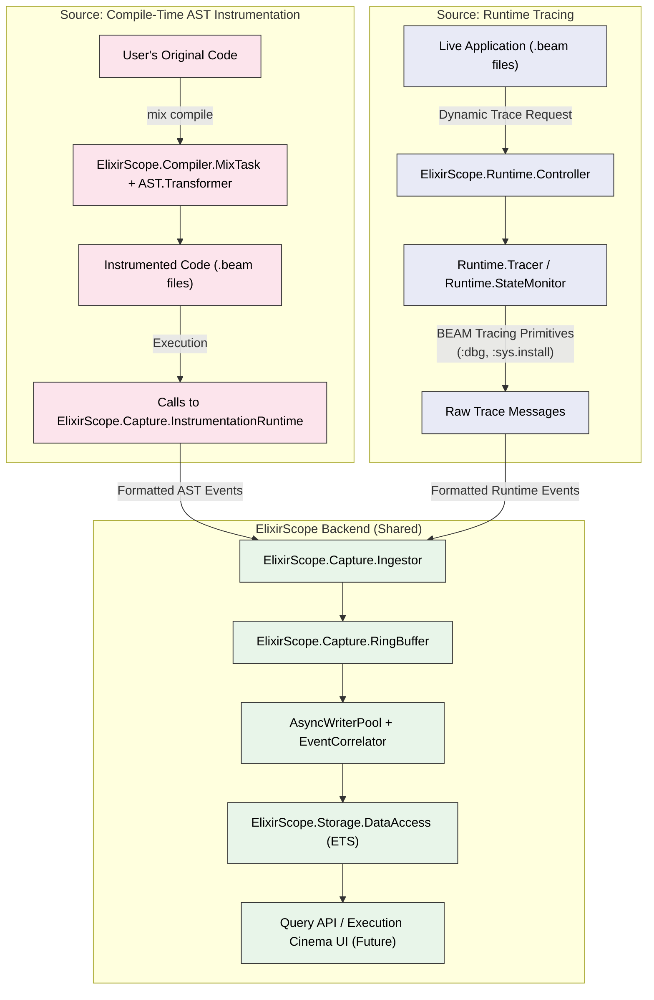

# ElixirScope: The Execution Cinema Debugger for Elixir

<!--[](https://github.com/your-repo/elixir_scope/actions/workflows/ci.yml)-->
[](https://hex.pm/packages/elixir_scope)
[](https://github.com/your-repo/elixir_scope/blob/main/LICENSE)

**ElixirScope is a next-generation debugging and observability platform for Elixir applications, designed to provide an "Execution Cinema" experience. It combines the deep, granular insights of compile-time AST instrumentation with the flexibility and production-safety of runtime tracing, all guided by AI-powered analysis.**

Our vision is to revolutionize how developers understand, debug, and optimize complex concurrent and distributed Elixir systems by offering:

-   **Total Behavioral Recall**: Capture comprehensive execution history.
-   **AI-Driven Guidance**: Intelligent instrumentation planning and analysis.
-   **Compile-Time Granularity**: Access local variables, trace expressions, and inject custom logic with precision.
-   **Runtime Flexibility**: Dynamically trace modules, functions, or processes without recompilation, ideal for live systems.
-   **Time-Travel Debugging**: Navigate through your application's execution history.
-   **Multi-Dimensional Analysis**: Correlate events across time, processes, state, and performance.

---

## 🚀 Current Status & Focus

ElixirScope is evolving! We have successfully:

1.  **Built a Production-Ready Runtime Tracing Foundation**: This system leverages BEAM's built-in primitives (`:dbg`, `:erlang.trace`, `:sys.install`) for dynamic, low-overhead tracing. (See `CURSOR_REVAMP_DEBUG_PLAN.md` & `PROGRESS_SUMMARY.md` for details on this completed phase).
2.  **Integrating Compile-Time AST Instrumentation**: We are now merging and enhancing our powerful compile-time AST transformation capabilities to work alongside the runtime system. This effort (tracked in `AST_MERGE_CURSOR.md`) aims to provide unparalleled debugging depth when needed.

This unified approach means ElixirScope will offer:
-   **Runtime Tracing** as the default for broad, dynamic observability and production debugging.
-   **Compile-Time AST Instrumentation** as an opt-in or AI-suggested mechanism for deep dives into specific code paths, capturing local variables, and enabling expression-level tracing during development and advanced debugging scenarios.

---

## 🏗️ Unified Architecture: The Best of Both Worlds

ElixirScope's revamped architecture intelligently combines compile-time and runtime tracing, directing data into a unified capture, processing, and storage pipeline.

### Key Architectural Principles:

*   **Intelligent Mode Selection**: An AI-driven orchestrator (or user configuration) determines the optimal tracing strategy—runtime, compile-time, or a hybrid—for a given debugging goal or application context.
*   **Convergent Data Pipeline**: Events from both runtime tracers and AST-injected calls flow through the same high-performance `Ingestor` -> `RingBuffer` -> `AsyncWriterPool` -> `EventCorrelator` -> `DataAccess` pipeline. This ensures consistent processing and correlation.
*   **Distinct Control Planes**: Runtime tracing is controlled dynamically via the `ElixirScope.Runtime` API. Compile-time instrumentation is managed via AI-generated plans fed into a `Mix.Tasks.Compile.ElixirScope` task and the `ElixirScope.AST.Transformer`.
*   **Unified Querying**: The goal is for `ElixirScope.Storage.QueryCoordinator` (and the future "Execution Cinema" UI) to present a single, coherent view of all captured data, regardless of its origin.

### Architectural Diagrams

#### 1. High-Level Unified Tracing Architecture

This diagram illustrates how both compile-time AST instrumentation and runtime tracing contribute to ElixirScope's data capture.



#### 2. Convergent Data Flow

This diagram emphasizes the two distinct data sources feeding into the common ElixirScope backend.



---

## 🚀 Getting Started (Conceptual)

As we integrate both tracing mechanisms, the setup will involve:

1.  **Dependency**: Add `elixir_scope` to your `mix.exs`.
2.  **Compiler (for AST-based features)**: Register `ElixirScope.Compiler.MixTask` in your `mix.exs`:
    ```elixir
    def project do
      [
        # ...
        compilers: [:elixir_scope | Mix.compilers()]
        # ...
      ]
    end
    ```
3.  **Application Start**: Add `ElixirScope` to your application's supervision tree.
    ```elixir
    # In your application.ex
    children = [
      # ... other children
      {ElixirScope, strategy: :hybrid_default} # Example strategy
    ]
    ```
4.  **Configuration (`config/config.exs`)**:
    ```elixir
    config :elixir_scope,
      # Unified settings
      unified_tracing: [
        default_mode_for_dev: :hybrid, # :runtime, :compile_time, :hybrid, :auto
        default_mode_for_prod: :runtime,
        # ... other unified settings ...
      ],
      # Runtime specific settings
      runtime_tracing: [
        default_trace_flags: [:call, :return_to, :send, :receive, :timestamp],
        # ... other runtime settings ...
      ],
      # Compile-time specific settings
      compile_time_tracing: [
        default_instrumentation_level: :function_boundaries, # :expressions, :locals
        # ... other compile-time settings ...
      ],
      ai: [
        planning: [
          default_strategy: :balanced # This will influence both runtime and AST plans
        ]
      ]
      # ... other existing ElixirScope configs ...
    ```

---

## 🛠️ Usage Examples (Conceptual for Unified System)

### Using the Unified API

```elixir
# Start tracing with ElixirScope deciding the best mode (runtime, AST, or hybrid)
{:ok, trace_ref} = ElixirScope.Unified.trace(MyModule.MyFunctions, level: :detailed)

# Request deep, granular tracing for a specific function (likely to use AST)
{:ok, granular_ref} = ElixirScope.Unified.trace({MyModule, :complex_function, 2},
  granularity: :locals_and_expressions, # Hint for AST
  capture_locals: [:important_var1, :important_var2],
  trace_lines: [42, 55]
)

# Explicitly use runtime tracing for a live PID
{:ok, runtime_pid_ref} = ElixirScope.Unified.trace(some_pid, force_runtime: true, include: [:messages])

# Stop a trace
ElixirScope.Unified.stop_trace(trace_ref)
```

### Accessing Combined Trace Data (via IEx Helpers - Future)

```iex
# Shows a combined, interleaved history for the PID, tagging event sources
iex> ElixirScope.IExHelpers.history(some_pid)
...
[<ts1>] [RUNTIME] CALL MyModule.foo/1 (Args: [123])
[<ts2>] [AST]     LINE 10 MyModule.foo/1: local_var_x = 456
[<ts3>] [RUNTIME]   SEND from <0.123.0> to <0.124.0>: {:work_item, ...}
[<ts4>] [AST]     LINE 15 MyModule.foo/1: another_var = 789
[<ts5>] [RUNTIME] EXIT MyModule.foo/1 (Return: :ok)
...

# Inspect state, including AST-captured locals, at a point in time
iex> ElixirScope.IExHelpers.inspect_state_at(some_pid, specific_event_id_or_timestamp)
State for PID <0.123.0> at <timestamp>:
  GenServer State: %{...}
  Active Call: MyModule.foo/1
    Local Variables (from AST):
      local_var_x: 456
      another_var: 789
    Arguments (from Runtime/AST): [123]
```

---

## 🧪 Testing ElixirScope

ElixirScope employs a comprehensive testing strategy, including unit, integration, live API, compliance, and focused test suites. The goal is to ensure reliability, performance, and correctness across all features and supported environments.

### Key Test Commands

The following `mix test.*` aliases are available for convenient testing (details in `mix.exs`):

*   `mix test.trace`: Runs the main test suite with detailed output (excludes live API calls).
*   `mix test.fast`: Runs a fast, parallelized version of the main test suite.
*   `mix test.mock`: Tests only the mock LLM provider (very fast, no API calls).
*   `mix test.gemini`: Runs Gemini LLM provider live API tests (requires `GOOGLE_API_KEY`).
*   `mix test.vertex`: Runs Vertex AI LLM provider live API tests (requires `VERTEX_JSON_FILE`).
*   `mix test.llm`: Runs all LLM component tests *excluding* live API calls.
*   `mix test.llm.live`: Runs all LLM component tests *including* live API calls.
*   `mix test.live`: Runs *only* live API tests for all configured providers.
*   `mix test.all`: Runs *all* tests, including all live API tests.

### Standard Test Execution

*   **Default (CI & Local):** `mix test` or `mix test.trace`
    *   Runs all tests except those tagged `:live_api`.
    *   Uses mock LLM providers by default, ensuring tests pass without external dependencies or API keys.
*   **With Coverage:** `mix test --cover`

### Running Live API Tests

To run tests that make actual calls to LLM APIs (Gemini, Vertex AI):

1.  **Set up Credentials:**
    *   **Vertex AI:** Export `VERTEX_JSON_FILE="/path/to/your/service-account.json"`
    *   **Gemini API:** Export `GOOGLE_API_KEY="your-gemini-api-key"`
2.  **Run Specific Live Tests:**
    *   `mix test.gemini`
    *   `mix test.vertex`
    *   `mix test.live` (for all configured live providers)
    *   `mix test.all` (for everything)

**Note:** Live API tests are tagged with `:live_api` and are excluded by default to ensure the main test suite can run in any environment without requiring credentials.

### Test Environment Variables

*   `VERTEX_JSON_FILE`: Path to Vertex AI service account credentials.
*   `VERTEX_DEFAULT_MODEL`: Vertex model to use for tests (e.g., "gemini-1.5-pro").
*   `GOOGLE_API_KEY`: API key for Gemini.
*   `GEMINI_DEFAULT_MODEL`: Gemini model to use for tests.
*   `LLM_PROVIDER`: Can force a specific provider (`mock`, `gemini`, `vertex`). Defaults to auto-detection or mock in test env.
*   `LLM_TIMEOUT`: API request timeout in milliseconds.

For more details on testing, refer to `TEST_CURSOR.md`.

---

## 🗺️ Roadmap

With the runtime tracing foundation complete and AST instrumentation being integrated, our roadmap includes:

1.  **Phase 1 (Unified Tracing Core - In Progress):**
    *   Fully integrate AST transformation with the runtime event pipeline.
    *   Implement the `ElixirScope.Unified` API and `Hybrid.TracingEngine`.
    *   Solidify event correlation for hybrid traces.
    *   Develop basic `IExHelpers` for unified data viewing.
2.  **Phase 2 (Advanced AI & Execution Cinema UI - Next):**
    *   Develop the "Execution Cinema" web interface for visual time-travel debugging.
    *   Enhance `AI.Orchestrator` with more sophisticated planning for both runtime and AST.
    *   Implement advanced AI analysis features on the captured data (anomaly detection, root cause hints).
    *   Build out the full `QueryCoordinator` for complex data retrieval.
3.  **Phase 3 (Production Hardening & Advanced Features):**
    *   Robust distributed tracing and correlation.
    *   Warm/cold storage solutions for long-term data.
    *   Deeper LLM integration for explanations and suggestions.
    *   ElixirLS integration.

---

## 🤝 Contributing

We welcome contributions! Please see our `CONTRIBUTING.md` (to be created) for guidelines.

1.  Fork the repository.
2.  Create a feature branch (`git checkout -b feature/YourFeature`).
3.  Add tests for new functionality.
4.  Ensure all tests pass (`mix test.all` if you have credentials, otherwise `mix test.trace`).
5.  Commit your changes (`git commit -am 'Add some feature'`).
6.  Push to the branch (`git push origin feature/YourFeature`).
7.  Create a new Pull Request.

---

## 📄 License

ElixirScope is released under the MIT License. See the `LICENSE` file for details.
