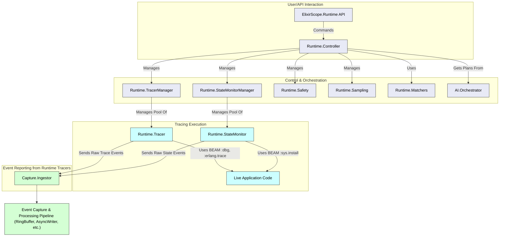

Okay, creating dependency diagrams for the *current* codebase (as provided) will help visualize the existing structure and identify areas of coupling or potential for simplification based on our "Compile-Time as King" strategy.

I'll generate a few diagrams focusing on different aspects:

1.  **High-Level Module Clusters:** Shows major functional areas and their primary dependencies.
2.  **Compile-Time Instrumentation Path:** Focuses on modules involved in AST transformation.
3.  **Runtime Tracing Path (Current "Unified" Focus):** Highlights the existing runtime tracing components.
4.  **Event Capture & Processing Pipeline:** Details the flow of events after they are reported.

Since I can't execute code or dynamically analyze dependencies from the provided text, these diagrams will be based on a manual review of the module definitions, aliases, and function calls visible in the code snippets. They will represent *direct* dependencies as implied by `alias` or explicit calls to other modules within ElixirScope.

---

**Diagram 1: High-Level Module Clusters & Dependencies**

This diagram shows the main groupings of modules and how they generally relate.

```mermaid
graph TD
    subgraph "A. Core & Config"
        Config["ElixirScope.Config"]
        Utils["ElixirScope.Utils"]
        Events["ElixirScope.Events"]
    end

    subgraph "B. AI & Orchestration"
        AI_Orchestrator["AI.Orchestrator"]
        AI_CodeAnalyzer["AI.CodeAnalyzer"]
        AI_PatternRecognizer["AI.PatternRecognizer"]
        AI_ComplexityAnalyzer["AI.ComplexityAnalyzer"]
        AI_LLM_Client["AI.LLM.Client"]
        AI_Predictive["AI.Predictive.ExecutionPredictor"]
        AI_IntelligentAnalyzer["AI.Analysis.IntelligentCodeAnalyzer"]
    end

    subgraph "C. Compile-Time Instrumentation"
        CT_Orchestrator["CompileTime.Orchestrator"]
        Mix_Compile_ElixirScope["Mix.Tasks.Compile.ElixirScope"]
        AST_Transformer["AST.Transformer"]
        AST_EnhancedTransformer["AST.EnhancedTransformer"]
        AST_InjectorHelpers["AST.InjectorHelpers"]
    end

    subgraph "D. Runtime Tracing & Control"
        RT_API["ElixirScope.Runtime"]
        RT_Controller["Runtime.Controller"]
        RT_TracerManager["Runtime.TracerManager"]
        RT_Tracer["Runtime.Tracer"]
        RT_StateMonitorManager["Runtime.StateMonitorManager"]
        RT_StateMonitor["Runtime.StateMonitor"]
        RT_Safety["Runtime.Safety"]
        RT_Sampling["Runtime.Sampling"]
        RT_Matchers["Runtime.Matchers"]
    end

    subgraph "E. Event Capture & Processing"
        Cap_InstrumentationRuntime["Capture.InstrumentationRuntime"]
        Cap_Ingestor["Capture.Ingestor"]
        Cap_RingBuffer["Capture.RingBuffer"]
        Cap_AsyncWriterPool["Capture.AsyncWriterPool"]
        Cap_AsyncWriter["Capture.AsyncWriter"]
        Cap_EventCorrelator["Capture.EventCorrelator"]
        Cap_PipelineManager["Capture.PipelineManager"]
    end

    subgraph "F. Storage"
        Storage_DataAccess["Storage.DataAccess"]
    end

    subgraph "G. Framework Integrations"
        Phoenix_Integration["Phoenix.Integration"]
    end

    subgraph "H. Distributed Tracing (Less developed)"
        Dist_NodeCoordinator["Distributed.NodeCoordinator"]
        Dist_EventSynchronizer["Distributed.EventSynchronizer"]
        Dist_GlobalClock["Distributed.GlobalClock"]
    end

    subgraph "I. Unified Interface (Overarching)"
        Unified_API["ElixirScope.Unified"]
    end

    ElixirScopeApp["ElixirScope.Application"]

    %% Core Dependencies
    Utils --> Config; % Utils might be used by Config for some init
    Events --> Utils;

    %% AI Dependencies
    AI_Orchestrator --> AI_CodeAnalyzer;
    AI_CodeAnalyzer --> AI_PatternRecognizer;
    AI_CodeAnalyzer --> AI_ComplexityAnalyzer;
    AI_Orchestrator --> Storage_DataAccess; % For plans
    AI_LLM_Client --> AI_LLM_Config["AI.LLM.Config"];
    AI_LLM_Client --> AI_LLM_Providers["AI.LLM.Providers.*"];
    AI_CodeAnalyzer --> AI_LLM_Client; % Implied if LLM is used for analysis
    AI_Predictive --> Utils;
    AI_IntelligentAnalyzer --> Utils; % Implied

    %% Compile-Time Dependencies
    CT_Orchestrator --> AI_CodeAnalyzer;
    CT_Orchestrator --> Utils;
    Mix_Compile_ElixirScope --> CT_Orchestrator; % Conceptually, could be AI_Orchestrator too
    Mix_Compile_ElixirScope --> AST_Transformer;
    Mix_Compile_ElixirScope --> Storage_DataAccess; % For plans via Orchestrator
    AST_Transformer --> AST_InjectorHelpers;
    AST_EnhancedTransformer --> AST_InjectorHelpers; % and AST.Transformer
    AST_EnhancedTransformer --> Cap_InstrumentationRuntime; % For report_local_variable_snapshot etc.
    AST_EnhancedTransformer --> Utils;
    AST_InjectorHelpers --> Cap_InstrumentationRuntime; % Injecting calls

    %% Runtime Dependencies
    RT_API --> RT_Controller;
    RT_Controller --> RT_TracerManager;
    RT_Controller --> RT_StateMonitorManager;
    RT_Controller --> AI_Orchestrator; % For runtime plans
    RT_Controller --> Utils;
    RT_TracerManager --> RT_Tracer;
    RT_TracerManager --> Cap_Ingestor; % For getting buffer
    RT_Tracer --> Cap_Ingestor; % For sending events
    RT_Tracer --> Events;
    RT_StateMonitorManager --> RT_StateMonitor;
    RT_StateMonitorManager --> Cap_Ingestor; % For buffer
    RT_StateMonitor --> Cap_Ingestor; % For events
    RT_StateMonitor --> Events;
    RT_Safety --> RT_API; % For emergency stop, via controller
    RT_Safety --> RT_Sampling; % To adjust sampling
    RT_Sampling --> Config; % Implied

    %% Capture Pipeline Dependencies
    Cap_InstrumentationRuntime --> Events;
    Cap_InstrumentationRuntime --> Cap_Ingestor;
    Cap_InstrumentationRuntime --> Utils;
    Cap_Ingestor --> Cap_RingBuffer;
    Cap_Ingestor --> Events;
    Cap_Ingestor --> Utils;
    Cap_AsyncWriterPool --> Cap_AsyncWriter;
    Cap_AsyncWriter --> Cap_RingBuffer;
    Cap_AsyncWriter --> Utils; % For timestamps
    Cap_EventCorrelator --> Events;
    Cap_EventCorrelator --> Utils;
    Cap_PipelineManager --> Cap_AsyncWriterPool; % Supervises

    %% Storage Dependencies
    Storage_DataAccess --> Events;
    Storage_DataAccess --> Utils;
    Cap_AsyncWriter --> Storage_DataAccess; % Or EventCorrelator does
    Cap_EventCorrelator --> Storage_DataAccess; % To lookup/store correlation state

    %% Framework Integration Dependencies
    Phoenix_Integration --> Cap_InstrumentationRuntime;
    Phoenix_Integration --> Utils;

    %% Distributed Dependencies
    Dist_NodeCoordinator --> Dist_EventSynchronizer;
    Dist_NodeCoordinator --> Dist_GlobalClock;
    Dist_NodeCoordinator --> Storage_DataAccess; % Implied for distributed queries
    Dist_NodeCoordinator --> Cap_InstrumentationRuntime; % For node events
    Dist_EventSynchronizer --> Storage_DataAccess;
    Dist_EventSynchronizer --> Dist_GlobalClock;

    %% Unified API Dependencies
    Unified_API --> RT_API; % Delegates to Runtime
    Unified_API --> CT_Orchestrator; % Potentially for AST mode
    Unified_API --> Cap_EventCorrelator; % For session management?
    Unified_API --> Utils;

    %% Application Dependencies
    ElixirScopeApp --> Config; % Starts Config
    ElixirScopeApp --> Cap_PipelineManager; % Example supervised child
    ElixirScopeApp --> Storage_DataAccess; % Implicit if starting a default storage
    % ... and other top-level services

    classDef core fill:#f9f,stroke:#333,stroke-width:2px;
    classDef ai fill:#ccf,stroke:#333,stroke-width:2px;
    classDef compile_time fill:#fcf,stroke:#333,stroke-width:2px;
    classDef runtime fill:#cff,stroke:#333,stroke-width:2px;
    classDef capture fill:#ffc,stroke:#333,stroke-width:2px;
    classDef storage fill:#fec,stroke:#333,stroke-width:2px;
    classDef integration fill:#dfd,stroke:#333,stroke-width:2px;
    classDef distributed fill:#ddd,stroke:#333,stroke-width:2px;
    classDef unified fill:#eee,stroke:#333,stroke-width:2px;

    class Config,Utils,Events core;
    class AI_Orchestrator,AI_CodeAnalyzer,AI_PatternRecognizer,AI_ComplexityAnalyzer,AI_LLM_Client,AI_LLM_Config,AI_LLM_Providers,AI_Predictive,AI_IntelligentAnalyzer ai;
    class CT_Orchestrator,Mix_Compile_ElixirScope,AST_Transformer,AST_EnhancedTransformer,AST_InjectorHelpers compile_time;
    class RT_API,RT_Controller,RT_TracerManager,RT_Tracer,RT_StateMonitorManager,RT_StateMonitor,RT_Safety,RT_Sampling,RT_Matchers runtime;
    class Cap_InstrumentationRuntime,Cap_Ingestor,Cap_RingBuffer,Cap_AsyncWriterPool,Cap_AsyncWriter,Cap_EventCorrelator,Cap_PipelineManager capture;
    class Storage_DataAccess storage;
    class Phoenix_Integration integration;
    class Dist_NodeCoordinator,Dist_EventSynchronizer,Dist_GlobalClock distributed;
    class Unified_API unified;
```

---

**Diagram 2: Compile-Time Instrumentation Path Focus**

This shows the flow from plan generation to instrumented BEAM file, with a focus on compile-time activities.

```mermaid
graph TD
    subgraph "Planning"
        P1[AI.Orchestrator] -- Generates --> Plan[Instrumentation Plan Schema]
        P2[AI.CodeAnalyzer] --> P1
    end

    subgraph "Compilation Step 1: ElixirScope Instrumentation"
        C1[Mix.Tasks.Compile.ElixirScope] -- Consumes --> Plan
        C1 -- Reads Source --> SourceFile["foo.ex (Original)"]
        C1 -- Parses --> AST_Orig["Original AST"]
        C1 -- Passes AST & Plan --> C2[AST.Transformer / EnhancedTransformer]
        C2 -- Uses --> C3[AST.InjectorHelpers]
        C3 -- Defines Injections For --> CapRuntimeAPI["Capture.InstrumentationRuntime API"]
        C2 -- Returns Instrumented AST --> AST_Instrumented["Instrumented AST"]
        C1 -- Converts AST to String --> InstrumentedFile["foo.ex (Instrumented, in _build)"]
    end

    subgraph "Compilation Step 2: Standard Elixir Compilation"
        C4[Mix.Tasks.Compile.Elixir] -- Compiles --> InstrumentedFile
        C4 --> BeamFile["foo.beam (Instrumented)"]
    end

    %% Data flow for dependencies
    AST_InjectorHelpers --> CapRuntimeAPI; % Conceptually targets this API
    AST_EnhancedTransformer --> CapRuntimeAPI;
    Mix_Compile_ElixirScope --> Storage_DataAccess["Storage.DataAccess (for plan)"]

    classDef planning fill:#cde4ff,stroke:#333,color:#000
    classDef compilation fill:#ffe4cd,stroke:#333,color:#000

    class P1,P2,Plan planning;
    class C1,C2,C3,AST_Orig,AST_Instrumented,SourceFile,InstrumentedFile,CapRuntimeAPI,C4,BeamFile,Storage_DataAccess compilation;
```

**Key Takeaways from Diagram 2:**
*   The `InstrumentationPlan` is the critical contract.
*   `AST.Transformer` and its helpers are central to injecting calls that target `Capture.InstrumentationRuntime`.
*   The output is standard Elixir code, albeit instrumented.

---

**Diagram 3: Runtime Tracing Path Focus (Current "Unified" System's Strength)**

This shows the existing, more complex path for dynamic runtime tracing. This is the area that would be *deprioritized* if "Compile-Time is King".


**Key Takeaways from Diagram 3:**
*   This path is significantly more complex due to dynamic control, safety, sampling, and managing BEAM tracing primitives directly.
*   If "Compile-Time is King," much of this (A1, A2, B1-B5, C1, C2, and parts of AIO related to runtime plans) could be simplified or removed.

---

**Diagram 4: Event Capture & Processing Pipeline (Common to Both)**

This pipeline is highly reusable and critical regardless of whether events come from compile-time or runtime instrumentation.

```mermaid
graph TD
    Input1["Events from Capture.InstrumentationRuntime (Compile-Time Path)"] --> A1
    Input2["Events from Runtime.Tracer / StateMonitor (Runtime Path)"] --> A1

    subgraph "Core Event Pipeline"
        A1[Capture.Ingestor] -- Writes To --> A2[Capture.RingBuffer]
        A3[Capture.AsyncWriterPool] -- Manages --> A4[Capture.AsyncWriter]
        A4 -- Reads From --> A2
        A4 -- Uses --> A5[Capture.EventCorrelator]
        A4 -- Writes To --> A6[Storage.DataAccess]
    end

    A7[Capture.PipelineManager] -- Supervises --> A3
    A7 -- Supervises --> A5 % If EventCorrelator is a separate supervised process

    A6 --> Output["AI Analysis / Execution Cinema"]

    classDef pipeline fill:#e8f5e9,stroke:#333,color:#000
    class Input1,Input2,Output;
    class A1,A2,A3,A4,A5,A6,A7 pipeline;
```

**Key Takeaways from Diagram 4:**
*   `Capture.Ingestor` is the unified entry point.
*   The `RingBuffer` -> `AsyncWriterPool` -> `EventCorrelator` -> `Storage` flow is a robust and reusable pattern for handling high event volumes.
*   This pipeline remains largely the same even if the *source* of events shifts predominantly to compile-time instrumentation.

---

**Analysis of Abstractions in Light of "Compile-Time as King":**

*   **Highest Reusability & Stability (Focus Areas):**
    *   **`ElixirScope.Config`**: Foundational.
    *   **`ElixirScope.Events`**: Defines the data.
    *   **`ElixirScope.Utils`**: Foundational.
    *   **`Mix.Tasks.Compile.ElixirScope` + `ElixirScope.AST.*`**: This *becomes* the primary instrumentation engine. Needs to be robust and feature-rich.
    *   **`ElixirScope.Capture.InstrumentationRuntime`**: The critical API layer for injected code. Its stability and performance are paramount.
    *   **`ElixirScope.Capture.Ingestor`, `RingBuffer`, `AsyncWriterPool`, `AsyncWriter`**: The core, high-performance event handling backend.
    *   **`ElixirScope.Storage.DataAccess`**: For persisting processed traces.
    *   **`ElixirScope.AI.CodeAnalyzer`, `AI.PatternRecognizer`, `AI.ComplexityAnalyzer`**: Essential for generating the *Instrumentation Plan* for the compile-time engine.
    *   **`ElixirScope.AI.Orchestrator`**: Its role would be refocused to primarily generate and manage *compile-time instrumentation plans*.

*   **Modules to Deprioritize/Simplify Significantly:**
    *   **`ElixirScope.Runtime` and ALL its sub-modules (`Controller`, `Tracer`, `TracerManager`, `StateMonitor`, `StateMonitorManager`, `Safety`, `Sampling`, `Matchers`)**: The entire dynamic runtime tracing framework becomes secondary. If any piece is needed (e.g., `StateMonitor` for OTP process state in some edge cases not coverable by AST), it would be a small, targeted addition, not a parallel tracing system.
    *   **`ElixirScope.Unified`**: The premise of a unified API trying to transparently switch between two full tracing systems might be dropped in favor of a primary compile-time approach with explicit, limited runtime capabilities if any.
    *   **`ElixirScope.Phoenix.Integration` (Telemetry-based)**: If Phoenix instrumentation is needed, the compile-time AST transformer should aim to identify Phoenix constructs (controllers, LiveViews) and inject `Capture.InstrumentationRuntime` calls directly. Telemetry-based runtime listeners become less critical.
    *   **`ElixirScope.Capture.EventCorrelator`**: May simplify if event sources are more predictable and less diverse (i.e., primarily from structured AST injections). The need to correlate disparate runtime events (like raw BEAM trace messages with manually reported events) decreases.
    *   **`ElixirScope.Distributed.*`**: Distributed tracing is an advanced feature. For the core debugger focused on development, this can be a later consideration.

By making these deprioritizations, the system's complexity can be significantly reduced, allowing for a more focused and powerful implementation of the "Execution Cinema Debugger" driven by compile-time instrumentation. The documented abstractions then become the stable building blocks for this vision.
