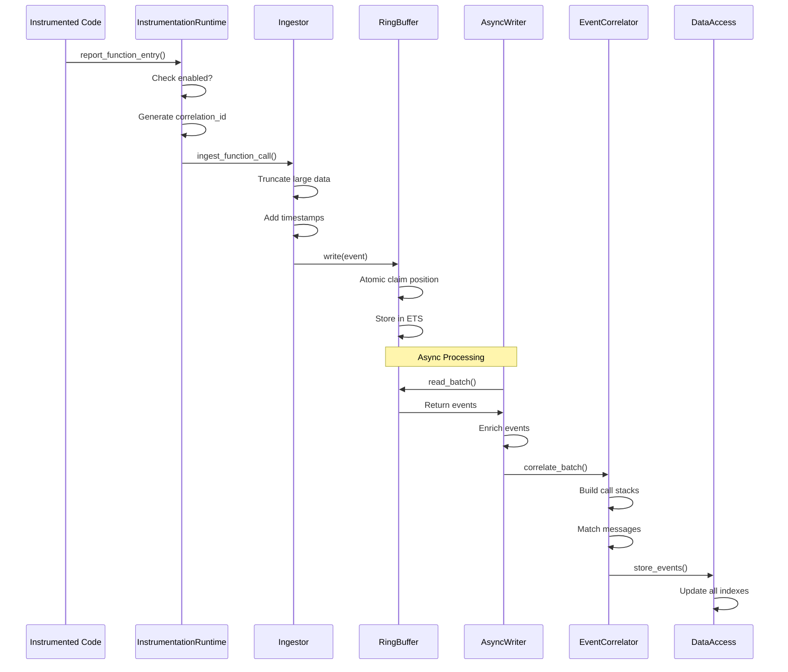
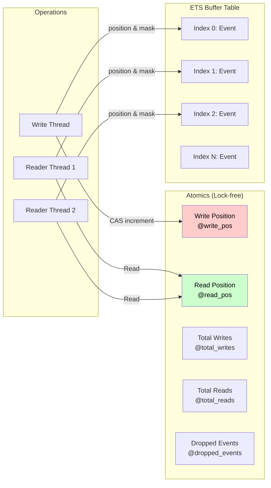
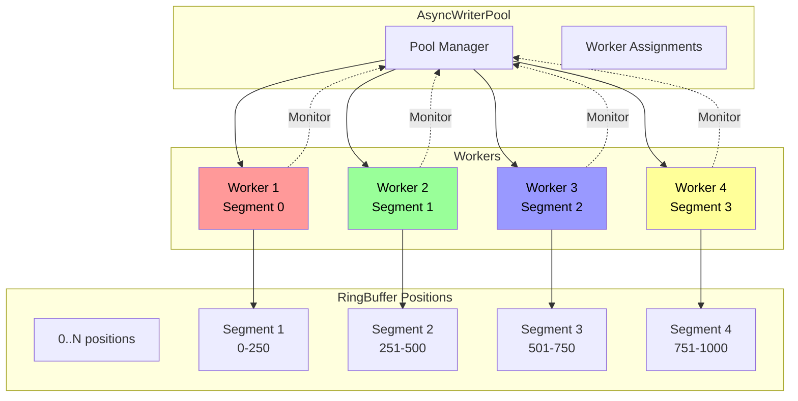
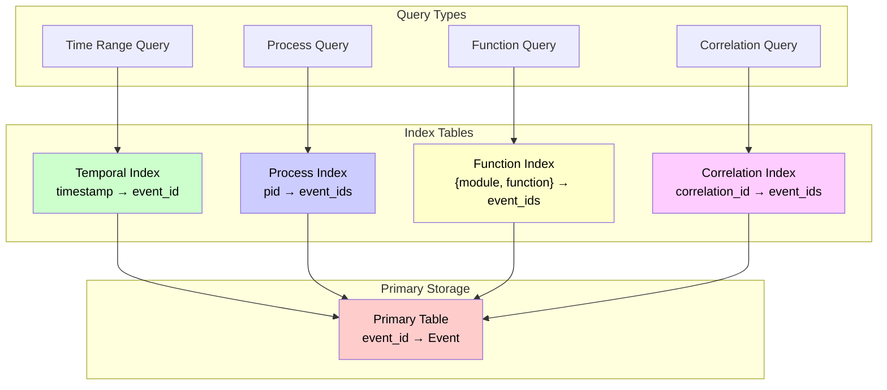
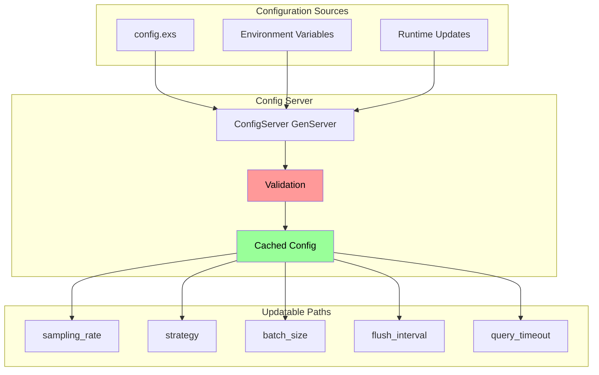
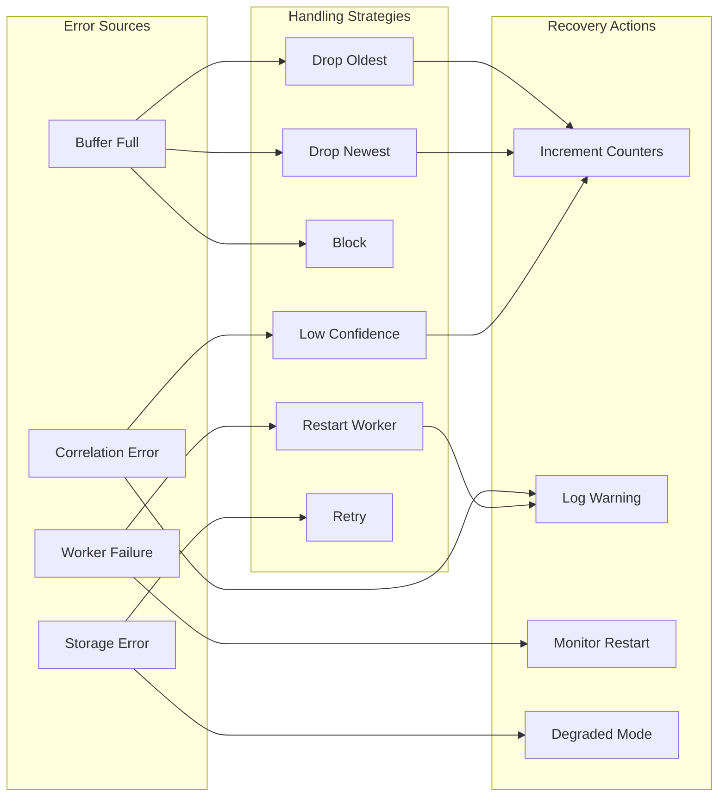
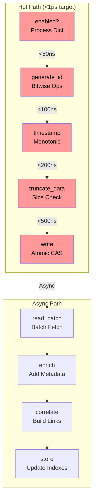
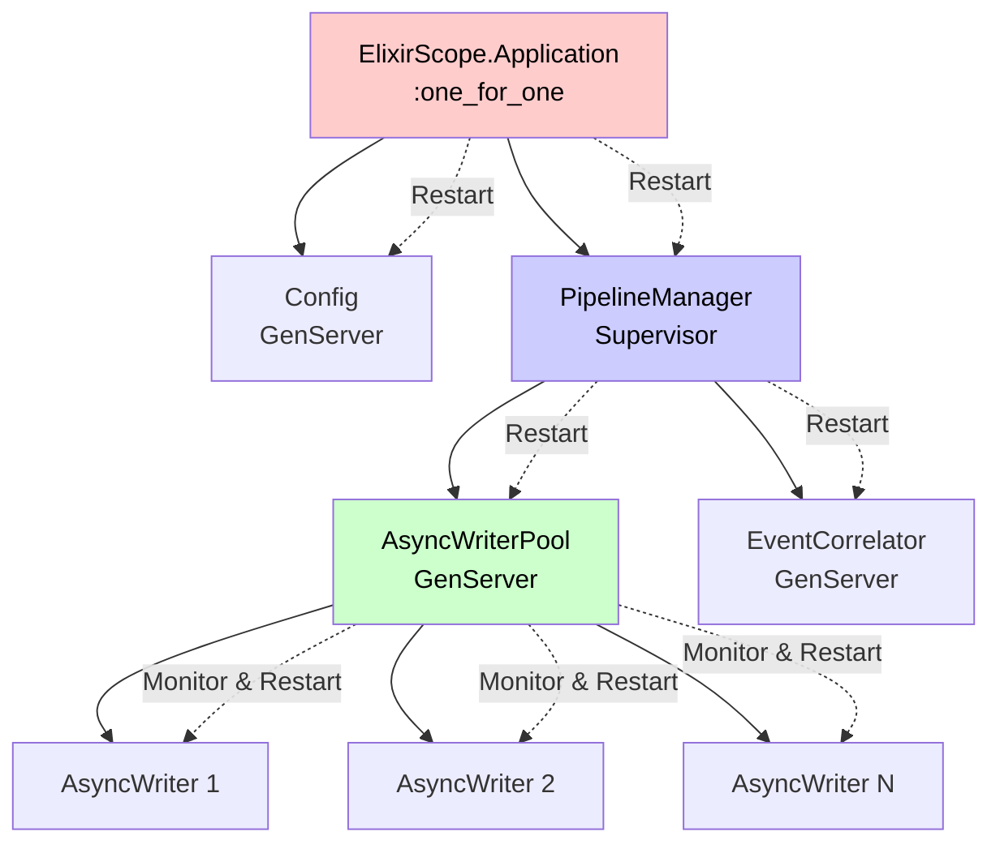

I'll create a comprehensive set of Mermaid diagrams to visualize the ElixirScope implementation architecture and flows.

## 2. Event Flow Sequence

> **Note:** Primarily runtime flow; needs to include AST instrumentation path via `Capture.InstrumentationRuntime`.

## 3. RingBuffer Lock-free Operations

## 5. AsyncWriterPool Work Distribution

## 6. Storage Layer Index Structure

## 7. Configuration Flow

## 8. Error Handling and Recovery

## 9. Performance Critical Path

> **Note:** Focuses on runtime; needs to incorporate AST instrumentation path.

## 10. Supervision Tree

> **Note:** Shows a partial tree; should be integrated into a unified system supervision tree including runtime/AST control.

These diagrams illustrate:

1. **Overall Architecture**: Shows all layers and components
2. **Event Flow**: Detailed sequence from instrumentation to storage
3. **Lock-free Operations**: How the RingBuffer achieves high performance
4. **Correlation State Machine**: How events are causally linked
5. **Work Distribution**: How AsyncWriterPool manages workers
6. **Storage Indexes**: Multi-dimensional query support
7. **Configuration Flow**: Sources and validation
8. **Error Handling**: Strategies for different failure modes
9. **Performance Path**: Critical hot path optimizations
10. **Supervision Tree**: Fault tolerance structure

The diagrams use color coding:
- Red: Performance critical components
- Blue: Async/background processing
- Green: Storage and persistence
- Yellow: Configuration and management
