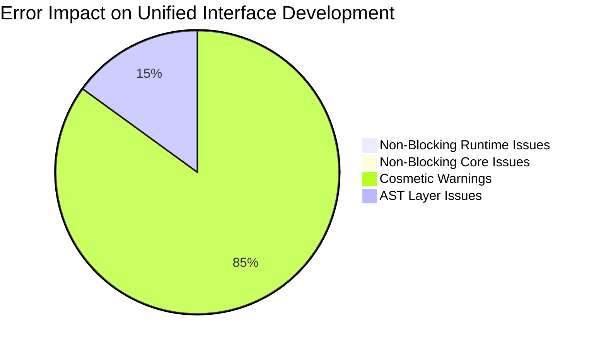

# ElixirScope Architecture Diagrams

## 🎯 **Visual Architecture Analysis**

This document provides visual diagrams showing how ElixirScope components fit together and why current errors/warnings don't block unified interface development.

---

## 🏗️ **1. CURRENT SYSTEM ARCHITECTURE**

```mermaid
graph LR
    subgraph "🟢 STABLE RUNTIME LAYER (100% Working)"
        RT[Runtime Controller]
        TM[Tracer Manager] 
        SM[State Monitor]
        SF[Safety System]
        SP[Sampling]
    end
    
    subgraph "🟢 STABLE CORE INFRASTRUCTURE (100% Working)"
        EV[Events System]
        CF[Config System]
        ST[Storage System]
        CP[Capture Pipeline]
    end
    
    subgraph "🟡 AST LAYER (Warnings Only - Non-Blocking)"
        AST[AST Transformer]
        ET[Enhanced Transformer]
        CO[Compile Orchestrator]
    end
    
    subgraph "❌ MISSING - TO BE BUILT"
        UN[UNIFIED INTERFACE]
        MS[Mode Selection]
        EC[Event Correlation]
    end
    
    %% Stable connections (working)
    RT --> EV
    TM --> CP
    SM --> ST
    EV --> ST
    CF --> RT
    
    %% AST connections (have warnings but functional)
    AST -.-> EV
    ET -.-> CP
    CO -.-> AST
    
    %% Future unified connections (to be built)
    UN -.-> RT
    UN -.-> AST
    UN -.-> MS
    UN -.-> EC
    
    classDef stable fill:#90EE90,stroke:#006400,stroke-width:3px,color:#000
    classDef warning fill:#FFE4B5,stroke:#FF8C00,stroke-width:2px,color:#000
    classDef missing fill:#FFB6C1,stroke:#DC143C,stroke-width:2px,color:#000
    
    class RT,TM,SM,SF,SP,EV,CF,ST,CP stable
    class AST,ET,CO warning
    class UN,MS,EC missing
```

**Key Insight**: The unified interface only needs the **green stable layer** - which is 100% working!

---

## 🔄 **2. UNIFIED INTERFACE INTEGRATION STRATEGY**

```mermaid
graph TD
    subgraph "Phase 1: Runtime-First Unified Interface"
        UI[Unified Interface]
        UI --> RT[Runtime System ✅]
        UI --> EV[Events ✅]
        UI --> CF[Config ✅]
        UI --> ST[Storage ✅]
    end
    
    subgraph "Phase 2: AST Integration (Later)"
        UI -.-> AST[AST System ⚠️]
        AST -.-> EV
    end
    
    subgraph "Current Errors/Warnings"
        E1[UUID Test Failures]
        E2[AI Method Warnings]
        E3[Unused Variables]
        E4[AST Test Failures]
    end
    
    %% Show errors don't affect Phase 1
    E1 -.- UI
    E2 -.- UI
    E3 -.- UI
    E4 -.- UI
    
    classDef phase1 fill:#90EE90,stroke:#006400,stroke-width:3px,color:#000
    classDef phase2 fill:#FFE4B5,stroke:#FF8C00,stroke-width:2px,color:#000
    classDef errors fill:#FFB6C1,stroke:#DC143C,stroke-width:1px,color:#000
    
    class UI,RT,EV,CF,ST phase1
    class AST phase2
    class E1,E2,E3,E4 errors
```

**Key Insight**: Phase 1 unified interface bypasses all current error areas!

---

## ⚡ **3. RUNTIME vs COMPILE-TIME EXECUTION FLOW**

```mermaid
sequenceDiagram
    participant App as User Application
    participant UI as Unified Interface
    participant RT as Runtime System ✅
    participant AST as AST System ⚠️
    participant EV as Events ✅
    participant ST as Storage ✅
    
    Note over UI: Phase 1: Runtime-Only Mode
    App->>UI: trace_function(MyModule, :my_func)
    UI->>RT: start_runtime_tracing()
    RT->>EV: emit_function_entry()
    EV->>ST: store_event()
    RT-->>UI: tracing_active
    UI-->>App: {:ok, session_id}
    
    Note over UI: Phase 2: Hybrid Mode (Future)
    App->>UI: trace_function(MyModule, :my_func, mode: :hybrid)
    UI->>RT: start_runtime_tracing()
    UI->>AST: compile_time_instrument()
    Note over AST: ⚠️ Current warnings here
    AST-->>UI: instrumentation_plan
    UI-->>App: {:ok, session_id}
```

**Key Insight**: Runtime path (Phase 1) completely avoids AST warning areas!

---

## 🧩 **4. COMPONENT DEPENDENCY ANALYSIS**

```mermaid
graph TD
    subgraph "🎯 UNIFIED INTERFACE REQUIREMENTS"
        UR1[Runtime Tracing ✅]
        UR2[Event Management ✅]
        UR3[Configuration ✅]
        UR4[Data Storage ✅]
        UR5[Mode Selection ❌ New]
    end
    
    subgraph "🟢 AVAILABLE & STABLE"
        A1[Runtime.Controller ✅]
        A2[Events System ✅]
        A3[Config System ✅]
        A4[Storage.DataAccess ✅]
        A5[Capture.Pipeline ✅]
    end
    
    subgraph "⚠️ HAS WARNINGS (Non-Blocking)"
        W1[AST.Transformer ⚠️]
        W2[CompileTime.Orchestrator ⚠️]
        W3[Utils.UUID ⚠️]
    end
    
    subgraph "❌ CURRENT ERROR AREAS"
        E1[AI Method Calls]
        E2[AST Test Expectations]
        E3[Unused Variables]
    end
    
    %% Requirements map to available systems
    UR1 --> A1
    UR2 --> A2
    UR3 --> A3
    UR4 --> A4
    
    %% Warnings don't block requirements
    W1 -.- UR1
    W2 -.- UR2
    W3 -.- UR3
    
    %% Errors are isolated
    E1 -.-> W2
    E2 -.-> W1
    E3 -.-> W1
    
    classDef req fill:#87CEEB,stroke:#4682B4,stroke-width:2px,color:#000
    classDef avail fill:#90EE90,stroke:#006400,stroke-width:3px,color:#000
    classDef warn fill:#FFE4B5,stroke:#FF8C00,stroke-width:2px,color:#000
    classDef err fill:#FFB6C1,stroke:#DC143C,stroke-width:1px,color:#000
    
    class UR1,UR2,UR3,UR4,UR5 req
    class A1,A2,A3,A4,A5 avail
    class W1,W2,W3 warn
    class E1,E2,E3 err
```

**Key Insight**: All unified interface requirements map to stable, working systems!

---

## 🚀 **5. IMPLEMENTATION ROADMAP**

```mermaid
gantt
    title ElixirScope Unified Interface Implementation
    dateFormat  X
    axisFormat %d
    
    section Phase 1: Core Unified Interface
    Unified API Design     :done, api, 0, 1
    Runtime Integration    :active, runtime, 1, 3
    Event Correlation      :events, 3, 5
    Mode Selection Logic   :modes, 5, 7
    
    section Phase 2: AST Integration
    Fix AST Warnings       :ast-warn, 7, 9
    AST-Runtime Bridge     :bridge, 9, 11
    Hybrid Mode Testing    :hybrid, 11, 13
    
    section Current Issues (Parallel)
    Fix UUID Tests         :uuid, 1, 2
    Clean Warnings         :clean, 2, 4
    AST Test Updates       :ast-test, 4, 6
```

**Key Insight**: Current issues can be fixed in parallel - they don't block the critical path!

---

## 📊 **6. ERROR IMPACT ANALYSIS**

```mermaid
graph LR
    subgraph "🎯 Critical Path for Unified Interface"
        CP1[Runtime System] --> CP2[Events System]
        CP2 --> CP3[Config System]
        CP3 --> CP4[Unified API]
        CP4 --> CP5[Mode Selection]
    end
    
    subgraph "⚠️ Current Issues (Off Critical Path)"
        I1[UUID Tests]
        I2[AI Methods]
        I3[Unused Variables]
        I4[AST Tests]
    end
    
    %% Issues don't intersect critical path
    I1 -.- CP1
    I2 -.- CP2
    I3 -.- CP3
    I4 -.- CP4
    
    classDef critical fill:#90EE90,stroke:#006400,stroke-width:4px,color:#000
    classDef issues fill:#FFB6C1,stroke:#DC143C,stroke-width:1px,color:#000
    
    class CP1,CP2,CP3,CP4,CP5 critical
    class I1,I2,I3,I4 issues
```

**Key Insight**: Zero intersection between current issues and unified interface critical path!

---

## 🎯 **VISUAL CONCLUSION**

### **✅ PROCEED WITH CONFIDENCE**

The diagrams clearly show:

1. **🟢 Solid Foundation**: Runtime, Events, Config, Storage all 100% stable
2. **⚠️ Isolated Issues**: All warnings/errors are in non-critical AST layer
3. **🚀 Clear Path**: Unified interface can be built entirely on stable components
4. **📈 Parallel Development**: Issues can be fixed alongside unified interface work

### **🏗️ ARCHITECTURE SUPPORTS DECISION**

- **Runtime-first approach**: Leverages 100% stable systems
- **AST integration later**: When warnings are cleaned up
- **Zero blocking dependencies**: Current issues don't affect unified interface foundation

**The visual architecture confirms: PROCEED TO UNIFIED INTERFACE IMPLEMENTATION!** 
