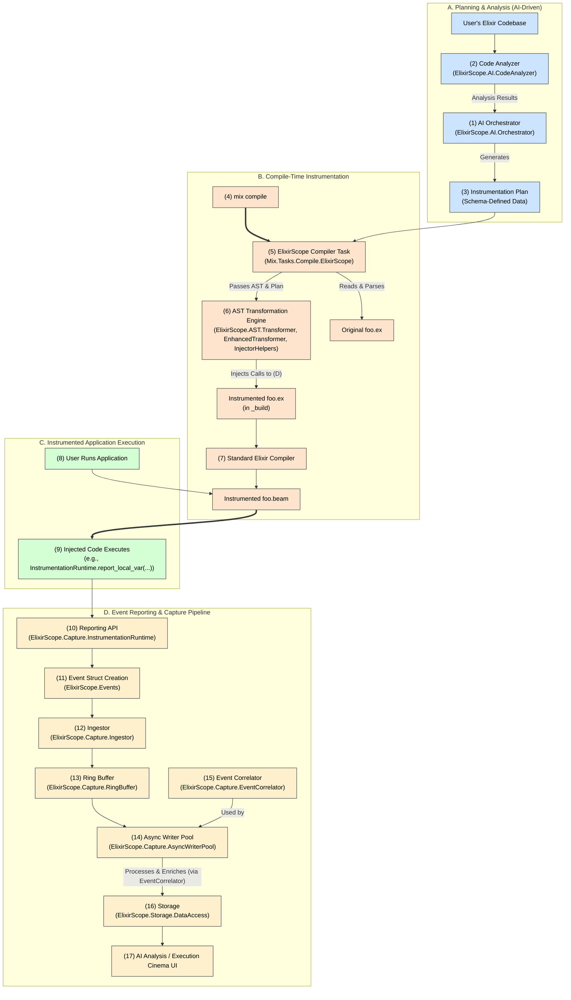

Okay, let's detail the "Compile-Time as King" strategy. This document will elaborate on making `Mix.Tasks.Compile.ElixirScope` and the AST transformers the centerpiece, leveraging `ElixirScope.Capture.InstrumentationRuntime` for data reporting, and ensuring the `Ingestor` -> `RingBuffer` -> `AsyncWriter` pipeline smoothly processes these events.

---

**ElixirScope: Compile-Time Instrumentation as the Core Strategy**

**Vision:** To provide unparalleled insight into Elixir application behavior during development and advanced debugging by making intelligent, compile-time AST (Abstract Syntax Tree) instrumentation the primary mechanism for data collection. This approach prioritizes depth of visibility and deterministic data capture, feeding a rich stream of execution events into AI-driven analysis tools and the "Execution Cinema" debugger.

**Core Philosophy:**

1.  **Deep Visibility is Paramount:** For debugging complex (especially concurrent) systems, the ability to see local variable states, expression results, and precise execution paths at any point in the code is invaluable. Compile-time AST manipulation offers the most direct and granular way to achieve this.
2.  **Deterministic Instrumentation:** What you plan to instrument at compile-time is precisely what gets instrumented. This reduces the "observer effect" and makes the collected data highly predictable.
3.  **AI-Driven Precision:** An AI (or rule-based system) analyzes the codebase to generate an "Instrumentation Plan." This plan dictates *what* and *where* to instrument, ensuring that data collection is targeted and meaningful, rather than a brute-force blanket approach.
4.  **Simplified "Agent" in Target Application:** The code injected into the user's application primarily consists of calls to a well-defined reporting API (`ElixirScope.Capture.InstrumentationRuntime`). The runtime footprint of ElixirScope within the instrumented application is thus minimized to these reporting calls and the backend data ingestion components.

---

**Architectural Overview (Compile-Time Focus):**



---

**Detailed Component Roles in the Compile-Time Strategy:**

1.  **AI & Orchestration (The "Planner")**
    *   **`ElixirScope.AI.CodeAnalyzer` / `PatternRecognizer`**:
        *   **Responsibility**: Statically analyzes the user's codebase. It identifies structures, complexities, potential areas of interest for debugging (e.g., complex conditional logic, state mutations, specific framework patterns).
        *   **Input**: Source code files.
        *   **Output**: Analysis results (ASTs, complexity scores, pattern matches).
    *   **`ElixirScope.AI.Orchestrator`**:
        *   **Responsibility**: Consumes analysis results from `CodeAnalyzer` and user directives (e.g., "debug this function intensely," "find out why this variable changes"). It then generates the detailed `InstrumentationPlan` according to the defined schema.
        *   **Input**: Code analysis, user goals/focus.
        *   **Output**: A well-defined `InstrumentationPlan` (JSON/Elixir term).

2.  **The ElixirScope Compiler (`Mix.Tasks.Compile.ElixirScope`)**
    *   **Responsibility**:
        *   Acts as a custom Mix compiler, running *before* the standard `Mix.Tasks.Compile.Elixir`.
        *   Loads the `InstrumentationPlan` (e.g., from a file specified in `mix.exs`, or fetched from the `Orchestrator`).
        *   Identifies all relevant `.ex` files within the project (respecting `elixirc_paths`, `include_modules`, `exclude_modules` from the plan or Mix config).
        *   For each target file:
            *   Reads the source code.
            *   Parses it into an Elixir AST using `Code.string_to_quoted/2`.
            *   Passes the AST and the relevant section of the `InstrumentationPlan` to the `AST.Transformer`.
            *   Receives the modified (instrumented) AST from the transformer.
            *   Converts the instrumented AST back to an Elixir source code string using `Macro.to_string/1`.
            *   Writes this instrumented source code to a designated location in the `_build` directory (e.g., `_build/dev/elixir_scope/lib/...`). This ensures original source files are untouched.
    *   **Input**: Source code files, `InstrumentationPlan`.
    *   **Output**: Instrumented source code files in the `_build` directory.

3.  **The AST Transformation Engine (`ElixirScope.AST.Transformer`, `EnhancedTransformer`, `InjectorHelpers`)**
    *   **Responsibility**:
        *   This is the **heart of the instrumentation process**.
        *   Receives an Elixir AST (for a module or function) and the corresponding part of the `InstrumentationPlan`.
        *   Intelligently traverses the AST (`Macro.prewalk/postwalk`).
        *   Interprets directives from the `InstrumentationPlan` (e.g., `probes`, `capture_settings`, `instrumentation_level`).
        *   For each directive, it locates the target AST node(s) based on `probe.location`.
        *   Constructs new AST fragments representing calls to `ElixirScope.Capture.InstrumentationRuntime` functions.
            *   Example: To capture local variable `x` (value `10`) at line 42 within function `foo/1` (correlation ID `cid123`):
                ```elixir
                # Original:
                # def foo(a) do # line 41
                #   x = a * 2  # line 42
                #   ...
                # end

                # Transformed AST would effectively become:
                # def foo(a) do # line 41
                #   x = a * 2  # line 42
                #   ElixirScope.Capture.InstrumentationRuntime.report_local_variable_snapshot(
                #     "cid123", # This would be generated or passed in
                #     "foo/1",  # Context: function
                #     42,       # Context: line
                #     %{x: x}   # Captured variable(s)
                #   )
                #   ...
                # end
                ```
        *   Carefully injects these new AST fragments into the original AST, ensuring original program logic and semantics are preserved (e.g., return values are maintained, exceptions propagate correctly). This often involves wrapping original expressions or blocks.
        *   The `EnhancedTransformer` might handle more complex injections like expression value capture or custom logic. `InjectorHelpers` provide utility functions for creating common injection patterns.
    *   **Input**: Original AST, `InstrumentationPlan` fragment.
    *   **Output**: Modified (instrumented) AST.

4.  **Standard Elixir Compiler (`Mix.Tasks.Compile.Elixir`)**
    *   **Responsibility**: Compiles the *instrumented* Elixir source code (from the `_build/elixir_scope/` directory) into BEAM bytecode, just like it would with regular Elixir code.
    *   **Input**: Instrumented `.ex` files.
    *   **Output**: Instrumented `.beam` files.

5.  **Injected Code (Executing within the User's Application)**
    *   **Responsibility**: These are the `ElixirScope.Capture.InstrumentationRuntime.report_*` calls that now exist within the compiled BEAM files. When the application runs and hits an instrumented line, these calls execute.
    *   They run synchronously within the context of the user's process.

6.  **The Reporting API (`ElixirScope.Capture.InstrumentationRuntime`)**
    *   **Responsibility**:
        *   This module provides the public API that all injected instrumentation code calls.
        *   Its functions (`report_function_entry`, `report_function_exit`, `report_local_variable_snapshot`, `report_expression_value_capture`, `report_line_execution`, etc.) are the direct targets of the AST injections.
        *   When called, a function in `InstrumentationRuntime` will:
            1.  Gather all necessary context (e.g., function name, line number, captured variable values, PID, timestamp).
            2.  Construct an appropriate `ElixirScope.Events` struct (e.g., `Events.FunctionEntry`, `Events.StateSnapshot` for local vars).
            3.  Pass this structured event to `ElixirScope.Capture.Ingestor`.
        *   It must be designed for very low overhead, as it's called directly from user code.
    *   **Input**: Arguments from the injected call site (e.g., module, function, line, captured values).
    *   **Output**: Formatted `ElixirScope.Events` struct passed to the `Ingestor`.

7.  **The Capture Pipeline (`Ingestor` -> `RingBuffer` -> `AsyncWriterPool`)**
    *   **`ElixirScope.Capture.Ingestor`**:
        *   **Responsibility**: Acts as the single, unified entry point for all events into the backend capture system. Receives event structs from `InstrumentationRuntime`.
        *   Performs minimal validation/normalization.
        *   Quickly writes the event to the `ElixirScope.Capture.RingBuffer`.
    *   **`ElixirScope.Capture.RingBuffer`**:
        *   **Responsibility**: A high-performance, lock-free (or low-contention) in-memory buffer.
        *   Decouples the fast, synchronous event reporting from slower, asynchronous processing. This prevents the instrumented application from being blocked by event processing.
    *   **`ElixirScope.Capture.AsyncWriterPool` / `AsyncWriter`**:
        *   **Responsibility**: A pool of worker processes that consume events from the `RingBuffer` in batches.
        *   Perform heavier processing:
            *   Event enrichment (e.g., adding more context).
            *   Event correlation using `ElixirScope.Capture.EventCorrelator` to link related events (e.g., function entry to exit, build call stacks).
            *   Serialization.
            *   Dispatching events to `ElixirScope.Storage.DataAccess` or directly to a streaming AI consumer.

---

**Data Flow Example (Simplified for one local variable capture):**

1.  **AI Plan Generation:**
    *   `AI.CodeAnalyzer` analyzes `MyApp.MyModule`.
    *   `AI.Orchestrator` decides to instrument `MyApp.MyModule.process/1` to capture local variable `interim_result` at line 25.
    *   Plan snippet: `%{ {MyApp.MyModule, {:process, 1}} => %{ probes: [ %{type: :local_variable_capture, location: %{type: :line, line_number: 25, position: :after}, payload: %{variables: [:interim_result]}} ] } }`

2.  **Compilation (`mix compile`):**
    *   `Mix.Tasks.Compile.ElixirScope` loads the plan.
    *   It finds `lib/my_app/my_module.ex`.
    *   Parses it to AST.
    *   Passes AST and plan snippet to `AST.Transformer`.
    *   `AST.Transformer` finds line 25 in `process/1`. After the statement on line 25, it injects:
        ```elixir
        ElixirScope.Capture.InstrumentationRuntime.report_local_variable_snapshot(
          __MODULE__, :process, 1, # Context
          25,                      # Line
          %{interim_result: interim_result} # Captured vars
        )
        ```
        (Actual call might include correlation ID, etc., generated by the transformer or runtime).
    *   Transformer returns modified AST.
    *   `MixTask` writes instrumented source to `_build/.../my_module.ex`.
    *   Standard Elixir compiler compiles this instrumented source to `my_module.beam`.

3.  **Application Execution:**
    *   User's application calls `MyApp.MyModule.process(data)`.
    *   The code executes. After line 25, the injected call to `InstrumentationRuntime.report_local_variable_snapshot(...)` is made.

4.  **Event Reporting & Capture:**
    *   `InstrumentationRuntime.report_local_variable_snapshot` is invoked.
    *   It creates an `ElixirScope.Events.StateSnapshot` (or a similar specific event type for local vars) struct containing `module`, `function`, `arity`, `line`, and `%{interim_result: <current_value>}`.
    *   This event struct is passed to `Ingestor.ingest_generic_event(...)`.
    *   `Ingestor` writes the event to the `RingBuffer`.
    *   An `AsyncWriter` process picks up the event from the `RingBuffer`.
    *   `AsyncWriter` might correlate it, enrich it, and then send it to `Storage.DataAccess` or stream it to the AI consumer.

5.  **AI Consumption / Debugger Display:**
    *   The AI process or the "Execution Cinema" UI queries `Storage.DataAccess` (or consumes the stream).
    *   It retrieves the event showing that at line 25 of `MyApp.MyModule.process/1`, `interim_result` had `current_value`.

---

**Benefits of "Compile-Time as King":**

*   **Unmatched Granularity:** Capture exactly what's needed, where it's needed.
*   **Predictable Data:** The structure and nature of captured data are defined at compile-time, simplifying AI model training and analysis.
*   **Reduced Runtime Complexity:** The "agent" in the instrumented application is primarily the `InstrumentationRuntime` API and the backend capture pipeline, avoiding the complexities of managing dynamic trace specifications.
*   **Offline Analysis for Plan Generation:** The AI can analyze the codebase thoroughly offline to create optimal instrumentation plans.
*   **Potentially Lower Base Overhead (for the tracing mechanism itself):** Direct function calls injected at compile time can be very efficient compared to dynamic tracing mechanisms if the reporting API and capture pipeline are optimized. The main overhead comes from the *amount* of data captured and reported.

This strategy firmly places the intelligence in the planning (AI + Orchestrator) and transformation (AST Engine) phases, making the runtime data reporting lean and focused.
