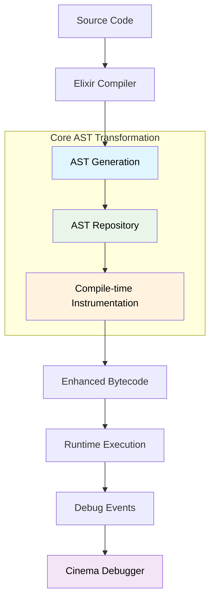
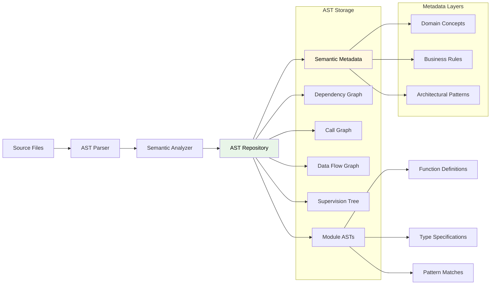
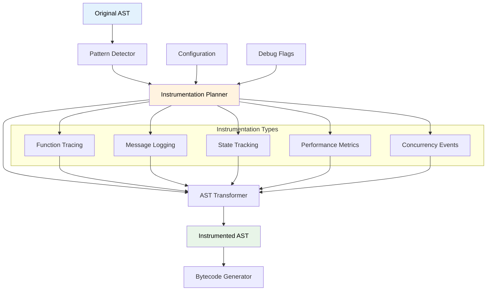
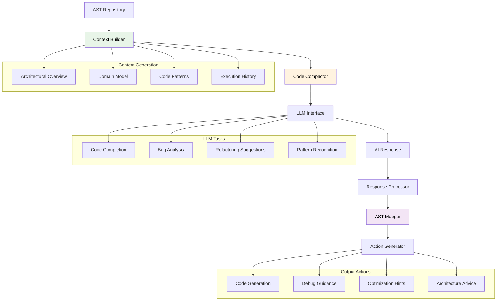
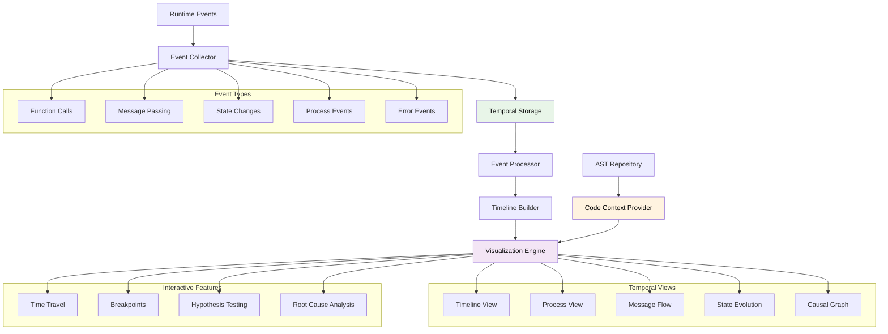
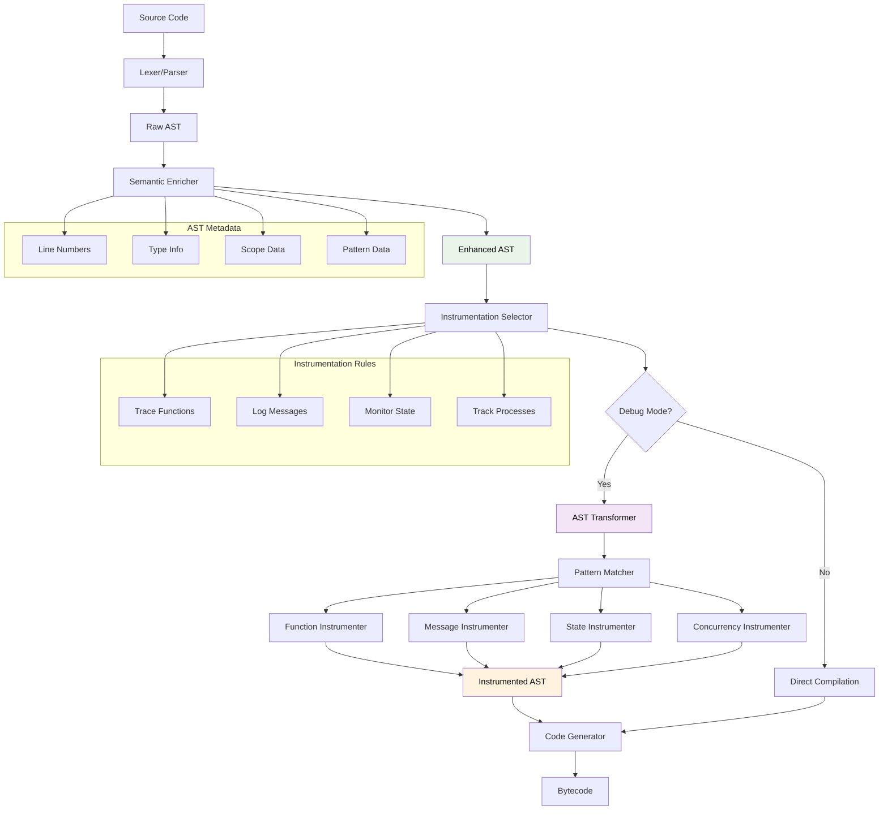
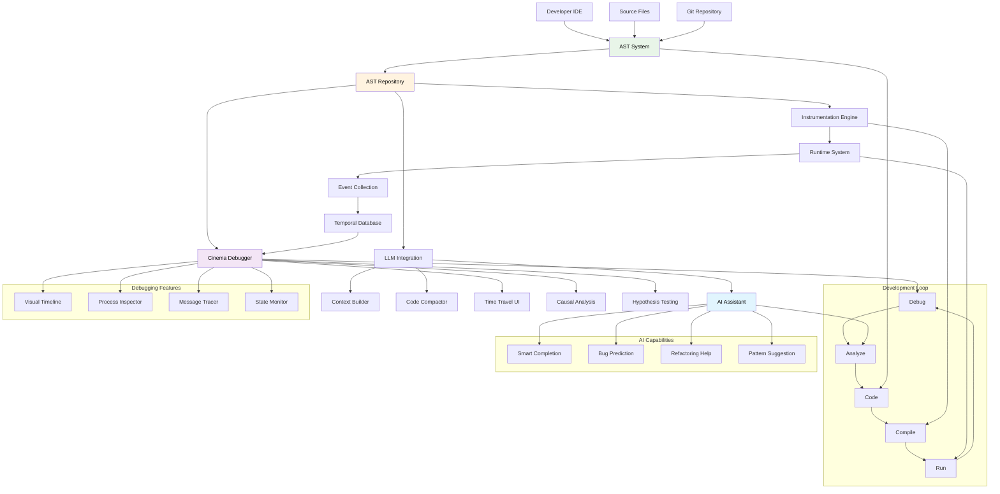

### Basic AST Processing Flow

### AST Repository Components

### Compile-time Instrumentation Pipeline

### LLM Integration Architecture

### Cinema Debugger Data Flow

### Detailed AST Transformation Process

### Comprehensive System Integration

