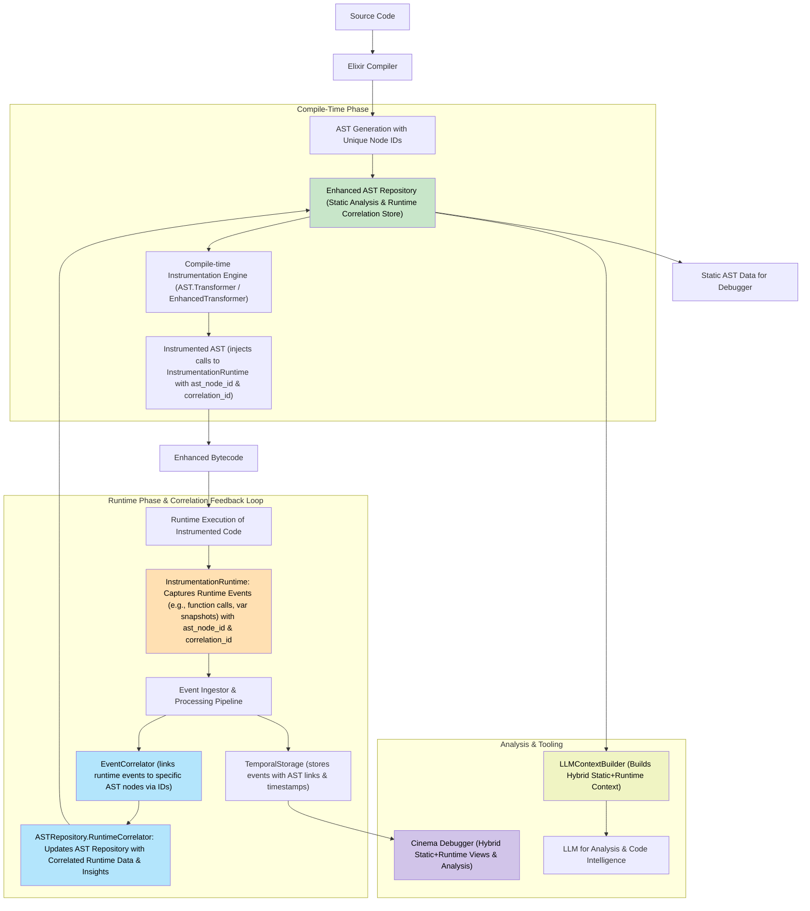
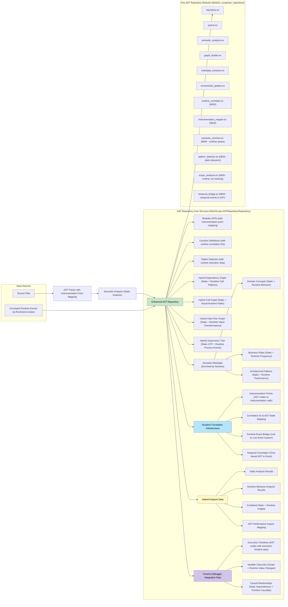
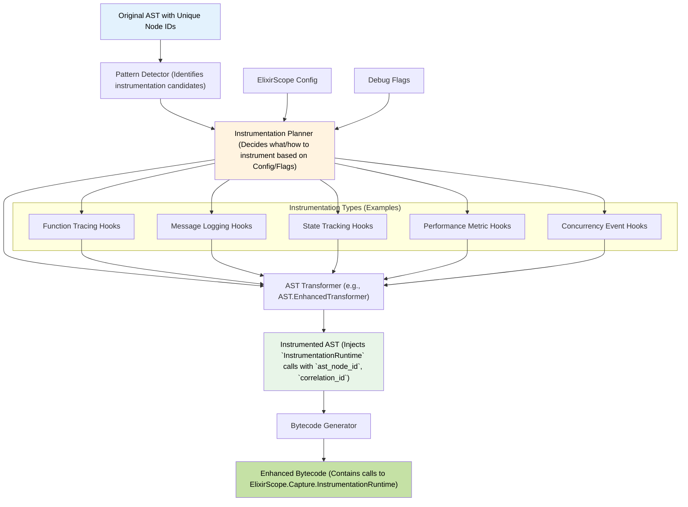
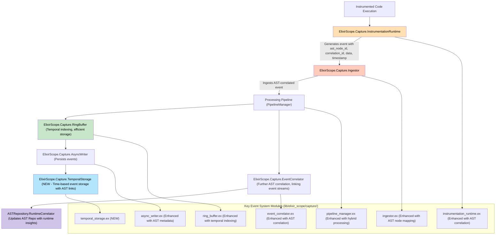
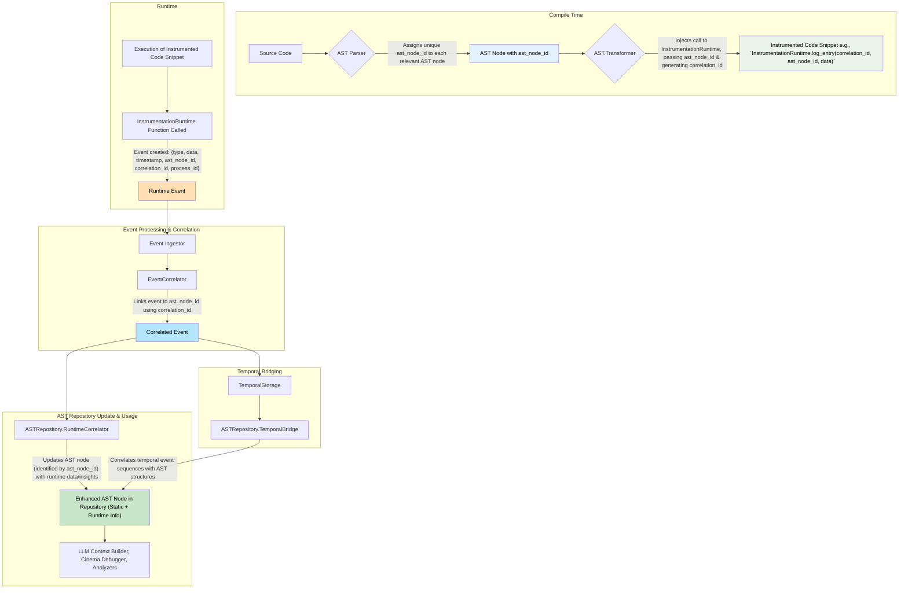
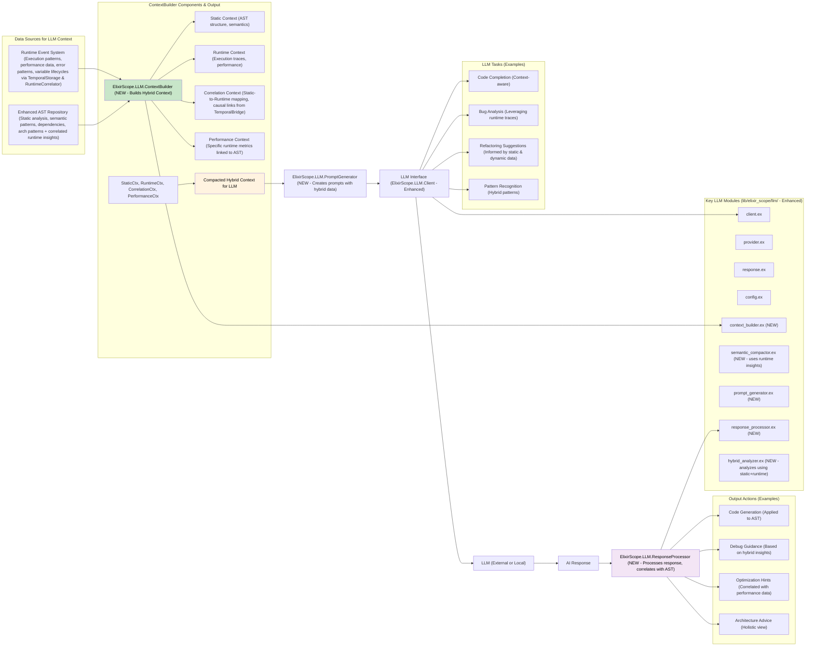
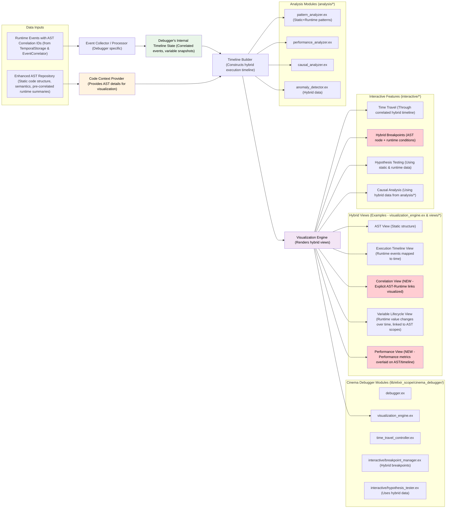
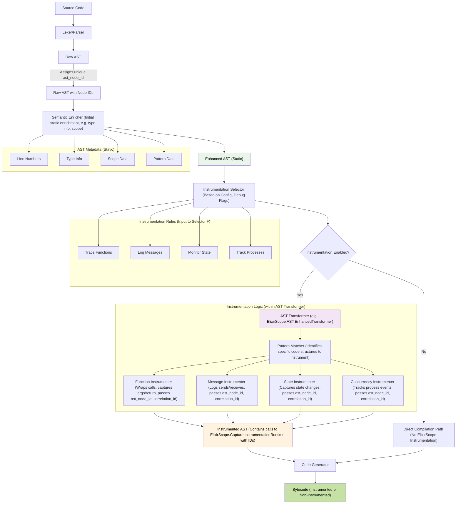
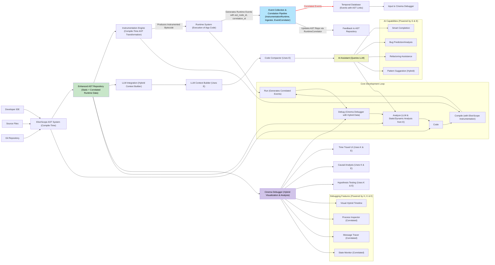

---

## 2. Enhanced AST Repository Components (Revised)

This diagram details the structure of the `ASTRepository` incorporating compile-time and runtime correlated data.

---

## 3. Compile-time Instrumentation Pipeline (Revised)

Focuses on how AST is transformed to include calls to `InstrumentationRuntime`.

---

## 4. Enhanced Event System with AST Correlation (New)

Details the flow of events from instrumentation to storage, emphasizing AST correlation.

---

## 5. Core Hybrid Correlation Flow (New)

Illustrates the lifecycle of correlation from AST to runtime event and back.

---

## 6. LLM Integration Architecture with Hybrid Context (Revised)

Shows how the LLM leverages both static AST and runtime correlated data.

---

## 7. Cinema Debugger Data Flow with Hybrid Visualization (Revised)

Illustrates how the Cinema Debugger uses both static AST and correlated runtime event data.

---

## 8. Detailed AST Transformation Process (Revised for Hybrid Output)

Clarifies the transformation process leading to instrumented code ready for hybrid data capture.

---

## 9. Comprehensive System Integration (Revised for Hybrid Flows)

High-level overview emphasizing the central role of the hybrid AST Repository and event correlation.

