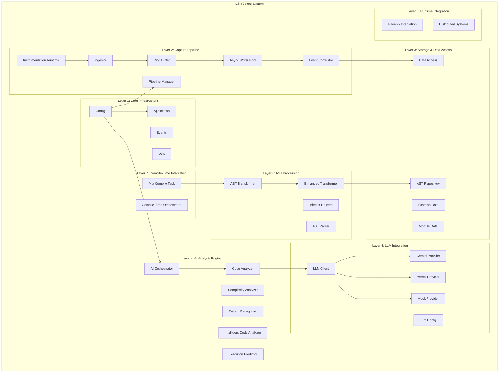
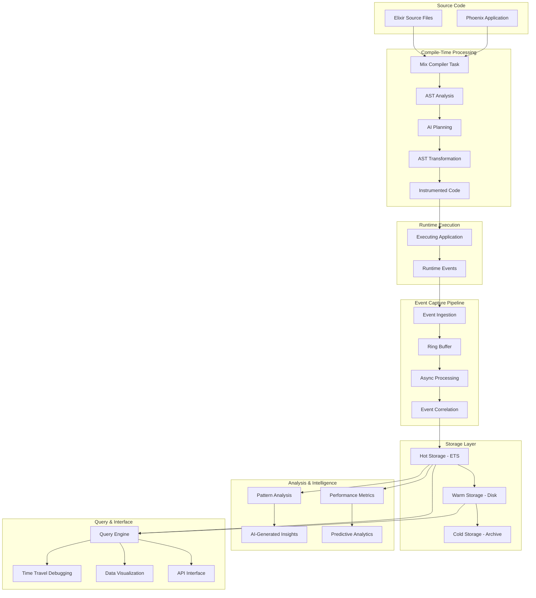
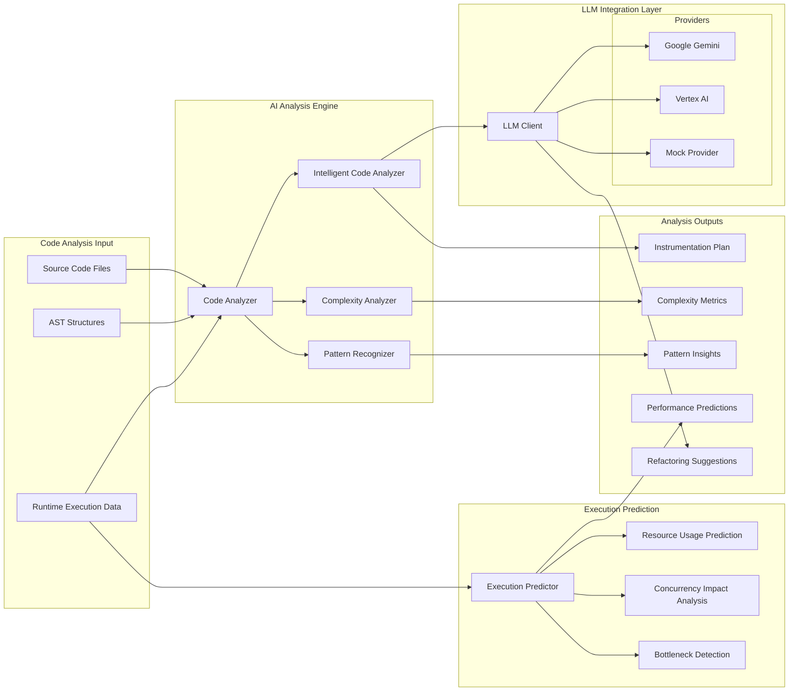
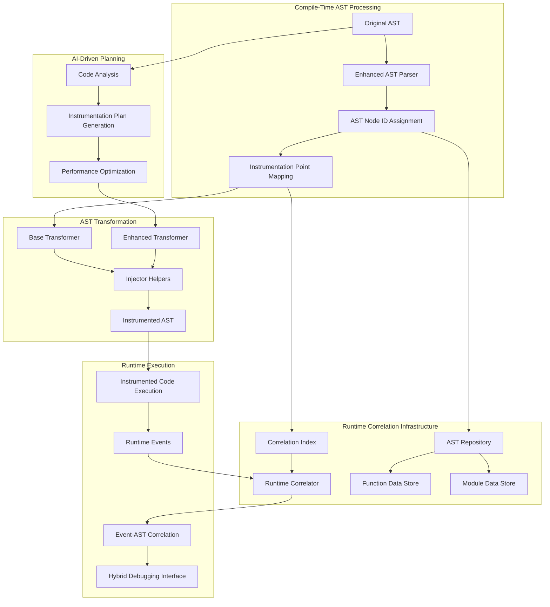
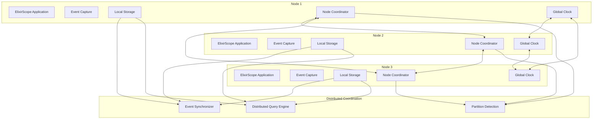
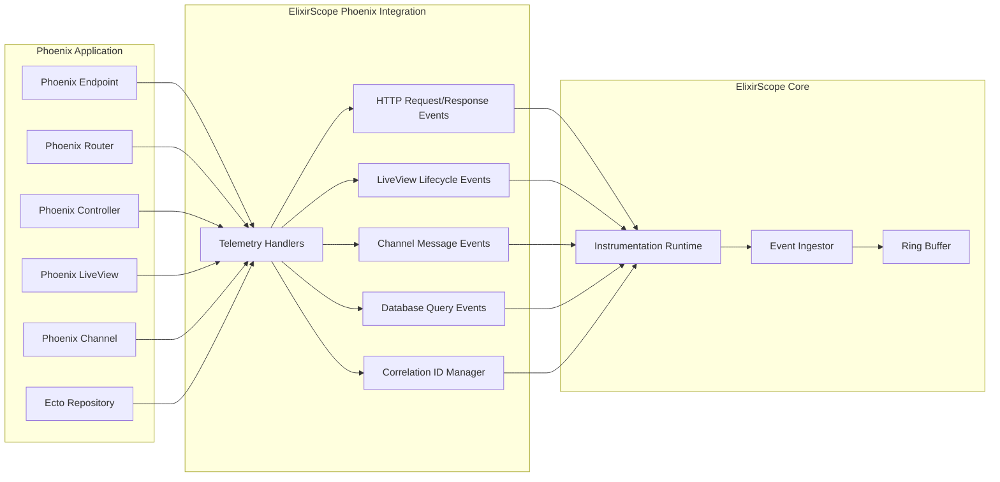
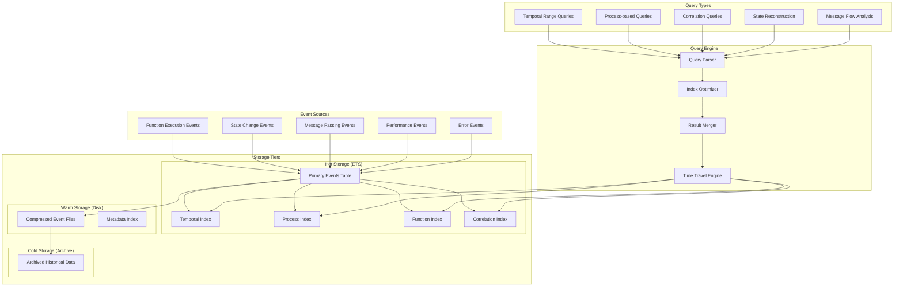
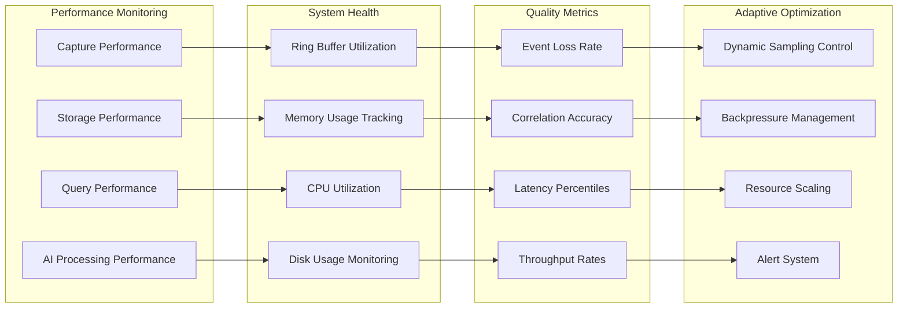
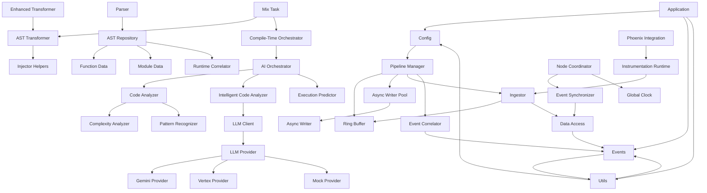

# ElixirScope Architecture Diagrams

## 1. Overall System Architecture

## 2. Data Flow Architecture

## 3. AI-Powered Analysis Pipeline

## 4. Event Capture and Processing Pipeline

```mermaid
sequenceDiagram
    participant App as Application Code
    participant Runtime as Instrumentation Runtime
    participant Ingestor as Event Ingestor
    participant RingBuffer as Ring Buffer
    participant AsyncPool as Async Writer Pool
    participant Correlator as Event Correlator
    participant Storage as Data Storage
    
    Note over App, Storage: Event Capture Flow
    
    App->>Runtime: Function call/exit
    Runtime->>Runtime: Check if enabled
    Runtime->>Ingestor: Report event
    Ingestor->>RingBuffer: Write event (<1μs)
    
    Note over RingBuffer, AsyncPool: Asynchronous Processing
    
    AsyncPool->>RingBuffer: Read batch
    RingBuffer-->>AsyncPool: Events batch
    AsyncPool->>Correlator: Process events
    
    Note over Correlator, Storage: Correlation & Storage
    
    Correlator->>Correlator: Establish causality
    Correlator->>Storage: Store correlated events
    
    Note over App, Storage: Query Flow
    
    App->>Storage: Query events
    Storage-->>App: Return results
```

## 5. AST Transformation and Hybrid Architecture

## 6. Distributed System Architecture

## 7. Phoenix Integration Architecture

## 8. Storage and Query Architecture

## 9. Performance and Monitoring

## 10. Module Dependency Graph

These diagrams provide a comprehensive view of the ElixirScope architecture, showing how the various components interact to provide AI-powered execution cinema debugging capabilities. The architecture is designed for high performance, scalability, and intelligent analysis of Elixir applications.
