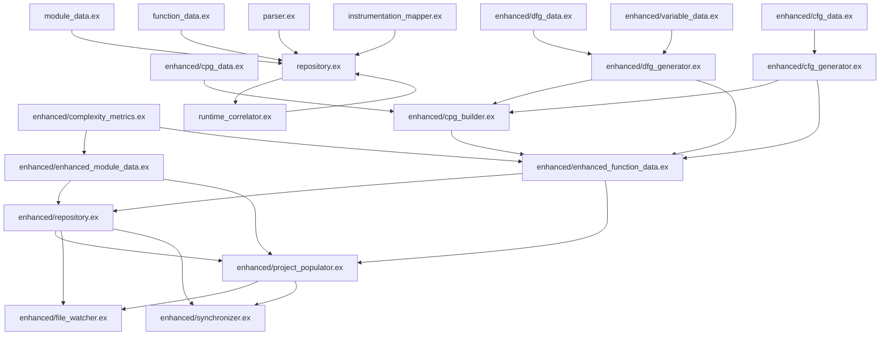

Looking at the files in `lib/elixir_scope/ast_repository`, here's the dependency graph:

## Dependency Layers (from bottom to top):

### Layer 1: Core Data Structures (No dependencies)
- `module_data.ex`
- `function_data.ex`
- `enhanced/complexity_metrics.ex`
- `enhanced/variable_data.ex`

### Layer 2: Enhanced Data Structures
- `enhanced/dfg_data.ex`
- `enhanced/cfg_data.ex`
- `enhanced/cpg_data.ex`
- `enhanced/enhanced_module_data.ex` (depends on ComplexityMetrics)
- `enhanced/enhanced_function_data.ex` (depends on ComplexityMetrics)

### Layer 3: Core Processing
- `parser.ex`
- `instrumentation_mapper.ex`

### Layer 4: Graph Generators
- `enhanced/dfg_generator.ex` (depends on DFGData, VariableData, EnhancedFunctionData)
- `enhanced/cfg_generator.ex` (depends on CFGData, EnhancedFunctionData)

### Layer 5: Advanced Analysis
- `enhanced/cpg_builder.ex` (depends on CPGData, DFGGenerator, CFGGenerator, EnhancedFunctionData)

### Layer 6: Repository Layer
- `repository.ex` (depends on ModuleData, FunctionData, Parser, InstrumentationMapper)
- `enhanced/repository.ex` (depends on EnhancedModuleData, EnhancedFunctionData)

### Layer 7: Runtime Integration
- `runtime_correlator.ex` (depends on Repository)

### Layer 8: Project Management
- `enhanced/project_populator.ex` (depends on EnhancedRepository, EnhancedModuleData, EnhancedFunctionData)

### Layer 9: File System Integration
- `enhanced/file_watcher.ex` (depends on EnhancedRepository, ProjectPopulator)
- `enhanced/synchronizer.ex` (depends on EnhancedRepository, ProjectPopulator)

## Key Circular Dependencies to Watch:
1. **Enhanced generators ↔ Enhanced function data**: The generators create data that's stored in EnhancedFunctionData, but they also depend on the structure
2. **Repository ↔ Runtime correlator**: They reference each other for event correlation

## Refactoring Impact:
When refactoring the large files, you'll need to be careful about:
1. **Data structure dependencies** flowing upward
2. **Circular references** between generators and data structures
3. **Repository integration points** where multiple components interact
4. **Configuration and utility modules** that might be shared across layers

The cleanest approach would be to refactor from the bottom layers up, ensuring data structures are stable before refactoring the components that use them.