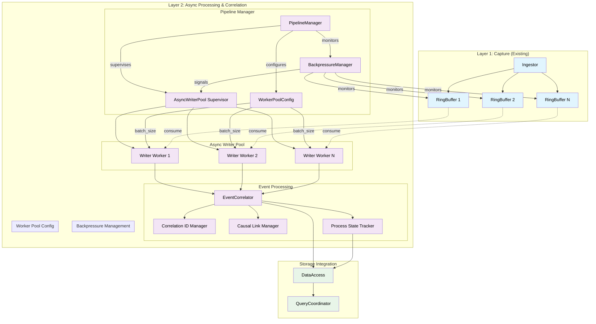
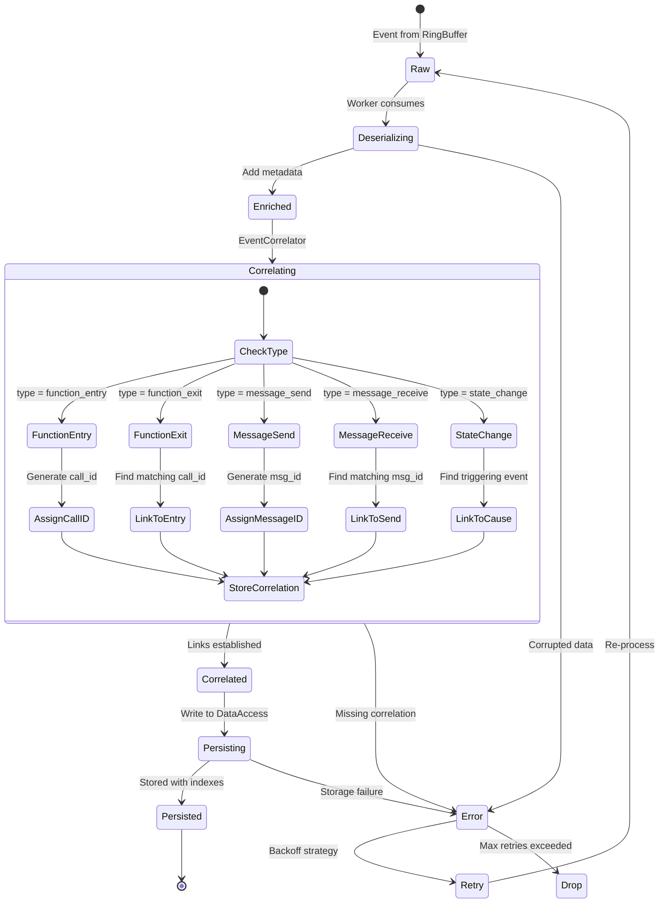
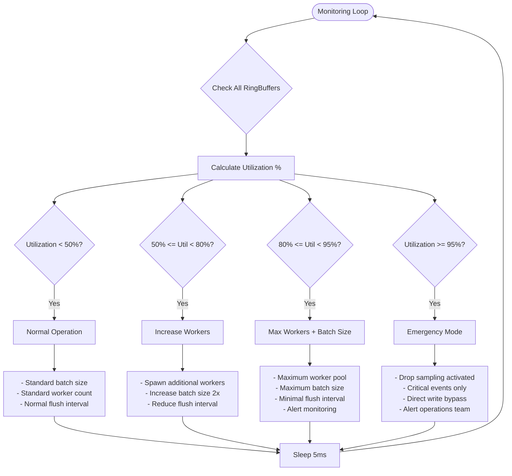
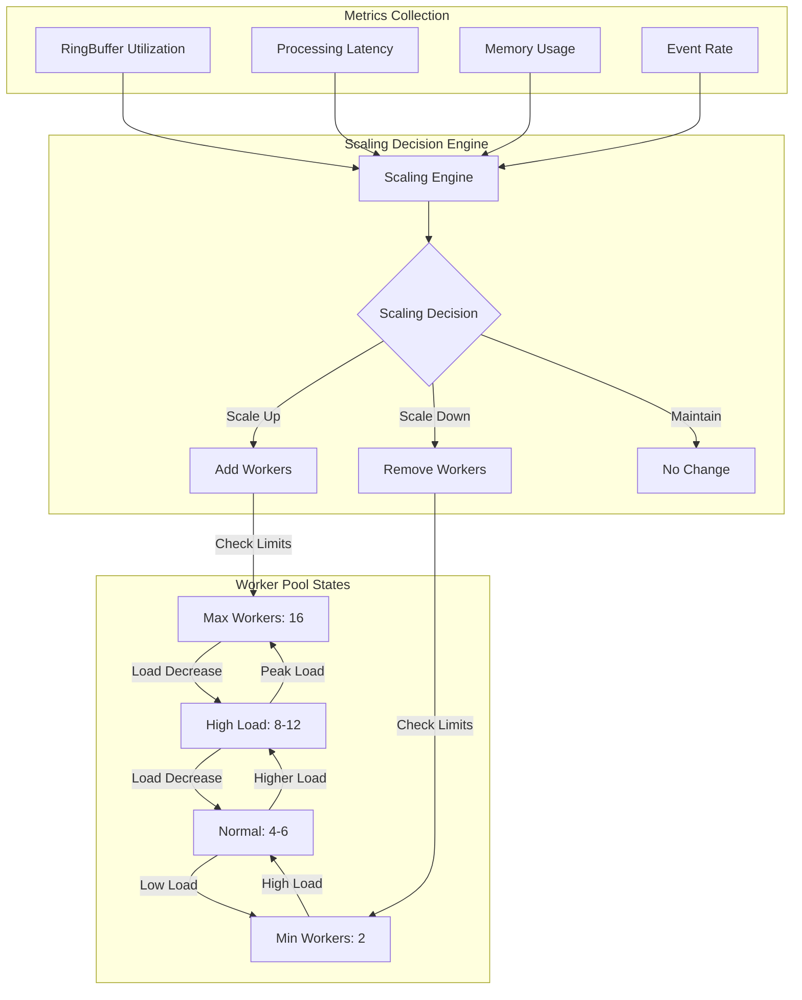
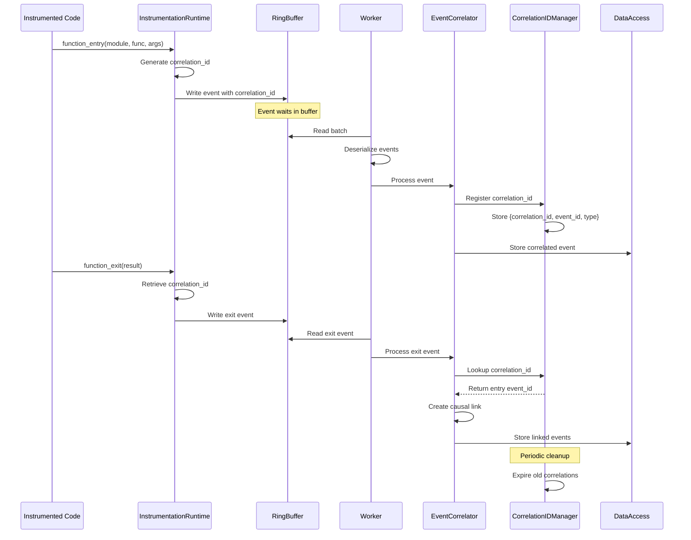
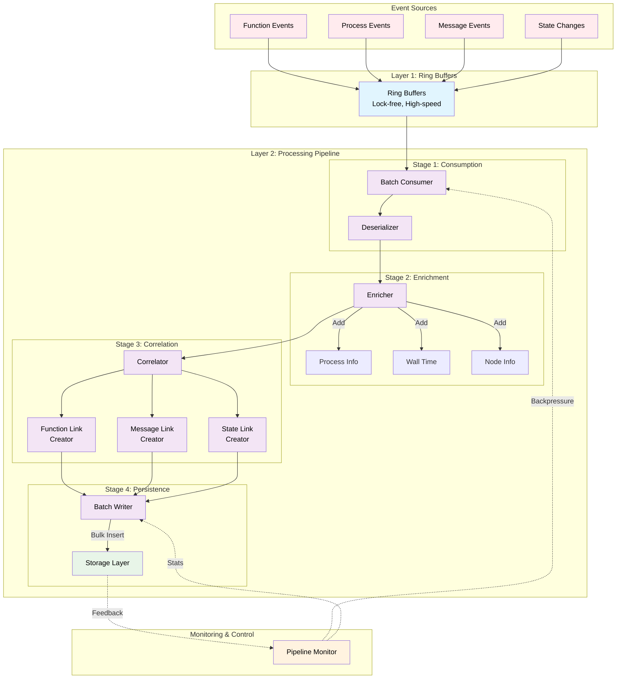
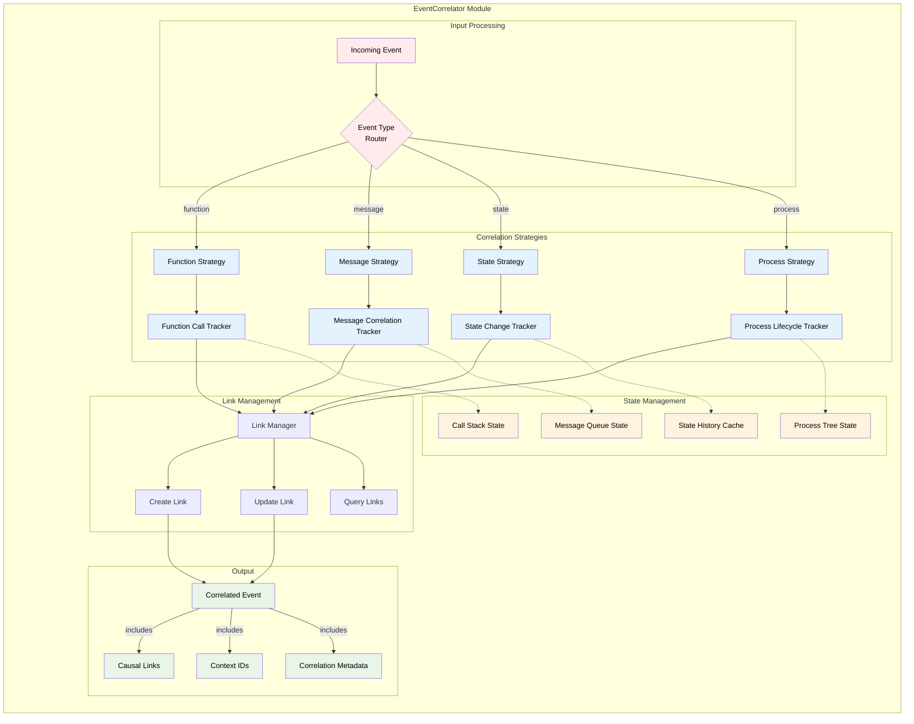

Looking at the comprehensive documentation and existing diagrams in DIAGS.md, I'll create additional diagrams specifically focused on Layer 2 implementation. These diagrams will help guide the development of the asynchronous processing and correlation layer.

# Additional Diagrams for Layer 2 Implementation

## 1. Layer 2 Detailed Component Architecture

## 2. Event Correlation State Machine

## 3. Backpressure Control Flow

## 4. Worker Pool Scaling Strategy

## 5. Correlation ID Lifecycle

## 6. Layer 2 Data Flow & Processing Pipeline

## 7. EventCorrelator Internal Architecture

## 8. Performance Monitoring Dashboard (Conceptual)

```mermaid
graph LR
    subgraph "Layer 2 Metrics Dashboard"
        subgraph "Throughput Metrics"
            EPS[Events/Second<br/>Current: 45,230]
            BPS[Batches/Second<br/>Current: 452]
            CPS[Correlations/Second<br/>Current: 38,450]
        end

        subgraph "Latency Metrics"
            P50[P50 Latency<br/>2.3ms]
            P95[P95 Latency<br/>8.7ms]
            P99[P99 Latency<br/>15.2ms]
        end

        subgraph "Buffer Health"
            RBU[Buffer Utilization<br/>RB1: 23%<br/>RB2: 31%<br/>RB3: 18%]
            DROP["Dropped Events<br/>0 (last hour)"]
        end

        subgraph "Worker Pool Status"
            WC[Worker Count<br/>Active: 6/16]
            WL[Worker Load<br/>Avg: 67%]
            WQ[Queue Depth<br/>Avg: 234 events]
        end

        subgraph "Correlation Success"
            CSR[Success Rate<br/>99.2%]
            MCE["Missing Correlations<br/>342 (last hour)"]
            OCE["Orphaned Events<br/>128 (last hour)"]
        end

        subgraph "System Resources"
            MEM[Memory Usage<br/>Layer 2: 487MB]
            CPU[CPU Usage<br/>Layer 2: 12%]
            ETS[ETS Tables<br/>Size: 1.2GB]
        end
    end

    subgraph "Alerts & Actions"
        A1[🟢 All Systems Normal]
        A2[🟡 High Buffer Utilization > 80%]
        A3[🔴 Correlation Failures > 5%]
        A4[🟡 Memory Pressure Warning]
    end

    RBU -.-> A2
    CSR -.-> A3
    MEM -.-> A4

    classDef metric fill:#e3f2fd,color:#000
    classDef alert fill:#fff3e0,color:#000
    classDef good fill:#c8e6c9,color:#000
    classDef warn fill:#fff9c4,color:#000
    classDef bad fill:#ffcdd2,color:#000
    
    class EPS,BPS,CPS,P50,P95,P99,WC,WL,WQ,CSR,MEM,CPU,ETS metric
    class A1 good
    class A2,A4 warn
    class A3 bad
```

These diagrams provide detailed guidance for implementing Layer 2, covering:

1. **Component Architecture**: How all Layer 2 components interact
2. **State Machines**: Event correlation workflow
3. **Control Flows**: Backpressure management logic
4. **Scaling Strategies**: Dynamic worker pool management
5. **Sequence Diagrams**: Correlation ID lifecycle
6. **Data Flow**: Complete processing pipeline
7. **Internal Architecture**: EventCorrelator implementation details
8. **Monitoring**: Key metrics to track for Layer 2 health

These complement the existing diagrams in DIAGS.md and provide the implementation-level detail needed to build Layer 2 successfully.