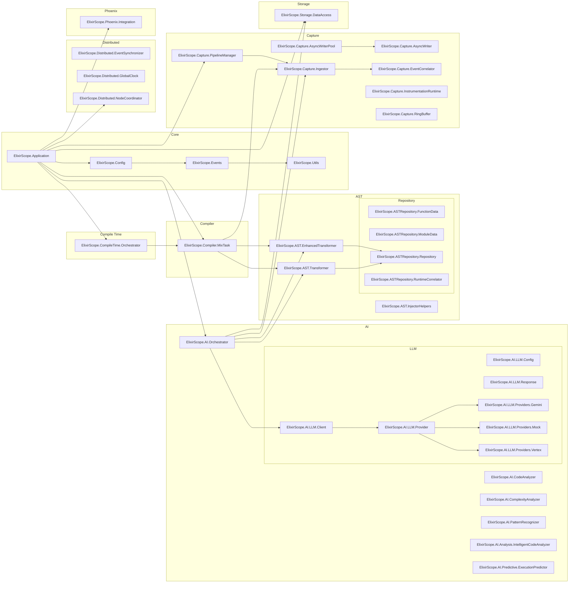
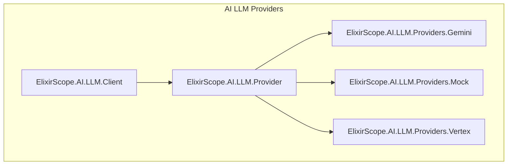
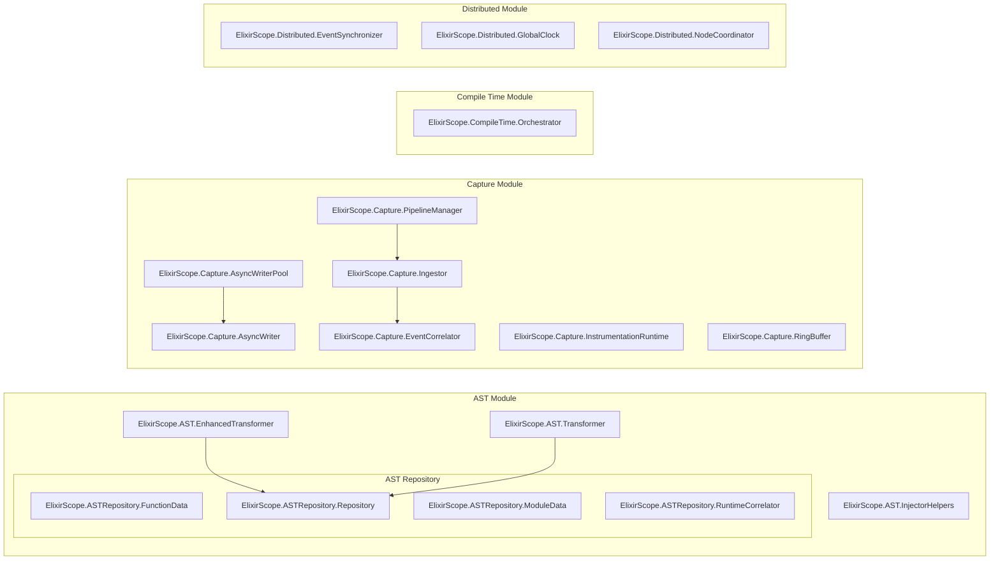
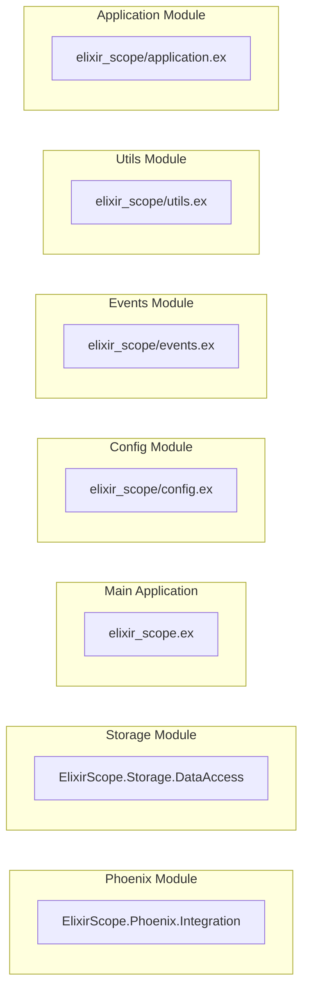

# ElixirScope Architecture Diagrams

## Overall Application Structure

```mermaid
graph LR
    subgraph "Core"
        A["ElixirScope.Application"] --> B["ElixirScope.Config"]
        B --> C["ElixirScope.Events"]
        C --> D["ElixirScope.Utils"]
    end

    subgraph "AI"
        AI1["ElixirScope.AI.CodeAnalyzer"]
        AI2["ElixirScope.AI.ComplexityAnalyzer"]
        AI3["ElixirScope.AI.Orchestrator"]
        AI4["ElixirScope.AI.PatternRecognizer"]
        AI5["ElixirScope.AI.Analysis.IntelligentCodeAnalyzer"]
        AI6["ElixirScope.AI.Predictive.ExecutionPredictor"]
        subgraph "LLM"
            LLM1["ElixirScope.AI.LLM.Client"]
            LLM2["ElixirScope.AI.LLM.Config"]
            LLM3["ElixirScope.AI.LLM.Provider"]
            LLM4["ElixirScope.AI.LLM.Response"]
            LLM5["ElixirScope.AI.LLM.Providers.Gemini"]
            LLM6["ElixirScope.AI.LLM.Providers.Mock"]
            LLM7["ElixirScope.AI.LLM.Providers.Vertex"]
        end
        AI3 --> LLM1
        LLM1 --> LLM3
        LLM3 --> LLM5
        LLM3 --> LLM6
        LLM3 --> LLM7
    end

    subgraph "AST"
        AST1["ElixirScope.AST.EnhancedTransformer"]
        AST2["ElixirScope.AST.InjectorHelpers"]
        AST3["ElixirScope.AST.Transformer"]
        subgraph "Repository"
            AST_R1["ElixirScope.ASTRepository.FunctionData"]
            AST_R2["ElixirScope.ASTRepository.ModuleData"]
            AST_R3["ElixirScope.ASTRepository.Repository"]
            AST_R4["ElixirScope.ASTRepository.RuntimeCorrelator"]
        end
        AST1 --> AST_R3
        AST3 --> AST_R3
    end

    subgraph "Capture"
        CAP1["ElixirScope.Capture.AsyncWriterPool"]
        CAP2["ElixirScope.Capture.AsyncWriter"]
        CAP3["ElixirScope.Capture.EventCorrelator"]
        CAP4["ElixirScope.Capture.Ingestor"]
        CAP5["ElixirScope.Capture.InstrumentationRuntime"]
        CAP6["ElixirScope.Capture.PipelineManager"]
        CAP7["ElixirScope.Capture.RingBuffer"]
        CAP1 --> CAP2
        CAP6 --> CAP4
        CAP4 --> CAP3
    end

    subgraph "Compile Time"
        CTO["ElixirScope.CompileTime.Orchestrator"]
    end

    subgraph "Compiler"
        COMP1["ElixirScope.Compiler.MixTask"]
    end

    subgraph "Distributed"
        DIST1["ElixirScope.Distributed.EventSynchronizer"]
        DIST2["ElixirScope.Distributed.GlobalClock"]
        DIST3["ElixirScope.Distributed.NodeCoordinator"]
    end

    subgraph "Phoenix"
        PHX1["ElixirScope.Phoenix.Integration"]
    end

    subgraph "Storage"
        STOR1["ElixirScope.Storage.DataAccess"]
    end

    A --> AI3
    A --> CAP6
    A --> CTO
    A --> COMP1
    A --> DIST3
    A --> PHX1
    A --> STOR1
    AI3 --> AST1
    AI3 --> AST3
    AI3 --> CAP4
    AI3 --> STOR1
    CTO --> COMP1
    COMP1 --> AST1
    COMP1 --> AST3
    COMP1 --> CAP4
```

## AI LLM Providers Detail

```mermaid
graph TD
    subgraph "AI LLM Providers"
        LLMC["ElixirScope.AI.LLM.Client"]
        LLMP["ElixirScope.AI.LLM.Provider"]
        LLMG["ElixirScope.AI.LLM.Providers.Gemini"]
        LLMM["ElixirScope.AI.LLM.Providers.Mock"]
        LLMV["ElixirScope.AI.LLM.Providers.Vertex"]

        LLMC --> LLMP
        LLMP --> LLMG
        LLMP --> LLMM
        LLMP --> LLMV
    end
```

## Module Detail

```mermaid
graph LR
    subgraph "AST Module"
        ET["ElixirScope.AST.EnhancedTransformer"]
        IH["ElixirScope.AST.InjectorHelpers"]
        T["ElixirScope.AST.Transformer"]
        subgraph "AST Repository"
            FD["ElixirScope.ASTRepository.FunctionData"]
            MD["ElixirScope.ASTRepository.ModuleData"]
            R["ElixirScope.ASTRepository.Repository"]
            RC["ElixirScope.ASTRepository.RuntimeCorrelator"]
        end
        ET --> R
        T --> R
    end

    subgraph "Capture Module"
        AWP["ElixirScope.Capture.AsyncWriterPool"]
        AW["ElixirScope.Capture.AsyncWriter"]
        EC["ElixirScope.Capture.EventCorrelator"]
        I["ElixirScope.Capture.Ingestor"]
        IR["ElixirScope.Capture.InstrumentationRuntime"]
        PM["ElixirScope.Capture.PipelineManager"]
        RB["ElixirScope.Capture.RingBuffer"]

        AWP --> AW
        PM --> I
        I --> EC
    end

    subgraph "Compile Time Module"
        CTO["ElixirScope.CompileTime.Orchestrator"]
    end

    subgraph "Distributed Module"
        ES["ElixirScope.Distributed.EventSynchronizer"]
        GC["ElixirScope.Distributed.GlobalClock"]
        NC["ElixirScope.Distributed.NodeCoordinator"]
    end
```

## Module Detail

```mermaid
graph LR
    subgraph "Phoenix Module"
        PI["ElixirScope.Phoenix.Integration"]
    end

    subgraph "Storage Module"
        DA["ElixirScope.Storage.DataAccess"]
    end

    subgraph "Main Application"
        ES["elixir_scope.ex"]
    end

    subgraph "Config Module"
        C["elixir_scope/config.ex"]
    end

    subgraph "Events Module"
        E["elixir_scope/events.ex"]
    end

    subgraph "Utils Module"
        U["elixir_scope/utils.ex"]
    end

    subgraph "Application Module"
        APP["elixir_scope/application.ex"]
    end
```

## Test Structure Overview

```mermaid
graph LR
    subgraph "Test Root"
        ETS["elixir_scope_test.exs"]
        THS["test_helper.exs"]
    end

    subgraph "ElixirScope Tests"
        CTS["elixir_scope/config_test.exs"]
        EvTS["elixir_scope/events_test.exs"]
        UTS["elixir_scope/utils_test.exs"]
    end

    subgraph "AI Tests"
        CATS["elixir_scope/ai/code_analyzer_test.exs"]
        ICATS["elixir_scope/ai/analysis/intelligent_code_analyzer_test.exs"]
        EPTS["elixir_scope/ai/predictive/execution_predictor_test.exs"]
        subgraph "LLM Tests"
            CLTS["elixir_scope/ai/llm/client_test.exs"]
            CoLTS["elixir_scope/ai/llm/config_test.exs"]
            PCTS["elixir_scope/ai/llm/provider_compliance_test.exs"]
            RLTS["elixir_scope/ai/llm/response_test.exs"]
            subgraph "Provider Tests"
                GLTS["elixir_scope/ai/llm/providers/gemini_live_test.exs"]
                MTS["elixir_scope/ai/llm/providers/mock_test.exs"]
                VLTS["elixir_scope/ai/llm/providers/vertex_live_test.exs"]
                VTS["elixir_scope/ai/llm/providers/vertex_test.exs"]
            end
        end
    end

    subgraph "AST Tests"
        ETTS["elixir_scope/ast/enhanced_transformer_test.exs"]
        TTS["elixir_scope/ast/transformer_test.exs"]
        subgraph "AST Repository Tests"
            PaTS["elixir_scope/ast_repository/parser_test.exs"]
            RTS["elixir_scope/ast_repository/repository_test.exs"]
            RCTS["elixir_scope/ast_repository/runtime_correlator_test.exs"]
        end
    end

    subgraph "Capture Tests"
        AWPTS["elixir_scope/capture/async_writer_pool_test.exs"]
        AWTS["elixir_scope/capture/async_writer_test.exs"]
        ECTS["elixir_scope/capture/event_correlator_test.exs"]
        ITS["elixir_scope/capture/ingestor_test.exs"]
        IRTS["elixir_scope/capture/instrumentation_runtime_enhanced_test.exs"]
        IRITS["elixir_scope/capture/instrumentation_runtime_integration_test.exs"]
        PMTS["elixir_scope/capture/pipeline_manager_test.exs"]
        RBTS["elixir_scope/capture/ring_buffer_test.exs"]
        TSTS["elixir_scope/capture/temporal_storage_test.exs"]
    end

    subgraph "Compiler Tests"
        CMTS["elixir_scope/compiler/mix_task_test.exs"]
    end

    subgraph "Distributed Tests"
        MNTS["elixir_scope/distributed/multi_node_test.exs"]
    end

    subgraph "Integration Tests"
        E2EHITS["elixir_scope/integration/end_to_end_hybrid_test.exs"]
        PPTS["integration/production_phoenix_test.exs"]
    end

    subgraph "LLM Specific Tests"
        CBTS["elixir_scope/llm/context_builder_test.exs"]
        HATS["elixir_scope/llm/hybrid_analyzer_test.exs"]
    end

    subgraph "Performance Tests"
        HBTS["elixir_scope/performance/hybrid_benchmarks_test.exs"]
    end

    subgraph "Phoenix Tests"
        PITS["elixir_scope/phoenix/integration_test.exs"]
    end

    subgraph "Storage Tests"
        DATS["elixir_scope/storage/data_access_test.exs"]
    end

    subgraph "Fixtures"
        SEP["fixtures/sample_elixir_project"]
        SP["fixtures/sample_project"]
    end

    subgraph "Support"
        AITH["support/ai_test_helpers.ex"]
        STPA["support/test_phoenix_app.ex"]
    end

    ETS --> ElixirScope_Tests
    ETS --> AI_Tests
    ETS --> AST_Tests
    ETS --> Capture_Tests
    ETS --> Compiler_Tests
    ETS --> Distributed_Tests
    ETS --> Integration_Tests
    ETS --> LLM_Specific_Tests
    ETS --> Performance_Tests
    ETS --> Phoenix_Tests
    ETS --> Storage_Tests
    ETS --> Fixtures
    ETS --> Support

    THS --> ElixirScope_Tests
    THS --> AI_Tests
    THS --> AST_Tests
    THS --> Capture_Tests
    THS --> Compiler_Tests
    THS --> Distributed_Tests
    THS --> Integration_Tests
    THS --> LLM_Specific_Tests
    THS --> Performance_Tests
    THS --> Phoenix_Tests
    THS --> Storage_Tests

    AITH --> AI_Tests
    STPA --> Phoenix_Tests

    AI1 --> CATS
    AI5 --> ICATS
    AI6 --> EPTS
    LLM1 --> CLTS
    LLM2 --> CoLTS
    LLM3 --> PCTS
    LLM4 --> RLTS
    LLM5 --> GLTS
    LLM6 --> MTS
    LLM7 --> VLTS
    LLM7 --> VTS

    ET --> ETTS
    T --> TTS
    AST_R3 --> RTS
    AST_R4 --> RCTS

    CAP1 --> AWPTS
    CAP2 --> AWTS
    CAP3 --> ECTS
    CAP4 --> ITS
    CAP5 --> IRTS
    CAP5 --> IRITS
    CAP6 --> PMTS
    CAP7 --> RBTS
    CAP7 --> TSTS

    COMP1 --> CMTS

    DIST3 --> MNTS

    PHX1 --> PITS

    STOR1 --> DATS

    SEP --> fixtures_sample_elixir_project_lib_genserver_module_ex["fixtures/sample_elixir_project/lib/genserver_module.ex"]
    SEP --> fixtures_sample_elixir_project_lib_phoenix_controller_ex["fixtures/sample_elixir_project/lib/phoenix_controller.ex"]
    SEP --> fixtures_sample_elixir_project_lib_supervisor_ex["fixtures/sample_elixir_project/lib/supervisor.ex"]
    SP --> fixtures_sample_project_mix_exs["fixtures/sample_project/mix.exs"]
    SP --> fixtures_sample_project_build_dev_lib_test_project_ebin_test_project_app["fixtures/sample_project/_build/dev/lib/test_project/ebin/test_project.app"]
    SP --> fixtures_sample_project_lib_test_module_ex["fixtures/sample_project/lib/test_module.ex"]
    E2EHITS --> PPTS
```